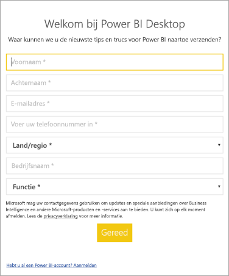

# <a name="administrators-manage-the-power-bi-desktop-sign-in-form"></a>Beheerders: Het Power BI Desktop-aanmeldingsformulier beheren
De eerste keer dat Power BI Desktop wordt gestart, wordt een aanmeldingsformulier weergegeven. Er kunnen gegevens in worden ingevuld, of u kunt zich aanmelden bij Power BI om door te gaan. Beheerders beheren dit formulier met behulp van een registersleutel. 



Beheerders gebruiken de volgende registersleutel om het aanmeldingsformulier uit te schakelen. Dit kan ook worden geactiveerd voor een gehele organisatie met behulp van globaal beleid.

```
Key: HKEY_CURRENT_USER\SOFTWARE\Policies\Microsoft\Microsoft Power BI Desktop
valueName: ShowLeadGenDialog
```
U kunt ook de volgende sleutel proberen, die heeft gewerkt voor sommige klanten op basis van hun configuraties:

```
Key: HKEY_CURRENT_USER\SOFTWARE\Microsoft\Microsoft Power BI Desktop
valueName: ShowLeadGenDialog
```

Met een waarde van 0 wordt het dialoogvenster uitgeschakeld.


Hebt u nog vragen? [Misschien dat de Power BI-community het antwoord weet](https://community.powerbi.com/)

