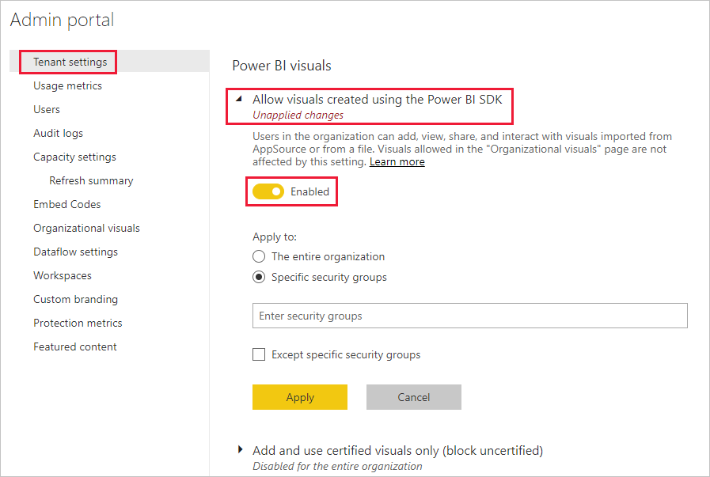
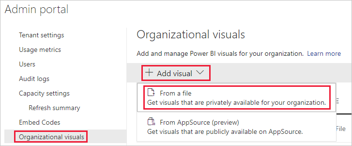

# Beheerinstellingen voor Power BI-visuals beheren

Als Power BI-beheerder voor uw organisatie kunt u bepalen tot welk type Power BI-visuals gebruikers toegang hebben in de organisatie.

Voor het beheren van Power BI-visuals moet u een globale beheerder in Office 365 zijn, of de rol van Power BI-servicebeheerder moet aan u zijn toegewezen. Zie [Understanding the Power BI admin role](service-admin-role.md) (Power BI-beheerdersrol) voor meer informatie over de beheerdersrol voor de Power BI-service.

## Toegang tot de beheerportal

Voor het inschakelen van de instellingen die in het artikel worden beschreven, hebt u toegang tot de beheerportal nodig.

1. In Power BI-service selecteert u **Instellingen**.

2. Selecteer **Beheerportal** in het vervolgkeuzemenu bij de instellingen.

    

## Tenantinstellingen voor Power BI-visuals

Als Power BI-beheerder voor uw organisatie kunt u bepalen tot welk type Power BI-visuals gebruikers toegang hebben in de organisatie.

De tenantinstellingen van de gebruikersinterface hebben alleen betrekking op de Power BI-service. Als u deze instellingen wilt toepassen in Power BI Desktop, moet u groepsbeleid gebruiken. In een tabel aan het eind van elke sectie ziet u details voor het inschakelen van de instelling in Power BI Desktop.

>[!NOTE]
>Wijzigingen in de tenantinstellingen hebben geen invloed op Power BI-visuals die op het tabblad [Visuals voor organisaties](#organizational-visuals) worden vermeld.

### Aangepaste visuals ophalen uit AppSource of een bestand

Beheer toegang van de organisatie voor het volgende type Power BI-visuals:

* Visuals die zijn gemaakt door ontwikkelaars en die als een .pbiviz-bestand zijn opgeslagen.

* Visuals die beschikbaar zijn via AppSource.

Volg de onderstaande instructies om gebruikers in uw organisatie de mogelijkheid te geven om .pbiviz-bestanden te uploaden en visuals vanuit AppSource aan hun rapporten en dashboards toe te voegen.

1. Vouw de instellingen **Visuals toestaan die zijn gemaakt met de Power BI SDK** uit.

2. Klik op **Ingeschakeld**.

3. Kies wie .pbiviz- en AppSource-visuals kan uploaden:

    * Selecteer de optie **De hele organisatie** om toe te staan dat iedereen in uw organisatie .pbiviz-bestanden kan uploaden en visuals uit AppSource kan toevoegen.

     * Selecteer de optie **Specifieke beveiligingsgroepen** voor het beheren van het uploaden van .pbiviz-bestanden en het toevoegen van visuals uit AppSource met behulp van beveiligingsgroepen. Voeg de beveiligingsgroepen die u wilt beheren toe aan de tekstbalk *Beveiligingsgroepen invoeren*. De beveiligingsgroepen die u hebt opgegeven worden standaard uitgesloten. Als u deze beveiligingsgroepen wilt insluiten en alle anderen in de organisatie wilt uitsluiten, selecteert u de optie **Specifieke beveiligingsgroepen uitsluiten**.

4. Klik op **Toepassen**.

Wijzigingen in de gebruikersinterface van tenantinstellingen zijn alleen van toepassing op de Power BI-service. Als u gebruikers in uw organisatie wilt toestaan .pbiviz-bestanden te uploaden en visuals uit AppSource toe te voegen aan hun deelvenster Visualisaties in Power BI Desktop, gebruikt u [Azure AD-groepsbeleid](/azure/active-directory-domain-services/manage-group-policy).

|Sleutel  |Waardenaam  |Waarde  |
|---------|---------|---------|
|Software\Policies\Microsoft\Power BI Desktop\    |EnableCustomVisuals    |0 - Uitschakelen  1 - Inschakelen (standaardinstelling)         |
|

### Gecertificeerde visuals in Power BI

Wanneer deze instelling is ingeschakeld, worden alleen [gecertificeerde Power BI-visuals](../developer/visuals/power-bi-custom-visuals-certified.md) in de rapporten en dashboards van uw organisatie weergegeven. Power BI-visuals uit AppSource of bestanden, die niet zijn gecertificeerd, retourneren een foutbericht.

1. Selecteer **Alleen gecertificeerde visuals toevoegen en gebruiken** vanuit de beheerdersportal.

2. Klik op **Ingeschakeld**.

3. Klik op **Toepassen**.

Wijzigingen in de gebruikersinterface van tenantinstellingen zijn alleen van toepassing op de Power BI-service. Voor het beheren van de tenantinstelling voor gecertificeerde visuals in Power BI Desktop gebruikt u [Azure AD-groepsbeleid](/azure/active-directory-domain-services/manage-group-policy).

|Sleutel  |Waardenaam  |Waarde  |
|---------|---------|---------|
|Software\Policies\Microsoft\Power BI Desktop\    |EnableUncertifiedVisuals    |0 - Uitschakelen  1 - Inschakelen (standaardinstelling)         |
|

## Organisatievisuals

Als Power BI-beheerder kunt u de lijst met Power BI-visuals die in de [store van uw organisatie](../developer/visuals/power-bi-custom-visuals.md#organizational-store) beschikbaar zijn, beheren. Op het tabblad **Visuals voor organisaties** in de *Beheerportal* kunt u visuals toevoegen en verwijderen en bepalen welke visuals automatisch worden weergegeven in het deelvenster Visualisaties van de gebruikers van uw organisatie. U kunt elk type visual aan de lijst toevoegen, waaronder niet-gecertificeerde visuals en .pbiviz-visuals, zelfs als deze in strijd zijn met de [tenantinstellingen](#power-bi-visuals-tenant-settings) van uw organisatie.

De instellingen voor visuals voor organisaties worden automatisch geïmplementeerd in Power BI Desktop.

>[!NOTE]
>Visuals voor organisaties worden niet ondersteund in Power BI Report Server.

### Een visual toevoegen vanuit een bestand

Gebruik deze methode om een nieuwe Power BI-visual toe te voegen vanuit een .pbiviz-bestand.

> [!WARNING]
> Een Power BI-visual die uit een bestand is geüpload", kan een code bevatten met beveiligings- of privacyrisico's. Wees er zeker van dat u de auteur en de bron van de visual vertrouwt voordat u de visual in de opslagplaats van de organisatie implementeert.

1. Selecteer **Visual toevoegen** > **Vanuit een bestand**.

    

2. Vul de volgende velden in:

    * **Een .pbiviz-bestand kiezen**: selecteer een visualbestand om te uploaden.

    * **Uw visual een naam geven**: geef de visual een korte titel, zodat rapportontwerpers eenvoudig kunnen zien wat de functie van die visual is.

    * **Pictogram**: upload een pictogrambestand dat moet worden weergegeven in het deelvenster Visualisaties.

    * **Beschrijving**: geef een korte beschrijving van de visual zodat de gebruiker meer context heeft.

    * **Toegang**: in deze sectie zijn twee opties beschikbaar:
    
        * Selecteer of gebruikers in uw organisatie toegang hebben tot deze visual. Deze instelling is standaard ingeschakeld.

        * Selecteer of deze visual in het deelvenster Visualisaties van de gebruikers in uw organisatie wordt weergegeven. Deze instelling is standaard uitgeschakeld. Zie [Een visual toevoegen aan het deelvenster Visualisaties](#add-a-visual-to-the-visualization-pane) voor meer informatie.

    

3. Selecteer **Toevoegen** om de uploadaanvraag te starten. Zodra de visual is geüpload, wordt deze weergegeven in lijst met visuals voor organisaties.

### Een visual toevoegen vanuit AppSource

Gebruik deze methode om een nieuwe Power BI-visual toe te voegen vanuit AppSource.

AppSource Power BI-visuals worden automatisch bijgewerkt. Gebruikers in uw organisatie beschikken altijd over de meest recente versie van de visual.

1. Selecteer **Visual toevoegen** > **Vanuit AppSource**.

    

2. Zoek in het venster **Power BI-visuals** de AppSource-visual die u wilt toevoegen en klik op **Toevoegen**. Zodra de visual is geüpload, wordt deze weergegeven in lijst met visuals voor organisaties.

### Een visual toevoegen aan het deelvenster Visualisaties

U kunt visuals kiezen op de pagina met visuals voor organisaties en ze automatisch weergeven in het deelvenster Visualisaties van alle gebruikers in uw organisatie.

1. Klik in de rij van de visual die u wilt toevoegen op **Instellingen**.

    organizational-pane

2. Schakel de instelling van het deelvenster Visualisaties in en klik op **Update**.

    

### Een visual verwijderen die uit een bestand is geüpload

Als u een visual permanent wilt verwijderen, selecteert u het prullenbakpictogram voor de visual in de opslagplaats.

> [!IMPORTANT]
> Verwijderen kan niet ongedaan worden gemaakt. Wanneer de visual is verwijderd, wordt deze onmiddellijk niet meer weergegeven in bestaande rapporten. Zelfs als u dezelfde visual opnieuw uploadt, zal hiermee de visual die u hebt verwijderd niet worden vervangen. Gebruikers kunnen echter de nieuwe visual opnieuw importeren en het exemplaar in hun rapporten vervangen.

### Een .pbiviz-visual uitschakelen

U kunt een .pbiviz-visual uitschakelen zodat deze niet meer beschikbaar is via de [store van de organisatie](../developer/visuals/power-bi-custom-visuals.md#organizational-store), terwijl de visual nog wel in de lijst met visuals voor organisaties wordt vermeld.

1. Klik in de rij van de .pbiviz-visual die u wilt uitschakelen op **Instellingen**.

2. Schakel in de sectie **Toegang** de volgende instelling uit: *Gebruikers in de organisatie hebben toegang tot deze visual en kunnen deze bekijken, delen en interactief gebruiken*.

Als de .pbiviz-visual is uitgeschakeld, wordt deze niet meer weergegeven in bestaande rapporten en wordt het volgende onderstaande foutbericht weergegeven:

*Deze aangepaste visual is niet langer beschikbaar. Neem voor meer informatie contact op met uw beheerder.*

>[!NOTE]
>.pbiviz-visuals waarvan een bladwijzer is gemaakt, blijven werken nadat ze zijn uitgeschakeld.

### Een visual bijwerken

AppSource-visuals worden automatisch bijgewerkt. Zodra een nieuwe versie beschikbaar is vanuit AppSource, vervangt deze een oudere versie die is geïmplementeerd via de lijst met visuals voor organisaties.

Als u een .pbiviz-visual wilt bijwerken, volgt u deze stappen om de visual te vervangen.

1. Klik in de rij van de visual die u wilt toevoegen op **Instellingen**.

2. Klik op **Bladeren** en selecteer het .pbiviz-bestand waarmee u de huidige visual wilt vervangen.

3. Klik op **Update**.

## Volgende stappen

> [!div class="nextstepaction"]
>[Power BI beheren in de beheerportal](service-admin-portal.md)

> [!div class="nextstepaction"]
>[Visuals in Power BI](../developer/visuals/power-bi-custom-visuals.md)

> [!div class="nextstepaction"]
>[Visuals van de organisatie in Power BI](../developer/visuals/power-bi-custom-visuals-organization.md)