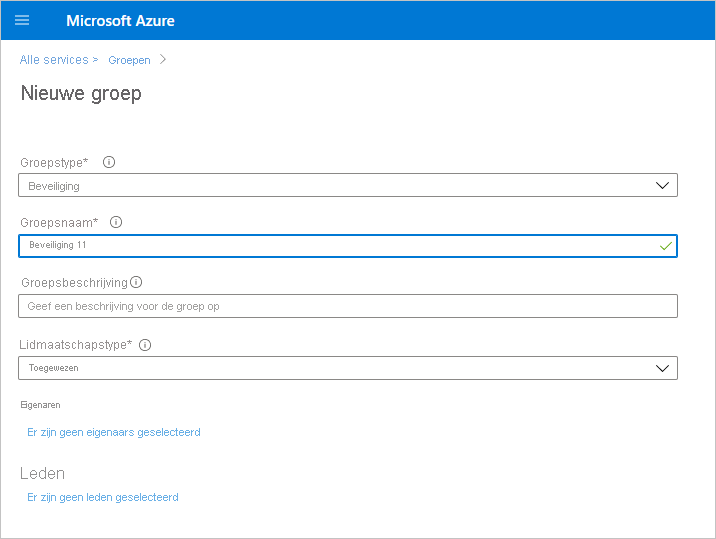
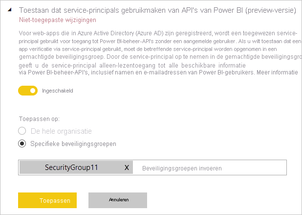

# Service-principalverificatie inschakelen voor alleen-lezen beheer-API's (preview)

Service-principal is een verificatiemethode die kan worden gebruikt om een Azure AD-toepassing (Azure Active Directory) toegang te geven tot inhoud en API's van de Power BI-service.
Wanneer u een Azure AD-app maakt, wordt er een [service-principal-object](https://docs.microsoft.com/azure/active-directory/develop/app-objects-and-service-principals#service-principal-object) gemaakt. Met het service-principal-object, ook wel de service-principal genoemd, kan Azure AD uw app verifiëren. Nadat de app is geverifieerd, heeft deze toegang tot Azure AD-tenantbronnen.

## Methode

Voer de volgende stappen uit om service-principal-verificatie in te schakelen voor Power BI-API's met het kenmerk alleen-lezen:

1. [Maak een Azure AD-app](https://docs.microsoft.com/azure/active-directory/develop/howto-create-service-principal-portal). U kunt deze stap overslaan als u al een Azure AD-app hebt die u wilt gebruiken. Noteer de app-id voor latere stappen. 
2. Maak een nieuwe **beveiligingsgroep** in Azure Active Directory. [Lees meer over het maken van een basisgroep en het toevoegen van leden met behulp van Azure Active Directory](https://docs.microsoft.com/azure/active-directory/fundamentals/active-directory-groups-create-azure-portal). U kunt deze stap overslaan als u al een beveiligingsgroep hebt die u wilt gebruiken.
    Zorg ervoor dat u **Beveiliging** selecteert als het groepstype.

    

3. Voeg uw app-id toe als lid van de beveiligingsgroep die u hebt gemaakt. Hiervoor doet u het volgende:
    1. Ga naar **Azure Portal > Azure Active Directory > Groepen** en kies de beveiligingsgroep die u in stap 2 hebt gemaakt.
    1. Selecteer **Leden toevoegen**.
    Opmerking: Zorg ervoor dat voor de app die u gebruikt, geen Power BI-beheerdersrollen in de Azure-portal zijn ingesteld. U controleert dit als volgt: 
       * Meld u aan bij de **Azure-portal** als een globale beheerder, een toepassingsbeheerder of een cloudtoepassingsbeheerder. 
        * Selecteer achtereenvolgens **Azure Active Directory** en **Bedrijfstoepassingen**. 
        * Selecteer de toepassing die u toegang tot Power BI wilt verlenen. 
        * Selecteer **Machtigingen**. Zorg ervoor dat er geen Power BI-beheerderstoestemming-vereist-machtigingen zijn ingesteld voor deze toepassing. Zie [Het beheren van toestemming voor toepassingen en het evalueren van toestemmingsaanvragen](https://docs.microsoft.com/azure/active-directory/manage-apps/manage-consent-requests) voor meer informatie. 
4. Schakel de beheerdersinstellingen voor de Power BI-service in. Om dit te doen:
    1. Meld u aan bij de Power BI-beheerportal. U moet een Power BI-beheerder zijn om de pagina met tenantinstellingen te kunnen weergeven.
    1. Onder **Instellingen voor beheerders-API** ziet u **Toestaan dat service-principals gebruikmaken van API's van Power BI (preview)** . Stel de wisselknop in op Ingeschakeld en selecteer het keuzerondje **Specifieke beveiligingsgroepen** en voeg de beveiligingsgroep die u in stap 2 hebt gemaakt toe in het tekstveld, zoals aangegeven in de volgende afbeelding.

        

 5. Begin met het gebruik van de beheer-API's met het kenmerk alleen-lezen. Hieronder ziet u de lijst met ondersteunde API's.

    >[!IMPORTANT]
    >Nadat u de service-principal voor gebruik met Power BI hebt ingeschakeld, zijn de Azure AD-machtigingen van de toepassing niet meer geldig. De machtigingen van de toepassing worden dan beheerd via de Power BI-beheerportal.

## Overwegingen en beperkingen
* U kunt zich niet aanmelden bij de Power BI-portal met behulp van een service-principal.
* Power BI-beheerdersrechten zijn vereist voor het inschakelen van de service-principal in de instellingen voor de beheerders-API in de Power BI-beheerportal.
* De service-principal ondersteunt momenteel de volgende API's:
    * [GetGroupsAsAdmin](https://docs.microsoft.com/rest/api/power-bi/admin/groups_getgroupsasadmin) met $expand voor dashboards, gegevenssets, rapporten en gegevensstromen 
    * [GetDashboardsAsAdmin](https://docs.microsoft.com/rest/api/power-bi/admin/dashboards_getdashboardsasadmin) met $expand-tegels
    * [GetDatasourcesAsAdmin](https://docs.microsoft.com/rest/api/power-bi/admin/datasets_getdatasourcesasadmin) 
    * [GetDatasetToDataflowsLinksAsAdmin](https://docs.microsoft.com/rest/api/power-bi/admin/datasets_getdatasettodataflowslinksingroupasadmin)
    * [GetDataflowDatasourcesAsAdmin](https://docs.microsoft.com/rest/api/power-bi/admin/dataflows_getdataflowdatasourcesasadmin) 
    * [GetDataflowUpstreamDataflowsAsAdmin](https://docs.microsoft.com/rest/api/power-bi/admin/dataflows_getupstreamdataflowsingroupasadmin) 
    * [GetCapacitiesAsAdmin](https://docs.microsoft.com/rest/api/power-bi/admin/getcapacitiesasadmin)
    * [GetActivityLog](https://docs.microsoft.com/rest/api/power-bi/admin/getactivityevents)
    * [GetModifiedWorkspaces](https://docs.microsoft.com/rest/api/power-bi/admin/workspaceinfo_getmodifiedworkspaces)
    * [WorkspaceGetInfo](https://docs.microsoft.com/rest/api/power-bi/admin/workspaceinfo_postworkspaceinfo)
    * [WorkspaceScanStatus](https://docs.microsoft.com/rest/api/power-bi/admin/workspaceinfo_getscanstatus)
    * [WorkspaceScanResult](https://docs.microsoft.com/rest/api/power-bi/admin/workspaceinfo_getscanresult)
