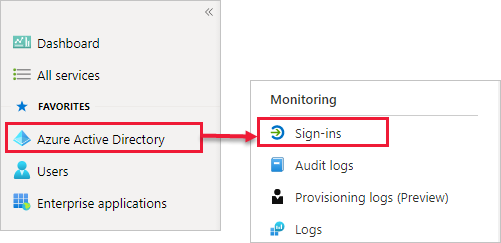

# Power Bi-gebruikers zoeken die zich hebben aangemeld

Als u beheerder bent voor uw organisatie en u wilt zien wie zich heeft aangemeld bij Power BI, kunt u de [toegangs- en gebruiksrapporten van Azure Active Directory](/azure/active-directory/reports-monitoring/concept-sign-ins) gebruiken.

> [!NOTE]
> Het rapport **Aanmeldingen** bevat nuttige informatie, maar vermeldt niet het type licentie van elke gebruiker. Gebruik het Microsoft 365-beheercentrum om licenties te bekijken.

## Vereisten

Elke gebruiker kan een rapport van zijn/haar eigen aanmeldingen bekijken. Als u een rapport voor alle gebruikers wilt bekijken, moet u een van de volgende rollen hebben: Globale beheerder, Beveiligingsbeheerder, Beveiligingslezer, Globale lezer of Rapportlezer.

## Het Azure Active Directory-beheercentrum gebruiken om aanmeldingen weer te geven

Volg deze stappen om aanmeldingsactiviteiten te bekijken.

1. Meld u aan bij het [Azure Active Directory-beheercentrum](https://aad.portal.azure.com) en selecteer **Azure Active Directory** in het portalmenu.

1. Selecteer **Bewaking** > **Aanmeldingen** in het resourcemenu.
   
    

1. Standaard worden alle aanmeldingen van de afgelopen 24 uur voor alle gebruikers en alle toepassingen weergegeven. Als u een andere tijdsperiode wilt selecteren, selecteert u **Datum** in het werkvenster en kiest u uit de beschikbare tijdsintervallen. Alleen de gegevens van de laatste zeven dagen zijn beschikbaar. Als u alleen aanmeldingen bij Power BI wilt zien, voegt u filters toe. Selecteer **Filter toevoegen** > Kies **Toepassing** als het veld waarop u wilt filteren en selecteer **Toepassen**. Selecteer **Toepassing begint met** bovenaan het werkvenster en voer de naam van de app in. Selecteer **Toepassen**.

    **Microsoft Power BI** filtert op aanmeldactiviteit met betrekking tot de service. **Power BI Gateway** filtert op aanmeldactiviteit die specifiek is voor de on-premises gegevensgateway.
   
    

## De gegevens exporteren

U kunt [een aanmeldingsrapport downloaden](/azure/active-directory/reports-monitoring/quickstart-download-sign-in-report) als een CSV-bestand of als een JSON-bestand.

1. Selecteer in de opdrachtbalk voor het rapport **Aanmeldingen** de optie **Downloaden** en selecteer vervolgens een van de volgende opties:

   * **CSV** om een CSV-bestand voor de uitgefilterde gegevens te downloaden.

   * **JSON** om een JSON-bestand voor de uitgefilterde gegevens te downloaden.

2. Typ een bestandsnaam en selecteer vervolgens **Downloaden**.

## Bewaartijd voor gegevens

Aanmeldingsgegevens zijn maximaal zeven dagen beschikbaar, tenzij uw organisatie een Azure AD Premium-licentie heeft. Als u Azure AD Premium P1 of Azure AD Premium P2 gebruikt, kunt u de gegevens weergeven van de afgelopen 30 dagen. Zie [Azure Active Directory report retention policies](/azure/active-directory/reports-monitoring/reference-reports-data-retention) (Bewaarbeleid voor Azure Active Directory-rapporten) voor meer informatie.

## Volgende stappen

[Gebruikersactiviteit controleren](service-admin-auditing.md)

Hebt u nog vragen? [Misschien dat de Power BI-community het antwoord weet](https://community.powerbi.com/)