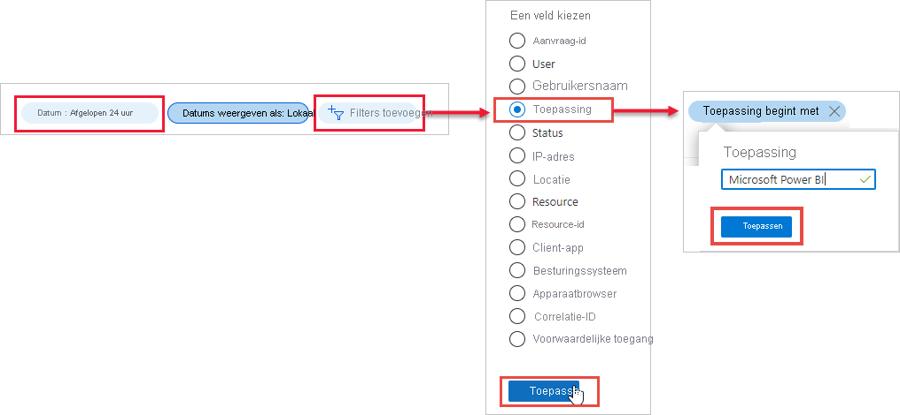

# Power Bi-gebruikers zoeken die zich hebben aangemeld

Als u een tenantbeheerder bent en u wilt zien wie zich heeft aangemeld bij Power BI, kunt u met behulp van de [toegangs- en gebruiksrapporten van Azure Active Directory](/azure/active-directory/reports-monitoring/concept-sign-ins) meer zichtbaarheid krijgen.

> [!NOTE]
> Het rapport **Aanmeldingen** bevat nuttige informatie, maar vermeldt niet het type licentie van de afzonderlijke gebruikers. Gebruik het Microsoft 365-beheercentrum om licenties te bekijken.

## Vereisten

Alle gebruikers (met inbegrip van niet-beheerders) kunnen een rapport inzien van hun eigen aanmeldingen, maar u moet voldoen aan de volgende vereisten om een rapport voor alle gebruikers te zien.

* Er moet een Azure Active Directory Premium-licentie zijn gekoppeld aan uw tenant.

* U moet een van de volgende rollen hebben: Globale beheerder, Beveiligingsbeheerder of Beveiligingslezer.

## Aanmeldingen bekijken in de Azure-portal

Volg deze stappen om aanmeldingsactiviteiten te bekijken.

1. Selecteer **Azure Active Directory** in de **Azure-portal**.

1. Selecteer **Aanmeldingen** onder **Bewaking**.
   
    

1. Filter de toepassing op **Microsoft Power BI** of **Power BI Gateway** en selecteer **Toepassen**.

    Kies **Microsoft Power BI** om te filteren op aanmeldingsactiviteit met betrekking tot de service. Kies **Power BI Gateway** om te filteren op specifieke aanmeldingsactiviteit voor de on-premises gegevensgateway.
   
    

## De gegevens exporteren

U kunt [een aanmeldingsrapport downloaden](/azure/active-directory/reports-monitoring/quickstart-download-sign-in-report) als een CSV-bestand of als een JSON-bestand.

Selecteer bovenaan het rapport **Aanmeldingen** de optie **Downloaden** en selecteer vervolgens een van de volgende opties:

* **CSV** om een CSV-bestand voor de uitgefilterde gegevens te downloaden.

* **JSON** om een JSON-bestand voor de uitgefilterde gegevens te downloaden.

## Bewaartijd voor gegevens

Gegevens van aanmeldingen zijn maximaal 30 dagen beschikbaar. Zie [Azure Active Directory report retention policies](/azure/active-directory/reports-monitoring/reference-reports-data-retention) (Bewaarbeleid voor Azure Active Directory-rapporten) voor meer informatie.

## Volgende stappen

[Auditing gebruiken binnen uw organisatie](service-admin-auditing.md)

Hebt u nog vragen? [Misschien dat de Power BI-community het antwoord weet](https://community.powerbi.com/)