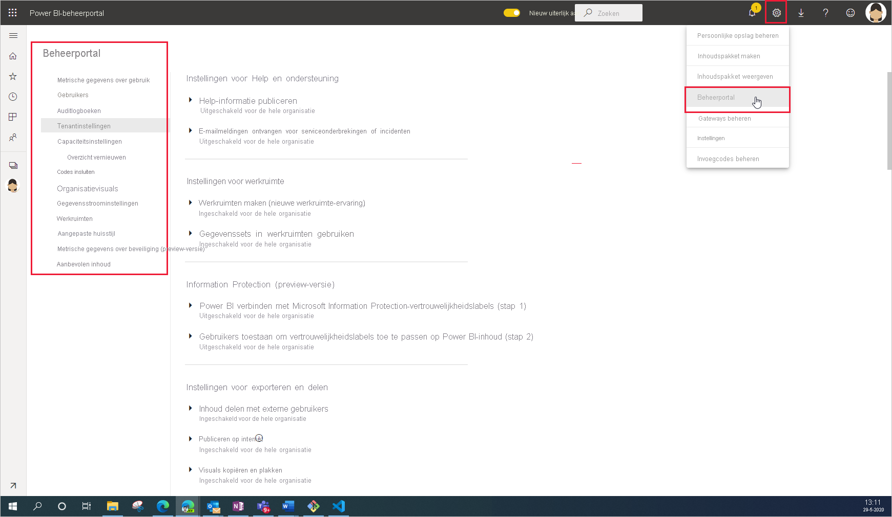

# Wat is Power BI-beheer?

Power BI-beheer is het beheer van de instellingen voor de hele organisatie die bepalen hoe Power BI werkt. Gebruikers die zijn toegewezen aan beheerdersrollen configureren, bewaken en inrichten van organisatiebronnen. In dit artikel vindt u een overzicht van beheerrollen, taken en hulpmiddelen om u op weg te helpen.

## Beheerdersrollen die betrekking hebben op Power BI

Er zijn verschillende rollen die samenwerken om Power BI voor uw organisatie te beheren. De meeste beheerdersrollen worden toegewezen in het Microsoft 365-beheercentrum of met PowerShell. De beheerdersrollen Power BI Premium-capaciteit en Power BI-ingesloten capaciteit worden toegewezen wanneer de capaciteit wordt gemaakt. Zie [Over beheerdersrollen](/microsoft-365/admin/add-users/about-admin-roles) voor meer informatie over elk van de beheerdersrollen. Zie [Beheerdersrollen toewijzen](/microsoft-365/admin/add-users/assign-admin-roles) voor meer informatie over het toewijzen van beheerdersrollen.

| **Type beheerder** | **Beheerscope** | **Power BI-taken** |
| --- | --- | --- |
| Globale beheerder | Microsoft 365 | Heeft onbeperkte toegang tot alle beheerfuncties voor de organisatie |
| | | Hiermee wijst u rollen toe aan andere gebruikers |
| Factureringsbeheerder | Microsoft 365 | Abonnementen beheren |
| | | Licenties kopen |
| Licentiebeheerder | Microsoft 365 | Licenties voor gebruikers toewijzen of verwijderen |
| Gebruikersbeheerder | Microsoft 365 | Gebruikers en groepen maken en beheren |
| | | Gebruikerswachtwoorden opnieuw instellen |
| Power BI-beheerder | Power BI-service | Volledige toegang tot Power BI-beheertaken|
| | | Functies van Power BI in- en uitschakelen |
| | | Rapporteren over gebruik en prestaties |
| | | Controle bekijken en beheren |
| Power BI Premium-capaciteitsbeheerder | Eén Premium-capaciteit | Werkruimten toewijzen aan de capaciteit|
| | | Gebruikersmachtiging voor de capaciteit beheren |
| | | Werkbelastingen beheren om geheugengebruik te configureren |
| | | De capaciteit opnieuw starten |
| Power BI Embedded-capaciteitsbeheerder | Eén Embedded-capaciteit | Werkruimten toewijzen aan de capaciteit|
| | | Gebruikersmachtiging voor de capaciteit beheren |
| | | Werkbelastingen beheren om geheugengebruik te configureren |
| | | De capaciteit opnieuw starten |

## Beheertaken en hulpprogramma’s

Power BI-beheerders werken meestal in de Power BI-beheerportal. U moet echter bekend zijn met gerelateerde hulpprogramma’s en beheercentra. Bekijk de bovenstaande tabel om te bepalen welke rol vereist is om taken uit te voeren met de hulpprogramma's die hier worden weergegeven.

| **Hulpprogramma** | **Veelvoorkomende taken** |
| --- | --- |
| [Power BI-beheerportal](https://app.powerbi.com/admin-portal) | Premium-capaciteit aanschaffen en ermee werken |
| | Kwaliteit van service waarborgen |
| | Werkruimten beheren |
| | Power BI-visuals publiceren |
| | Codes verifiëren die worden gebruikt voor het insluiten van Power BI in andere toepassingen |
| | Oplossen van gegevens bij gegevenstoegang en andere problemen |
| [Microsoft 365-beheercentrum](https://admin.microsoft.com) | Gebruikers en groepen beheren |
| | Licenties kopen en toewijzen |
| | Toegang tot Power BI blokkeren voor gebruikers |
| [Microsoft 365-centrum voor beveiliging en naleving](https://protection.office.com) | Controle bekijken en beheren |
| | Gegevensclassificatie en -tracering |
| | DLP-beleid (preventie van gegevensverlies) |
| | Informatiegovernance |
| [Azure Active Directory in Azure Portal](https://aad.portal.azure.com) | Voorwaardelijke toegang tot Power BI-resources configureren |
| | Power BI Embedded-capaciteit inrichten |
| [PowerShell-cmdlets](/powershell/power-bi/overview) | Werkruimten en andere aspecten van Power BI beheren via scripts |
| [API's en SDK voor beheer](service-admin-reference.md) | Aangepaste beheerhulpprogramma's bouwen. In Power BI Desktop kunnen deze API's bijvoorbeeld worden gebruikt om rapporten te maken op basis van gegevens met betrekking tot beheer. |

## Volgende stappen

Nu u de basisprincipes van Power BI-beheer kent, kunt u deze artikelen raadplegen om meer te weten te komen:

- [De Power BI-beheerportal gebruiken](service-admin-portal.md)
- [Richtlijnen voor tenantinstellingen](../guidance/admin-tenant-settings.md)
- [PowerShell-cmdlets gebruiken](/powershell/power-bi/overview)
- [Veelgestelde vragen over Power BI-beheer](service-admin-faq.md)
- [Power BI-licenties voor gebruikers in uw organisatie](service-admin-licensing-organization.md)
- Vragen? [Misschien dat de Power BI-community het antwoord weet](https://community.powerbi.com/)
- Suggesties? [Ideeën bijdragen om Power BI te verbeteren](https://ideas.powerbi.com/)