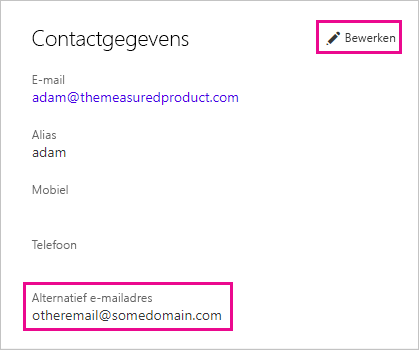

# <a name="use-an-alternate-email-address"></a>Een ander e-mailadres gebruiken

Wanneer u zich registreert voor Power BI, geeft u een e-mailadres op. Power BI gebruikt dit adres standaard voor het verzenden van updates over de activiteit in de service. Wanneer iemand u bijvoorbeeld een uitnodiging stuurt om iets te delen, wordt deze naar dit adres verzonden.

In sommige gevallen hebt u liever dat deze e-mailberichten naar een ander e-mailadres worden gestuurd dan het adres waarmee u zich hebt geregistreerd. In dit artikel wordt uitgelegd hoe u in Microsoft 365 en PowerShell een ander adres opgeeft. In het artikel wordt ook uitgelegd hoe een e-mailadres wordt omgezet door Azure Active Directory (Azure AD).

> [!NOTE]
> Het opgeven van een ander adres heeft geen invloed op het e-mailadres dat door Power BI wordt gebruikt voor service-updates, nieuwsbrieven en andere commerciële berichten. Deze berichten worden altijd verzonden naar het e-mailadres waarmee u zich hebt geregistreerd voor Power BI.

## <a name="use-microsoft-365"></a>Microsoft 365 gebruiken

Volg deze stappen als u een ander adres wilt opgeven in Microsoft 365.

1. Open de pagina [Persoonlijke gegevens](https://portal.office.com/account/#personalinfo) van uw account. Als u door de app wordt gevraagd om u aan te melden, doet u dit met het e-mailadres en het wachtwoord dat u voor Power BI gebruikt.

1. Selecteer in het menu links de optie **Persoonlijke gegevens**.

1. Selecteer in de sectie **Contactgegevens** de optie **Bewerken**.

    Als u uw gegevens niet kunt bewerken, betekent dit dat uw e-mailadres wordt beheerd door uw beheerder. Neem contact op met uw beheerder om uw e-mailadres bij te werken.

    

1. Voer in het veld **Alternatief e-mailadres** het e-mailadres in dat Microsoft 365 moet gebruiken voor Power BI-updates.

## <a name="use-powershell"></a>PowerShell gebruiken

Als u een ander adres in PowerShell wilt opgeven, gebruikt u de opdracht [Set-AzureADUser](/powershell/module/azuread/set-azureaduser/).

```powershell
Set-AzureADUser -ObjectId john@contoso.com -OtherMails "otheremail@somedomain.com"
```

## <a name="email-address-resolution-in-azure-ad"></a>E-adresomzetting in Azure AD

Als u een insluittoken van Azure AD wilt vastleggen voor Power BI, kunt u gebruikmaken van een van de volgende drie soorten e-mailadressen:

* Het belangrijkste e-mailadres dat is gekoppeld aan het Azure AD-account van een gebruiker;

* Het e-mailadres UserPrincipalName (UPN);

* Het matrixkenmerk *ander e-mailadres*.

Power BI selecteert welk e-mailadres moet worden gebruikt op basis van deze volgorde:

1. Als het e-mailkenmerk in het Azure AD-gebruikersobject aanwezig is, gebruikt Power BI dat e-mailkenmerk als e-mailadres.

1. Als het UPN-e-mailadres *niet* behoort tot het domein **\*.onmicrosoft.com** (de gegevens na het symbool \@), gebruikt Power BI dat e-mailkenmerk als e-mailadres.

1. Als het matrixkenmerk *ander e-mailadres* in het Azure AD-gebruikersobject aanwezig is, gebruikt Power BI het eerste e-mailadres in die lijst (omdat dit kenmerk een lijst van e-mailadressen kan bevatten).

1. Als aan geen van de bovenstaande voorwaarden wordt voldaan, gebruikt Power BI het UPN-adres.

Hebt u nog vragen? [Misschien dat de Power BI-community het antwoord weet](https://community.powerbi.com/)