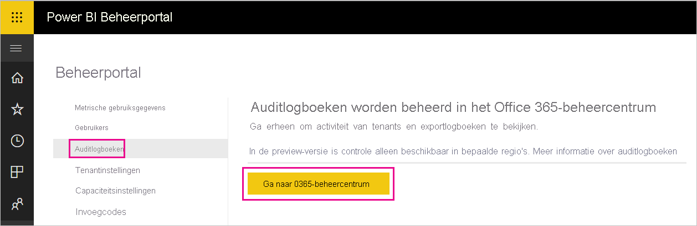

# <a name="track-user-activities-in-power-bi"></a>Activiteiten van gebruikers bijhouden in Power BI

Weten wie welke actie uitvoert op een item in uw Power BI-tenant kan essentieel zijn om uw organisatie te helpen te voldoen aan de vereisten, zoals het voldoen aan regelgeving en archiefbeheer. Met Power BI hebt u twee opties om gebruikersactiviteiten bij te houden: Het [Power BI-activiteitenlogboek](#use-the-activity-log) en het [gecombineerde auditlogboek](#use-the-audit-log). Deze logboeken bevatten beide een volledige kopie van de [Power BI-controlegegevens](#operations-available-in-the-audit-and-activity-logs). Er zijn echter verschillende belangrijke verschillen, zoals beschreven in de volgende tabel.

| **Gecombineerd auditlogboek** | **Power BI-activiteitenlogboek** |
| --- | --- |
| Bevat naast de Power BI-controlegebeurtenissen tevens gebeurtenissen van SharePoint Online, Exchange Online, Dynamics 365 en andere services. | Bevat alleen de Power BI-controlegebeurtenissen. |
| Alleen gebruikers met machtigingen voor Alleen-lezen auditlogboeken of Auditlogboeken hebben toegang, zoals globale beheerders en auditors. | Globale beheerders en Power BI-servicebeheerders hebben toegang. |
| Globale beheerders en auditors kunnen in het gecombineerde auditlogboek zoeken met behulp van het Microsoft 365 Security Center en het Microsoft 365-compliancecentrum. | Er is nog geen gebruikersinterface om het activiteitenlogboek te doorzoeken. |
| Globale beheerders en auditors kunnen vermeldingen in controlelogboeken downloaden met behulp van Microsoft 365-beheer-API's en -cmdlets. | Globale beheerders en Power BI-servicebeheerders kunnen vermeldingen in het activiteitenlogboek downloaden met behulp van een Power BI REST API en beheer-cmdlet. |
| Bewaart controlegegevens gedurende 90 dagen | Bewaart activiteitengegevens gedurende 30 dagen (openbare preview). |
| Houdt controlegegevens bij, zelfs als de tenant wordt verplaatst naar een andere Azure-regio. | Houdt geen controlegegevens bij als de tenant wordt verplaatst naar een andere Azure-regio. |


## <a name="use-the-activity-log"></a>Het activiteitenlogboek gebruiken

> [!NOTE]
> Activiteitenlogboek wordt niet ondersteund voor Microsoft Cloud Deutschland. Meer informatie over de servicebeperkingen voor de cloud voor Duitsland vindt u in [Veelgestelde vragen over klanten voor de Power BI-cloud voor DuitslandDuitse](service-govde-faq.md).


Als Power BI-servicebeheerder kunt u het gebruik van alle Power BI-resources op tenantniveau analyseren door aangepaste rapporten te gebruiken op basis van het Power BI-activiteitenlogboek. U kunt de activiteiten downloaden met behulp van een REST API of PowerShell-cmdlet. U kunt ook de activiteitsgegeven filteren op datumbereik, gebruiker en type activiteit.

### <a name="activity-log-requirements"></a>Vereisten voor activiteitenlogboek

U moet aan deze vereisten voldoen om toegang te krijgen tot het Power BI-activiteitenlogboek:

- U moet een globale beheerder of een Power BI-servicebeheerder zijn.
- U hebt de [Power BI Management-cmdlets](https://www.powershellgallery.com/packages/MicrosoftPowerBIMgmt) lokaal geïnstalleerd of u gebruikt de Power BI Management-cmdlets in Azure Cloud Shell.

### <a name="activityevents-rest-api"></a>ActivityEvents REST API

U kunt een beheertoepassing op basis van de Power BI REST API's gebruiken om activiteitsgebeurtenissen te exporteren naar een blobarchief of een SQL-database. U kunt vervolgens een aangepast gebruiksrapport maken boven op de geëxporteerde gegevens. In de REST API-aanroep **ActivityEvents** moet u een begindatum en einddatum opgeven, en optioneel een filter selecteren om activiteiten te selecteren op type activiteit of gebruikers-id. Omdat het activiteitenlogboek een grote hoeveelheid gegevens kan bevatten, ondersteunt de API **ActivityEvents** momenteel alleen het downloaden van maximaal één dag aan gegevens per aanvraag. Met andere woorden, de begindatum en einddatum moeten dezelfde dag aangeven, zoals in het volgende voorbeeld. Zorg ervoor dat u de datum-/tijdwaarden in UTC-notatie opgeeft.

```
https://api.powerbi.com/v1.0/myorg/admin/activityevents?startDateTime='2019-08-31T00:00:00'&endDateTime='2019-08-31T23:59:59'
```

Als het aantal items groot is, retourneert de **ActivityEvents**-API slechts ongeveer 5.000 tot 10.000 vermeldingen en een vervolgtoken. Roep de API **ActivityEvents** opnieuw aan met het vervolgtoken om de volgende batch vermeldingen te verkrijgen, enzovoort, totdat u alle vermeldingen hebt opgehaald en u geen vervolgtoken meer ontvangt. In het volgende voorbeeld ziet u hoe u het vervolgtoken gebruikt.

```
https://api.powerbi.com/v1.0/myorg/admin/activityevents?continuationToken='%2BRID%3ARthsAIwfWGcVAAAAAAAAAA%3D%3D%23RT%3A4%23TRC%3A20%23FPC%3AARUAAAAAAAAAFwAAAAAAAAA%3D'
```

Wat het aantal geretourneerde vermeldingen ook is, als de resultaten een vervolgtoken bevatten, roept u de API opnieuw aan met dat token om de resterende gegevens op te halen, totdat er geen vervolgtoken meer wordt geretourneerd. Het kan gebeuren dat een aanroep zelfs een vervolgtoken retourneert zonder gebeurtenisvermeldingen. In het volgende voorbeeld ziet u hoe u een lus met een vervolgtoken retourneert dat in het antwoord wordt geretourneerd:

```
while(response.ContinuationToken != null)
{
   // Store the activity event results in a list for example
    completeListOfActivityEvents.AddRange(response.ActivityEventEntities);

    // Make another call to the API with continuation token
    response = GetPowerBIActivityEvents(response.ContinuationToken)
}
completeListOfActivityEvents.AddRange(response.ActivityEventEntities);
```
> [!NOTE]
> Het kan tot 24 uur duren voordat alle gebeurtenissen worden weergegeven, hoewel alle gegevens normaal gesproken al veel eerder beschikbaar zijn.
>
>
Zie [Admin - Activiteitgebeurtenissen ophalen](/rest/api/power-bi/admin/getactivityevents) in de naslaginformatie voor Power BI REST API voor meer informatie over het gebruik van de Power BI REST API, inclusief voorbeelden van het ophalen van gebeurtenissen voor controle-activiteiten.

### <a name="get-powerbiactivityevent-cmdlet"></a>Cmdlet Get-PowerBIActivityEvent

U kunt de activiteitengebeurtenissen downloaden via de Power BI Management-cmdlets voor PowerShell. Met de cmdlet **Get-PowerBIActivityEvent** wordt de vervolgtoken automatisch voor u afgehandeld. De cmdlet **Get-PowerBIActivityEvent** gebruikt een StartDateTime- en een EndDateTime-parameter met dezelfde beperkingen als de REST API **ActivityEvents**. Met andere woorden, de begindatum en einddatum moeten verwijzen naar dezelfde datumwaarde omdat u de gegevens van de activiteit voor maar één dag tegelijk kunt ophalen.

In het volgende script ziet u hoe u alle Power BI-activiteiten kunt downloaden. Met de opdracht worden de resultaten van JSON geconverteerd naar .NET-objecten voor eenvoudige toegang tot eigenschappen van afzonderlijke activiteiten. In deze voorbeelden ziet u de kleinste en grootste tijdstempels die op een dag kunnen worden gebruikt om er zeker van te zijn dat er geen gebeurtenissen worden gemist.

```powershell
Login-PowerBI

$activities = Get-PowerBIActivityEvent -StartDateTime '2019-08-31T00:00:00' -EndDateTime '2019-08-31T23:59:59' | ConvertFrom-Json

$activities.Count
$activities[0]

```

### <a name="filter-activity-data"></a>Activiteitsgegevens filteren

U kunt activiteitsgebeurtenissen filteren op activiteitstype en gebruikers-id. In het volgende script ziet u hoe u alleen de gebeurtenisgegevens voor de activiteit **ViewDashboard** kunt downloaden. Gebruik de opdracht `Get-Help Get-PowerBIActivityEvent` voor meer informatie over ondersteunde parameters.

```powershell
Login-PowerBI

$activities = Get-PowerBIActivityEvent -StartDateTime '2019-08-31T00:00:00' -EndDateTime '2019-08-31T23:59:59' -ActivityType 'ViewDashboard' | ConvertFrom-Json

$activities.Count
$activities[0]

```

> [!NOTE]
> Er is een PowerShell-voorbeeld beschikbaar dat u helpt om gebeurtenissen in het Power BI-activiteitenlogboek te filteren en op te halen. Zie [Toegang tot het Power BI-activiteitenlogboek](../guidance/admin-activity-log.md) voor meer informatie.

## <a name="use-the-audit-log"></a>Het controlelogboek gebruiken

Als het uw taak is om gebruikersactiviteiten bij te houden in Power BI en Microsoft 365, kunt u in het Microsoft 365-beveiligings- en compliancecentrum controlebewerkingen uitvoeren of PowerShell gebruiken. Controles zijn afhankelijk van de functionaliteit in Exchange Online, dat automatisch is ingericht ter ondersteuning van Power BI.

U kunt de auditgegevens filteren op datumbereik, gebruiker, dashboard, rapport, gegevensset en soort activiteit. U kunt de activiteiten ook downloaden in een CSV-bestand (bestand met door komma's gescheiden waarden) om de gegevens offline te analyseren.

### <a name="audit-log-requirements"></a>Vereisten voor controlelogboek

U moet aan deze vereisten voldoen voor toegang tot de auditlogboeken:

- U moet een globale beheerder zijn of u moet de rol Auditlogboeken of Auditlogboeken alleen-lezen in Exchange Online hebben voor toegang tot het auditlogboek. Standaard beschikken de rolgroepen Nalevingsbeheer en Organisatiebeheer over deze rollen op de pagina **Machtigingen** in het Exchange-beheercentrum. Zie [Vereisten voor zoeken in het auditlogboek](/microsoft-365/compliance/search-the-audit-log-in-security-and-compliance#requirements-to-search-the-audit-log) voor meer informatie over de rollen waarmee auditlogboeken kunnen worden weergegeven.

    Als u niet-beheerdersaccounts toegang wilt geven tot de auditlogboeken, voegt u de gebruiker als lid van een van deze rolgroepen toe. Als u dit op een andere manier wilt doen, kunt u een aangepaste rolgroep maken in het Exchange-beheercentrum, de rollen Auditlogboeken of Auditlogboeken alleen-lezen aan deze groep toewijzen en vervolgens het niet-beheerdersaccount toewijzen aan de nieuwe rolgroep. Raadpleeg [Rolgroepen beheren in Exchange Online](/Exchange/permissions-exo/role-groups) voor meer informatie.

    Als u vanuit het Microsoft 365-beheercentrum geen toegang hebt tot het Exchange-beheercentrum, gaat u naar https://outlook.office365.com/ecp en meldt u zich aan met uw referenties.

- Als u wel toegang tot het auditlogboek hebt maar geen algemene beheerder of beheerder van de Power BI-service bent, krijgt u geen toegang tot de beheerportal van Power BI. In dit geval gebruikt u een rechtstreekse koppeling naar het [Office 365-centrum voor beveiliging en naleving](https://sip.protection.office.com/#/unifiedauditlog).

### <a name="access-your-audit-logs"></a>Auditlogboeken raadplegen

Als u logboeken wilt raadplegen, moet logboekregistratie zijn ingeschakeld in Power BI. Raadpleeg voor meer informatie [Auditlogboeken](service-admin-portal.md#audit-logs) in de documentatie voor de beheerportal. Er kan een vertraging tot 48 uur optreden tussen het inschakelen van de controlefunctie en het kunnen weergeven van controlegegevens. Als u niet direct gegevens ziet, controleert u de controlelogboeken op een later tijdstip. Er kan een vergelijkbare vertraging optreden tussen het ophalen van machtiging voor het weergeven van controlelogboeken en het kunnen openen van de logboeken.

De Power BI-auditlogboeken zijn rechtstreeks beschikbaar via het [Office 365-centrum voor beveiliging en naleving](https://sip.protection.office.com/#/unifiedauditlog). Er is ook een koppeling vanuit de Power BI-beheerportal:

1. Selecteer in Power BI rechtsboven het **tandwielpictogram** en selecteer vervolgens **Beheerportal**.

   

1. Selecteer **Auditlogboeken**.

1. Selecteer **Naar het Microsoft 365-beheercentrum gaan**.

   

### <a name="search-only-power-bi-activities"></a>Alleen Power BI activiteiten zoeken

Volg deze stappen om de resultaten te beperken tot alleen Power BI-activiteiten. Raadpleeg voor een lijst activiteiten de [Lijst van activiteiten die worden gecontroleerd door Power BI](#operations-available-in-the-audit-and-activity-logs). Deze lijst staat verderop in dit artikel.

1. Klik op de pagina **Auditlogboeken zoeken** onder **Zoeken** op de pijl-omlaag bij **Activiteiten**.

2. Selecteer **Power BI-activiteiten**.

   

3. Maak een selectie buiten de vervolgkeuzelijst om deze te sluiten.

Met uw zoekopdrachten worden alleen Power BI activiteiten gevonden.

### <a name="search-the-audit-logs-by-date"></a>Op datum zoeken in auditlogboeken

U kunt op datumbereik zoeken in de logboeken met behulp van de velden **Begindatum** en **Einddatum**. De standaardselectie is de afgelopen zeven dagen. De datum en tijd worden weergegeven in de UTC-notatie (Coordinated Universal Time). Het maximale datumbereik dat u kunt opgeven is 90 dagen. 

Er treedt een fout op als het geselecteerde datumbereik groter is dan 90 dagen. Als u het maximale datumbereik van 90 dagen gebruikt, selecteert u de huidige tijd voor **Begindatum**. Anders krijgt u een foutmelding met de mededeling dat de begindatum voor de einddatum valt. Als u controles hebt ingeschakeld in de afgelopen 90 dagen, kan het datumbereik niet beginnen voor de datum waarop controles zijn ingeschakeld.


### <a name="search-the-audit-logs-by-users"></a>Op gebruiker zoeken in auditlogboeken

U kunt zoeken naar vermeldingen in het auditlogboek voor activiteiten die zijn uitgevoerd door specifieke gebruikers. Hiervoor typt u een of meer gebruikersnamen in het veld **Gebruikers**. De gebruikersnaam ziet eruit als een e-mailadres. Het is het account waarmee gebruikers zich aanmelden bij Power BI. Laat dit vak leeg om vermeldingen weer te geven voor alle gebruikers (en serviceaccounts) in uw organisatie.


### <a name="view-search-results"></a>Zoekresultaten weergeven

Nadat u **Zoeken** hebt geselecteerd, worden de zoekresultaten geladen. Na enkele ogenblikken worden ze weergegeven onder **Resultaten**. Wanneer de zoekopdracht is voltooid, wordt het aantal gevonden resultaten weergegeven. Met **Zoeken in logboeken** worden maximaal 1000 gebeurtenissen gevonden. Als meer dan 1000 gebeurtenissen voldoen aan de zoekcriteria, geeft de app de meest recente 1000 gebeurtenissen weer.

#### <a name="view-the-main-results"></a>De belangrijkste resultaten bekijken

Het gebied **Resultaten** bevat de volgende informatie voor elke gebeurtenis die door de zoekopdracht is geretourneerd. Selecteer een kolomkop onder **Resultaten** om de resultaten te sorteren.

| **Kolom** | **Beschrijving** |
| --- | --- |
| Datum |De datum en tijd (in UTC-notatie) wanneer de gebeurtenis heeft plaatsgevonden. |
| IP-adres |Het IP-adres van het apparaat dat is gebruikt voor de geregistreerde activiteit. Het IP-adres wordt weergegeven in de adresnotatie van IPv4 of IPv6. |
| Gebruiker |De gebruiker (of het serviceaccount) die de actie heeft uitgevoerd die de gebeurtenis heeft veroorzaakt. |
| Activiteit |De activiteit die is uitgevoerd door de gebruiker. Deze waarde komt overeen met de activiteiten die u hebt geselecteerd in de vervolgkeuzelijst **Activiteiten**. Voor een gebeurtenis uit het auditlogboek van de Exchange-beheerder is de waarde in deze kolom een Exchange-cmdlet. |
| Item |Het object dat is gemaakt of gewijzigd als gevolg van de bijbehorende activiteit. Dit kan bijvoorbeeld het weergegeven of gewijzigde bestand zijn of het bijgewerkte gebruikersaccount. Niet alle activiteiten hebben een waarde in deze kolom. |
| Detail |Aanvullende details van een activiteit. Ook hier hebben niet alle activiteiten een waarde. |

#### <a name="view-the-details-for-an-event"></a>Details van een gebeurtenis bekijken

Als u meer gegevens van een gebeurtenis wilt bekijken, selecteert u de record van de gebeurtenis in de lijst met zoekresultaten. Er verschijnt een pagina **Details** met de gedetailleerde eigenschappen uit de gebeurtenisrecord. De eigenschappen die worden weergegeven op de pagina **Details** zijn afhankelijk van de Microsoft 365-service waarin de gebeurtenis zich voordoet.

Als u deze informatie wilt weergeven, selecteert u **Meer informatie**. Alle Power BI-vermeldingen hebben een waarde van 20 voor de eigenschap RecordType. Voor informatie over andere eigenschappen raadpleegt u [Gedetailleerde eigenschappen in het auditlogboek](/office365/securitycompliance/detailed-properties-in-the-office-365-audit-log/).

   

### <a name="export-search-results"></a>Zoekresultaten exporteren

Als u het Power BI-auditlogboek wilt exporteren als een CSV-bestand, volgt u deze stappen.

1. Selecteer **Resultaten exporteren**.

1. Selecteer **Geladen resultaten opslaan** of **Alle resultaten downloaden**.

    

### <a name="use-powershell-to-search-audit-logs"></a>Gebruik PowerShell om naar auditlogboeken te zoeken

U kunt PowerShell ook gebruiken om toegang tot de auditlogboeken te krijgen op basis van uw aanmeldingsgegevens. In het volgende voorbeeld ziet u hoe u verbinding maakt met Exchange Online PowerShell en vervolgens de opdracht [Search-UnifiedAuditLog](/powershell/module/exchange/policy-and-compliance-audit/search-unifiedauditlog?view=exchange-ps&preserve-view=true/) gebruikt om vermeldingen van Power BI-auditlogboeken op te halen. Als u het script wilt uitvoeren, moet een beheerder de juiste machtigingen aan u toewijzen. Zie voor meer informatie de sectie [Vereisten voor controlelogboek](#audit-log-requirements).

```powershell
Set-ExecutionPolicy RemoteSigned

$UserCredential = Get-Credential

$Session = New-PSSession -ConfigurationName Microsoft.Exchange -ConnectionUri https://outlook.office365.com/powershell-liveid/ -Credential $UserCredential -Authentication Basic -AllowRedirection

Import-PSSession $Session
Search-UnifiedAuditLog -StartDate 9/11/2018 -EndDate 9/15/2018 -RecordType PowerBI -ResultSize 1000 | Format-Table | More
```

### <a name="use-powershell-to-export-audit-logs"></a>Gebruik PowerShell om auditlogboeken te exporteren

U kunt PowerShell ook gebruiken om de resultaten van uw zoekopdracht voor de auditlogboeken te exporteren. In het volgende voorbeeld ziet u hoe u verzendt via de opdracht [Search-UnifiedAuditLog](/powershell/module/exchange/policy-and-compliance-audit/search-unifiedauditlog?view=exchange-ps&preserve-view=true/) en de resultaten exporteert met de cmdlet [Export-Csv](/powershell/module/microsoft.powershell.utility/export-csv). Als u het script wilt uitvoeren, moet een beheerder de juiste machtigingen aan u toewijzen. Zie voor meer informatie de sectie [Vereisten voor controlelogboek](#audit-log-requirements).

```powershell
$UserCredential = Get-Credential

$Session = New-PSSession -ConfigurationName Microsoft.Exchange -ConnectionUri https://outlook.office365.com/powershell-liveid/ -Credential $UserCredential -Authentication Basic -AllowRedirection

Import-PSSession $Session
Search-UnifiedAuditLog -StartDate 9/11/2019 -EndDate 9/15/2019 -RecordType PowerBI -ResultSize 5000 |
Export-Csv -Path "c:\temp\PowerBIAuditLog.csv" -NoTypeInformation

Remove-PSSession $Session
```

Zie [Connect to Exchange Online PowerShell](/powershell/exchange/exchange-online/connect-to-exchange-online-powershell/connect-to-exchange-online-powershell/) (Verbinding maken met Exchange Online PowerShell) voor meer informatie over het maken van verbinding met Exchange Online. Voor een ander voorbeeld van hoe u PowerShell met auditlogboeken gebruikt, raadpleegt u [Using Power BI audit log and PowerShell to assign Power BI Pro licenses](https://powerbi.microsoft.com/blog/using-power-bi-audit-log-and-powershell-to-assign-power-bi-pro-licenses/) (Power BI-auditlogboeken en PowerShell gebruiken om Power BI Pro-licenties toe te wijzen).

## <a name="operations-available-in-the-audit-and-activity-logs"></a>Bewerkingen die beschikbaar zijn in de controle- en activiteitenlogboeken

De volgende bewerkingen zijn beschikbaar in de controle- en activiteitenlogboeken.

| Beschrijvende naam                                     | Naam van bewerking                              | Opmerkingen                                  |
|---------------------------------------------------|---------------------------------------------|------------------------------------------|
| Toegang tot uitgelichte Power BI-tabellen in Excel | AnalyzedByExternalApplication |    |
| Gegevensbron toegevoegd aan Power BI-gateway             | AddDatasourceToGateway                      |                                          |
| Toegang tot Power BI-map toegevoegd                      | AddFolderAccess                             | Momenteel niet gebruikt                       |
| Power BI-groepsleden toegevoegd                      | AddGroupMembers                             |                                          |
| Opslagaccount van gegevensstroom door beheerder aan tenant gekoppeld | AdminAttachedDataflowStorageAccountToTenant | Momenteel niet gebruikt                       |
| Power BI-gegevensset geanalyseerd                         | AnalyzedByExternalApplication               | Wordt gegenereerd wanneer gebruikers met de service communiceren                                         |
| Power BI-rapport geanalyseerd                          | AnalyzeInExcel                              |                                          |
| Een werkruimte toegewezen aan een implementatiepijplijn                          | AssignWorkspaceToPipeline                              |                                          |
| Gekoppeld opslagaccount voor gegevensstroom                 | AttachedDataflowStorageAccount              |                                          |
| Verbonden Power BI-gegevensset aan gateway                | BindToGateway                               |                                          |
| Vernieuwen van gegevensstroom geannuleerd                        | CancelDataflowRefresh                       |                                          |
| Status van de capaciteit gewijzigd                            | ChangeCapacityState                         |                                          |
| Toewijzing van gebruiker van capaciteit gewijzigd                  | UpdateCapacityUsersAssignment               |                                          |
| Power BI-gegevenssetverbindingen gewijzigd              | SetAllConnections                           |                                          |
| Beheerders Power BI-gateway gewijzigd                   | ChangeGatewayAdministrators                 |                                          |
| Gebruikers van de Power BI-gateway-gegevensbron gewijzigd        | ChangeGatewayDatasourceUsers                |                                          |
| Een aangepaste visuals voor organisaties gemaakt                          | InsertOrganizationalGalleryItem                                |                                          |
| Organisatie-inhoudspakket voor Power BI gemaakt      | CreateOrgApp                                |                                          |
| Een implementatiepijplijn gemaakt      | CreateAlmPipeline                                |                                          |
| Power BI-app gemaakt                              | CreateApp                                   |                                          |
| Power BI-dashboard gemaakt                        | CreateDashboard                             |                                          |
| Power BI-gegevensstroom gemaakt                         | CreateDataflow                              |                                          |
| Power BI-gegevensset gemaakt                          | CreateDataset                               |                                          |
| Power BI-e-mailabonnement gemaakt               | CreateEmailSubscription                     |                                          |
| Power BI-map gemaakt                           | CreateFolder                                |                                          |
| Power BI Gateway gemaakt                          | CreateGateway                               |                                          |
| Power BI-groep gemaakt                            | CreateGroup                                 |                                          |
| Power BI-rapport gemaakt                           | CreateReport <sup>1</sup>                                |                                          |
| De werkruimte voor Power BI-sjabloon-apps maken | CreateTemplateApp   |
| Installatieticket voor Power BI-sjabloon-apps maken | CreateTemplateAppInstallTicket |
| Pakket voor Power BI-sjabloon-apps maken | CreateTemplateAppPackage |
| Aangepaste visual heeft Azure AD-toegangstoken aangevraagd                           | GenerateCustomVisualAADAccessToken                                |                                          |
| Aangepaste visual vereist Office Web Apps-toegangstoken                           | GenerateCustomVisualWACAccessToken                                |                                          |
| Gegevensstroom gemigreerd naar extern opslagaccount     | DataflowMigratedToExternalStorageAccount    | Momenteel niet gebruikt                       |
| Machtigingen voor gegevensstroom toegevoegd                        | DataflowPermissionsAdded                    | Momenteel niet gebruikt                       |
| Machtigingen voor gegevensstroom verwijderd                      | DataflowPermissionsRemoved                  | Momenteel niet gebruikt                       |
| Een aangepaste visual voor organisaties verwijderd     | DeleteOrganizationalGalleryItem                                |                                          |
| Een implementatiepijplijn verwijderd      | DeleteAlmPipeline                                |                                          |
| Organisatie-inhoudspakket voor Power BI verwijderd      | DeleteOrgApp                                |                                          |
| Power BI-opmerking verwijderd                          | DeleteComment                               |                                          |
| Power BI-dashboard verwijderd                        | DeleteDashboard                             | Momenteel niet gebruikt                       |
| Power BI-gegevensstroom verwijderd                         | DeleteDataflow                              | Momenteel niet gebruikt                       |
| Power BI-gegevensset verwijderd                          | DeleteDataset                               |                                          |
| Power BI-e-mailabonnement verwijderd               | DeleteEmailSubscription                     |                                          |
| Power BI-map verwijderd                           | DeleteFolder                                |                                          |
| Toegang tot Power BI-map verwijderd                    | DeleteFolderAccess                          | Momenteel niet gebruikt                       |
| Power BI Gateway verwijderd                          | DeleteGateway                               |                                          |
| Power BI-groep verwijderd                            | DeleteGroup                                 |                                          |
| Power BI-rapport verwijderd                           | DeleteReport                                |                                          |
| De werkruimte voor Power BI-sjabloon-apps verwijderen | DeleteTemplateApp |
| Pakket voor Power BI-sjabloon-app is verwijderd | DeleteTemplateAppPackage |
| Geïmplementeerd in een pijplijnfase                           | DeployAlmPipeline                                |                                          |
| Gegevensbronnen voor Power BI-gegevensset gedetecteerd          | GetDatasources                              |                                          |
| Power BI-rapport gedownload                        | DownloadReport                              |                                          |
| Bewerkte gegevensstroomeigenschappen                        | EditDataflowProperties                      |                                          |
| Machtiging voor Power BI-certificering bewerkt          | EditCertificationPermission                 | Momenteel niet gebruikt                       |
| Power BI-dashboard bewerkt                         | EditDashboard                               | Momenteel niet gebruikt                       |
| Power BI-gegevensset bewerkt                           | EditDataset                                 |                                          |
| Eigenschappen van Power BI-gegevensset bewerkt                | EditDatasetProperties                       | Momenteel niet gebruikt                       |
| Power BI-rapport bewerkt                            | EditReport                                  |                                          |
| Power BI-gegevensstroom geëxporteerd                        | ExportDataflow                              |                                          |
| Visuele gegevens van Power BI-rapport geëxporteerd              | ExportReport                                |                                          |
| Power BI-tegelgegevens geëxporteerd                       | ExportTile                                  |                                          |
| Het pakket voor de Power BI-sjabloon-app is uitgepakt naar de werkruimte | ExtractTemplateAppPackage |
| Kan machtigingen voor gegevensstroom niet toevoegen                | FailedToAddDataflowPermissions              | Momenteel niet gebruikt                       |
| Kan machtigingen voor gegevensstroom niet verwijderen             | FailedToRemoveDataflowPermissions           | Momenteel niet gebruikt                       |
| SAS-token van Power BI-gegevensstroom gegenereerd             | GenerateDataflowSasToken                    |                                          |
| Power BI-insluittoken gegenereerd                    | GenerateEmbedToken                          |                                          |
| Schermopname genereren                       | GenerateScreenshot |                     |
| Bestand naar Power BI geïmporteerd                         | Importeren                                      |                                          |
| Power BI-app geïnstalleerd                            | InstallApp                                  |                                          |
| Power BI-sjabloon-app geïnstalleerd | InstallTemplateApp |
| Werkruimte gemigreerd naar een capaciteit                  | MigrateWorkspaceIntoCapacity                |                                          |
| Power BI-opmerking geplaatst                           | PostComment                                 |                                          |
| Power BI-dashboard afgedrukt                        | PrintDashboard                              |                                          |
| Pagina van Power BI-rapport afgedrukt                      | PrintReport                                 |                                          |
| Pakket voor Power BI-sjabloon-app gepromoveerd | PromoteTemplateAppPackage |
| Power BI-rapport gepubliceerd op internet                  | PublishToWebReport <sup>2</sup>                         |                                          |
| Gepubliceerde of bijgewerkte aanbevolen tabellen | UpdateFeaturedTables <sup>3</sup>   | |
| Geheim van Power BI-gegevensstroom ontvangen uit Key Vault  | ReceiveDataflowSecretFromKeyVault           |                                          |
| Een werkruimte verwijderd uit een implementatiepijplijn         | UnassignWorkspaceFromPipeline                 |                                          |
| Gegevensbron verwijderd uit Power BI-gateway         | RemoveDatasourceFromGateway                 |                                          |
| Power BI-groepsleden verwijderd                    | DeleteGroupMembers                          |                                          |
| Werkruimte uit een capaciteit verwijderd                 | RemoveWorkspacesFromCapacity                |                                          |
| Power BI-dashboard hernoemd                        | RenameDashboard                             |                                          |
| Vernieuwing van Power BI-gegevensstroom aangevraagd               | RequestDataflowRefresh                      | Momenteel niet gebruikt                       |
| Vernieuwing van Power BI-gegevensset aangevraagd                | RefreshDataset                              |                                          |
| Power BI-werkruimten opgehaald                     | GetWorkspaces                               |                                          |
| Vertrouwelijkheidslabel toegepast                         | SensitivityLabelApplied                     |                                          |
| Vertrouwelijkheidslabel gewijzigd                         | SensitivityLabelChanged                     |                                          |
| Vertrouwelijkheidslabel verwijderd                         | SensitivityLabelRemoved                     |                                          |
| Locatie voor gegevensstroomopslag instellen voor een werkruimte     | SetDataflowStorageLocationForWorkspace      |                                          |
| Geplande vernieuwing van Power BI-gegevensstroom ingesteld        | SetScheduledRefreshOnDataflow               |                                          |
| Geplande vernieuwing van Power BI-gegevensset ingesteld         | SetScheduledRefresh                         |                                          |
| Power BI-dashboard gedeeld                         | ShareDashboard                              |                                          |
| Power BI-rapport gedeeld                            | ShareReport                                 |                                          |
| Verlengde proefversie Power BI gestart                   | OptInForExtendedProTrial                    | Momenteel niet gebruikt                       |
| Proefversie van Power BI gestart                            | OptInForProTrial                            |                                          |
| Power BI-gegevensbron overgenomen                   | TakeOverDatasource                          |                                          |
| Power BI-gegevensset overgenomen                        | TakeOverDataset                             |                                          |
| Heeft een Power BI-gegevensstroom overgenomen                     | TookOverDataflow                             |                                          |
| Publicatie van Power BI-app ongedaan gemaakt                          | UnpublishApp                                |                                          |
| Instellingen voor capaciteitbeheer bijwerken      | UpdateCapacityResourceGovernanceSettings    | Momenteel niet in het Microsoft 365-beheercentrum |
| Een aangepaste visual voor organisaties bijgewerkt                     | UpdateOrganizationalGalleryItem                   |                                          |
| Capaciteitsbeheerder bijgewerkt                            | UpdateCapacityAdmins                        |                                          |
| Weergavenaam van de capaciteit bijgewerkt                     | UpdateCapacityDisplayName                   |                                          |
| Bijgewerkte toewijzingsmachtigingen voor gegevensstroomopslag   | UpdatedDataflowStorageAssignmentPermissions |                                          |
| Toegang voor implementatiepijplijn bijgewerkt   | UpdateAlmPipelineAccess |                                          |
| Geïnstalleerde parameters voor Power BI-sjabloon-apps zijn bijgewerkt | UpdateInstalledTemplateAppParameters |
| Configuratie van de implementatiepijplijn bijgewerkt   | SetConfigurationAlmPipeline |                                          |
| Power BI-instellingen van organisatie bijgewerkt          | UpdatedAdminFeatureSwitch                   |                                          |
| Power BI-app bijgewerkt                              | UpdateApp                                   |                                          |
| Power BI-gegevensstroom bijgewerkt                         | UpdateDataflow                              |                                          |
| Gegevensbronnen voor Power BI-gegevensset bijgewerkt             | UpdateDatasources                           |                                          |
| Parameters van Power BI-gegevensset bijgewerkt               | UpdateDatasetParameters                     |                                          |
| Power BI-e-mailabonnement bijgewerkt               | UpdateEmailSubscription                     |                                          |
| Power BI-map bijgewerkt                           | UpdateFolder                                |                                          |
| Toegang tot Power BI-map bijgewerkt                    | UpdateFolderAccess                          |                                          |
| Referenties van gegevensbron van Power BI-gateway bijgewerkt  | UpdateDatasourceCredentials                 |                                          |
| Instellingen voor Power BI-sjabloon-apps bijgewerkt | UpdateTemplateAppSettings |
| De toegangsmachtigingen voor Power BI-sjabloon-apps zijn bijgewerkt | UpdateTemplateAppTestPackagePermissions |
| Power BI-dashboard bekeken                         | ViewDashboard                               |                                          |
| Power BI-gegevensstroom bekeken                          | ViewDataflow                                |                                          |
| Power BI-rapport bekeken                            | ViewReport                                  |                                          |
| Power BI-tegel bekeken                              | ViewTile                                    |                                          |
| Metrische gegevens over Power BI-gebruik bekeken                     | ViewUsageMetrics                            |                                          |
|                                                   |                                             |                                          |

<sup>1</sup> Als er vanuit Power BI Desktop wordt gepubliceerd naar de service, is er sprake van een CreateReport-gebeurtenis in de service.

<sup>2</sup> PublishtoWebReport verwijst naar de functie [Publiceren op internet](../collaborate-share/service-publish-to-web.md).

<sup>3</sup> UpdateFeaturedTables verwijst naar [Aanbevolen Power BI-tabellen in Excel](../collaborate-share/service-excel-featured-tables.md).

## <a name="next-steps"></a>Volgende stappen

- [Wat is Power BI-beheer?](service-admin-administering-power-bi-in-your-organization.md)
- [Power BI-beheerportal](service-admin-portal.md)
- [Toegang tot het Power BI-activiteitenlogboek](../guidance/admin-activity-log.md)
- Vragen? [Misschien dat de Power BI-community het antwoord weet](https://community.powerbi.com/)
- Suggesties? [Ideeën bijdragen om Power BI te verbeteren](https://ideas.powerbi.com/)