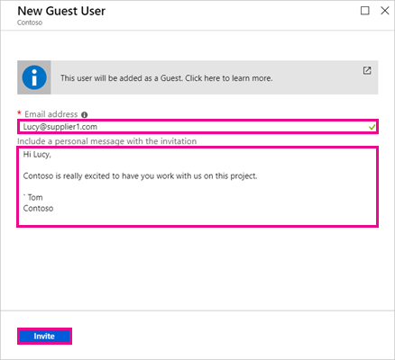
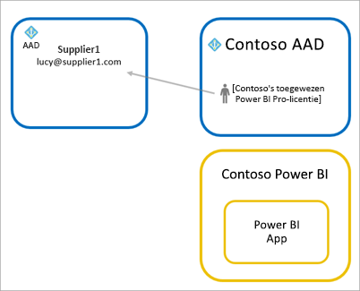
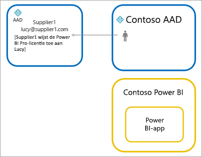

# Power BI-inhoud met Azure AD B2B distribueren naar externe gastgebruikers

Met Power BI kunt u inhoud delen met externe gastgebruikers via Azure Active Directory Business-to-Business (Azure AD B2B). Door Azure AD B2B te gebruiken, maakt uw organisatie het delen met externe gebruikers op een centrale locatie mogelijk. Standaard hebben externe gasten een alleen-verbruik-ervaring. Daarnaast kunt u toestaan dat gastgebruikers buiten uw organisatie inhoud in uw organisatie kunnen bewerken en beheren.

Dit artikel bevat een eenvoudige inleiding tot Azure AD B2B in Power BI. Zie [Power BI-inhoud distribueren naar externe gastgebruikers met behulp van Azure Active Directory B2B](../guidance/whitepaper-azure-b2b-power-bi.md) voor meer informatie.

## Toegang inschakelen

Zorg ervoor dat u de functie [Inhoud delen met externe gebruikers](service-admin-portal.md#export-and-sharing-settings) in de Power BI-beheerdersportal inschakelt voordat u gastgebruikers uitnodigt. Zelfs wanneer deze optie is ingeschakeld, moet de gebruiker de rol Gastuitnodiging hebben in Azure Active Directory om gastgebruikers uit te nodigen.

Dankzij de optie om [externe gastgebruikers toe te staan om inhoud in de organisatie te bewerken en te beheren](service-admin-portal.md#allow-external-guest-users-to-edit-and-manage-content-in-the-organization), hebben gastgebruikers de mogelijkheid om inhoud in werkruimten te zien en maken, en kunnen ze ook door de Power BI van uw organisatie browsen.

> [!NOTE]
> Met de instelling [Inhoud delen met externe gebruikers](service-admin-portal.md#export-and-sharing-settings) bepaalt u of u met Power BI externe gebruikers kunt uitnodigen voor uw organisatie. Nadat een externe gebruiker de uitnodiging accepteert, worden ze een gastgebruiker van Azure AD B2B in uw organisatie. Ze kunnen vervolgens overal in Power BI worden geselecteerd in vervolgkeuzelijsten voor het selecteren van personen. Als de instelling is uitgeschakeld, behouden bestaande gastgebruikers in uw organisatie toegang tot alle items waartoe ze al toegang hadden en worden ze ook nog steeds weergegeven in vervolgkeuzelijsten voor het selecteren van personen. Als gasten worden toegevoegd via de benadering van [geplande uitnodigingen](#planned-invites), worden ze ook weergegeven in die vervolgkeuzelijsten. Als u wilt voorkomen dat gastgebruikers toegang hebben tot Power BI, gebruikt u een beleid van Azure AD voor voorwaardelijke toegang.

## Wie kunt u uitnodigen?

De meeste e-mailadressen ondersteunen gastgebruikers, met inbegrip van persoonlijke e-mailaccounts zoals gmail.com, outlook.com en hotmail.com. In Azure AD B2B worden deze adressen *sociale identiteiten* genoemd.

U kunt geen gebruikers uitnodigen die zijn gekoppeld aan een overheidscloud, zoals [Power BI voor de Amerikaanse overheid](service-govus-overview.md).

## Gastgebruikers uitnodigen

Gastgebruikers hebben alleen een uitnodiging nodig wanneer u deze personen de eerste keer uitnodigt voor uw organisatie. Gebruik geplande of ad-hocuitnodigingen om gebruikers uit te nodigen.

Als u ad-hocuitnodigingen wilt gebruiken, gebruikt u de volgende mogelijkheden:

* Delen van rapporten en dashboards
* Toegangslijst voor app

Ad-hocuitnodigingen worden niet ondersteund in de toegangslijsten van werkruimten. Gebruik de [methode met geplande uitnodigingen](#planned-invites) om deze gebruikers toe te voegen aan uw organisatie. Nadat de externe gebruiker een gast in uw organisatie wordt, voegt u deze toe aan de toegangslijst voor de werkruimte.

### Geplande uitnodigingen

Gebruik een geplande uitnodiging als u weet welke gebruikers u wilt uitnodigen. U kunt de uitnodigingen verzenden via Azure Portal of PowerShell. U moet de rol van gebruikersbeheerder toewijzen om personen uit te nodigen.

Volg deze stappen om een uitnodiging te verzenden via de Azure-portal.

1. Selecteer **Azure Active Directory** in de [Azure-portal](https://portal.azure.com).

1. Selecteer onder **Beheren** **Gebruikers** > **Alle gebruikers** > **Nieuwe gastgebruiker**.

    

1. Voer een **e-mailadres** en het **persoonlijke bericht** in.

    

1. Selecteer **Uitnodigen**.

Als u meer dan één gastgebruiker wilt uitnodigen, gebruikt u PowerShell of nodigt u mensen bulksgewijs uit in Azure AD. Om PowerShell te gebruiken voor bulksgewijs uitnodigen, volgt u de stappen in [Zelfstudie: PowerShell gebruiken om bulksgewijs gebruikers uit te nodigen voor Microsoft Azure AD B2B-samenwerking](/azure/active-directory/b2b/bulk-invite-powershell/). Om de Azure-portal te gebruiken voor bulksgewijs uitnodigen, volgt u de stappen in [Zelfstudie: Bulksgewijs gebruikers uitnodigen voor Microsoft Azure AD B2B-samenwerking](/azure/active-directory/b2b/tutorial-bulk-invite/).

De gastgebruiker moet in de e-mailuitnodiging die is ontvangen, de optie **Aan de slag** selecteren. De gastgebruiker wordt vervolgens toegevoegd aan de organisatie.

### Ad-hocuitnodigingen

Als u een externe gebruiker wilt uitnodigen, voegt u de persoon toe aan uw dashboard of meldt u dit via de functie voor delen of naar uw app via de toegangspagina. Hier volgt een voorbeeld van wat te doen wanneer u een externe gebruiker uitnodigt om een app te gebruiken.

De gastgebruiker ontvangt een e-mail met het bericht dat u de app met hem of haar hebt gedeeld.

De gastgebruiker moet zich aanmelden met het e-mailadres van de organisatie. Zodra de gastgebruiker zich heeft aangemeld, wordt deze gevraagd de uitnodiging te accepteren. Als het aanmelden is voltooid, wordt de app geopend voor de gastgebruiker. De gastgebruiker kan een bladwijzer naar deze koppeling maken of de e-mail bewaren om terug te keren naar de app.

## Licentieverlening

De gastgebruiker moet over de juiste licenties beschikken om de inhoud te zien die u hebt gedeeld. Er zijn drie manieren om ervoor te zorgen dat de gebruiker een geschikte licentie heeft: door Power BI Premium te gebruiken, door een Power BI Pro-licentie toe te wijzen of door de Power BI Pro-licentie van de gast te gebruiken.

[Gastgebruikers die inhoud in de organisatie kunnen bewerken en beheren](service-admin-portal.md#allow-external-guest-users-to-edit-and-manage-content-in-the-organization) hebben een Power BI Pro-licentie nodig om inhoud bij te dragen aan werkruimten of om inhoud te delen met anderen.

### Power BI Premium gebruiken

Door de werkruimte toe te wijzen aan [Power BI Premium-capaciteit](service-premium-what-is.md) kan de gastgebruiker de app gebruiken zonder een licentie voor Power BI Pro. Met Power BI Premium kunnen apps ook profiteren van andere mogelijkheden, zoals een verhoogde vernieuwingsfrequentie, toegewezen capaciteit en grote modellen.

### Een Power BI Pro-licentie toewijzen aan een gastgebruiker

Als u vanuit uw organisatie een Power BI Pro-licentie toewijst aan een gastgebruiker, kan die gastgebruiker inhoud bekijken die met ze wordt gedeeld. Zie [Licenties toewijzen aan gebruikers op de pagina Licenties](/office365/admin/manage/assign-licenses-to-users#assign-licenses-to-users-on-the-licenses-page) voor meer informatie over het toewijzen van licenties. Voordat u Pro-licenties toewijst aan gastgebruikers, raadpleegt u de [site met productvoorwaarden](https://www.microsoft.com/licensing/terms) om te controleren of u voldoet aan de voorwaarden van uw licentieovereenkomst met Microsoft.

### De gastgebruiker beschikt over een eigen Power BI Pro-licentie

De gastgebruiker heeft mogelijk al een Power BI Pro-licentie die aan hen is toegewezen via hun eigen organisatie.

## Gastgebruikers die inhoud kunnen bewerken en beheren

Wanneer u de functie [Externe gastgebruikers toestaan om inhoud in de organisatie te bewerken en te beheren](service-admin-portal.md#allow-external-guest-users-to-edit-and-manage-content-in-the-organization) gebruikt, krijgen de opgegeven gastgebruikers aanvullende toegang tot de Power BI van uw organisatie. Toegestane gasten kunnen alle inhoud zien waar ze machtigingen voor hebben, ze kunnen toegang krijgen tot de startpagina, door werkruimten browsen, apps installeren, kijken waar ze op de toegangslijst staan en inhoud bijdragen aan werkruimten. Ze kunnen een beheerder maken of zijn voor werkruimten waarvoor de nieuwe werkruimte-ervaring wordt gebruikt. Er gelden enkele beperkingen. Zie de gedeeltes Overwegingen en beperkingen voor deze beperkingen.

Toegestane gasten hebben de tenant-URL nodig om zich te kunnen aanmelden bij Power BI. Volg deze stap om de tenant-URL te zoeken.

1. Selecteer in de Power BI-service in het bovenste koptekst Help ( **?** ) en selecteer vervolgens **Over Power BI**.

2. Zoek de waarde naast **Tenant-URL**. Deel de tenant-URL met uw toegestane gastgebruikers.

    

## Overwegingen en beperkingen

* Standaard mogen externe gasten van Azure AD B2B alleen inhoud gebruiken. Externe gasten van Azure AD B2B kunnen apps, dashboards en rapporten weergeven, gegevens exporteren en e-mailabonnementen instellen voor dashboards en rapporten. Ze hebben geen toegang tot werkruimten en kunnen hun eigen inhoud niet publiceren. U kunt de functie [Externe gastgebruikers toestaan om inhoud in de organisatie te bewerken en te beheren](service-admin-portal.md#allow-external-guest-users-to-edit-and-manage-content-in-the-organization) gebruiken om deze beperkingen te verwijderen.

* U hebt een Power BI Pro-licentie nodig om gastgebruikers uit te nodigen. Gebruikers van de Pro-proefversie kunnen geen gastgebruikers uitnodigen in Power BI.

* Sommige ervaringen zijn niet beschikbaar voor [gastgebruikers die inhoud in de organisatie kunnen bewerken en beheren](service-admin-portal.md#allow-external-guest-users-to-edit-and-manage-content-in-the-organization). Als gastgebruikers rapporten willen bijwerken of publiceren, hebben ze de Power BI-service nodig, inclusief Gegevens ophalen om de Power BI Desktop-bestanden te uploaden.  De volgende ervaringen worden niet ondersteund:
  * Rechtstreeks publiceren van Power BI Desktop naar de Power BI-service
  * Gastgebruikers kunnen geen gebruikmaken van Power BI Desktop om verbinding te maken met servicegegevenssets in de Power BI-service
  * Klassieke werkruimten die aan Microsoft 365-groepen zijn gekoppeld
    * Gastgebruikers kunnen geen beheerders van deze werkruimten maken of zijn
    * Gastgebruikers kunnen lid zijn
  * Ad-hocuitnodigingen verzenden wordt niet ondersteund voor toegangslijsten van werkruimten
  * Power BI Publisher voor Excel wordt niet ondersteund voor gastgebruikers
  * Gastgebruikers kunnen geen Power BI Gateway installeren of deze aan uw organisatie koppelen
  * Gastgebruikers kunnen geen apps installeren en naar de hele organisatie publiceren
  * Gastgebruikers kunnen geen organisatie-inhoudspakketten gebruiken, maken, bijwerken of installeren
  * Gastgebruikers kunnen niet analyseren in Excel
  * Gastgebruikers kunnen niet met @mentioned worden genoemd in opmerkingen
  * Gastgebruikers kunnen geen abonnementen gebruiken
  * Gastgebruikers die deze mogelijkheid gebruiken, moeten over een werk- of schoolaccount beschikken

* Gastgebruikers die sociale identiteiten gebruiken, ondervinden meer beperkingen vanwege beperkte aanmeldingsmogelijkheden.
  * Ze kunnen gebruikmaken van gebruikservaringen in de Power BI-service via een webbrowser
  * Ze kunnen geen Power BI - Mobiel-apps gebruiken
  * Ze kunnen zich niet aanmelden wanneer een werk- of schoolaccount vereist is

* Deze functie is momenteel niet beschikbaar in het webonderdeel voor Power BI SharePoint Online-rapporten.

* Er bestaan Azure Active Directory-instellingen waardoor gastgebruikers mogelijk minder acties kunnen uitvoeren in uw totale organisatie. Deze instellingen zijn ook van toepassing op uw Power BI-omgeving. De instellingen worden in de volgende documentatie besproken:
  * [Instellingen voor externe samenwerking beheren](/azure/active-directory/b2b/delegate-invitations#configure-b2b-external-collaboration-settings)
  * [Uitnodigingen aan B2B-gebruikers van specifieke organisaties toestaan of blokkeren](/azure/active-directory/b2b/allow-deny-list)
  * [Voorwaardelijke toegang gebruiken om toegang toe te staan of te blokkeren](/azure/active-directory/conditional-access/concept-conditional-access-cloud-apps)

* U kunt inhoud vanuit een overheidscloud, zoals GCC, delen naar een externe commerciële cloudgebruiker. De gastgebruiker kan echter geen eigen licentie gebruiken. De inhoud moet in de capaciteit zijn toegewezen aan Premium om toegang mogelijk te maken. U kunt ook een Power BI Pro-licentie toewijzen aan het gastaccount.

* Delen buiten uw organisatie wordt niet ondersteund voor nationale clouds, zoals de cloudinstanties Duitsland en China. Maak in plaats daarvan gebruikersaccounts in uw organisatie die externe gebruikers kunnen gebruiken om toegang te krijgen tot de inhoud.

* Als u rechtstreeks deelt met een gastgebruiker, stuurt Power BI deze gebruiker een e-mail met de koppeling. Als u wilt voorkomen dat een e-mailbericht wordt verzonden, voegt u de gastgebruiker toe aan een beveiligingsgroep en deelt u met de beveiligingsgroep.  

## Volgende stappen

Raadpleeg de volgende whitepaper voor meer informatie, zoals informatie over hoe beveiliging op rijniveau werkt: [Power BI-inhoud met Azure AD B2B distribueren naar externe gastgebruikers](../guidance/whitepaper-azure-b2b-power-bi.md).

Zie [Wat is B2B-samenwerking van Azure AD?](/azure/active-directory/active-directory-b2b-what-is-azure-ad-b2b/) voor informatie over Azure AD B2B.