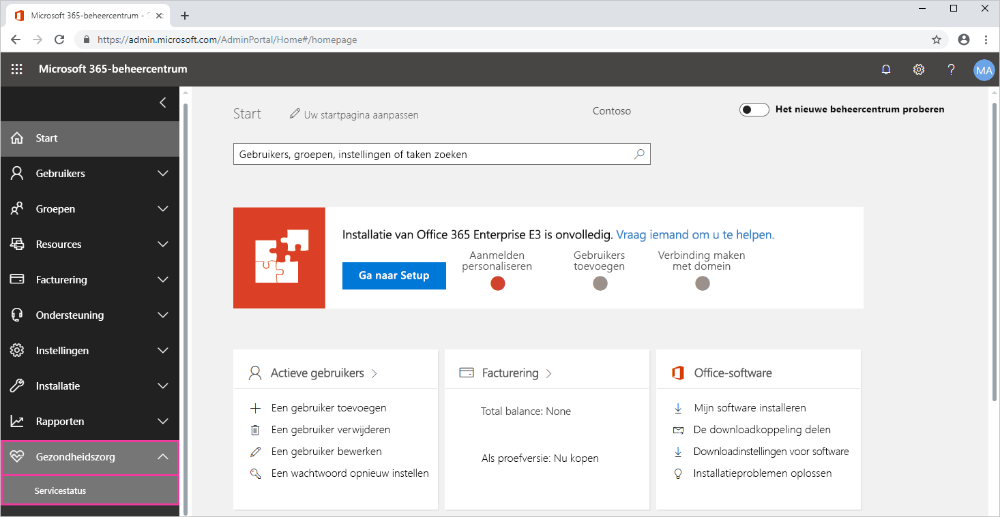
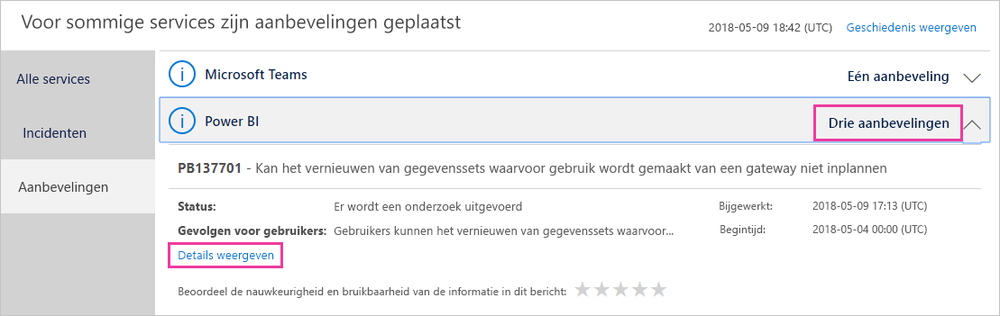
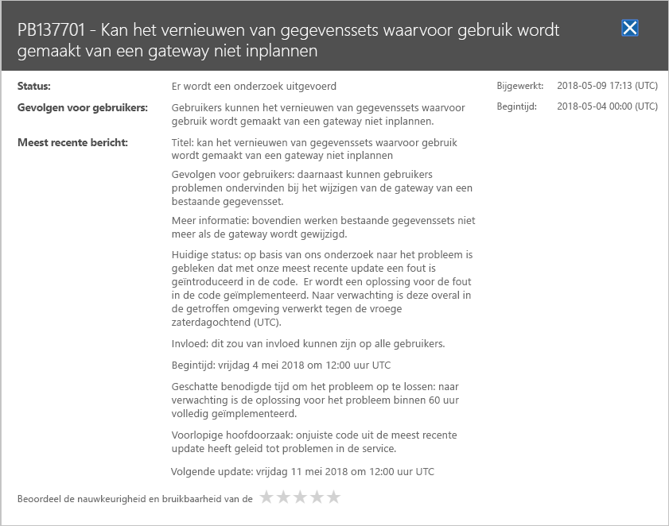

# Status van de Power BI-service in Microsoft 365 bijhouden

Het Microsoft 365-beheercentrum bevat belangrijke hulpprogramma's voor Power BI-beheerders. De hulpprogramma's bieden onder andere actuele en historische informatie over de status van services. Als u toegang wilt hebben tot deze informatie, moet u een van de volgende rollen hebben:

* Power BI-servicebeheerder

* Globale beheerder

Zie het Engelstalige artikel [Administrator roles related to Power BI](service-admin-administering-power-bi-in-your-organization.md#administrator-roles-related-to-power-bi) voor meer informatie over rollen.

1. Meld u aan bij het [Microsoft 365-beheercentrum](https://portal.office.com/adminportal).

1. Selecteer in het navigatievenster **Alles weergeven** > **Status** > **Servicestatus**. De pagina Servicestatus wordt weergegeven:

    

1. Selecteer **Adviesrapporten** of **Incidenten** in de lijst **Alle services** en bekijk de resultaten. In de onderstaande schermafbeelding ziet u een van drie actieve adviesrapporten.

    

1. Selecteer **Details weergeven** voor een item als u meer informatie wilt weergeven. In de onderstaande schermafbeelding ziet u aanvullende informatie, zoals recente statusupdates.

    

    Schuif naar beneden om meer informatie te bekijken en sluit het deelvenster wanneer u klaar bent.

1. Als u historische informatie over alle services wilt weergeven, selecteert u **Geschiedenis weergeven** in de rechterbovenhoek van de pagina **Servicestatus**. Selecteer vervolgens **Afgelopen 7 dagen** of **Afgelopen 30 dagen**. 

1. Selecteer **Huidige status weergeven** om terug te gaan naar de huidige servicestatus.