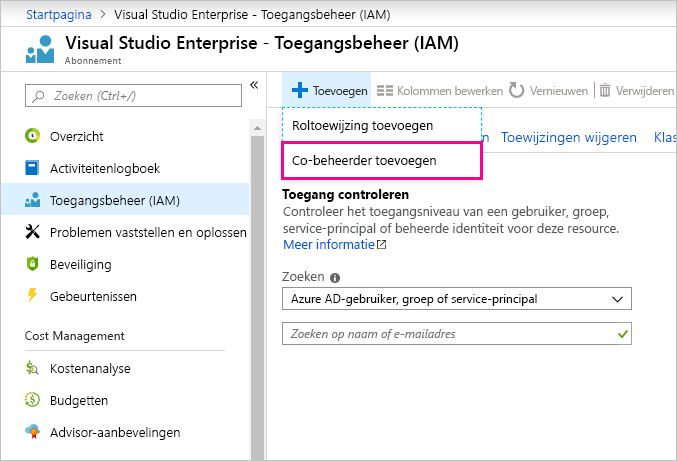

# Dezelfde account gebruiken voor Power BI en Azure

Als u een gebruiker bent van Power BI en Azure, kunt u eventueel dezelfde aanmeldgegevens voor beide services gebruiken, zodat u uw wachtwoord niet twee keer hoeft in te voeren.

Bij Power BI wordt u aangemeld met uw organisatieaccount die is gekoppeld aan het e-mailadres van uw werk of school.  Bij Azure wordt u aangemeld met een Microsoft-account of uw organisatieaccount.

Als u dezelfde aanmeldgegevens voor Azure en Power BI wilt gebruiken, moet u zich bij Azure aanmelden met uw organisatieaccount.

**Wat gebeurt er als ik mij bij Azure al met mijn Microsoft-account heb aangemeld?**

Als medebeheerder kunt u uw organisatieaccount in Azure toevoegen door de volgende stappen uit te voeren:

1. Meld u aan bij [Azure Portal](https://portal.azure.com/). Als u een gebruiker bent in meerdere Azure-mappen, selecteert u **Abonnementen** en filtert u vervolgens om alleen de map en abonnementen weer te geven die u wilt bewerken.

1. Selecteer **Toegangsbeheer (IAM)** in het navigatievenster en vervolgens **Toevoegen** \> **Co-beheerder toevoegen**.

    

1. Voer het e-mailadres in dat is gekoppeld aan uw organisatieaccount en selecteer **Toevoegen**.

1. De volgende keer dat u zich aanmeldt bij de Azure-portal, gebruikt u het e-mailadres van uw organisatie.

Hebt u nog vragen? [Misschien dat de Power BI-community het antwoord weet](https://community.powerbi.com/)
