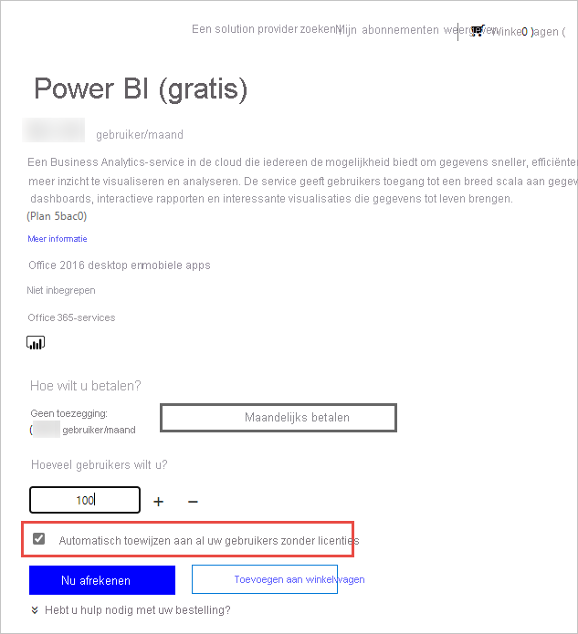

# Power BI-licenties voor gebruikers in uw organisatie

Wat een gebruiker in de Power BI-service kan doen, is afhankelijk van het type licentie per gebruiker dat deze heeft. Het toegangsniveau dat de licentie biedt, is afhankelijk van of de werkruimte die wordt geopend wel of niet een Premium-werkruimte is. Alle gebruikers van de Power BI-service moeten over een licentie beschikken.

Er zijn twee manieren waarop gebruikers een licentie kunnen krijgen. Met behulp van mogelijkheden voor aanmelden via een self-service en een werk- of schoolaccount kunnen gebruikers hun eigen gratis licentie, Pro-licentie of Premium per gebruikerslicentie aanvragen. Een andere mogelijkheid is dat beheerders een Power BI-licentie aanschaffen en licenties aan gebruikers toewijzen.

In dit artikel besteden we aandacht aan de aankoopservice en licenties per gebruiker gezien vanuit het perspectief van een beheerder. Zie [Aanmelden voor Power BI als afzonderlijke gebruiker](../fundamentals/service-self-service-signup-for-power-bi.md) voor meer informatie over de manier waarop gebruikers hun eigen licentie kunnen verkrijgen.

## Wie kan licenties kopen en toewijzen?

De rol van beheerder moet aan u zijn toegewezen om licenties voor uw organisatie aan te schaffen of toe te wijzen. Beheerdersrollen worden toegewezen met behulp van het Azure Active Directory-beheercentrum of het Microsoft 365-beheercentrum. In de volgende tabel ziet u welke rol is vereist om taken met betrekking tot aanschaffen en licenties uit te voeren. Zie [Beheerdersrollen weergeven en toewijzen in Azure Active Directory](/azure/active-directory/users-groups-roles/directory-manage-roles-portal) voor meer informatie over beheerdersrollen in Azure Active Directory. Zie [Informatie over beheerdersrollen](/microsoft-365/admin/add-users/about-admin-roles?view=o365-worldwide) voor meer informatie over beheerdersrollen in Microsoft 365, inclusief best practices.

| Wie kan services en licenties aanschaffen? | Wie kan gebruikerslicenties beheren? |
| --------------- | --------------- |
| Factureringsbeheerder | Licentiebeheerder |
| Globale beheerder | Gebruikersbeheerder |
|  | Globale beheerder |

Met deze rollen wordt de organisatie beheerd. Zie [Beheerdersrollen in de Power BI-service](service-admin-role.md) voor informatie over beheerdersrollen in de Power BI-service.

## Power BI voor uw organisatie kopen

Zie [Prijzen- en productvergelijking](https://powerbi.microsoft.com/pricing/) voor meer informatie over prijzen.

Een globale beheerder of een factureringsbeheerder kan zich aanmelden voor de Power BI-service en licenties aanschaffen voor de gebruikers in hun organisatie. Als u nog niet klaar bent om licenties aan te schaffen, selecteert u de proefversie van Power BI Pro. U krijgt 25 licenties die u gedurende één maand mag gebruiken. Zie [Een Power BI-abonnement voor uw organisatie verkrijgen](service-admin-org-subscription.md) voor stapsgewijze instructies over aanmelden.

## Aanmelden via de self-service

Afzonderlijke gebruikers kunnen hun eigen Power BI-licentie verkrijgen door zich aan te melden met hun werk- of schoolaccount. Met een gratis licentie kunnen gebruikers Power BI verkennen voor het analyseren en visualiseren van persoonlijke gegevens met behulp van Mijn werkruimte, maar ze kunnen niet delen met andere gebruikers. Een Power BI Pro-licentie is vereist om inhoud te delen. Een Power BI Premium-licentie biedt toegang tot verschillende functies, mogelijkheden en typen inhoud die alleen beschikbaar zijn via Premium. Een Premium per gebruikerslicentie beperkt de toegang tot deze functies tot andere gebruikers met een Premium per gebruikerslicentie; met een Premium-licentie op basis van capaciteit kunnen gebruikers met gratis licenties toegang krijgen tot alle inhoud, maar kunnen alleen gebruikers met een Pro-licentie inhoud maken. Gebruikers kunnen hun licentietype upgraden naar Pro of zich rechtstreeks aanmelden voor Pro, als de organisatie de commerciële cloud gebruikt. Rechtstreekse aanschaf van of een upgrade naar Pro is niet beschikbaar voor onderwijsinstellingen of organisaties die zijn geïmplementeerd naar clouds van Microsoft Azure Government, Microsoft Azure Duitsland of Azure China 21Vianet.

Als u niet wilt dat gebruikers in uw organisatie gebruikmaken van Aanmelden via een self-service, raadpleegt u [Aanmelden via een self-service in- of uitschakelen](service-admin-disable-self-service.md) om te leren hoe u dit uitschakelt.

Als u de aanmelding via self-service uitschakelt, voorkomt u dat gebruikers Power BI voor gegevensvisualisatie en -analyse verkennen. Als u afzonderlijke aanmelding blokkeert, wilt u mogelijk Power BI (gratis)-licenties voor uw organisatie ontvangen en aan alle gebruikers toewijzen. Volg deze stappen om automatisch een Power BI (gratis)-licentie toe te wijzen aan alle bestaande gebruikers:

1. Meld u aan bij het [Microsoft 365-beheercentrum](https://admin.microsoft.com) met referenties voor globale beheerder of factureringsbeheerder.
1. Selecteer in het menu van de linker zijbalk **Facturering** > **Aankoopservices**.
1. Zoek of blader naar de Power BI (gratis)-aanbieding. Selecteer de aanbieding en selecteer **Nu kopen**.
1. Voer het aantal licenties in dat nodig is voor al uw gebruikers.
1. Selecteer **Automatisch toewijzen aan al uw gebruikers zonder licenties** en reken vervolgens af.

  

Zie [Gebruikerslicenties weergeven en beheren](service-admin-manage-licenses.md) als u wilt zien welke gebruikers in uw organisatie mogelijk al over een licentie beschikken.

## Licentietypen en mogelijkheden

Er zijn twee soorten Power BI-licenties per gebruiker: Pro en Premium. Welk type licentie een gebruiker nodig heeft, wordt bepaald door de locatie waar inhoud is opgeslagen, hoe de gebruiker die inhoud gebruikt en of voor die inhoud Premium-functies worden gebruikt. De locatie waar inhoud kan worden opgeslagen, wordt bepaald door het [licentietype](#license-types) van uw organisatie.

Met een van de licentietypen, de op capaciteit gebaseerde licentie voor [Power BI Premium](service-admin-premium-purchase.md), kunnen gebruikers met een gratis licentie inhoud gebruiken in werkruimten die aan Premium-capaciteit zijn toegewezen. Buiten de Premium-capaciteit kan een gebruiker met een gratis licentie de Power BI-service alleen gebruiken om verbinding te maken met gegevens en om rapporten en dashboards in **Mijn werkruimte** te maken. Ze kunnen geen inhoud met anderen delen of inhoud naar andere werkruimten publiceren. Zie [Typen werkruimten](../consumer/end-user-workspaces.md#types-of-workspaces) voor meer informatie over werkruimtetypen.

Een Power BI-licentie met gratis en Pro per gebruiker-licenties maakt alleen gebruik van een gedeelde en beperkte capaciteit om inhoud te verwerken. Wanneer inhoud wordt opgeslagen in die gedeelde capaciteit, kunnen gebruikers aan wie een Power BI Pro-licentie is toegewezen, alleen samenwerken met andere Power BI Pro-gebruikers. Ze kunnen inhoud gebruiken die door andere gebruikers is gedeeld, inhoud publiceren naar app-werkruimten, dashboards delen en zich abonneren op dashboards en rapporten.  Wanneer werkruimten zich in de Premium-capaciteit bevinden, kunnen Pro-gebruikers inhoud distribueren naar gebruikers die geen Power BI Pro-licentie hebben.

Wanneer u Premium per gebruikers-licenties gebruikt, kan inhoud die is gemaakt door een Premium per gebruiker gelicentieerde gebruiker alleen worden gedeeld met andere gebruikers die een Premium-licentie hebben, tenzij de inhoud specifiek wordt geplaatst in een werkruimte die wordt gehost op een Premium-capaciteit. In de onderstaande tabel worden de basismogelijkheden van elk licentietype samengevat. Zie [Functies per licentietype](../fundamentals/service-features-license-type.md) voor een gedetailleerd overzicht van de beschikbare functies per licentietype.

| Licentietype | Mogelijkheden wanneer werkruimte zich in gedeelde capaciteit bevindt | Aanvullende mogelijkheden wanneer werkruimte zich in Premium-capaciteit bevindt |
| --------- | ----------- | ----------- |
| Power BI (gratis) | Toegang tot inhoud in Mijn werkruimte | Inhoud gebruiken die met hun is gedeeld |
| Power BI Pro | Inhoud naar andere werkruimten publiceren, dashboards delen, abonneren op dashboards en rapporten, delen met gebruikers die over een Pro-licentie beschikken | Inhoud distribueren naar gebruikers met gratis licenties |

## Licentietypen

Alle op gebruikers gebaseerde, commerciële licenties van Microsoft zijn gebaseerd op Azure Active Directory-identiteiten. Als u de Power BI-service wilt gebruiken, moet u zich aanmelden met een identiteit die door Azure Active Directory wordt ondersteund voor commerciële licenties. U kunt Power BI toevoegen aan elk Microsoft-licentie waarvoor Azure Active Directory wordt gebruikt voor identiteitsservices. Sommige licenties, zoals Office 365 E5, omvatten al een Power BI Pro-licentie, dus hiervoor hoeft u zich niet apart aan te melden voor Power BI.

Er zijn twee soorten Power BI-licenties voor organisaties: Standard en Premium.

Met een standaard, self-service Power BI Pro-licentie kunnen beheerders licenties per gebruiker toewijzen. Er zijn maandelijks kosten per gebruiker van toepassing voor Power BI Pro-licenties. Met dit licentietype kunt u samenwerken, publiceren, delen en ad-hocanalyses uitvoeren. Inhoud wordt opgeslagen naar gedeelde opslagcapaciteit die volledig door Microsoft wordt beheerd.

Met een Power BI Premium-licentie wordt capaciteit toegewezen aan een organisatie. Premium is geschikt voor zakelijke BI, big data-analyse en cloud- en on-premises rapporten, en biedt geavanceerde besturingselementen voor beheer en implementatie. Toegewezen reken- en opslagresources worden beheerd door capaciteitsbeheerders in uw organisatie. Er worden maandelijkse kosten in rekening gebracht voor deze toegewezen omgeving. Naast andere Premium-voordelen kan inhoud die in Premium-capaciteit is opgeslagen ook worden geopend door en gedistribueerd naar gebruikers die geen Power BI Pro-licentie hebben. Aan ten minste één gebruiker moet een Power BI Pro-licentie zijn toegewezen om Premium te kunnen gebruiken, en inhoudsmakers en ontwikkelaars hebben nog steeds een Power BI Pro-licentie nodig.

De twee typen licenties sluiten elkaar niet uit. U kunt zowel Power BI Premium als Power BI Pro gebruiken. In deze configuratie kan inhoud die in Premium-capaciteit is opgeslagen, worden gedeeld met alle gebruikers en is gedeelde capaciteit ook beschikbaar. Zie [Gegevensopslag beheren in Power BI-werkruimten](service-admin-manage-your-data-storage-in-power-bi.md) voor informatie over capaciteitslimieten.

Zie [Power BI-prijzen](https://powerbi.microsoft.com/pricing) om productfuncties en prijzen te vergelijken.

## Toegang voor gastgebruikers

U kunt inhoud distribueren naar gebruikers buiten uw organisatie. Het is mogelijk om inhoud te delen met externe gebruikers door hen uit te nodigen de inhoud als gast weer te geven. Met Azure Active Directory Business-to-Business (Azure AD B2B) kunt u inhoud delen met externe gastgebruikers. Aan de volgende voorwaarden moet worden voldaan om te delen met externe gebruikers:

- De mogelijkheid om inhoud met externe gebruikers te delen moet zijn ingeschakeld

- De gastgebruiker moet over de juiste licenties beschikken om de gedeelde inhoud te kunnen weergeven

Zie [Power BI-inhoud distribueren naar externe gastgebruikers met Azure AD B2B](service-admin-azure-ad-b2b.md) voor meer informatie over toegang voor gastgebruikers.

## Power BI Pro-licenties kopen

Als beheerder kunt u Power BI Pro-licenties kopen via Microsoft 365 of via een Microsoft-partner. Nadat u de licenties hebt gekocht, wijst u ze toe aan individuele gebruikers. Zie [Power BI Pro-licenties kopen en toewijzen](service-admin-purchasing-power-bi-pro.md) voor meer informatie.

### Power BI Pro-licentie verloopt

Er is een respijtperiode na het verstrijken van een Power BI Pro-licentie. Voor licenties die deel uitmaken van een volumelicentie-aankoop, is de respijtperiode 90 dagen. Als u de licentie rechtstreeks hebt aangeschaft, bedraagt de respijtperiode 30 dagen.

Power BI Pro heeft dezelfde levenscyclus van licenties als Microsoft 365. Raadpleeg [Wat gebeurt er met mijn gegevens en toegang wanneer mijn abonnement op Microsoft 365 voor bedrijven eindigt?](/microsoft-365/commerce/subscriptions/what-if-my-subscription-expires) voor meer informatie.

## Volgende stappen

- [Power BI Pro-licenties kopen en toewijzen](service-admin-purchasing-power-bi-pro.md)
- [Documentatie voor zakelijke abonnementen en facturering](/microsoft-365/commerce/?view=o365-worldwide)
- [Power Bi-gebruikers zoeken die zich hebben aangemeld](service-admin-access-usage.md)
- Hebt u nog vragen? [Misschien dat de Power BI-community het antwoord weet](https://community.powerbi.com/)

Power BI heeft Power BI Premium Gen2 geïntroduceerd als preview-aanbieding, waardoor de Power BI Premium-ervaring als volgt wordt aangepast met verbeteringen:
* Prestaties
* Licentie verlening per gebruiker. Zie de [Veelgestelde vragen over Premium per gebruiker](service-premium-per-user-faq.md) voor meer informatie.
* Grotere schaal
* Verbeterde metrische gegevens
* Automatisch schalen
* Minder beheeroverhead

Zie [Power BI Premium Generation 2 (preview-versie)](service-premium-what-is.md#power-bi-premium-generation-2-preview) voor meer informatie over Power BI Premium Gen2.
