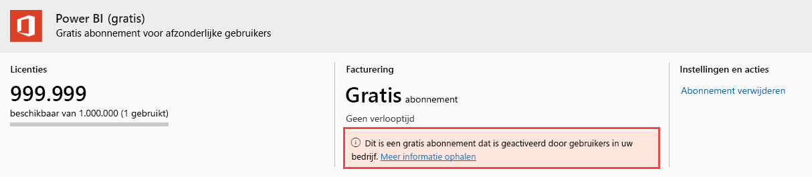

# Power BI-gebruikerslicenties weergeven en beheren

In dit artikel wordt uitgelegd hoe beheerders het Microsoft 365-beheercentrum of Azure Portal kunnen gebruiken om gebruikerslicenties voor de Power BI-service te bekijken en te beheren.

> [!NOTE]
>
>Het is mogelijk dat aan een gebruiker zowel een Power BI-licentie (gratis) als een Power BI Pro-licentie is toegewezen. Dit kan gebeuren wanneer een gebruiker zich registreert voor een gratis licentie en er vervolgens later een Power BI Pro-licentie wordt toegewezen. Het hoogste licentieniveau is in dit geval van kracht.
>

## Uw abonnementen bekijken

Voer de volgende stappen uit om te bekijken welke Power BI-abonnementen uw organisatie heeft.

1. Meld u aan bij het [Microsoft 365-beheercentrum](https://admin.microsoft.com).
2. Selecteer in het navigatiemenu **Facturering** > **Producten en services**.

U ziet uw actieve Power BI-abonnementen samen met andere abonnementen die u hebt. Mogelijk wordt er een onverwacht abonnement voor Power BI (gratis) weergegeven, zoals hier te zien is.

  

Dit type abonnement wordt voor u gemaakt wanneer gebruikers registratie via self-service gebruiken. Zie [Power BI in uw organisatie](/microsoft-365/admin/misc/power-bi-in-your-organization?view=o365-worldwide) voor meer informatie.

## Gebruikerslicenties beheren in Microsoft 365

Als u het Microsoft 365-beheercentrum wilt gebruiken om gebruikerslicenties te beheren, raadpleegt u de [documentatie voor zakelijke abonnementen en facturering](/microsoft-365/commerce/?view=o365-worldwide).

## Gebruikerslicenties beheren in Azure Portal

Volg deze stappen om Power BI-licenties weer te geven en toe te wijzen met behulp van Azure Portal.

1. Meld u aan bij [Azure Portal](https://portal.azure.com).

2. Zoek naar **Azure Active Directory** en selecteer deze optie.

3. Selecteer onder **Beheren** in het Azure Active Directory-resourcemenu de optie **Licenties**.

4. Selecteer in het resourcemenu **Alle producten** en selecteer vervolgens een Power BI-licentietype om de lijst met gelicentieerde gebruikers weer te geven.

5. Als u een licentie wilt toewijzen, selecteert u **+ Toewijzen** op de opdrachtbalk. Kies op de pagina **Licentie toewijzen** een gebruiker en selecteer vervolgens **Opties voor toewijzingen** om een Power BI-licentie in te schakelen voor het geselecteerde gebruikersaccount.

6. Als u een licentie wilt verwijderen, schakelt u het selectievakje naast de naam van de gebruiker in en selecteert u **Licentie verwijderen**.

## Volgende stappen

- [Power BI Pro kopen](service-admin-purchasing-power-bi-pro.md)
- [Licentieverlening voor uw organisatie](service-admin-licensing-organization.md)