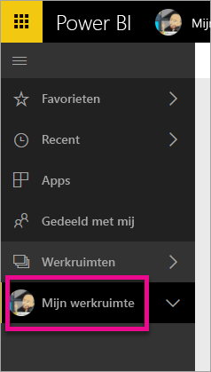
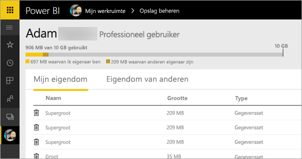
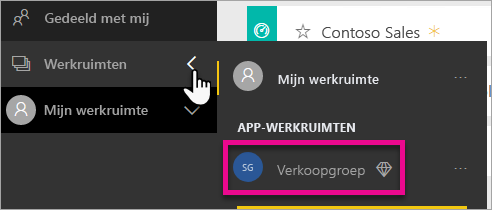
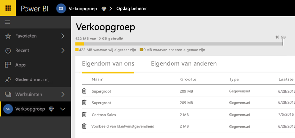
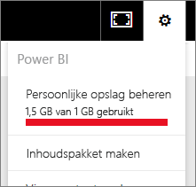
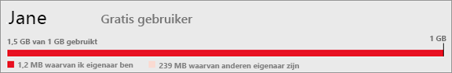
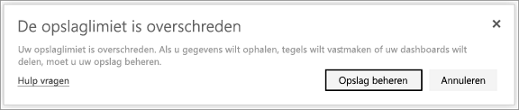

# Gegevensopslag in Power BI-werkruimten beheren

Ontdek hoe u de gegevensopslag beheert in uw persoonlijke werkruimte of een werkruimte, zodat u rapporten en gegevenssets kunt blijven publiceren.

## Capaciteitslimieten

Limieten voor opslag van werkruimten hangen af van de vraag of de werkruimte zich in een [gedeelde of Premium-capaciteit](../fundamentals/service-basic-concepts.md#capacities) bevindt. Dit geldt zowel voor Mijn werkruimte als app-werkruimten.

### Limieten voor gedeelde capaciteit
Voor werkruimten in gedeelde capaciteit: 

- Er geldt een opslaglimiet van 10 GB per werkruimte.
- Voor app-werkruimten mag het totale gebruik niet groter zijn dan de opslaglimiet van 10 GB voor de tenant, vermenigvuldigd met het aantal Pro-licenties in de tenant.

### Limieten voor Premium-capaciteit
Voor werkruimten in Premium-capaciteit:
- Er geldt een limiet van 100 TB per Premium-capaciteit.
- Er geldt geen opslaglimiet per gebruiker.

Meer informatie over andere functies van het [Power BI-prijsmodel](https://powerbi.microsoft.com/pricing).

## Wat is opgenomen in de opslag

Tot uw gegevensopslag behoren uw eigen gegevenssets en Excel-rapporten en items die iemand met u heeft gedeeld. Gegevenssets zijn alle gegevensbronnen die u hebt geüpload of waarmee u verbonden bent. Deze gegevensbronnen bevatten de Power BI Desktop-bestanden en Excel-werkmappen die u gebruikt. Het volgende is ook opgenomen in uw gegevenscapaciteit.

* Excel-adresbereiken die zijn vastgemaakt aan een dashboard.
* On-premises visualisaties van Reporting Services die zijn vastgemaakt aan een Power BI-dashboard.
* Geüploade afbeeldingen.

De grootte van een dashboard dat u deelt, is afhankelijk van hetgeen eraan is vastgemaakt. Als u bijvoorbeeld items uit twee rapporten vastmaakt die deel uitmaken van twee verschillende gegevenssets, omvat de grootte beide gegevenssets.

## Items beheren waarvan u de eigenaar bent

Zie hoeveel gegevensopslag u gebruikt in uw Power BI-account en beheer uw account.

1. Om uw eigen opslag te beheren, gaat u naar **Mijn werkruimte** in het navigatiedeelvenster.
   
    

2. Selecteer het  in de rechterbovenhoek **Persoonlijke opslag beheren**.
   
    In de bovenste balk ziet u hoeveel u hebt gebruikt van uw opslaglimiet.
   
    
   
    De gegevenssets en rapporten worden gescheiden op twee tabbladen:
   
    **Items waarvan ik eigenaar ben:** Dit zijn de rapporten en gegevenssets die u hebt geüpload naar uw Power BI-account, waaronder servicegegevenssets zoals Salesforce en Dynamics CRM.  

    **Items waarvan anderen eigenaar zijn:** Anderen hebben deze rapporten en gegevenssets met u gedeeld.
1. Als u een gegevensset of rapport wilt verwijderen, selecteert u het prullenbakpictogram .

Bedenk dat u of iemand anders mogelijk rapporten en dashboards heeft die zijn gebaseerd op een gegevensset. Als u de gegevensset verwijdert, werken die rapporten en dashboards niet meer.

## Uw werkruimte beheren
1. Selecteer de pijl naast **Werkruimten** en selecteer de naam van de werkruimte.
   
    
2. Selecteer het tandwielpictogram  in de rechterbovenhoek **Groepsopslag beheren**.
   
    In de bovenste balk ziet u hoeveel opslaglimiet van de groep is gebruikt.
   
    
   
    De gegevenssets en rapporten worden gescheiden op twee tabbladen:
   
    **Items waarvan wij eigenaar zijn:** Dit zijn rapporten en gegevenssets die door u of iemand anders zijn geüpload naar het Power BI-account van de groep, waaronder servicegegevenssets zoals Salesforce en Dynamics CRM.

    **Items waarvan anderen eigenaar zijn:** Anderen hebben deze rapporten en gegevenssets met uw groep gedeeld.

3. Als u een gegevensset of rapport wilt verwijderen, selecteert u het prullenbakpictogram .
   
   > [!NOTE]
   > Bedenk dat u of iemand anders in de groep mogelijk rapporten en dashboards heeft die zijn gebaseerd op een gegevensset. Als u de gegevensset verwijdert, werken die rapporten en dashboards niet meer.
   
   Elk lid met de rol van beheerder, lid of inzender in een werkruimte is gemachtigd om gegevenssets en rapporten in de werkruimte te verwijderen.

## Limieten voor de gegevensset
Er is een limiet van 1 GB per gegevensset die wordt geïmporteerd in Power BI. Als u ervoor hebt gekozen om de Excel-ervaring te houden, in plaats van de gegevens te importeren, is 250 MB de limiet voor de gegevensset.

## Wat er gebeurt wanneer u een limiet bereikt
Als u de gegevenscapaciteitslimiet bereikt, ziet u instructies in de service. 

Wanneer u het tandwielpictogram selecteert, ziet u een rode balk die aangeeft dat u de limiet van uw gegevenscapaciteit hebt overschreden.

Deze limiet wordt ook aangeduid in **Persoonlijke opslag beheren**.

 

 Wanneer u een actie uitvoert waarmee u een van de limieten bereikt, wordt een bericht weergegeven dat u de limiet hebt overschreden. U kunt [uw opslag beheren](#manage-items-you-own) om de hoeveelheid opgeslagen gegevens te verkleinen en zo binnen de limiet te blijven.

 

 ## Volgende stappen

 Hebt u nog vragen? [Misschien dat de Power BI-community het antwoord weet](https://community.powerbi.com/)
