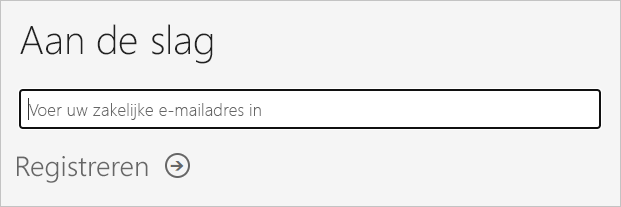
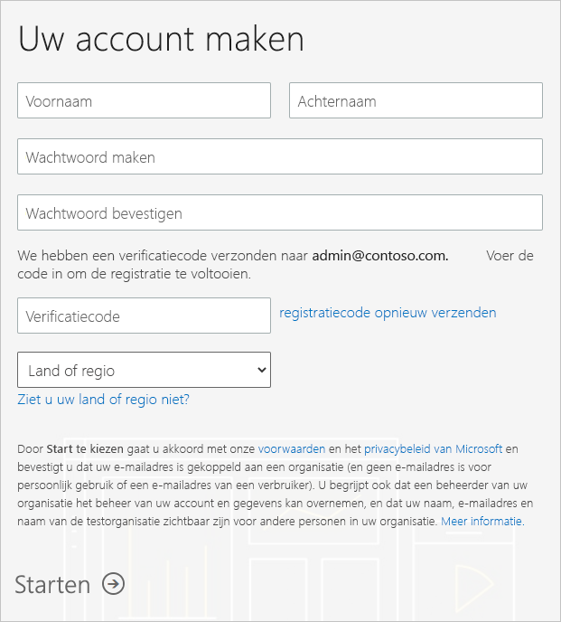

# Een Power BI-abonnement voor uw organisatie verkrijgen

U kunt zich als beheerder registreren voor Power BI via de [Power BI-website](https://powerbi.microsoft.com). U kunt zich ook registreren via de pagina voor het aanschaffen van services in het Microsoft 365-beheercentrum. Als een beheerder zich voor Power BI registreert, kan diegene licenties toewijzen aan gebruikers die toegang nodig hebben.

Bovendien kunnen individuele gebruikers in uw organisatie zich mogelijk registreren voor Power BI via de Power BI-website. Wanneer een gebruiker in uw organisatie zich registreert voor Power BI, krijgt die gebruiker automatisch een Power BI-licentie toegewezen. Als u deze mogelijkheid wilt uitschakelen, volgt u de stappen in [Registratie en kopen via self-service in- of uitschakelen](service-admin-disable-self-service.md).

## Registreren via Power BI

U hebt een werk- of schoolaccount nodig om u te registreren voor een Power BI-abonnement. We bieden geen ondersteuning voor e-mailadressen die worden geleverd via e-mailservices voor consumenten, of die afkomstig zijn van telecomproviders.

Volg deze stappen om u te registreren:

1. Ga naar de [Power BI-website](https://powerbi.microsoft.com). Selecteer **Gratis proberen**.
2. Voer uw zakelijke e-mailadres in en selecteer vervolgens **Registreren**.

   

3. Verifieer uw identiteit. We bellen u of sturen u een sms om u van een verificatiecode te voorzien.
4. Selecteer **Ja** om te bevestigen dat u een e-mailadres gebruikt dat u van uw bedrijf hebt ontvangen.
5. Maak uw account. We sturen een verificatiecode naar uw e-mailadres om de registratie te voltooien.

   

## Registreren via Microsoft 365

Als u een globale beheerder of factureringsbeheerder voor Microsoft 365 bent, kunt u een Power BI-abonnement voor uw organisatie verkrijgen. Zie [Wie kan licenties kopen en toewijzen?](../service-admin-licensing-organization.md#who-can-purchase-and-assign-licenses) voor meer informatie.

> [!NOTE]
>
> Een Microsoft 365 E5-abonnement bevat reeds Power BI Pro-licenties. Zie [Gebruikerslicenties weergeven en beheren](service-admin-manage-licenses.md) voor meer informatie over het beheren van licenties.
>
>

Voer de volgende stappen uit om Power BI Pro-licenties te kopen in het Microsoft 365-beheercentrum:

1. Meld u aan bij het [Microsoft 365-beheercentrum](https://admin.microsoft.com).

2. Selecteer in het navigatiemenu **Facturering** > **Aankoopservices**.
  
   

3. Zoek of blader om het abonnement te vinden dat u wilt kopen. U vindt **Power BI** onder aan **Andere categorieën die u mogelijk interesseren** aan de onderkant aan de pagina. Selecteer de koppeling om de Power BI-abonnementen weer te geven die beschikbaar zijn voor uw organisatie.

4. Selecteer een aanbieding, zoals Power BI Pro.

5. Selecteer op de pagina **Services aanschaffen** de optie **Kopen**. Als u deze nog niet eerder hebt gebruikt, kunt u een gratis abonnement op Power BI Pro krijgen. Een dergelijk abonnement bevat 25 licenties en is één maand geldig.

   

6. Kies **Maandelijks betalen** of **Voor een volledig jaar betalen**, afhankelijk van hoe u wilt betalen.

7. Voer onder **Voor hoeveel gebruikers?** het aantal licenties in dat u wilt kopen. Selecteer vervolgens **Nu uitchecken** om de transactie te voltooien.

8. Ga naar **Facturering** > **Producten en services** en zoek **Power BI Pro** om uw aankoop te verifiëren.

Zie [Power BI in uw organisatie](https://docs.microsoft.com/microsoft-365/admin/misc/power-bi-in-your-organization?view=o365-worldwide) voor meer informatie over hoe uw organisatie de Power BI-service verkrijgt.

## Volgende stappen

- [Gebruikerslicenties weergeven en beheren](service-admin-manage-licenses.md)
- [Registratie en kopen via self-service in- of uitschakelen](service-admin-disable-self-service.md)
- [Documentatie voor zakelijke abonnementen en facturering](https://docs.microsoft.com/microsoft-365/commerce/?view=o365-worldwide)
