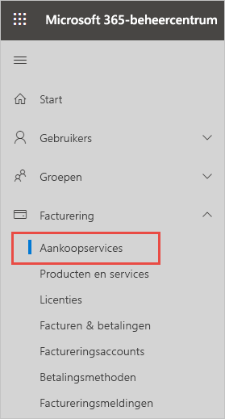
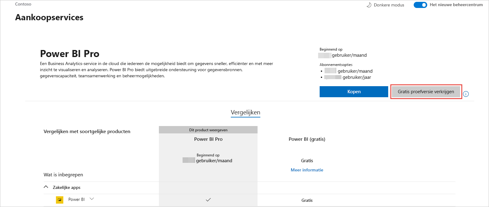
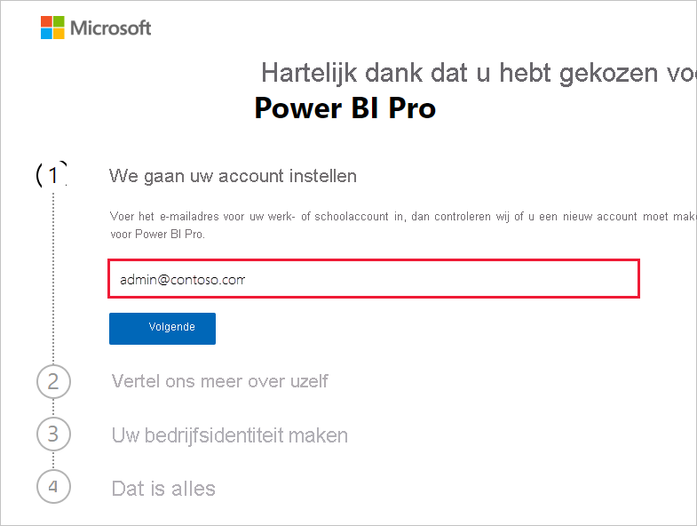
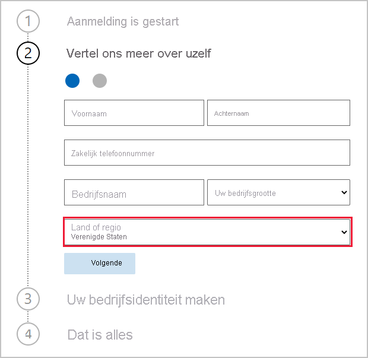
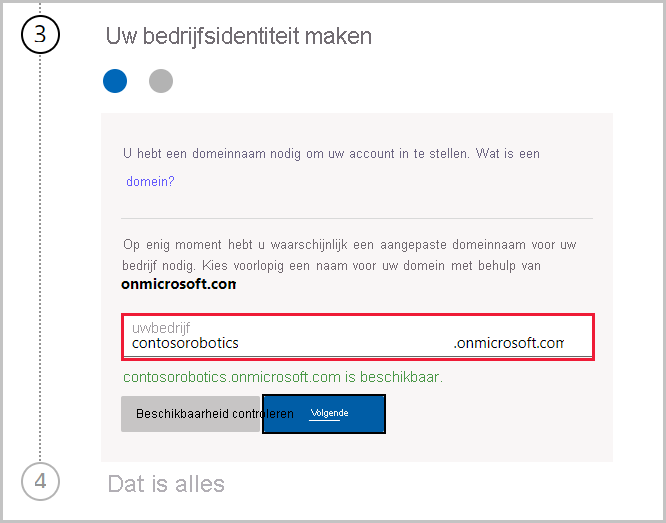

# Een Power BI service-abonnement voor uw organisatie verkrijgen

Beheerders kunnen zich registreren voor de Power BI-service via de pagina **Services aanschaffen** van het Microsoft 365-beheercentrum. Als een beheerder zich voor Power BI registreert, kan diegene licenties toewijzen aan gebruikers die toegang nodig hebben.

Gebruikers in uw organisatie kunnen zich registreren voor Power BI via de Power BI-website. Wanneer een gebruiker in uw organisatie zich registreert voor Power BI, krijgt deze automatisch een Power BI-licentie toegewezen. Als u de self-servicefunctionaliteit wilt uitschakelen, volgt u de stappen in [Registratie en kopen via self-service in- of uitschakelen](service-admin-disable-self-service.md).

## Registreren via Microsoft 365

Als u een globale beheerder of factureringsbeheerder bent, kunt u een Power BI-abonnement voor uw organisatie verkrijgen. Zie [Wie kan licenties kopen en toewijzen?](service-admin-licensing-organization.md#who-can-purchase-and-assign-licenses) voor meer informatie.

> [!NOTE]
>
> Een Microsoft 365 E5-abonnement bevat reeds Power BI Pro-licenties. Zie [Gebruikerslicenties weergeven en beheren](service-admin-manage-licenses.md) voor meer informatie over het beheren van licenties.
>
>

Voer de volgende stappen uit om Power BI Pro-licenties te kopen in het Microsoft 365-beheercentrum:

1. Meld u aan bij het [Microsoft 365-beheercentrum](https://admin.microsoft.com).

2. Selecteer in het navigatiemenu **Facturering** > **Aankoopservices**.
  
   

3. Zoek of blader om het abonnement te vinden dat u wilt kopen. U vindt **Power BI** onder aan **Andere categorieën die u mogelijk interesseren** aan de onderkant aan de pagina. Selecteer de koppeling om de Power BI-abonnementen weer te geven die beschikbaar zijn voor uw organisatie.

4. Selecteer een aanbieding, zoals Power BI Pro.

5. Selecteer op de pagina **Services aanschaffen** de optie **Kopen**. Als u deze nog niet eerder hebt gebruikt, kunt u een gratis abonnement op Power BI Pro krijgen. Een dergelijk abonnement bevat 25 licenties en is één maand geldig.

   

6. Kies **Maandelijks betalen** of **Voor een volledig jaar betalen**, afhankelijk van hoe u wilt betalen.

7. Voer onder **Voor hoeveel gebruikers?** het aantal licenties in dat u wilt kopen. Selecteer vervolgens **Nu uitchecken** om de transactie te voltooien.

8. Ga naar **Facturering** > **Producten en services** en zoek **Power BI Pro** om uw aankoop te verifiëren.

Zie [Power BI in uw organisatie](https://docs.microsoft.com/microsoft-365/admin/misc/power-bi-in-your-organization?view=o365-worldwide) voor meer informatie over hoe uw organisatie de Power BI-service kan beheren en aanschaffen.

## Meer manieren om Power BI voor uw organisatie te kopen

Als u nog geen Microsoft 365-abonnee bent, kunt u de onderstaande stappen gebruiken om een Power BI Pro-proefversie voor uw organisatie te verkrijgen. U kunt zich ook [registreren voor een nieuwe Microsoft 365-proefversie](service-admin-signing-up-for-power-bi-with-a-new-office-365-trial.md) en vervolgens Power BI toevoegen door de stappen in de voorgaande sectie te volgen.

U hebt een werk- of schoolaccount nodig om u te registreren voor een Power BI-abonnement. We bieden geen ondersteuning voor e-mailadressen die worden geleverd via e-mailservices voor consumenten, of die afkomstig zijn van telecomproviders. Als u geen werk- of schoolaccount hebt, kunt u er tijdens de registratie een maken.

Volg deze stappen om u te registreren:

1. Ga naar [Registreren voor Power BI Pro](https://signup.microsoft.com/create-account/signup?OfferId=d59682f3-3e3b-4686-9c00-7c7c1c736085&ali=1&products=d59682f3-3e3b-4686-9c00-7c7c1c736085). 

2. Voer het e-mailadres van uw werk- of schoolaccount in en selecteer vervolgens **Volgende**. Het is geen probleem als u een e-mail adres opgeeft dat niet als een werk- of school-e-mailadres wordt beschouwd. Wanneer u uw bedrijfsidentiteit maakt, krijgt u een nieuw, voor u ingesteld account.

   

3. We voeren een snelle controle uit om te zien of u een nieuw account moet maken. Selecteer **Account instellen** om door te gaan met het registratieproces.

   > [!NOTE]
   >Als uw e-mailadres al in gebruik is bij een andere Microsoft-service, kunt u zich **aanmelden** of in plaats daarvan **een nieuw account maken**. Als u ervoor kiest om een nieuw account te maken, gaat u door met de volgende stappen om de installatie uit te voeren.
>
>
 
4. Vul het formulier in om ons meer te vertellen over uzelf. Zorg ervoor dat u het juiste land of de juiste regio kiest. Het land dat u selecteert, bepaalt waar uw gegevens worden opgeslagen, zoals wordt uitgelegd in [Bepalen waar uw Power BI-tenant zich bevindt](service-admin-where-is-my-tenant-located.md#how-to-determine-where-your-power-bi-tenant-is-located).

   

5. Selecteer **Volgende**. We moeten een verificatiecode verzenden om uw identiteit te verifiëren. Geef een telefoonnummer op, zodat wij u een sms kunnen sturen of kunnen bellen. Selecteer daarna **Verificatiecode verzenden**.

6. Voer de verificatiecode in en ga vervolgens door met het **maken van uw bedrijfsidentiteit**.

   

    Voer een korte naam in voor uw bedrijf. Er vindt een controle plaats of deze beschikbaar is. Met deze korte naam wordt de naam van uw organisatie in het datacentrum gemaakt als subdomein van onmicrosoft.com. U kunt later uw eigen bedrijfsdomein toevoegen. U hoeft zich geen zorgen te maken als de gewenste korte naam al in gebruik is. Waarschijnlijk heeft iemand met een vergelijkbare bedrijfsnaam dezelfde korte naam gekozen. Probeer gewoon een andere variant. Selecteer **Volgende**.
    
7. Maak uw gebruikers-id en wachtwoord om u aan te melden bij uw account. Selecteer **Registreren** en u bent klaar.

Het account dat u hebt gemaakt, heeft nu de rol van globale beheerder van een nieuwe Power BI Pro-proeftenant. U kunt zich aanmelden bij het [Microsoft 365-beheercentrum](https://admin.microsoft.com) om meer gebruikers toe te voegen, een aangepast domein in te stellen, meer services te kopen en uw Power BI-abonnement te beheren.

## Volgende stappen

- [Gebruikerslicenties weergeven en beheren](service-admin-manage-licenses.md)
- [Registratie en kopen via self-service in- of uitschakelen](service-admin-disable-self-service.md)
- [Documentatie voor zakelijke abonnementen en facturering](https://docs.microsoft.com/microsoft-365/commerce/?view=o365-worldwide)
