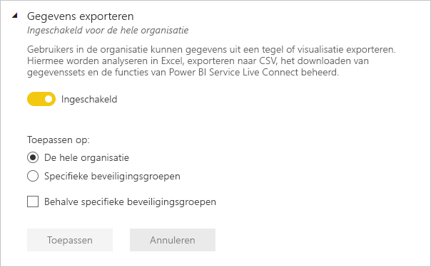
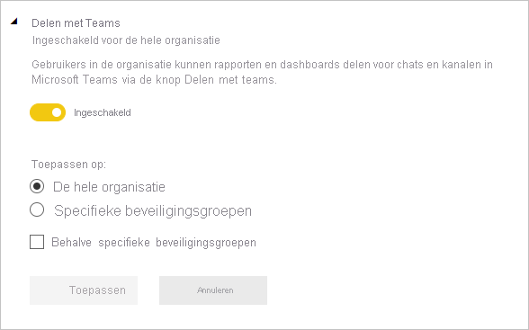
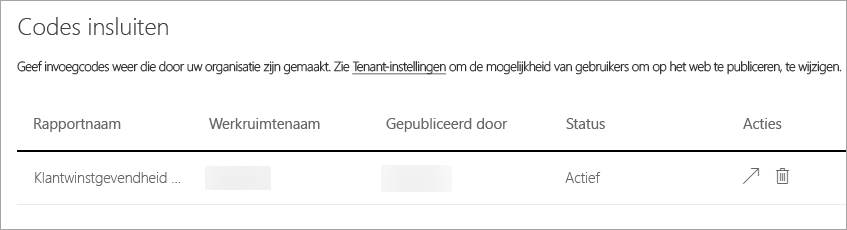

# Power BI beheren in de beheerportal

De beheerportal stelt u in staat om de Power BI-instellingen voor uw organisatie te beheren. De portal bevat onder andere metrische gebruiksgegevens, en biedt toegang tot het Microsoft 365-beheercentrum en de tenantinstellingen.

De volledige beheerportal is toegankelijk voor globale beheerders en gebruikers met de rol Power BI-servicebeheerder. Als u niet een van deze rollen heeft, ziet u in de portal alleen de optie **Capaciteitsinstellingen**. Zie [Understanding the Power BI admin role](service-admin-role.md) (Power BI-beheerdersrol) voor meer informatie over de beheerdersrol voor de Power BI-service.

## Toegang krijgen tot de beheerportal

U moet een globale beheerder of Power BI-servicebeheerder zijn om toegang te krijgen tot de Power BI-beheerportal. Zie [Understanding the Power BI admin role](service-admin-role.md) (Power BI-beheerdersrol) voor meer informatie over de beheerdersrol voor de Power BI-service. Volg deze stappen om naar de Power BI-beheerportal te gaan:

1. Meld u aan bij [Power BI](https://app.powerbi.com) met behulp van de referenties van uw beheerdersaccount.

1. Selecteer in de paginakoptekst **Instellingen** > **Beheerportal**.

    

De beheerportal bevat verschillende secties. De rest van dit artikel biedt informatie over elk van deze secties.

* [Metrische gegevens over gebruik](#usage-metrics)
* [Gebruikers](#users)
* [Auditlogboeken](#audit-logs)
* [Tenantinstellingen](#tenant-settings)
* [Capaciteitsinstellingen](#capacity-settings)
* [Codes insluiten](#embed-codes)
* [Organisatievisuals](organizational-visuals.md#organizational-visuals)
* [Azure-verbindingen (preview)](#azure-connections-preview)
* [Werkruimten](#workspaces)
* [Aangepaste huisstijl](#custom-branding)
* [Metrische gegevens voor beveiliging](#protection-metrics)
* [Aanbevolen inhoud](#featured-content)

## Metrische gegevens over gebruik

Met de **Metrische gegevens over gebruik** kunt u het Power BI-gebruik voor uw organisatie bewaken. Ook wordt weergegeven welke gebruikers en groepen in uw organisatie het meest actief zijn in Power BI.

> [!NOTE]
> De eerste keer dat u het dashboard opent, of als u het dashboard weergeeft nadat u het lange tijd niet hebt gebruikt, ziet u waarschijnlijk een melding dat het dashboard wordt geladen.

Nadat het dashboard is geladen, ziet u twee secties met tegels. De eerste sectie bevat gebruiksgegevens voor individuele gebruikers, en de tweede sectie bevat vergelijkbare informatie voor groepen.

Hier volgt een overzicht van wat u in elke tegel kunt zien:

* Unieke telling van alle dashboards, rapporten en gegevenssets in de gebruikerswerkruimte.
  
    

* Het meest gebruikte dashboard qua het aantal gebruikers dat er toegang tot heeft. Bijvoorbeeld: U hebt een dashboard dat u deelt met drie gebruikers. U hebt het dashboard ook toegevoegd aan een inhoudspakket waarmee twee verschillende gebruikers zijn verbonden. Het aantal dashboards is dan 6 (1 + 3 + 2).
  
    

* De meest populaire inhoud waarmee gebruikers verbinding hebben gemaakt. Dit is alle inhoud die de gebruikers kunnen bereiken via het proces Gegevens ophalen, zoals SaaS-inhoudspakketten, organisatie-inhoudspakketten, bestanden of databases.

  
    

* Een weergave van de actiefste gebruikers op basis van hoeveel dashboards ze hebben, zowel dashboards die ze zelf hebben gemaakt en dashboards die met ze zijn gedeeld.
  
    

* Een weergave van de actiefste gebruikers op basis van de hoeveelheid rapporten die ze hebben.
  
    

De tweede sectie bevat hetzelfde type informatie, maar dan op basis van groepen. In deze sectie ziet u welke groepen in uw organisatie het actiefst zijn en wat voor soort inhoud ze gebruiken.

Deze informatie biedt nuttige inzichten in hoe personen Power BI gebruiken in uw organisatie.

## Metrische gegevens over gebruik beheren

Rapporten met metrische gegevens over gebruik zijn een functie die de Power BI- of globale beheerder kan in- of uitschakelen. Beheerders hebben gedetailleerde controle over welke gebruikers toegang hebben tot metrische gegevens over gebruik. Ze zijn standaard ingeschakeld (**Aan**) voor alle gebruikers in de organisatie.

Beheerders kunnen ook bepalen of makers van inhoud gegevens per gebruiker kunnen bekijken in metrische gegevens over gebruik. 

Zie [Metrische gegevens over het gebruik van Power BI-dashboards en -rapporten bewaken](../collaborate-share/service-usage-metrics.md) voor meer informatie over de rapporten zelf.

### Metrische gegevens over het gebruik voor makers van inhoud

1. Selecteer in de beheerportal **Tenantinstellingen** > **Instellingen voor controle en gebruik** > **Metrische gegevens over het gebruik voor makers van inhoud**.

    

1. Schakel metrische gegevens over gebruik in (of uit) > **Toepassen**.

    

### Gegevens per gebruiker in metrische gegevens over gebruik voor makers van inhoud

Gegevens per gebruiker zijn standaard ingeschakeld voor metrische gebruiksgegevens, en accountgegevens worden opgenomen in het metrische rapport. Als u geen accountgegevens wilt opnemen voor een bepaalde gebruiker of voor alle gebruikers, schakelt u de functie voor bepaalde beveiligingsgroepen of voor een hele organisatie uit. Accountgegevens worden dan in het rapport weergegeven als *Naamloos*.

### Alle bestaande inhoud voor metrische gegevens over gebruik verwijderen

Bij het uitschakelen van metrische gegevens over gebruik voor de gehele organisatie kunnen beheerders ook een of beide van deze opties kiezen:

- **Alle bestaande inhoud voor metrische gegevens over gebruik verwijderen** om alle bestaande rapporten en dashboardtegels te verwijderen die zijn gemaakt met behulp van de rapporten en gegevenssets voor metrische gegevens over gebruik. Deze optie verwijdert alle toegang tot metrische gegevens voor alle gebruikers in de organisatie die deze mogelijk al gebruiken.
- **Alle bestaande gegevens per gebruiker verwijderen uit de huidige inhoud van metrische gegevens over gebruik** om alle toegang te verwijderen tot gegevens per gebruiker voor alle gebruikers in de organisatie die deze mogelijk al gebruiken. 

Let op, want het verwijderen van bestaande metrische gegevens over gebruik en gegevens per gebruiker kan niet ongedaan worden gemaakt.

## Gebruikers

U beheert Power BI-gebruikers, -groepen en -beheerders in het Microsoft 365-beheercentrum. Het tabblad **Gebruikers** bevat een link naar het beheercentrum.

## Auditlogboeken

U beheert Power BI-auditlogboeken in het Office 365-centrum voor beveiliging en naleving. Het tabblad **Auditlogboeken** bevat een link naar het centrum voor beveiliging en naleving. Zie [Activiteiten van gebruikers bijhouden in Power BI](service-admin-auditing.md) voor meer informatie.

Als u auditlogboeken wilt gebruiken, zorg dan dat de instelling [**Auditlogboeken maken voor het controleren van interne activiteiten en naleving**](#create-audit-logs-for-internal-activity-auditing-and-compliance) is ingeschakeld.

## Tenantinstellingen

Met **Tenantinstellingen** kunt u nauwkeurig bepalen welke functies aan uw organisatie ter beschikking worden gesteld. Als u zich zorgen maakt over gevoelige gegevens, zijn sommige van onze functies mogelijk niet geschikt voor uw organisatie, of misschien wilt u alleen een bepaalde functie beschikbaar stellen aan een specifieke groep.

> [!NOTE]
> Tenantinstellingen waarmee u de beschikbaarheid van functies in de Power BI-gebruikersinterface bepaalt, kunnen helpen bij het vaststellen van beheerbeleid, maar zijn geen beveiligingsmaatregel. De instelling **Gegevens exporteren** beperkt bijvoorbeeld niet de machtigingen van een Power BI-gebruiker voor een gegevensset. Power BI-gebruikers met leestoegang tot een gegevensset hebben de toestemming om deze gegevensset op te vragen en kunnen mogelijk de resultaten behouden zonder de functie **Gegevens exporteren** in de Power BI-gebruikersinterface te gebruiken.

In de volgende afbeelding worden diverse instellingen op het tabblad **Tenantinstellingen** weergegeven.

> [!NOTE]
> Het duurt maximaal 15 minuten voordat een instelling voor iedereen in uw organisatie is gewijzigd.

Instellingen hebben een van deze drie statussen:

* **Uitgeschakeld voor de hele organisatie**: niemand in uw organisatie kan deze functie gebruiken.

    

* **Ingeschakeld voor de hele organisatie**: iedereen in uw organisatie kan deze functie gebruiken.

    

* **Ingeschakeld voor een subset van de organisatie**: In plaats van de functie in te schakelen voor de hele organisatie, kunt u de instelling toepassen op **Specifieke beveiligingsgroepen** in uw organisatie die deze functie mogen gebruiken.

    U kunt een functie ook inschakelen voor de hele organisatie **Met uitzondering van beveiligingsgroepen**.

    

    U kunt instellingen ook combineren om de functie alleen in te schakelen voor een specifieke groep gebruikers en uit te schakelen voor een andere groep gebruikers. Op deze manier kunt u ervoor zorgen dat bepaalde gebruikers geen toegang hebben tot de functie, zelfs niet als ze deel uitmaken van de groep die wel toegang heeft. De meest beperkende instelling voor een gebruiker is van toepassing.

    

In de volgende secties ziet u een overzicht van de verschillende typen tenantinstellingen.

## Instellingen voor Help en ondersteuning

### Help-informatie publiceren

Beheerders kunnen interne URL's opgeven om de bestemming van koppelingen in het Help-menu van Power BI te overschrijven, en voor licentie-upgrades. Als aangepaste URL's zijn ingesteld, worden gebruikers in de organisatie naar interne Help- en ondersteuningsresources geleid, in plaats van naar de standaardbestemmingen. De bestemmingen van de volgende resources kunnen worden aangepast:

* **Learn**. Deze koppeling uit het Help-menu leidt standaard naar een [lijst met al uw Power BI-leertrajecten en -modules](https://docs.microsoft.com/learn/browse/?products=power-bi). Als u deze koppeling wilt omleiden naar interne trainingsresources, stelt u een aangepaste URL in voor **Trainingsdocumentatie**.

* **Community**. Als u gebruikers vanuit het Help-menu naar een intern forum wilt leiden, in plaats van naar de [Power BI-community](https://community.powerbi.com/), stelt u een aangepaste URL in voor **Discussieforum**.

* **Licentie-upgrades**. Gebruikers met een (gratis) Power BI-licentie kunnen de kans krijgen om hun account bij te werken naar Power BI Pro tijdens het gebruik van de service. Als u een interne URL opgeeft voor **Licentieaanvragen**, leidt u gebruikers om naar een interne aanvraag- en aankoopstroom, en voorkomt u selfservice-aankopen. Raadpleeg [Gebruikers toestaan Power BI Pro uit te proberen](#allow-users-to-try-power-bi-pro) als u wilt voorkomen dat gebruikers licenties kopen, maar het wel goed vindt dat gebruikers een proefversie van Power BI Pro starten.

* **Hulp vragen**. Als u gebruikers vanuit het Help-menu naar een interne helpdesk wilt leiden, in plaats van naar [Power BI-ondersteuning](https://powerbi.microsoft.com/support/), stelt u een aangepaste URL in voor **Helpdesk**.

### E-mailmeldingen ontvangen voor serviceonderbrekingen of incidenten

Voor e-mail ingeschakelde beveiligingsgroepen ontvangen e-mailmeldingen als deze tenant wordt beïnvloed door een serviceonderbreking of incident. Meer informatie over [Meldingen over onderbrekingen van de service](service-interruption-notifications.md).

### Gebruikers toestaan Power BI Pro uit te proberen

De instelling **Gebruikers toestaan Power BI Pro uit te proberen** is standaard ingeschakeld, en biedt u meer controle over hoe gebruikers Power BI Pro-licenties verkrijgen. In scenario's waarin u selfservice-aankopen hebt geblokkeerd, stelt deze instelling gebruikers in staat om een proefversie van Power BI Pro te starten. De ervaring van eindgebruikers is afhankelijk van hoe u licentie-instellingen samenvoegt. In de onderstaande tabel ziet u hoe upgraden van (gratis) Power BI naar Power BI Pro wordt beïnvloed door verschillende instellingencombinaties:

| Instelling voor selfservice-aankopen | Gebruiker toestaan Power BI Pro uit te proberen | Ervaring van de eindgebruiker |
| ------ | ------ | ----- |
| Ingeschakeld | Uitgeschakeld | Gebruiker kan een Pro-licentie kopen, maar geen proefversie starten |
| Ingeschakeld | Ingeschakeld | Gebruiker kan een gratis proefversie van Pro starten, en kan upgraden naar een betaalde licentie |
| Uitgeschakeld | Uitgeschakeld | Gebruiker wordt in een bericht gevraagd contact op te nemen met de IT-beheerder om een licentie aan te vragen |
| Uitgeschakeld | Ingeschakeld | Gebruiker kan een proefversie van Pro starten, maar moet contact opnemen met de IT-beheerder om een betaalde licentie te krijgen |

> [!NOTE]
> U kunt een interne URL voor licentieaanvragen toevoegen in [Instellingen voor Help en ondersteuning](#help-and-support-settings). Als u de URL instelt, wordt de standaardaankoopervaring overschreven. Gebruikers die een licentie kunnen kopen in de scenario's die in de bovenstaande tabel zijn beschreven, worden omgeleid naar uw interne URL.

Zie [Selfservice-registratie en -aankopen in- of uitschakelen](service-admin-disable-self-service.md) voor meer informatie.

## Instellingen voor werkruimte

In **Tenantinstellingen** in de beheerportal zijn drie secties voor het beheren van werkruimten:

- [De nieuwe werkruimte-ervaringen maken](#create-the-new-workspaces).
- [Gegevenssets in werkruimten gebruiken](#use-datasets-across-workspaces).
- [Het maken van een klassieke werkruimte blokkeren](#block-classic-workspace-creation).

### Nieuwe werkruimten maken

Werkruimten zijn plaatsen waar gebruikers kunnen samenwerken aan dashboards, rapporten en andere inhoud. Beheerders gebruiken de instelling **Werkruimten maken (nieuwe werkruimte-ervaring)** om aan te geven welke gebruikers in de organisatie werkruimten mogen maken. Beheerders kunnen iedereen of niemand binnen de organisatie toestemming geven om werkruimten te maken. Ze kunnen het maken van werkruimten ook beperken tot leden van specifieke beveiligingsgroepen. Meer informatie over [werkruimten](../collaborate-share/service-new-workspaces.md).

:::image type="content" source="media/service-admin-portal/power-bi-admin-workspace-settings.png" alt-text="Werkruimten maken (nieuwe werkruimte-ervaring)":::

Voor klassieke werkruimten die zijn gebaseerd op Microsoft 365-groepen, blijft het beheer geconcentreerd in de beheerportal en Azure Active Directory.

> [!NOTE]
> Met de instelling **Werkruimten maken (nieuwe werkruimte-ervaring)** kunnen alleen gebruikers die Microsoft 365-groepen kunnen maken, nieuwe werkruimten maken in Power BI. Zorg ervoor dat u in de Power BI-beheerportal een waarde instelt om ervoor te zorgen dat de juiste gebruikers nieuwe werkruimten kunnen maken.

**Lijst met werkruimten**

De beheerportal heeft nog een sectie met instellingen over de werkruimten in uw tenant. In die sectie kunt u de lijst werkruimten sorteren en filteren, en de details van elke werkruimte weergeven. Zie [Werkruimten](#workspaces) in dit artikel voor meer informatie.

**Inhoudspakketten en apps publiceren**

In de beheerportal bepaalt u ook welke gebruikers machtigingen krijgen om apps naar de organisatie te distribueren. Zie [Inhoudspakketten en apps naar de volledige organisatie publiceren](#publish-content-packs-and-apps-to-the-entire-organization) in dit artikel voor meer informatie.

### Gegevenssets in werkruimten gebruiken

Beheerders kunnen bepalen welke gebruikers in de organisatie gegevenssets kunnen gebruiken in verschillende werkruimten. Als deze instelling is ingeschakeld, hebben gebruikers nog steeds de vereiste machtiging voor het maken van een specifieke gegevensset nodig.

:::image type="content" source="media/service-admin-portal/power-bi-admin-datasets-workspaces.png" alt-text="Gegevenssets in werkruimten gebruiken":::

Zie [Inleiding tot gegevenssets in werkruimten](../connect-data/service-datasets-across-workspaces.md) voor meer informatie.

### Het maken van een klassieke werkruimte blokkeren

Beheerders kunnen bepalen of de organisatie klassieke werkruimten kan maken. Als deze instelling is ingeschakeld, kunnen gebruikers die alleen werkruimten maken deze alleen maken in de nieuwe werkruimte-ervaring. 

Als deze functie is ingeschakeld, worden nieuw gemaakte Office 365-groepen niet weergegeven in de lijst Power BI-werkruimten. Bestaande klassieke werkruimten worden nog steeds weergegeven in de lijst. Als de instelling is uitgeschakeld, worden alle Office 365-groepen waarvan de gebruiker lid is, weergegeven in de lijst met werkruimten. Meer informatie over [werkruimten in de nieuwe werkruimte-ervaring](../collaborate-share/service-new-workspaces.md).

## Instellingen voor exporteren en delen

### Inhoud delen met externe gebruikers

Gebruikers in de organisatie kunnen dashboards, rapporten en apps delen met gebruikers buiten de organisatie. Meer informatie over [extern delen](../collaborate-share/service-share-dashboards.md#share-a-dashboard-or-report-outside-your-organization).

De volgende afbeelding toont het bericht dat verschijnt wanneer u deelt met een externe gebruiker.

  

> [!IMPORTANT]
> Met deze optie wordt bepaald of gebruikers in Power BI externe gebruikers kunnen uitnodigen om gastgebruiker te worden van Azure AD B2B (Active Directory B2B) in uw organisatie, via Power BI. Wanneer deze optie is ingeschakeld, kunnen gebruikers met de rol Afzender van gastuitnodigingen in Azure AD externe e-mailadressen toevoegen wanneer rapporten, dashboards en Power BI-apps worden gedeeld. De externe ontvanger wordt uitgenodigd om lid te worden van uw organisatie als een Azure AD B2B-gastgebruiker. Belangrijk: als u deze instelling uitschakelt, worden externe gebruikers die al Azure AD B2B-gastgebruikers zijn in uw organisatie, nog steeds weergegeven in de UI’s van Personen selecteren in Power BI. Zij kunnen ook toegang krijgen tot items, werkruimten en apps.

### Publiceren op internet

Als beheerder van een Power BI-tenant krijgt u met de instelling **Publiceren op internet** opties waarvoor gebruikers invoegcodes kunnen maken voor het publiceren van rapporten op internet. Met deze functionaliteit wordt het rapport en de gegevens die het bevat, beschikbaar voor iedereen op internet. Meer informatie over [publiceren op internet](../collaborate-share/service-publish-to-web.md).

> [!NOTE]
> Alleen Power BI-beheerders kunnen iemand machtigen verlenen voor het maken van nieuwe invoegcodes voor publiceren op internet. Organisaties kunnen bestaande invoegcodes hebben. Zie de sectie [Invoegcodes](service-admin-portal.md#embed-codes) van de beheerportal om momenteel gepubliceerde rapporten te bekijken.

De volgende afbeelding toont het menu **Meer options (...)** voor een rapport wanneer de instelling **Publiceren op internet** is ingeschakeld.

De instelling **Publiceren op internet** in de beheerportal bevat opties waarvoor gebruikers invoegcodes kunnen maken.

Beheerders kunnen **Publiceren op internet** instellen op **Ingeschakeld** en de optie **Kiezen hoe invoegcodes werken** op **Alleen bestaande invoegcodes toestaan**. In dat geval kunnen gebruikers invoegcodes maken, maar moeten ze contact opnemen met de Power BI-beheerder om toestemming hiervoor te krijgen.

Gebruikers zien verschillende opties in de gebruikersinterface, afhankelijk van de instelling **Publiceren op internet**.

|Functie |Ingeschakeld voor de hele organisatie |Uitgeschakeld voor de hele organisatie |Specifieke beveiligingsgroepen   |
|---------|---------|---------|---------|
|**Publiceren op internet** onder het menu **Meer opties (...)** van het rapport|Ingeschakeld voor iedereen|Niet voor iedereen zichtbaar|Alleen zichtbaar voor gemachtigde gebruikers of groepen.|
|**Invoegcodes beheren** onder **Instellingen**|Ingeschakeld voor iedereen|Ingeschakeld voor iedereen|Ingeschakeld voor iedereen  Optie * **Verwijderen** alleen voor gemachtigde gebruikers of groepen. * **Ophalen van codes** ingeschakeld voor iedereen.|
|**Codes invoegen** binnen de beheerportal|De status geeft een van de volgende opties weer: * Actief * Niet ondersteund * Geblokkeerd|De status geeft **Uitgeschakeld** weer|De status geeft een van de volgende opties weer: * Actief * Niet ondersteund * Geblokkeerd  Als een gebruiker niet is geautoriseerd op basis van de tenantinstelling, wordt de status weergegeven als **geschonden**.|
|Bestaande gepubliceerde rapporten|Iedereen ingeschakeld|Iedereen uitgeschakeld|Rapporten blijven weergeven voor iedereen.|

### Gegevens exporteren

Gebruikers in de organisatie kunnen gegevens uit een tegel of visualisatie exporteren. Hiermee worden analyseren in Excel, exporteren naar CSV, het downloaden van gegevenssets (PBIX) en de functies van Power BI Service Live Connect bediend. Meer informatie over [het exporteren van gegevens vanaf een tegel of visual](../visuals/power-bi-visualization-export-data.md).

>[!NOTE]
> Vóór de introductie van de instelling voor exporteren naar Excel werd met deze instelling ook het exporteren van gegevens naar Excel-bestanden beheerd. Zie de [opmerking onder Exporteren naar Excel](#export-to-excel) voor meer informatie.

De volgende afbeelding toont de optie voor het exporteren van gegevens uit een tegel.

> [!NOTE]
> Als u **Gegevens exporteren** uitschakelt, hebben gebruikers ook geen toegang tot de functie [Analyseren in Excel](../collaborate-share/service-analyze-in-excel.md) en kunnen ze ook de live-verbinding met de Power BI-service niet gebruiken.

### Exporteren naar Excel

Gebruikers in de organisatie kunnen de gegevens van een visualisatie exporteren naar een Excel-bestand.

>[!IMPORTANT]
> Vóór de introductie van de instelling voor exporteren naar Excel werd het exporteren naar een Excel-bestand geregeld via de instelling Gegevens exporteren. De eerste keer dat tenantbeheerders de instelling Exporteren naar Excel bekijken (bij tenants die vóór de introductie van de instelling Exporteren naar Excel al bestonden), zien ze dat er *niet-toegepaste wijzigingen* zijn. Ze moeten deze wijzigingen toepassen om de nieuwe instelling van kracht te laten worden. Als dit niet gebeurt, wordt het exporteren naar Excel-bestanden blijvend geregeld door de instelling Gegevens exporteren.

### Rapporten als PowerPoint-presentaties of PDF-documenten exporteren

Gebruikers binnen de organisatie kunnen Power BI-rapporten als PowerPoint-bestanden of PDF-documenten exporteren. [Meer informatie](../consumer/end-user-powerpoint.md)

De volgende afbeelding toont het menu **Bestand** voor een rapport wanneer de instelling **Rapporten exporteren als PowerPoint-presentaties of PDF-documenten** is ingeschakeld.

### Dashboards en rapporten afdrukken

Gebruikers in de organisatie kunnen dashboards en rapporten afdrukken. [Meer informatie](../consumer/end-user-print.md)

De volgende afbeelding toont de optie voor het afdrukken van een dashboard.

De volgende afbeelding toont het menu **Bestand** voor een rapport wanneer de instelling **Dashboards en rapporten afdrukken** is ingeschakeld.

### Externe gastgebruikers toestaan om inhoud in de organisatie te bewerken en te beheren

Azure AD B2B-gastgebruikers kunnen inhoud in de organisatie bewerken en beheren. [Meer informatie](service-admin-azure-ad-b2b.md)

In de volgende afbeelding ziet u de optie Externe gastgebruikers toestaan om inhoud in de organisatie te bewerken en te beheren.

In de beheerportal bepaalt u ook welke gebruikers machtigingen krijgen om externe gebruikers uit te nodigen voor de organisatie. Raadpleeg [Inhoud delen met externe gebruikers](#export-and-sharing-settings) in dit artikel voor details.

### E-mailabonnementen
Gebruikers in de organisatie kunnen e-mailabonnementen maken. Meer informatie over [abonnementen](../collaborate-share/service-publish-to-web.md).

### Aanbevolen inhoud

Toestaan dat sommige of alle auteurs van rapporten in uw organisatie hun inhoud in de sectie Aanbevolen van de Power BI-startpagina kunnen aanbevelen. Nieuwe gebruikers krijgen bovenaan hun Power BI-startpagina de aanbevolen inhoud te zien. De aanbevolen inhoud schuift omlaag op de startpagina wanneer gebruikers **Favorieten**, **Vaak gebruikte items** en **Recente items** toevoegen. 

We raden u aan eerst te beginnen met een klein aantal promotors. Wanneer de hele organisatie inhoud mag aanbevelen op de startpagina, kan het lastig zijn om alle gepromoveerde inhoud bij te houden. 

Wanneer u aanbevolen inhoud hebt ingeschakeld, kunt u deze ook beheren in de Beheerportal. Zie [Aanbevolen inhoud beheren](#manage-featured-content) in dit artikel voor meer informatie over het beheren van aanbevolen inhoud in uw domein.

## Instellingen voor inhoudspakket en app

### Inhoudspakketten en apps naar de volledige organisatie publiceren

Beheerders gebruiken deze instelling om te bepalen welke gebruikers inhoudspakketten en apps naar de volledige organisatie mogen publiceren, in plaats van naar specifieke groepen. Meer informatie over [het publiceren van apps](../collaborate-share/service-create-distribute-apps.md).

De volgende afbeelding toont de optie **Mijn hele organisatie** bij het maken van een inhoudspakket.

### Sjabloon-apps en organisatie-inhoudspakketten maken

Gebruikers in de organisatie kunnen sjabloon-apps en organisatie-inhoudspakketten maken die gegevenssets gebruiken die zijn gebaseerd op één gegevensbron in Power BI Desktop. Meer informatie over [sjabloon-apps](../connect-data/service-template-apps-create.md).

### Apps pushen naar eindgebruikers

Makers van rapporten kunnen apps rechtstreeks met eindgebruikers delen zonder dat er installatie vanuit [AppSource](https://appsource.microsoft.com) is vereist. Meer informatie over [het automatisch installeren van apps voor eindgebruikers](../collaborate-share/service-create-distribute-apps.md#automatically-install-apps-for-end-users).

## Instellingen voor integratie

### Analyseren in Excel gebruiken met on-premises gegevenssets

Gebruikers in de organisatie kunnen Excel gebruiken voor het weergeven van on-premises Power BI-gegevenssets en het werken met deze sets. [Meer informatie](../collaborate-share/service-analyze-in-excel.md)

> [!NOTE]
> Als u **Gegevens exporteren** uitschakelt, hebben gebruikers ook geen toegang tot de functie **Analyseren in Excel**.

### ArcGIS Maps for Power BI gebruiken

Gebruikers in de organisatie kunnen de visualisatie ArcGIS Maps for Power BI, die is geleverd door Esri, gebruiken. [Meer informatie](../visuals/power-bi-visualization-arcgis.md)

### Algemene zoekopdrachten voor Power BI gebruiken (preview-versie)

Gebruikers in de organisatie kunnen externe-zoekopdrachtfuncties gebruiken waarbij gebruik wordt gemaakt van Azure Search.

## Instellingen voor de aanbevolen tabellen

Onder **Tenant-instellingen** kunt u met behulp van de instelling **Verbindingen met aanbevolen tabellen toestaan** de Power BI-beheerder laten controleren wie in de organisatie uitgelichte tabellen kan gebruiken in de galerie Gegevenstypen van Excel. 

:::image type="content" source="media/service-admin-portal/admin-allow-connections-featured-tables.png" alt-text="Alle verbindingen met uitgelichte tabellen":::

Verbindingen met aanbevolen tabellen worden ook uitgeschakeld als de instelling **Gegevens exporteren** is ingesteld op **Uitgeschakeld**.

Meer informatie over [Uitgelichte Power BI-tabellen in Excel](../collaborate-share/service-excel-featured-tables.md).

## Tenantinstelling Delen met Teams

De instelling **Delen in Teams** bevindt zich in het gedeelte **Tenantinstellingen** van de Power BI-beheerportal. Door deze instelling kunnen organisaties de knoppen voor **Delen in Teams** verbergen in de Power BI-service. Indien de instelling is uitgeschakeld, zien gebruikers de knoppen **Delen in Teams** niet op de actiebalk of in de contextmenu's bij het bekijken van rapporten en dashboards in de Power BI-service.

Meer informatie over [het delen van Power BI-inhoud in Teams](../collaborate-share/service-share-report-teams.md).

## Instellingen voor R-visuals

### Interactie met visuele R-elementen en visuele R-elementen delen

Gebruikers in de organisatie kunnen interactie hebben met visuele elementen die zijn gemaakt met R scripts en deze elementen delen. [Meer informatie](../visuals/service-r-visuals.md)

> [!NOTE]
> Deze instelling geldt voor de hele organisatie en kan niet worden beperkt tot specifieke groepen.

## Instellingen voor controle en gebruik

### Auditlogboeken maken voor het controleren van interne activiteiten en naleving

Gebruikers in de organisatie kunnen de auditfunctie gebruiken voor het controleren van acties die door andere gebruikers in de organisatie worden uitgevoerd in Power BI. [Meer informatie](service-admin-auditing.md)

Deze instelling moet worden ingeschakeld om vermeldingen te kunnen vastleggen in het auditlogboek. Er kan een vertraging tot 48 uur bestaan tussen het inschakelen van de controlefunctie en het kunnen weergeven van controlegegevens. Als u niet direct gegevens ziet, controleert u de controlelogboeken op een later tijdstip. Er kan een vergelijkbare vertraging optreden tussen het ophalen van machtiging voor het weergeven van controlelogboeken en het kunnen openen van de logboeken.

> [!NOTE]
> Deze instelling geldt voor de hele organisatie en kan niet worden beperkt tot specifieke groepen.

### Metrische gegevens over het gebruik voor makers van inhoud

Gebruikers in de organisatie kunnen metrische gegevens weergeven over het gebruik van de dashboards en rapporten die ze hebben gemaakt. [Meer informatie](../collaborate-share/service-usage-metrics.md)

### Gegevens per gebruiker in metrische gegevens over gebruik voor makers van inhoud

In metrische gegevens over het gebruik voor makers van inhoud zijn namen en e-mailadressen zichtbaar van gebruikers die inhoud openen. [Meer informatie](../collaborate-share/service-usage-metrics.md)

Standaard wordt Gegevens per gebruiker ingeschakeld voor metrische gegevens over gebruik. Accountgegevens van makers van inhoud worden in het metrische rapport opgenomen. Als u deze informatie niet voor alle gebruikers wilt verzamelen, schakelt u de functie voor bepaalde beveiligingsgroepen of voor een hele organisatie uit. Accountgegevens voor de uitgesloten gebruikers worden dan in het rapport weergegeven als *Naamloos*.

## Instellingen voor dashboard

### Gegevensclassificatie voor dashboards

Gebruikers in de organisatie kunnen dashboards taggen met classificaties die het beveiligingsniveau van het dashboard aangeven. [Meer informatie](../create-reports/service-data-classification.md)

> [!NOTE]
> Deze instelling geldt voor de hele organisatie en kan niet worden beperkt tot specifieke groepen.

## Instellingen voor ontwikkelaars

### Inhoud in apps insluiten

Gebruikers in de organisatie kunnen Power BI-dashboards en rapporten insluiten in SaaS-toepassingen (Software as a Service). Als u deze instelling uitschakelt, kunnen gebruikers de REST API's niet gebruiken om inhoud van Power BI in hun toepassing in te sluiten. [Meer informatie](../developer/embedded/embedding.md)

### Toestaan dat service-principals gebruikmaken van API's van Power BI

Web-apps die in Azure AD (Active Directory) zijn geregistreerd, maken gebruik van een toegewezen service-principal voor toegang tot API's van Power BI zonder een aangemelde gebruiker. Als u wilt toestaan dat een app verificatie via een service-principal gebruikt, moet de betreffende service-principal worden opgenomen in een beveiligingsgroep die toegang heeft. [Meer informatie](../developer/embedded/embed-service-principal.md)

> [!NOTE]
> Service-principals nemen de machtigingen voor alle instellingen van de Power BI-tenant over van hun beveiligingsgroep. Als u deze machtigingen wilt beperken, maakt u een specifieke beveiligingsgroep voor service-principals en voegt u deze toe aan de lijst Behalve specifieke beveiligingsgroepen voor de desbetreffende, ingeschakelde Power BI-instellingen.

## Gegevensstroominstellingen

### Gegevensstromen maken en gebruiken

Gebruikers in de organisatie kunnen gegevensstromen maken en gebruiken. Zie [Selfservice voor gegevensvoorbereiding in Power BI](../transform-model/service-dataflows-overview.md) voor een overzicht van gegevensstromen. Zie [Workloads configureren](service-admin-premium-workloads.md) als u gegevensstromen wilt inschakelen in een Premium-capaciteit.

> [!NOTE]
> Deze instelling geldt voor de hele organisatie en kan niet worden beperkt tot specifieke groepen.

## Instellingen voor sjabloon-apps

Drie instellingen bepalen wie de mogelijkheid heeft om sjabloon-apps te publiceren of te installeren.

### Sjabloon-apps publiceren

Gebruikers in de organisatie kunnen werkruimten voor sjabloon-apps maken. U bepaalt welke gebruikers sjabloon-apps mogen publiceren of distribueren aan clients buiten uw organisatie via [AppSource](https://appsource.microsoft.com) of andere distributiemethoden.

### Sjabloon-apps installeren die in AppSource worden vermeld

Gebruikers in de organisatie kunnen **alleen** vanuit [AppSource](https://appsource.microsoft.com) sjabloon-apps downloaden en installeren. U bepaalt welke specifieke gebruikers of beveiligingsgroepen sjabloon-apps mogen installeren vanuit AppSource.

### Sjabloon-apps installeren die niet in AppSource worden vermeld

U bepaalt welke gebruikers in de organisatie sjabloon-apps mogen downloaden en installeren die **niet in [ AppSource](https://appsource.microsoft.com) worden vermeld**.

## Capaciteitsinstellingen

### Power BI Premium

Via het tabblad **Power BI Premium-instellingen** kunt u capaciteiten van Power BI Premium (Em of P SKU) beheren die voor uw organisatie zijn gekocht. Alle gebruikers binnen uw organisatie kunnen het tabblad **Power BI Premium-instellingen** zien, maar ze zien alleen inhoud op het tabblad als ze zijn aangewezen als *Capaciteitsbeheerder* of als ze beschikken over toewijzingsmachtigingen. Als een gebruiker geen machtigingen heeft, verschijnt het volgende bericht.

### Power BI Embedded

Via het tabblad **Power BI Embedded-instellingen** kunt u de capaciteiten van Power BI Embedded (A SKU) bekijken die u voor uw klant hebt aangeschaft. Aangezien u alleen A SKU's vanuit Azure kunt aanschaffen, kunt u [ingesloten capaciteiten in Azure beheren](../developer/embedded/azure-pbie-create-capacity.md) vanuit de **Azure-portal**.

Zie [Wat is Power BI Embedded?](../developer/embedded/azure-pbie-what-is-power-bi-embedded.md) voor meer informatie over het beheren van Power BI Embedded (A SKU)-instellingen.

## Codes insluiten

Als beheerder kunt u de invoegcodes weergeven die worden gegenereerd voor uw tenant om rapporten openbaar te delen. U kunt ook codes intrekken of verwijderen. [Meer informatie](../collaborate-share/service-publish-to-web.md)

## Organisatievisuals

Alle beheerinstellingen voor Power BI-visuals, inclusief tenantinstellingen voor Power BI-visuals, worden beschreven in [Beheerinstellingen voor Power BI-visuals beheren](organizational-visuals.md).

## Azure-verbindingen (preview)

### Opslag op tenantniveau (preview)

Gegevens die worden gebruikt met Power BI worden standaard opgeslagen in de interne opslag die wordt geleverd door Power BI. Met de integratie van gegevensstromen en Azure Data Lake Storage Gen2 (ADLS Gen2) kunt u uw gegevensstromen opslaan in het Azure Data Lake Storage Gen2-account van uw organisatie. Ga naar [Integratie van gegevensstromen en Azure Data Lake (preview)](../transform-model/service-dataflows-azure-data-lake-integration.md) voor meer informatie.

### Opslagmachtigingen op werkruimteniveau (preview)

Werkruimtebeheerders mogen standaard niet hun eigen opslagaccount verbinden. Met deze preview-functie kunt u een instelling inschakelen op basis waarvan is toegestaan dat werkruimtebeheerders hun eigen opslagaccount verbinden.

## Werkruimten

Als beheerder kunt u op het tabblad **Werkruimten** alle werkruimten bekijken die aanwezig zijn in uw tenant. Op dit tabblad kunt u deze acties uitvoeren:

- De lijst met werkruimten en de bijbehorende gegevens vernieuwen.
- De gegevens over de werkruimten exporteren in een CSV-bestand. 
- Details van een werkruimte bekijken, inclusief de id, de bijbehorende gebruikers en hun rollen, en de dashboards, rapporten en gegevenssets.
- De lijst met personen die toegang hebben bewerken. Dit betekent dat u de werkruimte kunt verwijderen. U kunt uzelf als beheerder toevoegen aan een werkruimte, en vervolgens de werkruimte openen en verwijderen.
- De velden Naam en Beschrijving bewerken.

Beheerders kunnen ook bepalen of gebruikers een werkruimte in de nieuwe werkruimte-ervaring, of een klassieke werkruimte kunnen maken. Zie [Instellingen voor werkruimte](#workspace-settings) in dit artikel voor meer informatie. 

De tabelkolommen op het tabblad **Werkruimten** komen overeen met de eigenschappen die worden geretourneerd met de [REST API voor Power BI-beheer](/rest/api/power-bi/admin) voor werkruimten. Persoonlijke werkruimten zijn van het type **PersonalGroup**, klassieke werkruimten zijn van het type **Group** en werkruimten met de nieuwe werkruimte-ervaring zijn van het type **Workspace**. Zie [Werk organiseren in de nieuwe werkruimten](../collaborate-share/service-new-workspaces.md) voor meer informatie.

Op het tabblad **Werkruimten** wordt de *status* voor elke werkruimte weergegeven. De volgende tabel bevat meer informatie over de betekenis van deze statussen.

|Staat  |Beschrijving  |
|---------|---------|
| **Actief** | Een normale werkruimte. Er wordt geen informatie gegeven over het gebruik of de inhoud ervan, alleen dat de werkruimte zelf 'normaal' is. |
| **Zwevend** | Een werkruimte zonder gebruiker met beheerdersrechten. |
| **Verwijderd** | Een verwijderde werkruimte. We bewaren gedurende 90 dagen voldoende metagegevens om de werkruimte te herstellen indien gewenst. |
| **Verwijderen** | Een werkruimte die wordt verwijderd, maar nog niet is verdwenen. Gebruikers kunnen hun eigen werkruimten verwijderen door items in Verwijderen en uiteindelijk Verwijderd te plaatsen. |

Beheerders kunnen ook werkruimten beheren en herstellen met behulp van de beheerportal of PowerShell-cmdlets. 

## Aangepaste huisstijl

Als beheerder kunt u het uiterlijk van Power BI aanpassen voor uw hele organisatie. Op dit moment zijn er drie hoofdopties:

* **Logo uploaden**: het beste resultaat krijgt u als u een logo uploadt dat is opgeslagen als een PNG-bestand van maximaal 10 kB en ten minste 200 x 30 pixels.

* **Voorbladafbeelding uploaden**: het beste resultaat krijgt u als u een voorbladafbeelding uploadt die is opgeslagen als een JPG- of PNG-bestand van maximaal 1 MB en ten minste 1920 x 160 pixels.

* **Themakleur selecteren**: U kunt een thema selecteren op basis van een hexadecimale waarde, een RGB-waarde of uit het beschikbare palet.

Zie [Aangepaste huisstijl voor uw organisatie](https://aka.ms/orgBranding) voor meer informatie.

## Metrische gegevens voor beveiliging

Nadat u gegevensbeveiliging voor Power BI hebt ingeschakeld, zijn metrische gegevens voor gegevensbeveiliging zichtbaar in de beheerportal. In dit rapport wordt weergegeven hoe vertrouwelijkheidslabels u helpen uw inhoud te beveiligen.

## Aanbevolen inhoud beheren

Als tenantbeheerder kunt u alle rapporten, dashboards en apps beheren die nu worden weergegeven in de sectie Aanbevolen op de Power BI-startpagina in uw organisatie.

- Selecteer **Aanbevolen inhoud** in de Beheerportal.

Hier ziet u een overzicht van de personen die de inhoud hebben aanbevolen, wanneer de inhoud is aanbevolen en alle bijbehorende relevante metagegevens. Als iets er verdacht uitziet of als u de sectie Aanbevolen wilt opschonen, kunt u indien nodig gepromoveerde inhoud verwijderen.

Zie [Aanbevolen inhoud](#featured-content) in dit artikel voor meer informatie over het inschakelen van aanbevolen inhoud.

## Volgende stappen

[Power BI in uw organisatie beheren](service-admin-administering-power-bi-in-your-organization.md)  
[Understanding the Power BI admin role](service-admin-role.md) (Power BI-beheerdersrol)  
[Power BI controleren in uw organisatie](service-admin-auditing.md)  

Hebt u nog vragen? [Misschien dat de Power BI-community het antwoord weet](https://community.powerbi.com/)
