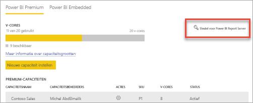

# Capaciteiten configureren en beheren in Power BI Premium

Het beheer van Power BI Premium omvat het maken, beheren en bewaken van Premium-capaciteiten. In dit artikel krijgt u stapsgewijze instructies. Zie [Premium-capaciteiten beheren](service-premium-capacity-manage.md) voor algemene informatie over capaciteiten.

Meer informatie over het beheren van Power BI Premium- en Power BI Embedded-capaciteiten, die toegewezen resources voor uw inhoud bieden.

*Capaciteit* vormt het hart van de Power BI Premium- en Power BI Embedded-aanbiedingen. Het is een set resources die is gereserveerd voor exclusief gebruik door uw organisatie. Wanneer u over toegewezen capaciteit beschikt, kunt u dashboards, rapporten en gegevenssets publiceren voor gebruikers binnen uw organisatie zonder dat u een licentie per gebruiker voor hen hoeft aan te schaffen. Daarnaast krijgt u betrouwbare en consistente prestaties voor de inhoud die in capaciteit wordt gehost. Zie [Wat is Power BI Premium?](service-premium-what-is.md) voor meer informatie.

## Capaciteit beheren

Nadat u capaciteitsknooppunten in Microsoft 365 hebt aangeschaft, stelt u de capaciteit in de Power BI-beheerportal in. U beheert Power BI Premium-capaciteiten in de sectie **Capaciteitsinstellingen** van de portal.

U beheert een capaciteit door de naam van de capaciteit te selecteren. Vervolgens wordt het scherm voor capaciteitsbeheer weergegeven.

Als er geen werkruimten zijn toegewezen aan de capaciteit, wordt een bericht weergegeven over [het toewijzen van een werkruimte aan de capaciteit](#assign-a-workspace-to-a-capacity).

### Een nieuwe capaciteit instellen (Power BI Premium)

In de beheerportal wordt het aantal *virtuele kernen* (v-cores) weergegeven dat u hebt gebruikt en dat nog beschikbaar is. Het totale aantal v-cores is gebaseerd op de Premium-SKU's die u hebt aangeschaft. Als u bijvoorbeeld een P3 en P2 aanschaft, resulteert dit in 48 beschikbare kernen: 32 voor de P3 en 16 voor de P2.

Als u beschikbare v-cores hebt, stelt u met de volgende stappen de nieuwe capaciteit in.

1. Selecteer **Nieuwe capaciteit instellen**.

1. Geef een naam op voor de capaciteit.

1. Definieer wie de beheerder voor deze capaciteit is.

1. Selecteer de grootte van uw capaciteit. Welke opties beschikbaar zijn, is afhankelijk van het aantal beschikbare v-cores. U kunt geen een optie selecteren die groter is dan het aantal beschikbare v-cores.

    

1. Selecteer **Instellen**.

    

Capaciteitsbeheerders, evenals Power BI-beheerders en globale beheerders, kunnen de capaciteit vervolgens bekijken in de beheerportal.

### Capaciteitsinstellingen

1. In het scherm voor het beheren van de Premium-capaciteit kunt u onder **Acties** het **tandwielpictogram** selecteren om instellingen te bekijken en bij te werken. 

    

1. U kunt zien wie de servicebeheerders zijn, wat de SKU of de grootte van de capaciteit is en in welke regio de capaciteit zich bevindt.

    

1. U kunt ook de naam van een capaciteit wijzigen of een capaciteit verwijderen.

    

> [!NOTE]
> De capaciteitsinstellingen voor Power BI Embedded worden beheerd in Microsoft Azure Portal.

### Capaciteitsgrootte wijzigen

Power BI-beheerders en globale beheerders kunnen Power BI Premium-capaciteit wijzigen. Capaciteitsbeheerders die geen Power BI-beheerder of globale beheerder zijn, beschikken niet over deze optie.

1. Selecteer **Capaciteitsgrootte wijzigen**.

    

1. Op het scherm **Capaciteitsgrootte wijzigen** upgradet of downgradet u de capaciteit.

    

    Beheerders kunnen naar wens knooppunten maken en verwijderen en de grootte van de knooppunten wijzigen, zolang ze maar over het vereiste aantal v-cores beschikken.

    U kunt P SKU's niet downgraden naar EM SKU's. U kunt de muisaanwijzer over uitgeschakelde opties bewegen voor een uitleg.

> [!IMPORTANT]
> Als er een hoog resourcegebruik is in uw Power BI Premium-capaciteit, wat leidt tot problemen met prestaties of betrouwbaarheid, kunt u e-mailmeldingen ontvangen om het probleem te identificeren en op te lossen. Zie [Meldingen over capaciteit en betrouwbaarheid](service-interruption-notifications.md#capacity-and-reliability-notifications) voor meer informatie.

### Gebruikersrechten beheren

U kunt extra capaciteitsbeheerders toewijzen en gebruikers toewijzen die beschikken over machtigingen voor *capaciteitstoewijzing*. Gebruikers die over toewijzingsmachtigingen beschikken, kunnen een werkruimte aan een capaciteit toewijzen als ze een beheerder van die werkruimte zijn. Ze kunnen ook hun persoonlijke *Mijn werkruimte* toewijzen aan de capaciteit. Gebruikers met toewijzingsmachtigingen hebben geen toegang tot de beheerportal.

> [!NOTE]
> Capaciteitsbeheerders voor Power BI Embedded worden gedefinieerd in Microsoft Azure Portal.

Vouw onder **Gebruikersmachtigingen** de optie **Gebruikers met toewijzingsmachtigingen** uit en voeg vervolgens naar behoefte gebruikers of groepen toe.

## Werkruimte toewijzen aan een capaciteit

Er zijn twee manieren om een werkruimte toe te wijzen aan een capaciteit: vanuit de beheerportal en vanuit een werkruimte.

### Toewijzen vanuit de beheerportal

Capaciteitsbeheerders, maar ook Power BI-beheerders en globale beheerders, kunnen bulksgewijs werkruimten toewijzen in de sectie voor het beheren van Premium-capaciteit in de beheerportal. Wanneer u een capaciteit beheert, kunt u in de sectie **Werkruimten** werkruimten toewijzen.

1. Selecteer **Werkruimten toewijzen**. Deze optie is op meerdere plekken beschikbaar.

1. Selecteer een optie voor **Toepassen op**.

    

   | Selectie | Beschrijving |
   | --- | --- |
   | **Werkruimten per gebruiker** | Wanneer u werkruimten toewijst per gebruiker of groep, worden alle werkruimten die eigendom zijn van deze gebruikers, toegewezen aan Premium-capaciteit, met inbegrip van de persoonlijke werkruimte van de gebruiker. Deze gebruikers krijgen automatisch machtigingen om werkruimten toe te wijzen. Dit geldt ook voor werkruimten die al zijn toegewezen aan een andere capaciteit. |
   | **Specifieke werkruimten** | Voer de naam in van een specifieke werkruimte die u wilt toewijzen aan de geselecteerde capaciteit. |
   | **Alle werkruimten van de organisatie** | Als u alle werkruimten van de organisatie toewijst aan Premium-capaciteit, worden alle werkruimten en Mijn werkruimten in uw organisatie toegewezen aan deze Premium-capaciteit. Daarnaast beschikken alle huidige en toekomstige gebruikers over de machtiging om afzonderlijke werkruimten aan deze capaciteit toe te wijzen. |
   | | |

1. Selecteer **Toepassen**.

### Toewijzen vanuit de instellingen voor een werkruimte

U kunt ook een werkruimte aan een Premium-capaciteit toewijzen via de instellingen voor de desbetreffende werkruimte. Als u een werkruimte wilt overzetten naar een capaciteit, moet u over beheerdersmachtigingen voor die werkruimte en ook over machtigingen voor capaciteitstoewijzing voor die capaciteit beschikken. Houd er rekening mee dat werkruimtebeheerders altijd een werkruimte uit Premium-capaciteit kunnen verwijderen.

1. Bewerk een werkruimte door achtereenvolgens het beletselteken **(. . .)** en **Werkruimte bewerken** te selecteren.

    

1. Vouw onder **Werkruimte bewerken** de optie **Geavanceerd** uit.

1. Selecteer de capaciteit waaraan u deze werkruimte wilt toewijzen.

    

1. Selecteer **Opslaan**.

Na het opslaan wordt de werkruimte met alle bijbehorende inhoud overgezet naar Premium capaciteit, zonder dat de eindgebruikers hier iets van merken.

## Productcode van Power BI Report Server

U vindt de productcode van Power BI Report Server op het tabblad **Capaciteitsinstellingen** in de Power BI-beheerportal. Deze is alleen beschikbaar voor algemene beheerders of gebruikers die de rol Power BI-servicebeheerder toegewezen hebben gekregen en als u een Power BI Premium-SKU hebt gekocht.

Als u **Power BI Report Server-sleutel** selecteert, wordt een dialoogvenster weergeven met uw productcode. U kunt deze kopiëren en gebruiken bij de installatie.

Zie [Power BI Report Server installeren](../report-server/install-report-server.md) voor meer informatie.

## Volgende stappen

[Premium-capaciteiten beheren](service-premium-capacity-manage.md)

Hebt u nog vragen? [Misschien dat de Power BI-community het antwoord weet](https://community.powerbi.com/)
