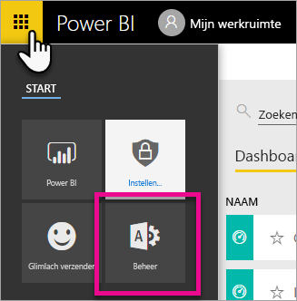
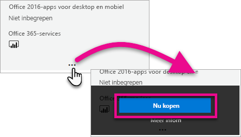
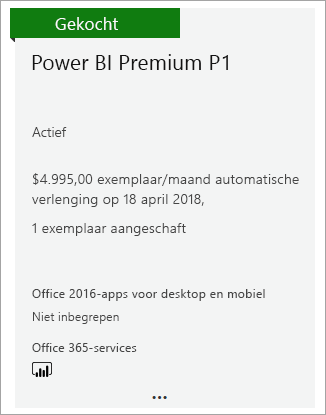
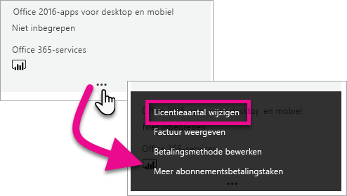

# Power BI Premium aanschaffen

In dit artikel wordt beschreven hoe u Power BI Premium-capaciteit voor uw hele organisatie koopt. Dit artikel bevat informatie over het volgende scenario:

- P SKU's gebruiken voor typische productiescenario's. Voor P SKU's zijn een maandelijks of jaarlijks bedrag vereist. Ze worden maandelijks gefactureerd.

Zie [Wat is Power BI Premium?](service-premium-what-is.md) voor meer informatie over Power BI Premium. Zie de [pagina met prijzen voor Power bi](https://powerbi.microsoft.com/pricing/)voor actuele prijzen en plannings informatie. Ook als uw organisatie gebruikmaakt van Power BI Premium hebben makers van inhoud een [Power BI Pro-licentie](service-admin-purchasing-power-bi-pro.md) nodig. Zorg ervoor dat u ten minste één Power BI Pro-licentie voor uw organisatie koopt. Met A SKU's hebben _alle gebruikers_ die inhoud gebruiken ook Pro-licenties nodig.

> [!NOTE]
> Als een Premium-abonnement verloopt, houdt u dertig dagen volledige toegang tot uw capaciteit. Daarna keert uw inhoud terug naar een gedeelde capaciteit. Modellen groter dan 1 GB worden niet ondersteund in gedeelde capaciteit.

> [!NOTE]
> Power BI Premium heeft onlangs een nieuwe versie van Premium uitgebracht, genaamd **Premium Gen2**, die momenteel beschikbaar is als preview. Premium Gen2 vereenvoudigt het beheer van Premium-capaciteiten en vermindert de overhead voor beheer. Zie [Power BI Premium Generation 2 (preview-versie)](service-premium-what-is.md#power-bi-premium-generation-2-preview) voor meer informatie.

## P SKU's kopen voor typische productiescenario's

U kunt een nieuwe tenant maken met een Power BI Premium P1 SKU die is geconfigureerd, of u kunt een Power BI Premium-capaciteit kopen voor een bestaande organisatie. In beide gevallen kunt u capaciteit toevoegen als u dat nodig hebt.

### Een nieuwe tenant maken met Power BI Premium P1

Als u geen bestaande tenant hebt en een tenant wilt maken, kunt u op hetzelfde moment Power BI Premium aanschaffen. Met de volgende koppeling gaat u stapsgewijs door het proces voor het maken van een nieuwe tenant en kunt u Power BI Premium aanschaffen: [Power BI Premium P1-aanbieding](https://signup.microsoft.com/Signup?OfferId=b3ec5615-cc11-48de-967d-8d79f7cb0af1). Wanneer u een tenant maakt, wordt aan u automatisch de rol Globale Microsoft 365-beheerder voor die tenant toegewezen.

Nadat u capaciteit hebt aangeschaft, leert u hoe u [capaciteit kunt beheren](service-admin-premium-manage.md#manage-capacity) en [werkruimten kunt toewijzen](service-admin-premium-manage.md#assign-a-workspace-to-a-capacity) aan een capaciteit.

### Een Power BI Premium-capaciteit voor een bestaande organisatie kopen

Als u over een bestaande organisatie (tenant) beschikt, moet u de rol Globale Microsoft 365-beheerder of Factureringsbeheerder hebben om abonnementen en licenties te kunnen aanschaffen. Zie [Microsoft 365-beheerdersrollen](https://support.office.com/article/About-Office-365-admin-roles-da585eea-f576-4f55-a1e0-87090b6aaa9d) voor meer informatie.

Volg deze stappen om een Premium-capaciteit aan te schaffen.

1. Selecteer in de Power BI-service de optie Kiezer voor Microsoft 365-apps en vervolgens **Beheerder**.

    

    U kunt ook naar het Microsoft 365-beheercentrum bladeren.

1. Selecteer **Facturering** > **Services aanschaffen**.

1. Zoek onder **Andere abonnementen** naar Power BI Premium-aanbiedingen. Hiermee worden P1 tot en met P3, EM3 en P1 (maandelijks) weergegeven.

1. Beweeg de muisaanwijzer over het beletselteken **(. . .)** en selecteer vervolgens **Nu kopen**.

    

1. Volg de stappen om de aankoop te voltooien.

Nadat u de aankoop hebt voltooid, wordt op de pagina **Services aanschaffen** weergegeven dat het item is gekocht en actief is.

Nadat u capaciteit hebt aangeschaft, leert u hoe u [capaciteit kunt beheren](service-admin-premium-manage.md#manage-capacity) en [werkruimten kunt toewijzen](service-admin-premium-manage.md#assign-a-workspace-to-a-capacity) aan een capaciteit.

### Meer capaciteiten kopen

Nu u over een capaciteit beschikt, kunt u er naar behoefte meer aan toevoegen. U kunt elke gewenste combinatie van SKU's voor Premium-capaciteit (P1 tot en met P3) binnen uw organisatie gebruiken. De verschillende SKU’s bieden verschillende resourcemogelijkheden.

1. Selecteer in het Microsoft 365-beheercentrum **Facturering** > **Services aanschaffen**.

1. Zoek het Power BI Premium-item waarvan u meer wilt kopen, onder **Andere abonnementen**.

1. Beweeg de muisaanwijzer over **Meer opties** (...) en selecteer vervolgens **Aantal licenties wijzigen**.

    

1. Geef op hoeveel exemplaren u voor dit item wilt hebben. Selecteer vervolgens **Verzenden** wanneer u klaar bent.

   > [!IMPORTANT]
   > Bij het selecteren van **Verzenden** worden de kosten in rekening gebracht via de geregistreerde creditcard.

Op de pagina **Services aanschaffen** wordt aangegeven hoeveel exemplaren u hebt. In de Power BI-beheerportal wordt onder **Capaciteitsinstellingen** bij de beschikbare v-cores de nieuw gekochte capaciteit weergegeven.

### Uw abonnement annuleren

U kunt uw abonnement vanuit het Microsoft 365-beheercentrum annuleren. Als u uw Premium-abonnement wilt annuleren, gaat u als volgt te werk.

1. Blader naar het Microsoft 365-beheercentrum.

1. Selecteer **Facturering** > **Abonnementen**.

1. Selecteer uw Power BI Premium-abonnement in de lijst.

1. Selecteer **Meer acties** > **Abonnement annuleren**.

1. Op de pagina **Abonnement annuleren** wordt aangegeven of u wel of niet verantwoordelijk bent voor [de kosten voor vroegtijdige beëindiging](https://support.office.com/article/early-termination-fees-6487d4de-401a-466f-8bc3-c0beb5cc40d3). Op deze pagina kunt u ook lezen wanneer de gegevens voor het abonnement worden verwijderd.

1. Lees de informatie en selecteer **Abonnement annuleren** als u wilt doorgaan.

#### Wanneer u annuleert of uw licentie verloopt

Wanneer u uw Premium-abonnement annuleert, of als u capaciteitslicentie verloopt, hebt u voor een periode van 30 dagen vanaf de annulering- of verloopdatum toegang tot uw Premium-capaciteiten. Na 30 hebt u geen toegang meer tot uw Premium-capaciteiten of de werkruimten daarin.

## A SKU's aanschaffen voor testen en andere scenario's

U kunt ook A SKU's aanschaffen voor testen en andere scenario's, wat voorziet in premium-capaciteit op uurbasis. Zie [Power BI Premium kopen voor testen](service-admin-premium-testing.md) voor meer informatie en stappen.

## Volgende stappen

[Capaciteiten configureren en beheren in Power BI Premium](service-admin-premium-manage.md)\
[Pagina met Power BI-prijzen](https://powerbi.microsoft.com/pricing/)\
[Veelgestelde vragen over Power BI Premium](service-premium-faq.md)\
[Een technisch document over een Power BI-implementatie voor de onderneming plannen](https://aka.ms/pbienterprisedeploy)

Hebt u nog vragen? [Misschien dat de Power BI-community het antwoord weet](https://community.powerbi.com/)

Power BI heeft Power BI Premium Gen2 geïntroduceerd als preview-aanbieding, waardoor de Power BI Premium-ervaring als volgt wordt aangepast met verbeteringen:
* Prestaties
* Licenties per gebruiker
* Grotere schaal
* Verbeterde metrische gegevens
* Automatisch schalen
* Minder beheeroverhead

Zie [Power BI Premium Generation 2 (preview-versie)](service-premium-what-is.md#power-bi-premium-generation-2-preview) voor meer informatie over Power BI Premium Gen2.