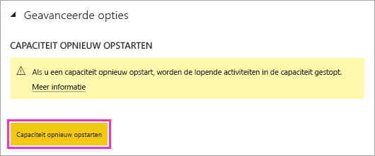
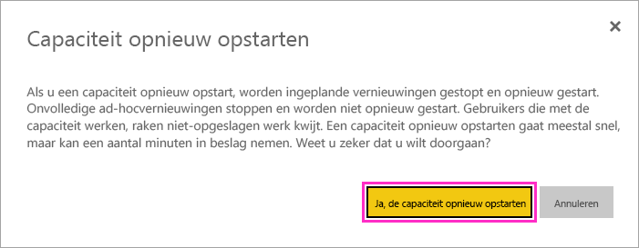

# Een Power BI Premium-capaciteit opnieuw opstarten

Als Power BI-beheerder moet u mogelijk een Premium-capaciteit opnieuw opstarten. In dit artikel wordt uitgelegd hoe u een capaciteit opnieuw opstart en wordt een aantal vragen over opnieuw opstarten en prestaties beantwoord.

## Waarom biedt Power BI deze optie?

Power BI biedt gebruikers de mogelijkheid om ingewikkelde analyses uit te voeren met enorme gegevenshoeveelheden. Helaas kunnen gebruikers prestatieproblemen veroorzaken door de Power BI-service met taken te overbelasten, te complexe query's te schrijven, cirkelverwijzingen te maken, enzovoort.

Power BI gedeelde capaciteit biedt enigszins bescherming tegen dergelijke situaties door limieten in te stellen voor de bestandsgrootte, vernieuwingsschema’s en andere aspecten van de service. In een Power BI Premium-capaciteit gelden de meeste van deze limieten echter niet meer. Als gevolg daarvan kan één rapport met een ongeldige DAX-expressie of een uiterst complex model significante prestatieproblemen veroorzaken. Wanneer een rapport wordt verwerkt, kunnen alle beschikbare resources van de capaciteit worden verbruikt. 

In Power BI worden voortdurend verbeteringen aangebracht door om gebruikers van Premium-capaciteit tegen dit soort situaties te beschermen. Ook geven we beheerders de middelen in handen om te analyseren wanneer en waarom capaciteiten worden overbelast. Bekijk onze [korte trainingssessie](https://www.youtube.com/watch?v=UgsjMbhi_Bk&feature=youtu.be) en [langere trainingssessie](https://powerbi.tips/2018/07/) voor meer informatie. Tegelijkertijd hebt u de mogelijkheid nodig om grote problemen te beperken wanneer deze zich voordoen. De snelste manier om deze problemen te beperken is het opnieuw opstarten van de capaciteit.

## Is het proces voor opnieuw opstarten veilig? Gaan er gegevens verloren?

Alle opgeslagen gegevens, definities, rapporten en dashboards in uw capaciteit blijven tijdens het opnieuw opstarten volledig intact. Wanneer u een capaciteit opnieuw opstart, worden in de meeste gevallen doorlopende geplande en ad-hoc vernieuwingen tijdelijk gestopt door de vernieuwingsengine en vervolgens opnieuw opgestart dankzij de ingebouwde herstartlogica van Power BI. De service probeert alle beïnvloede vernieuwingen opnieuw uit te voeren zodra de capaciteit weer beschikbaar is. De status van vernieuwingen kan in de gebruikersinterface tijdens het opnieuw opstarten niet worden gewijzigd. 

Gebruikers die met de capaciteit werken, raken niet-opgeslagen werk kwijt tijdens een herstartproces. Gebruikers moeten hun browsers vernieuwen zodra het opnieuw opstarten is voltooid.

## Hoe kan ik een capaciteit opnieuw opstarten?

Volg deze stappen om een capaciteit opnieuw op te starten.

1. Navigeer in de Power BI-beheerportal, op het tabblad **Capaciteitsinstellingen**, naar uw capaciteit. 

1. Voeg de **functievlag** *CapacityRestart* toe aan de URL van uw capaciteit: `https://app.powerbi.com/admin-portal/capacities/<YourCapacityId>?capacityRestartButton=true`.

1. Onder **Geavanceerde instellingen** > **CAPACITEIT OPNIEUW OPSTARTEN**, selecteert u de optie **Capaciteit opnieuw opstarten**.

    

1. In het dialoogvenster **Capaciteit opnieuw opstarten** selecteert u de optie **Ja, capaciteit opnieuw opstarten**.

    

## Hoe kan ik voorkomen dat zich in de toekomst problemen voordoen?

De beste manier om problemen te voorkomen, is gebruikers te instrueren over het efficiënt modelleren van gegevens. Zie onze [trainingssessie](https://powerbi.tips/2018/07/) voor meer informatie.

Het is tevens aan te raden regelmatig [uw capaciteiten te controleren](service-admin-premium-monitor-capacity.md), om trends te vinden die mogelijk duiden op onderliggende problemen. We zijn van plan regelmatige updates van de bewakings-app en andere hulpprogramma’s te publiceren, zodat u uw capaciteiten effectiever kunt bewaken en beheren.

## Volgende stappen

[Wat is Power BI Premium?](service-premium-what-is.md)

Nog vragen? [Misschien dat de community van Power BI het antwoord weet](https://community.powerbi.com/).
