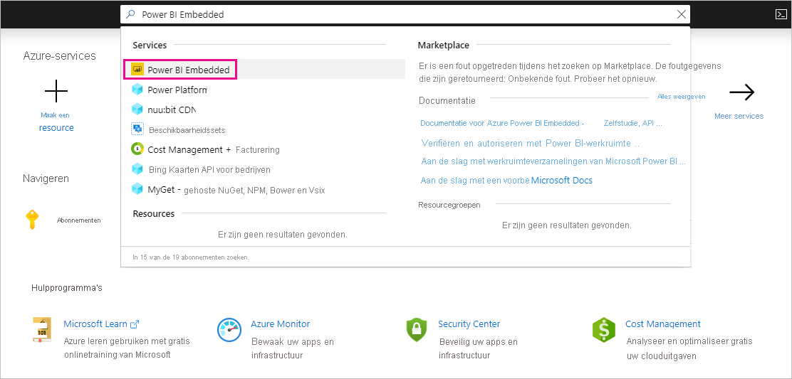
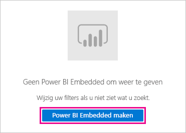
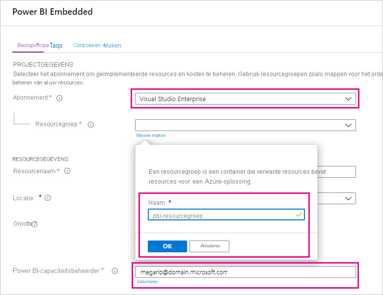
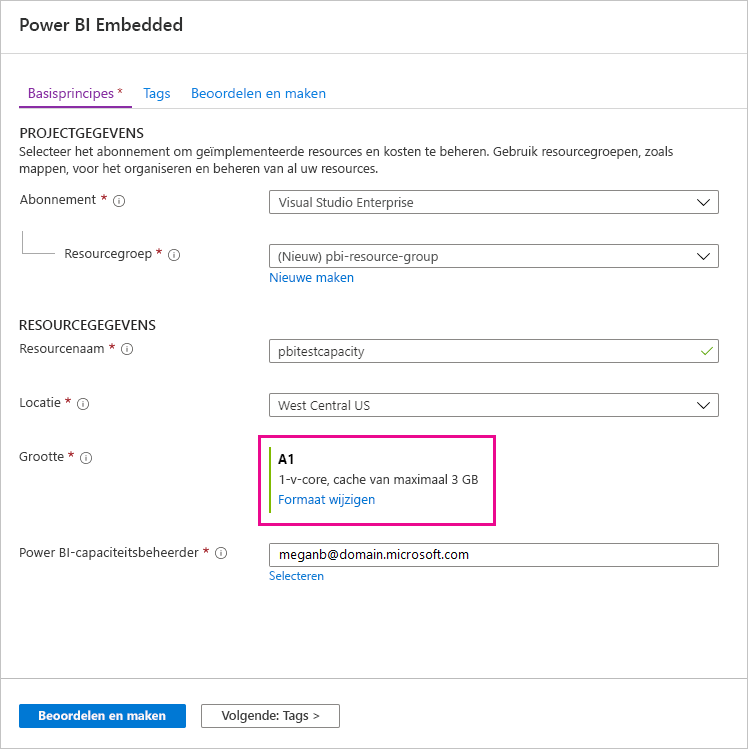
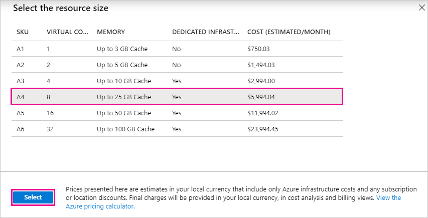
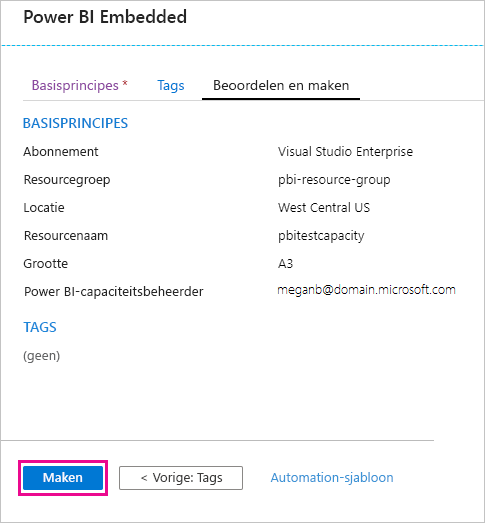
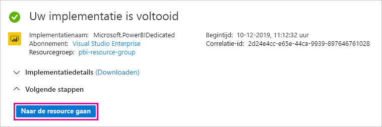
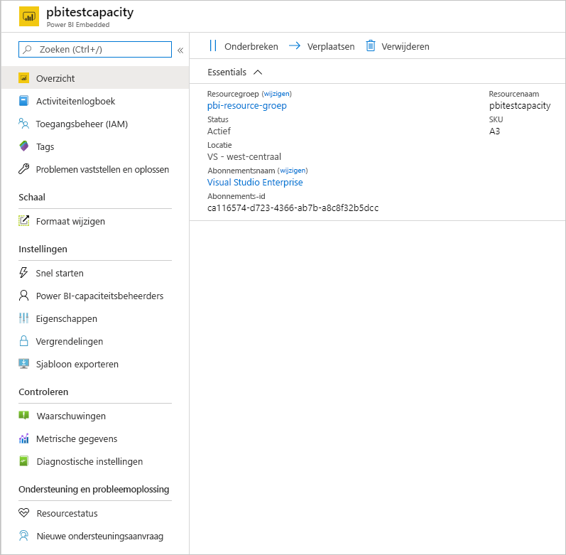

# Power BI Premium kopen om te testen

In dit artikel wordt beschreven hoe Power BI Premium A SKU's kunnen worden aangeschaft voor het testen van scenario's en voor gevallen waarin u niet over de benodigde machtigingen beschikt om P SKU's aan te schaffen (de rollen Globale Microsoft 365-beheerder of Factureringsbeheerder). Voor A SKU's zijn geen tijdtoezegging vereist. Ze worden per uur gefactureerd. U koopt A SKU's in [Azure Portal](https://portal.azure.com).

Zie [Wat is Power BI Premium?](service-premium-what-is.md) voor meer informatie over Power BI Premium. Zie de [pagina met Power BI-prijzen](https://powerbi.microsoft.com/pricing/) en de [Power BI Premium-rekenmachine](https://powerbi.microsoft.com/calculator/) voor informatie over de huidige prijzen en de planning. Ook als uw organisatie gebruikmaakt van Power BI Premium hebben makers van inhoud een [Power BI Pro-licentie](service-admin-purchasing-power-bi-pro.md) nodig. Zorg ervoor dat u ten minste één Power BI Pro-licentie voor uw organisatie koopt. Met A SKU's hebben _alle gebruikers_ die inhoud gebruiken ook Pro-licenties nodig.

> [!NOTE]
> Als een Premium-abonnement verloopt, houdt u dertig dagen volledige toegang tot uw capaciteit. Daarna keert uw inhoud terug naar een gedeelde capaciteit. Modellen groter dan 1 GB worden niet ondersteund in gedeelde capaciteit.

## A SKU's aanschaffen voor testen en andere scenario's

A SKU's worden beschikbaar gesteld via de Azure Power BI Embedded-service. U kunt A SKU's op de volgende manieren gebruiken:

- Het insluiten van Power BI in toepassingen van derden inschakelen. Zie [Power BI Embedded](../developer/embedded/azure-pbie-what-is-power-bi-embedded.md)voor meer informatie.

- Test de Premium-functionaliteit voordat u een P-SKU koopt.

- Ontwikkel- en testomgevingen maken naast een productieomgeving die P SKU's gebruikt.

- Koop Power BI Premium ook al bent u geen globale Microsoft 365-beheerder of factureringsbeheerder.

> [!NOTE]
> Als u een SKU van A4 of hoger aanschaft, kunt u profiteren van alle Premium-functies, met uitzondering van onbeperkt delen van inhoud. Met A SKU's hebben _alle gebruikers_ die inhoud gebruiken Pro-licenties nodig.

Volg deze stappen om A SKU's aan te schaffen in Azure Portal:

1. Meld u aan bij [Azure Portal](https://portal.azure.com) met een account met ten minste beheerdersmachtigingen in Power BI.

1. Zoek naar _Power BI Embedded_ en selecteer de service in de zoekresultaten.

    

1. Selecteer **Power BI Embedded maken**.

    

1. Geef in het scherm **Power BI Embedded maken** de volgende gegevens op:

    - Het **Abonnement** waarin de Power BI Embedded-service wordt gemaakt.

    - De fysieke **Locatie** waarin de resourcegroep met de service wordt gemaakt. Voor betere prestaties moet deze locatie dicht bij de locatie zijn van uw Azure Active Directory-tenant voor Power BI.

    - De bestaande **Resourcegroep** om te gebruiken, of maak een nieuwe zoals wordt weergegeven in het voorbeeld.

    - De **Power BI-capaciteitsbeheerder**. De capaciteitsbeheerder moet een lidgebruiker zijn of een service-principal in uw Azure AD-Tenant.

    

1. Als u alle functies van Power BI Premium wilt gebruiken (met uitzondering van onbeperkt delen), hebt u ten minste een A4 SKU nodig. Selecteer **Formaat wijzigen**.

    

1. Selecteer een capaciteitsgrootte van A4, A5 of A6, die overeenkomt met P1, P2 en P3.

    

1. Selecteer **Beoordelen en maken**, controleer de opties die u hebt gekozen en selecteer vervolgens **Maken**.

    

1. Het kan enkele minuten duren voordat de implementatie is voltooid. Als het klaar is, selecteert u **Ga naar resource**.

    

1. Bekijk op het beheerscherm de opties die u hebt voor het beheren van de service, inclusief het onderbreken van de service wanneer u deze niet gebruikt.

    

Nadat u capaciteit hebt aangeschaft, leert u hoe u [capaciteit kunt beheren](service-admin-premium-manage.md#manage-capacity) en [werkruimten kunt toewijzen](service-admin-premium-manage.md#assign-a-workspace-to-a-capacity) aan een capaciteit.

## Volgende stappen

[Wat is Power BI Premium?](service-premium-what-is.md)
[Power BI Premium aanschaffen](service-admin-premium-purchase.md)
[Capaciteiten in Power BI Premium configureren en beheren](service-admin-premium-manage.md)\
[Pagina met Power BI-prijzen](https://powerbi.microsoft.com/pricing/)\
[Power BI Premium-rekenmachine](https://powerbi.microsoft.com/calculator/)\
[Veelgestelde vragen over Power BI Premium](service-premium-faq.md)\
[Een technisch document over een Power BI-implementatie voor de onderneming plannen](https://aka.ms/pbienterprisedeploy)

Hebt u nog vragen? [Misschien dat de Power BI-community het antwoord weet](https://community.powerbi.com/)
