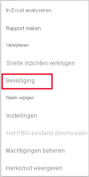

# Beveiliging op rijniveau (RLS) met Power BI

Beveiliging op rijniveau (RLS) kan in Power BI worden gebruikt om de toegang tot gegevens voor bepaalde gebruikers te beperken. Filters beperken de toegang tot gegevens op rijniveau en u kunt filters definiëren in rollen. In de Power BI-service hebben leden van een werkruimte toegang tot gegevenssets in de werkruimte. Toegang tot deze gegevens wordt niet door Beveiliging op rijniveau beperkt.

U kunt RLS configureren voor gegevensmodellen met Power BI Desktop zijn geïmporteerd in Power BI. U kunt RLS ook configureren voor gegevenssets die gebruikmaken van DirectQuery, zoals SQL Server. Voor liveverbindingen van Analysis Services of Azure Analysis Services configureert u beveiliging op rijniveau in het model, niet in Power BI Desktop. De beveiligingsoptie wordt niet weergegeven voor gegevenssets met een liveverbinding.

[!INCLUDE [include-short-name](../includes/rls-desktop-define-roles.md)]

Het beveiligingsfilter op rijniveau gebruikt standaard filters in één richting, ongeacht of de relaties zijn ingesteld op één richting of twee richtingen. U kunt handmatig kruislings filtering met beveiliging op rijniveau in twee richtingen inschakelen door de relatie te selecteren en het selectievakje **Beveiligingsfilter toepassen in beide richtingen** in te schakelen. Selecteer deze optie als u ook dynamische beveiliging op rijniveau op serverniveau hebt geïmplementeerd, waarbij beveiliging op rijniveau op de gebruikersnaam of aanmeldings-id is gebaseerd.

Zie voor meer informatie [Kruisfiltering in twee richtingen met DirectQuery in Power BI Desktop](../transform-model/desktop-bidirectional-filtering.md) en het technische artikel [Het semantische BI-model in tabelvorm beveiligen](https://download.microsoft.com/download/D/2/0/D20E1C5F-72EA-4505-9F26-FEF9550EFD44/Securing%20the%20Tabular%20BI%20Semantic%20Model.docx).

[!INCLUDE [include-short-name](../includes/rls-desktop-view-as-roles.md)]

## De beveiliging voor uw model beheren

Als u de beveiliging wilt beheren voor uw gegevensmodel, voert u de volgende stappen uit:

1. Selecteer in de Power BI-service het menu **Meer opties** voor een gegevensset. Dit menu wordt weer gegeven wanneer u de muisaanwijzer op de naam van een gegevensset plaatst, ongeacht of u deze selecteert in het navigatiemenu of de werkruimtepagina.

    

    

1. Selecteer **Beveiliging**.

   

Met Beveiliging wordt de RLS-pagina geopend. Hier kunt u leden toewijzen aan een rol die u in Power BI Desktop hebt gemaakt. Beveiliging is alleen zichtbaar voor de eigenaren van de gegevensset. Als de gegevensset zich in een groep bevindt, zien alleen beheerders van de groep de beveiligingsoptie.

U kunt alleen rollen maken of wijzigen in Power BI Desktop.

## Werken met leden

### Leden toevoegen

Voeg een lid aan de rol toe door het e-mailadres of de naam van de gebruiker of de beveiligingsgroep te typen. U kunt geen groepen toevoegen die in Power BI zijn gemaakt. U kunt leden [buiten uw organisatie](../guidance/whitepaper-azure-b2b-power-bi.md#data-security-for-external-partners) toevoegen.

Aan het getal tussen haakjes naast de rolnaam of naast Leden kunt u zien hoeveel leden deel uitmaken van de rol.

### Leden verwijderen

U kunt leden verwijderen door de X naast hun naam te selecteren. 

## De rol in de Power BI-service valideren

U kunt controleren of de rol die u hebt gedefinieerd, correct werkt door de functie testen.

1. Selecteer **Meer opties** (...) naast de rol.
2. Selecteer **Gegevens testen als rol**.

U krijgt rapporten te zien die voor deze rol beschikbaar zijn. Dashboards worden in deze weergave niet weergegeven. In de paginakoptekst wordt de toegepaste rol weergegeven.

U kunt andere rollen of een combinatie van rollen testen door **Nu weergeven als** te selecteren.

U kunt ervoor kiezen om de gegevens weer te geven als een specifiek persoon, maar u kunt ook een combinatie van beschikbare rollen selecteren om te valideren of ze werken.

Als u de normale weergave wilt herstellen, selecteert u **Terug naar beveiliging op rijniveau**.

[!INCLUDE [include-short-name](../includes/rls-usernames.md)]

## RLS met werkruimten gebruiken in Power BI

Als u een Power BI Desktop-rapport naar een werkruimte in de Power BI-service publiceert, worden de rollen toegepast op leden met alleen-lezentoegang. U dient aan te geven dat leden de Power BI-inhoud alleen kunnen weergeven in de instellingen van de werkruimte.

> [!WARNING]
> Als u de werkruimte zodanig hebt geconfigureerd dat leden bewerkingsmachtigingen hebben, worden de RLS-rollen niet toegepast op deze leden. Gebruikers kunnen alle gegevens zien.

[!INCLUDE [include-short-name](../includes/rls-limitations.md)]

[!INCLUDE [include-short-name](../includes/rls-faq.md)]

## Volgende stappen

- [Gegevenstoegang met beveiliging op rijniveau (RLS) beperken voor Power BI Desktop](../create-reports/desktop-rls.md)
- [Richtlijnen voor beveiliging op rijniveau (RLS) in Power BI Desktop](../guidance/rls-guidance.md)
- Vragen? [Misschien dat de Power BI-community het antwoord weet](https://community.powerbi.com/)
- Suggesties? [Ideeën bijdragen om Power BI te verbeteren](https://ideas.powerbi.com/)
