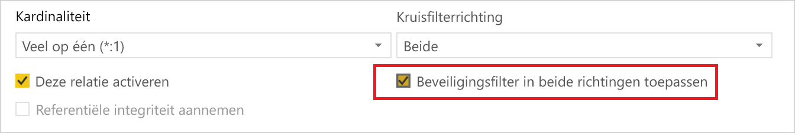
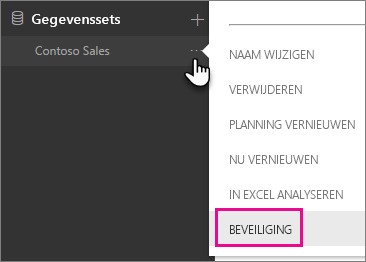
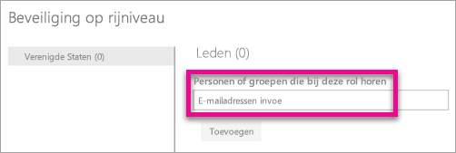
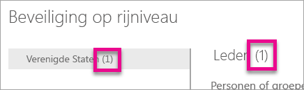
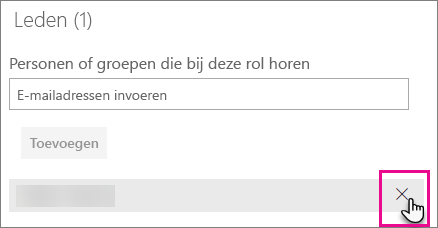
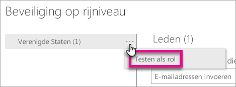
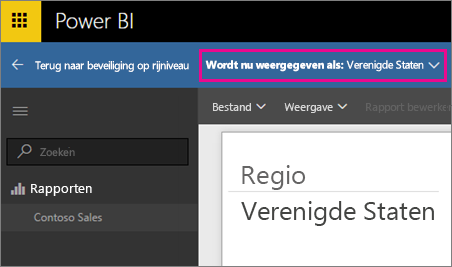
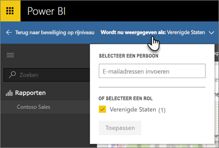
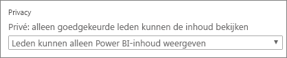

# Beveiliging op rijniveau (RLS) met Power BI

Beveiliging op rijniveau (RLS) kan in Power BI worden gebruikt om de toegang tot gegevens voor bepaalde gebruikers te beperken. Filters beperken de toegang tot gegevens op rijniveau en u kunt filters definiëren in rollen. Let erop dat in de Power BI-service leden van een werkruimte toegang hebben tot gegevenssets in de werkruimte. Toegang tot deze gegevens wordt niet door Beveiliging op rijniveau beperkt.

U kunt RLS configureren voor gegevensmodellen met Power BI Desktop zijn geïmporteerd in Power BI. U kunt RLS ook configureren voor gegevenssets die gebruikmaken van DirectQuery, zoals SQL Server. Voorheen kon u RLS alleen implementeren binnen on-premises Analysis Services-modellen buiten Power BI. Voor Analysis Services- of Azure Analysis Services-liveverbindingen configureert u beveiliging op rijniveau in het model, niet in Power BI Desktop. De beveiligingsoptie wordt niet weergegeven voor gegevenssets met een liveverbinding.

[!INCLUDE [include-short-name](../includes/rls-desktop-define-roles.md)]

Het beveiligingsfilter op rijniveau gebruikt standaard filters in één richting, ongeacht of de relaties zijn ingesteld op één richting of twee richtingen. U kunt handmatig kruisfiltering met beveiliging op rijniveau in twee richtingen inschakelen door de relatie te selecteren en het selectievakje **Beveiligingsfilter toepassen in beide richtingen** te markeren. U moet dit selectievakje inschakelen wanneer u ook dynamische beveiliging op rijniveau op serverniveau hebt geïmplementeerd, waarbij beveiliging op rijniveau is gebaseerd op de gebruikersnaam of aanmeldings-id.

Zie voor meer informatie [Kruisfiltering in twee richtingen met DirectQuery in Power BI Desktop](../transform-model/desktop-bidirectional-filtering.md) en het technische artikel [Het semantische BI-model in tabelvorm beveiligen](https://download.microsoft.com/download/D/2/0/D20E1C5F-72EA-4505-9F26-FEF9550EFD44/Securing%20the%20Tabular%20BI%20Semantic%20Model.docx).

[!INCLUDE [include-short-name](../includes/rls-desktop-view-as-roles.md)]

## De beveiliging voor uw model beheren

Als u de beveiliging wilt beheren voor uw gegevensmodel, gaat u als volgt te werk:

1. Selecteer het **weglatingsteken (...)**  voor een dataset.
2. Selecteer **Beveiliging**.
   
   

Zodoende opent u de RLS-pagina, waar u leden kunt toewijzen aan een rol die u hebt gemaakt in Power BI Desktop. De beveiliging is alleen zichtbaar en beschikbaar voor de eigenaren. Als de gegevensset zich in een groep bevindt, zien alleen beheerders van de groep de beveiligingsoptie. 

U kunt alleen rollen maken of wijzigen in Power BI Desktop.

## Werken met leden

### Leden toevoegen

U kunt een lid aan de rol toevoegen door het e-mailadres of de naam van de gebruiker, beveiligingsgroep of distributielijst op te geven die u wilt toevoegen. U kunt geen groepen toevoegen die in Power BI zijn gemaakt. U kunt leden [buiten uw organisatie](../guidance/whitepaper-azure-b2b-power-bi.md#data-security-for-external-partners) toevoegen.

Aan het getal tussen haakjes naast de rolnaam of naast Leden kunt u zien hoeveel leden deel uitmaken van de rol op.

### Leden verwijderen

U kunt leden verwijderen door de X naast hun naam te selecteren. 

## De rol in de Power BI-service valideren

U kunt controleren of de rol die u hebt gedefinieerd, correct werkt door de functie testen. 

1. Selecteer **Meer opties** (...) naast de rol.
2. Selecteer **Gegevens testen als rol**.

Vervolgens ziet u de rapporten die beschikbaar zijn voor deze rol. Er worden geen dashboards gepresenteerd in deze weergave. In de bovenstaande blauwe balk ziet u wat wordt toegepast.

U kunt andere rollen of een combinatie van rollen testen door te selecteren **Nu weergeven als**.

U kunt ervoor kiezen om de gegevens weer te geven als een specifiek persoon, maar u kunt ook een combinatie van beschikbare rollen selecteren om te valideren of ze werken. 

Als u de normale weergave wilt herstellen, selecteert u **Terug naar beveiliging op rijniveau**.

[!INCLUDE [include-short-name](../includes/rls-usernames.md)]

## RLS met werkruimten gebruiken in Power BI

Als u een Power BI Desktop-rapport naar een werkruimte in de Power BI-service publiceert, worden de rollen toegepast op leden met Alleen lezen-toegang. U moet aangeven dat leden de Power BI-inhoud alleen kunnen weergeven binnen de instellingen van de werkruimte.

> [!WARNING]
> Als u de werkruimte zodanig hebt geconfigureerd dat leden bewerkingsmachtigingen hebben, worden de RLS-rollen niet toegepast op deze leden. Gebruikers kunnen alle de gegevens bekijken.

[!INCLUDE [include-short-name](../includes/rls-limitations.md)]

[!INCLUDE [include-short-name](../includes/rls-faq.md)]

## Volgende stappen

Bekijk de volgende resources voor meer informatie over dit artikel:

- [Gegevenstoegang met beveiliging op rijniveau (RLS) beperken voor Power BI Desktop](../create-reports/desktop-rls.md)
- [Richtlijnen voor beveiliging op rijniveau (RLS) in Power BI Desktop](../guidance/rls-guidance.md)
- Vragen? [Misschien dat de Power BI-community het antwoord weet](https://community.powerbi.com/)
- Suggesties? [Ideeën bijdragen om Power BI te verbeteren](https://ideas.powerbi.com/)
