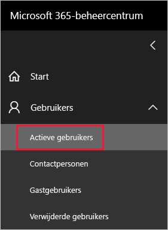
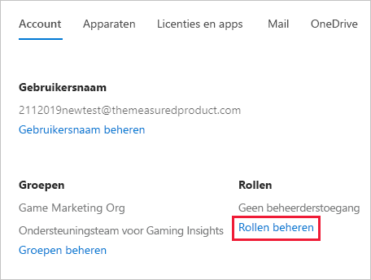
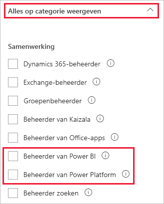

# <a name="understanding-power-bi-service-administrator-roles"></a>Informatie over de rol Power BI-servicebeheerder

Als u een Power BI-tenant wilt beheren, moet u een van de volgende rollen hebben: Power BI-beheerder, Power Platform-beheerder of globale Microsoft 365-beheerder. Microsoft 365-beheerders van gebruikerstoegang wijzen de rol van Power BI- of Power Platform-beheerder toe in het Microsoft 365-beheercentrum of met behulp van een PowerShell-script. Raadpleeg [Rollen toewijzen aan gebruikersaccounts met PowerShell](/office365/enterprise/powershell/assign-roles-to-user-accounts-with-office-365-powershell) voor meer informatie.

Gebruikers in de Power BI-beheerdersrol en Power Platform-beheerdersrol hebben volledige controle over een Power BI-tenant en de beheerfuncties, met uitzondering van licentieverlening. Wanneer een gebruiker is toegewezen, heeft deze persoon toegang tot de [Power BI-beheerportal](service-admin-portal.md). In de portal heeft de gebruiker toegang tot tenantbrede gebruiksgegevens en kan het tenantbrede gebruik van Power BI-functies worden beheerd. Deze beheerdersrollen zijn ideaal voor gebruikers die toegang tot de Power BI-beheerportal moeten hebben, maar die geen andere beheerderstoegang voor Microsoft 365 nodig hebben.

> [!NOTE]
> In Power BI-documentatie verwijst 'Power BI-beheerder' naar gebruikers met de Power BI-beheerdersrol of de Power Platform-beheerdersrol. In de documentatie staat duidelijk wanneer de globale Microsoft 365-beheerdersrol is vereist voor een taak.

## <a name="limitations-and-considerations"></a>Beperkingen en overwegingen

De beheerdersrollen voor de Power BI-service en Power Platform bieden niet de volgende mogelijkheden:

* Mogelijkheid om gebruikers en licenties in het Microsoft 365-beheercentrum te wijzigen.

* Toegang tot de auditlogboeken. Zie [Activiteiten van gebruikers bijhouden in Power BI](service-admin-auditing.md) voor meer informatie.

Voor deze mogelijkheden is de globale Microsoft 365-beheerdersrol vereist.

## <a name="assign-users-to-an-admin-role-in-the-microsoft-365-admin-center"></a>Gebruikers toewijzen aan een beheerdersrol in het Microsoft 365-beheercentrum

Volg deze stappen om in het Microsoft 365-beheercentrum aan gebruikers een beheerdersrol toe te wijzen.

1. Selecteer **Gebruikers** > **Actieve gebruikers** in het [Microsoft 365-beheercentrum](https://portal.office.com/adminportal/home#/homepage).

    

1. Selecteer de gebruiker aan wie u de rol wilt toewijzen.

1. Selecteer **Rollen beheren** onder **Rollen**.

    

1. Vouw **Alles weergeven op categorie** uit en selecteer vervolgens **Power BI-beheerder** of **Power Platform-beheerder**.

    

1. Selecteer **Save changes**.

## <a name="assign-users-to-the-admin-role-with-powershell"></a>Gebruikers de rol van beheerder geven met PowerShell

U kunt gebruikers ook toewijzen aan rollen met behulp van PowerShell. Gebruikers worden beheerd in Azure Active Directory (Azure AD). Als u de Azure AD PowerShell-module nog niet hebt, kunt u [de nieuwste versie download en installeren](https://www.powershellgallery.com/packages/AzureAD/).

1. Maak eerst verbinding met Azure AD:
   ```
   PS C:\Windows\system32> Connect-AzureAD
   ```

1. Vraag daarna de **ObjectId** op voor de rol **Power BI-servicebeheerder**. U kunt [Get-AzureADDirectoryRole](/powershell/module/azuread/get-azureaddirectoryrole) uitvoeren om de **ObjectId** op te halen

    ```
    PS C:\Windows\system32> Get-AzureADDirectoryRole

    ObjectId                             DisplayName                        Description
    --------                             -----------                        -----------
    00f79122-c45d-436d-8d4a-2c0c6ca246bf Power BI Service Administrator     Full access in the Power BI Service.
    250d1222-4bc0-4b4b-8466-5d5765d14af9 Helpdesk Administrator             Helpdesk Administrator has access to perform..
    3ddec257-efdc-423d-9d24-b7cf29e0c86b Directory Synchronization Accounts Directory Synchronization Accounts
    50daa576-896c-4bf3-a84e-1d9d1875c7a7 Company Administrator              Company Administrator role has full access t..
    6a452384-6eb9-4793-8782-f4e7313b4dfd Device Administrators              Device Administrators
    9900b7db-35d9-4e56-a8e3-c5026cac3a11 AdHoc License Administrator        Allows access manage AdHoc license.
    a3631cce-16ce-47a3-bbe1-79b9774a0570 Directory Readers                  Allows access to various read only tasks in ..
    f727e2f3-0829-41a7-8c5c-5af83c37f57b Email Verified User Creator        Allows creation of new email verified users.
    ```

    In dit geval is de **ObjectId** van de rol 00f79122-c45d-436d-8d4a-2c0c6ca246bf.

1. Vervolgens haalt u de **ObjectId** van de gebruiker op. U vindt deze door het uitvoeren van [Get-AzureADUser](/powershell/module/azuread/get-azureaduser).

    ```
    PS C:\Windows\system32> Get-AzureADUser -ObjectId 'tim@contoso.com'

    ObjectId                             DisplayName UserPrincipalName      UserType
    --------                             ----------- -----------------      --------
    6a2bfca2-98ba-413a-be61-6e4bbb8b8a4c Tim         tim@contoso.com        Member
    ```

1. U moet [Add-AzureADDirectoryRoleMember](/powershell/module/azuread/add-azureaddirectoryrolemember) uitvoeren om het lid aan de rol toe te voegen.

    | Parameter | Beschrijving |
    | --- | --- |
    | ObjectId |De ObjectId van de rol. |
    | RefObjectId |De ObjectId van het lid. |

    ```powershell
    Add-AzureADDirectoryRoleMember -ObjectId 00f79122-c45d-436d-8d4a-2c0c6ca246bf -RefObjectId 6a2bfca2-98ba-413a-be61-6e4bbb8b8a4c
    ```

## <a name="next-steps"></a>Volgende stappen

[Power BI in uw organisatie beheren](service-admin-administering-power-bi-in-your-organization.md)  
[Power BI-beheerportal](service-admin-portal.md)  

Hebt u nog vragen? [Misschien dat de Power BI-community het antwoord weet](https://community.powerbi.com/)