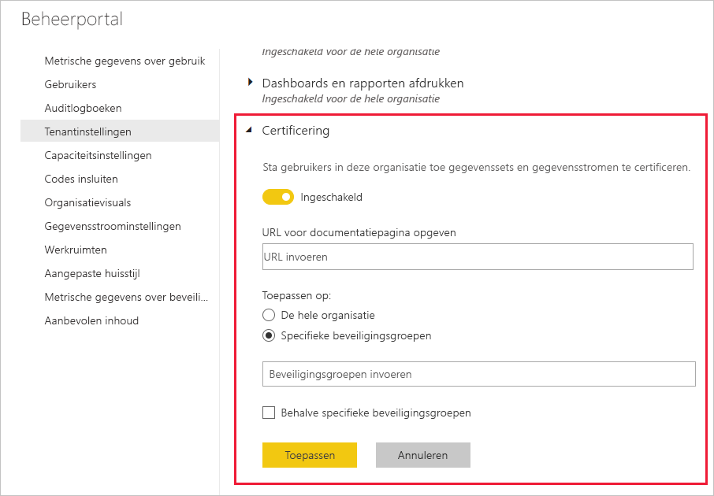

# Certificering van gegevenssets en gegevensstromen instellen (preview)

Uw organisatie kan gegevenssets en gegevensstromen certificeren die de gezaghebbende bronnen voor essentiële informatie zijn.

Als Power BI-tenantbeheerder bent u verantwoordelijk voor het instellen van het certificeringsproces voor uw organisatie. Dit betekent:
* Certificering inschakelen voor uw tenant.
* Een lijst met groepen en gebruikers definiëren die gemachtigd zijn om gegevenssets en gegevensstromen te certificeren.
* Voor gegevenssets de URL van het beleid voor gegevenscertificering van de organisatie verstrekken, indien aanwezig.

Certificering van gegevenssets en gegevensstromen maakt deel uit van *goedkeuring* van gegevenssets en gegevensstromen. Zie [goedkeuring van gegevenssets](../service-datasets-promote.md) en [goedkeuring van gegevensstromen](../transform-model/service-dataflows-promote-certify.md) voor meer informatie.

## Certificering instellen

1. Ga naar Tenantinstellingen in de beheerportal.
1. Vouw onder de sectie Instellingen voor exporteren en delen de sectie Certificering uit.

   

1. Stel de wisselknop in op **Ingeschakeld**.
1. Als uw organisatie gepubliceerd certificeringsbeleid heeft, kunt u voor certificering van gegevenssets hier de URL ervan opgeven. Dit wordt de koppeling **Meer informatie** in de sectie Certificering van het dialoogvenster [Goedkeuringsinstellingen voor gegevensstromen](../service-datasets-promote.md#request-dataset-certification) 
1. Geef de gebruikers of groepen op die gemachtigd zijn om gegevenssets en gegevensstromen te certificeren. Deze geautoriseerde certificeerders kunnen gebruikmaken van de knop Certificering in de sectie Certificering van het dialoogvenster met goedkeuringsinstellingen voor [gegevenssets](../service-datasets-promote.md#request-dataset-certification) of [gegevensstromen](../transform-model/service-dataflows-promote-certify.md#certify-a-dataflow).
1. Klik op **Toepassen**.

## Volgende stappen
* [Gegevenssets promoten](../service-datasets-promote.md)
* [Gegevenssets certificeren](../service-datasets-certify.md)
* [Het niveau van gegevensstromen verhogen](../transform-model/service-dataflows-promote-certify.md#promote-a-dataflow)
* [Gegevensstromen certificeren](../transform-model/service-dataflows-promote-certify.md#certify-a-dataflow)
* Vragen? [Misschien dat de community van Power BI het antwoord weet](https://community.powerbi.com/).
