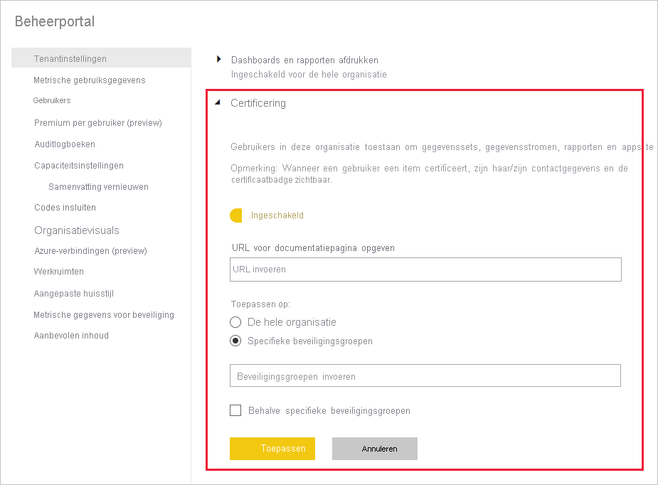

# Inhoudscertificering inschakelen

Uw organisatie kan geselecteerde inhoud certificeren om deze inhoud te identificeren als een gezaghebbende bron voor essentiële informatie. Momenteel kunnen de volgende inhoudstypen worden gecertificeerd:
* Gegevenssets
* Gegevensstromen (preview)
* Rapporten (preview)
* Apps (preview)

Als Power BI-beheerder bent u verantwoordelijk voor het inschakelen en instellen van het certificeringsproces voor uw organisatie. Dit betekent:
* Certificering inschakelen voor uw tenant.
* Een lijst met beveiligingsgroepen definiëren waarvan de leden worden gemachtigd om inhoud te certificeren.
* Een URL opgeven die verwijst naar de documentatie over het inhoudscertificeringsproces van de organisatie, als dergelijke documentatie bestaat.

Certificering maakt deel uit van de *goedkeuringsfunctie* van Power BI. Raadpleeg [Goedkeuring: Power BI-inhoud promoveren en certificeren](../collaborate-share/service-endorsement-overview.md) voor meer informatie.

## Certificering instellen

1. Ga naar Tenantinstellingen in de beheerportal.
1. Vouw onder de sectie Instellingen voor exporteren en delen de sectie Certificering uit.

   

1. Stel de wisselknop in op **Ingeschakeld**.
1. Als uw organisatie een gepubliceerd certificeringsbeleid heeft, kunt u hier de URL ervan opgeven. Dit wordt de koppeling **Meer informatie** in de sectie Certificering van het [dialoogvenster Goedkeuringsinstellingen](../collaborate-share/service-endorse-content.md#request-content-certification). Als u geen koppeling opgeeft, wordt aan gebruikers die certificering van hun inhoud willen aanvragen geadviseerd om contact op te nemen met hun Power BI-beheerder.
1. Geef een of meer beveiligingsgroepen op waarvan de leden worden gemachtigd om inhoud te certificeren. Deze geautoriseerde certificeerders kunnen gebruikmaken van de knop Certificering in de sectie Certificering van het [dialoogvenster Goedkeuringsinstellingen](../collaborate-share/service-endorse-content.md#certify-content). In dit veld kunt u alleen beveiligingsgroepen invoeren. U kunt geen benoemde gebruikers invoeren.
    
    Als een beveiligingsgroep subbeveiligingsgroepen bevat waaraan u geen certificeringsrechten wilt geven, kunt u het selectievakje **Behalve specifieke beveiligingsgroepen** inschakelen en de naam van die groep(en) opgeven in een tekstvak dat wordt weergegeven.
1. Klik op **Toepassen**.

## Volgende stappen
* [Inhoud promoveren of certificeren](../collaborate-share/service-endorse-content.md)
* [Meer informatie over goedkeuring in Power BI](../collaborate-share/service-endorsement-overview.md)
* Vragen? [Misschien dat de Power BI-community het antwoord weet](https://community.powerbi.com/)
