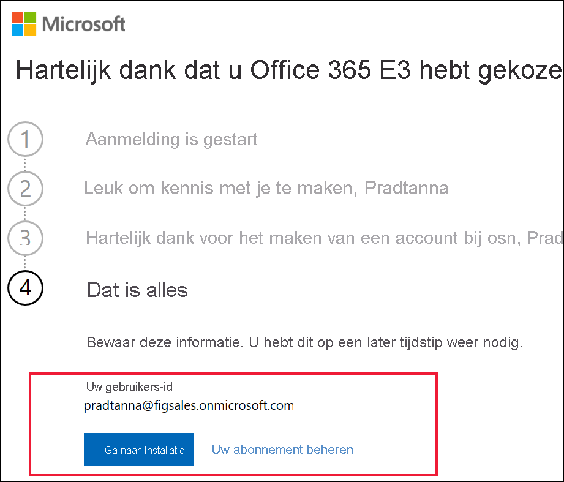

# Registreren voor Power BI met een nieuwe proefversie van Microsoft 365

In dit artikel wordt een alternatieve manier beschreven om u te registreren voor Power BI, als u nog geen e-mailaccount voor werk of school hebt.

Als het niet lukt om u met uw e-mailadres te registreren voor Power BI, controleert u eerst of het wel een [e-mailadres is dat kan worden gebruikt met Power BI](../fundamentals/service-self-service-signup-for-power-bi.md#supported-email-addresses). Als dat niet lukt, registreert u zich voor een Microsoft 365-proefversie en maakt u een werkaccount. Gebruik vervolgens dat nieuwe werkaccount om u te registreren voor de Power BI-service. U kunt Power BI ook na afloop van de proefversie van Microsoft 365 nog gebruiken.

> [!NOTE]
> De naam Office 365 is onlangs gewijzigd in Microsoft 365. Tot al onze artikelen zijn bijgewerkt, kunt u de aanduiding Office 365 nog steeds tegenkomen.

## Meld u aan voor een proefversie van Microsoft 365 van Office
Meld u aan voor een proefversie van Microsoft 365 [op de website van Microsoft 365](https://www.microsoft.com/microsoft-365/business/compare-more-office-365-for-business-plans). Als u nog geen account hebt, helpt Microsoft u met stapsgewijze instructies om er een te maken. Omdat commerciële e-mailaccounts (zoals Hotmail en Gmail) niet werken met Microsoft 365, maakt u een nieuw account dat wel werkt.  Dit e-mail account ziet er ongeveer als volgt uit: *zalan@onmicrosoft.com* .

Als u **Office 365 E5** selecteert, bevat uw proefversie ook Power BI Pro. De proefversie van Power BI Pro verloopt op hetzelfde moment als uw proefversie van Office 365 E5, die momenteel 30 dagen geldig is. Als u in plaats daarvan **Office 365 E3** selecteert, kunt u zich als *gratis* gebruiker aanmelden voor Power BI en upgraden naar **Pro** voor een proefversie van 60 dagen. 

1. Voer uw e-mailadres in. Microsoft laat u weten of dat e-mailadres werkt met Microsoft 365 of dat u een nieuw e-mailadres moet maken.  

    Als u een nieuw e-mailadres nodig hebt, helpt Microsoft u met stapsgewijze instructies om er een te maken. Eerst moet u een nieuw account maken. Selecteer **Account instellen**.

    

2. Voer details over het nieuwe account in.

    

3. Maak een nieuw e-mailadres en wachtwoord. Maak een nieuwe aanmeldingsnaam die eruitziet als you@yourcompany.onmicrosoft.com. Dit zijn de aanmeldingsgegevens die u gebruikt voor uw nieuwe Office 365-account en voor Power BI.

    

4. Dat is alles.  U hebt nu een e-mailadres dat u kunt gebruiken om u te registreren voor Power BI. Doorgaan om [u als zelfstandige gebruiker te registreren voor de Power BI-service](../service-self-service-signup-for-power-bi.md)

     

    Mogelijk moet u wachten terwijl de nieuwe tenant wordt gemaakt.

## Belangrijke overwegingen

Als er problemen zijn met het aanmelden met het nieuwe account, probeer het dan met een persoonlijke browsersessie.

Als u deze aanmeldingsmethode gebruikt, maakt u een nieuwe organisatietenant en wordt u de beheerder van de tenant. Zie [Wat is Power BI-beheer?](service-admin-administering-power-bi-in-your-organization.md) voor meer informatie. U kunt nieuwe gebruikers toevoegen aan uw tenant en vervolgens met hun delen, zoals wordt beschreven in de [documentatie voor Microsoft 365-beheerders](https://support.office.com/article/Add-users-individually-to-Office-365---Admin-Help-1970f7d6-03b5-442f-b385-5880b9c256ec).

## Volgende stappen

[Wat is Power BI-beheer?](service-admin-administering-power-bi-in-your-organization.md)  
[Power BI-licenties in uw organisatie](service-admin-licensing-organization.md)  
[Registreren voor Power BI als afzonderlijke gebruiker](../fundamentals/service-self-service-signup-for-power-bi.md)

Hebt u nog vragen? [Misschien dat de Power BI-community het antwoord weet](https://community.powerbi.com/)
