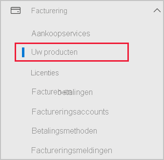

# Power BI toevoegen aan een Microsoft 365-partnerabonnement

Met Microsoft 365 kunnen bedrijven Microsoft 365 gebundeld en geïntegreerd met hun eigen oplossingen verkopen en klanten één aanspreekpunt bieden voor inkopen, facturering en ondersteuning.

Als u van plan bent om Power BI aan uw Microsoft 365-abonnement toe te voegen, kunt u het beste contact opnemen met uw partner. Als uw partner Power BI nog niet aanbiedt, hebt u de volgende mogelijkheden.

## Samenwerken met uw partner om Power BI aan te schaffen

Als u een abonnement op Power BI Pro of Power BI Premium wilt kopen, werk dan samen met uw partner om na te gaan welke opties u hebt:

* Uw partner stemt ermee in om Power BI toe te voegen aan hun portfolio zodat u van hen kunt kopen.

* Uw partner kan overstappen naar een model waarbij u Power BI rechtstreeks bij Microsoft of een andere partner die Power BI aanbiedt, kunt kopen.

## Aanschaffen via Microsoft of een ander kanaal

Afhankelijk van de relatie met uw partner kunt u Power BI rechtstreeks aanschaffen via Microsoft of een andere partner. In het Microsoft 365-beheercentrum kunt u controleren of u Power BI-abonnementen kunt toevoegen (vereist lidmaatschap met de rol van globale beheerder of factureringsbeheerder).

1. Ga naar het [Microsoft 365-beheercentrum](https://admin.microsoft.com/AdminPortal/Home#/homepage).

1. Open in het linkermenu **Facturering** en selecteer vervolgens **Uw producten**:

   

 1. Zoek naar **Abonnementen**, zoals wordt weergegeven in de onderstaande afbeelding. Als u **Abonnementen** ziet, kunt u de service rechtstreeks bij Microsoft aanschaffen of contact opnemen met een andere partner die Power BI aanbiedt.

    

    Als **Abonnementen** niet wordt weergegeven, kunt u Power BI niet rechtstreeks aanschaffen bij Microsoft of een andere partner.

Als uw partner geen Power BI aanbiedt en u het niet rechtstreeks kunt aanschaffen bij Microsoft of een andere partner, kunt u zich registreren voor een gratis proefversie.

## Aanmelden voor een gratis proefversie

U kunt u aanmelden voor een gratis proefversie van Power BI. Als u Power BI Pro aan het einde van de proefperiode niet aanschaft, hebt u nog steeds een gratis licentie die veel functies van Power BI biedt. Raadpleeg [Registreren voor Power BI als afzonderlijke gebruiker](../fundamentals/service-self-service-signup-for-power-bi.md) voor meer informatie.

### Ad-hoc-abonnementen inschakelen

Standaard zijn individuele aanmeldingen, ook wel ad-hoc-abonnementen genoemd, uitgeschakeld. In dit geval ziet u het volgende bericht wanneer u zich probeert te registreren: *Uw IT-afdeling heeft registratie voor Microsoft Power BI uitgeschakeld*.

Als u ad-hoc-abonnementen wilt inschakelen, kunt u contact opnemen met uw partner en vragen om deze te activeren. Als u een beheerder van uw tenant bent en weet hoe u Azure Active Directory PowerShell-opdrachten gebruikt, kunt u zelf ad-hoc-abonnementen inschakelen. Volg de stappen in [Selfservice-inkoop in- of uitschakelen](service-admin-disable-self-service.md) voor meer informatie.

## Volgende stappen

* [Power BI-licenties in uw organisatie](service-admin-licensing-organization.md)
* [Power BI Pro-licenties kopen en toewijzen](service-admin-purchasing-power-bi-pro.md)

Hebt u nog vragen? [Misschien dat de Power BI-community het antwoord weet](https://community.powerbi.com/)