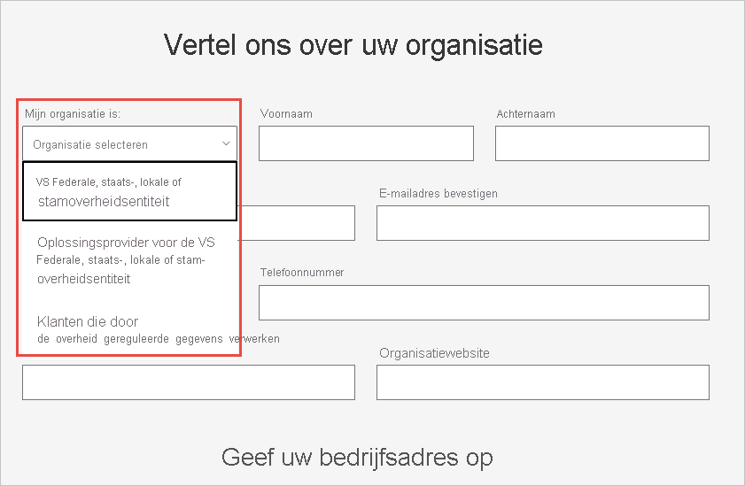

# Uw Amerikaanse overheidsorganisatie registreren in de Power BI-service

Er is een versie van de Power BI-service beschikbaar als onderdeel van de [Microsoft 365 Government-abonnementen](https://www.microsoft.com/microsoft-365/government/compare-office-365-government-plans?rtc=1). Dit artikel is bedoeld voor Amerikaanse overheidsklanten. Het inschrijvingsproces dat hierin wordt beschreven, staat los van de commerciële versie van de Power BI-service.

Raadpleeg [Power BI voor Amerikaanse overheidsklanten - Overzicht](service-govus-overview.md) voor meer informatie over de Power BI-service voor de Amerikaanse overheid.

> [!NOTE]
> Dit artikel is bedoeld voor beheerders die de bevoegdheid hebben hun Amerikaanse overheidsorganisatie te registreren voor Power BI. Als u een eindgebruiker bent, neemt u contact met uw beheerder op voor een abonnement op Power BI voor de Amerikaanse overheid.
> 
> 

## Het juiste aanmeldingsproces voor uw Amerikaanse overheidsorganisatie selecteren

Mogelijk maakt uw Amerikaanse overheidsorganisatie nog geen gebruik van de community in de overheidscloud of heeft de organisatie al een abonnement. In de volgende secties worden de stappen voor aanmelding besproken, op basis van uw voortgang met de Microsoft 365 Government-abonnementen en Power BI. De stappen zijn verschillend, afhankelijk van uw huidige inschrijving.

Nadat u zich hebt aangemeld voor Power BI voor de Amerikaanse overheid, start u samen met uw accountteam aan het [*whitelisting*-proces](#additional-signup-information) dat in dit artikel wordt beschreven. Die stap is nodig om uw organisatie volledig in de communitycloud voor de overheid op te nemen.

## Aanmelden voor een nieuw Microsoft 365 Government-abonnement

Als uw organisatie voor het eerst gebruikmaakt van de cloudcommunity voor de overheid, volgt u deze stappen om een Microsoft 365 Government-abonnement te verkrijgen:

> [!NOTE]
> Deze stappen moeten worden uitgevoerd door de globale beheerder.
>

1. Ga naar [Microsoft 365 Government-abonnementen](https://products.office.com/government/office-365-web-services-for-government).
2. Selecteer **Aan de slag met een gratis proefversie**.
3. Vul het formulier in om ons meer te vertellen over uw organisatie. Gebruik de vervolgkeuzelijst om uw organisatietype te selecteren.

   

4. Dien het formulier in om het onboardingproces te starten. Uw Microsoft-vertegenwoordiger of -partner kan u helpen als u vragen hebt.

Nadat dit proces is voltooid, volgt u de stappen voor bestaande Microsoft 365 Government-klanten om een Power BI-abonnement toe te voegen.

## Power BI aan een Microsoft 365 Government-abonnement toevoegen

Als uw organisatie al een Microsoft 365 Government-abonnement heeft, volgt u deze stappen om een Power BI-abonnement toe te voegen:

> [!NOTE]
> Deze stappen moeten worden uitgevoerd door de globale beheerder.
> 
> 

1. Meld u aan bij het Microsoft 365-beheercentrum met uw referenties voor globale beheerder of factureringsbeheerder.
2. Selecteer **Facturering** > **Services aanschaffen**.
4. Zoek of blader naar de Power BI Pro Government-aanbieding en kies **Proberen** of **Nu kopen**.
5. Voltooi uw bestelling.
6. Wijs licenties aan gebruikersaccounts toe.

## Aanvullende registratie-informatie

Voordat u Power BI-services voor de Amerikaanse overheid kunt gebruikt, moet u samen met uw Microsoft-accountteam het proces voor *whitelisting* voor uw organisatie starten. Whitelisting is een proces dat door het engineeringteam van Power BI wordt gebruikt om klanten van de commerciële cloudomgeving over te zetten naar de veilige communitycloud voor de overheid. Met deze stap zorgt u ervoor de dat functies in de cloud van de Amerikaanse overheid naar verwachting werken. 

Neem voor hulp contact op met het Microsoft-accountteam om het whitelisting-proces te starten. Alleen beheerders kunnen een aanvraag voor whitelisting indienen. Het proces neemt ongeveer drie weken in beslag. Tijdens die periode brengt het engineeringteam van Power BI de benodigde wijzigingen aan om ervoor te zorgen dat uw tenant goed werkt in de cloud van de Amerikaanse overheid.

## Volgende stappen

* [Overzicht van Power BI voor de Amerikaanse overheid](service-govus-overview.md)
- [Hoe kan ik Microsoft 365 Government aanschaffen?](https://docs.microsoft.com/office365/servicedescriptions/office-365-platform-service-description/office-365-us-government/microsoft-365-government-how-to-buy#how-do-i-buy-microsoft-365-government)