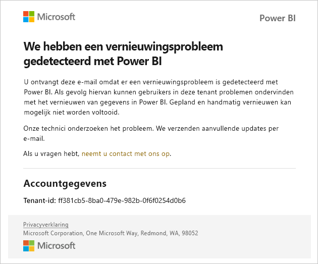
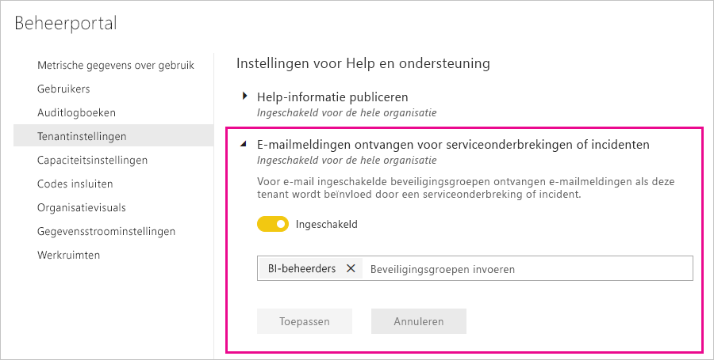

# Meldingen over onderbrekingen van de service

Het is essentieel om inzicht te hebben in de beschikbaarheid van uw bedrijfskritische zakelijke toepassingen. Power BI biedt meldingen over incidenten zodat u optioneel e-mails kunt ontvangen bij onderbreking of degradatie van een service. Hoewel deze incidenten zelden voorkomen dankzij de Service Level Agreement (SLA) van 99,9 procent van Power BI, vinden we het belangrijk om u op de hoogte te houden. In de volgende schermopname ziet u het type e-mailbericht dat u ontvangt als u meldingen inschakelt:

Op dit moment verzenden we e-mails voor de volgende _betrouwbaarheidsscenario's:_

- Betrouwbaarheid van rapport openen
- Betrouwbaarheid van model vernieuwen
- Betrouwbaarheid van query vernieuwen

Er worden meldingen verzonden wanneer er een _lange vertraging_ is bij bewerkingen zoals het openen van rapporten, het vernieuwen van gegevenssets of het uitvoeren van query’s. Wanneer een incident is opgelost, ontvangt u een vervolgmail.

> [!NOTE]
> Deze functie is momenteel alleen beschikbaar voor toegewezen capaciteit in Power BI Premium. Deze functie is niet beschikbaar voor gedeelde of ingesloten capaciteit.

## Meldingen over capaciteit en betrouwbaarheid

Als er lange perioden van hoog resourcegebruik zijn in een Power BI Premium-capaciteit, wat effect kan hebben op de betrouwbaarheid, wordt er een e-mailmelding verzonden. Voorbeelden van deze effecten zijn langdurige vertragingen bij bewerkingen zoals het openen van een rapport, het vernieuwen van een gegevensset en het uitvoeren van query's. 

De e-mailmelding biedt informatie over de reden van het hoge resourcegebruik, waaronder:

* De gegevensset-id van de verantwoordelijke gegevensset
* Het type bewerking
* De CPU-tijd die is gekoppeld aan het hoge resourcegebruik. Hier volgt de [definitie van CPU-tijd](https://wikipedia.org/wiki/CPU_time) in Wikipedia.

Er worden via Power BI ook e-mailmeldingen verzonden wanneer overbelasting in een Power BI Premium-capaciteit wordt gedetecteerd. In het e-mailbericht wordt de waarschijnlijke reden voor de overbelasting uitgelegd, welke bewerkingen verantwoordelijk waren voor die belasting in de afgelopen tien minuten en hoe hoog die belasting voor elke bewerking was. 

Als u meer dan één Premium-capaciteit hebt, bevat het e-mailbericht informatie over deze capaciteiten tijdens de periode van overbelasting. U kunt overwegen de werkruimten met resource-intensieve items te verplaatsen naar capaciteiten met de minste belasting.

E-mailmeldingen over overbelasting worden alleen verzonden wanneer er een drempelwaarde voor overbelasting is geactiveerd. U ontvangt geen tweede e-mail wanneer de belasting van die Premium-capaciteit weer daalt naar niet-overbelaste niveaus.

In de volgende afbeelding ziet u een voorbeeld van een e-mailmelding:

## Meldingen inschakelen

Een Power BI-tenantbeheerder schakelt meldingen in de beheerportal in:

1. Identificeer of maak een beveiligingsgroep met e-mail die meldingen moet ontvangen.

1. Selecteer **Tenantinstellingen** in de beheerportal. Vouw onder **Instellingen voor Help en ondersteuning** de optie **E-mailmeldingen ontvangen voor serviceonderbrekingen of incidenten** uit.

1. Schakel meldingen in, voer een beveiligingsgroep in en selecteer **Toepassen**.

    

> [!NOTE]
> Vanuit Power BI worden meldingen verzonden vanuit het account no-reply-powerbi@microsoft.com. Zorg ervoor dat dit account wordt toegevoegd aan de lijst met veilige afzenders zodat meldingen niet eindigen in een map voor ongewenste e-mail.

## Volgende stappen

[Ondersteuningsopties van Power BI Pro en Power BI Premium](service-support-options.md)

Hebt u nog vragen? [Misschien dat de Power BI-community het antwoord weet](https://community.powerbi.com/)
