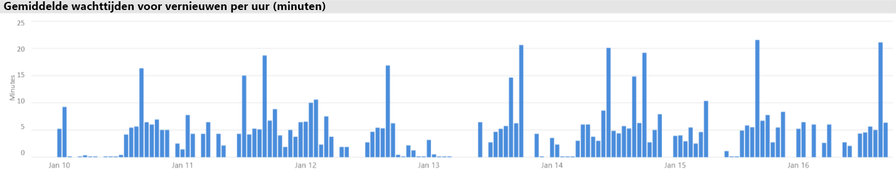
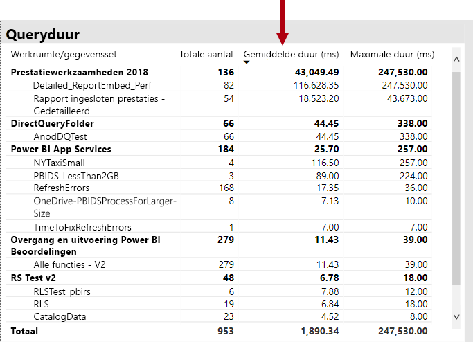
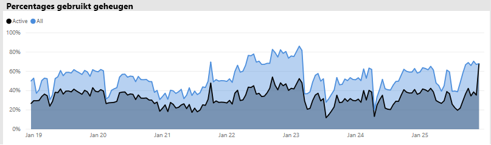
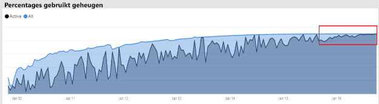

# Scenario's voor Premium-capaciteit

In dit artikel worden praktijkscenario's beschreven waarbij Power BI Premium-capaciteiten zijn geïmplementeerd. Er worden veelvoorkomende problemen en uitdagingen beschreven en ook hoe u problemen kunt herkennen en oplossen:

- [Gegevenssets up-to-date houden](#keeping-datasets-up-to-date)
- [Gegevenssets die langzaam reageren identificeren](#identifying-slow-responding-datasets)
- [Oorzaken identificeren voor gegevenssets die sporadisch langzaam reageren](#identifying-causes-for-sporadically-slow-responding-datasets)
- [Bepalen of er voldoende geheugen is](#determining-whether-there-is-enough-memory)
- [Bepalen of er voldoende CPU is](#determining-whether-there-is-enough-cpu)

De stappen, samen met de grafiek- en tabelvoorbeelden, zijn afkomstig van de **app Metrische Power BI Premium-capaciteitsgegevens** waartoe een Power BI-beheerder toegang heeft.

> [!NOTE]
> Power BI Premium heeft onlangs een nieuwe versie van Premium uitgebracht, genaamd **Premium Gen2**, die momenteel beschikbaar is als preview. Premium Gen2 vereenvoudigt het beheer van Premium-capaciteiten en vermindert de overhead voor beheer. Zie [Power BI Premium Generation 2 (preview-versie)](service-premium-what-is.md#power-bi-premium-generation-2-preview) voor meer informatie.

## Gegevenssets up-to-date houden

In dit scenario is een onderzoek gestart toen gebruikers erover klaagden dat rapportgegevens soms oud of "verouderd" leken.

In de app communiceert de beheerder met de visual **Vernieuwingen**, waarbij gegevenssets in aflopende volgorde op de statistieken voor **Maximale wachttijd** worden gesorteerd. Deze visual helpt hen te zien welke gegevenssets de langste wachttijd hebben, gegroepeerd op de naam van de werkruimte.

In de visual **Gemiddelde wachttijd per uur voor vernieuwen** merken ze op dat er dagelijks om 16:00 consistent een piek is in de wachttijden voor vernieuwen.

Er zijn verschillende mogelijke verklaringen voor deze resultaten:

- Er vinden mogelijk te veel vernieuwingspogingen op hetzelfde moment plaats, waardoor de limieten die door het capaciteitsknooppunt zijn gedefinieerd, worden overschreden. In dit geval zes gelijktijdige vernieuwingen op een P1 met standaardgeheugentoewijzing.

- Gegevenssets die moeten worden vernieuwd, zijn mogelijk te groot voor het beschikbare geheugen (hiervoor is minimaal twee keer het geheugen vereist voor een volledige vernieuwing).
- Inefficiënte Power Query-logica kan tijdens het vernieuwen van de gegevensset resulteren in een piek in het geheugengebruik. Bij een bezette capaciteit kan deze piek de fysieke limiet bereiken, waardoor het vernieuwen van de gegevens mislukt en mogelijk invloed heeft op andere rapportweergavebewerkingen op de capaciteit.
- Gegevenssets die vaak worden opgevraagd en in het geheugen moeten blijven, kunnen invloed hebben op de mogelijkheid van andere gegevenssets te worden vernieuwd vanwege een beperkt beschikbaar geheugen.

Om dit te onderzoeken, kan de Power BI-beheerder zoeken naar:

- Weinig beschikbaar geheugen op het moment dat de gegevens worden vernieuwd wanneer het beschikbare geheugen kleiner is dan 2x de grootte van de gegevensset die moet worden vernieuwd.
- Gegevenssets die niet worden vernieuwd en zich niet in het geheugen bevinden voordat ze worden vernieuwd, maar interactief verkeer begonnen te vertonen tijdens drukke vernieuwingstijden. Om te zien welke gegevenssets op een bepaald moment in het geheugen zijn geladen, kan een Power BI beheerder het gegevenssetgebied van het tabblad **Gegevenssets** in de app bekijken. De beheerder kan vervolgens kruislings filteren op een bepaalde tijd door te klikken op een van de balken in **Aantal gegevenssets dat per uur wordt geladen**. Een lokale piek, die in de onderstaande afbeelding wordt weergegeven, geeft een tijdstip aan waarop meerdere gegevenssets in het geheugen zijn geladen, waardoor de start van geplande vernieuwingen vertraging kan oplopen.
- Er vinden meer gegevenssetverwijderingen plaats op het moment dat gegevensvernieuwingen zijn gepland om te starten. Verwijderingen kunnen erop wijzen dat er een hoge geheugenbelasting is ontstaan doordat er te veel verschillende interactieve rapporten zijn ontvangen vóór het vernieuwen. De visual **Verwijderingen en geheugenverbruik van gegevenssets per uur** kan duidelijk wijzen op pieken in verwijderingen.

Op de volgende afbeelding wordt een lokale piek in geladen gegevenssets weergegeven, dat het vertraagd starten van vernieuwingen door interactieve query's veronderstelt. Als u een periode selecteert in de visual **Aantal gegevenssets dat per uur wordt geladen**, wordt de visual **Grootten gegevenssets** kruislings gefilterd.

De Power BI-beheerder kan proberen het probleem op te lossen door stappen uit te voeren om ervoor te zorgen dat er voldoende geheugen beschikbaar is voor het vernieuwen van gegevens, te beginnen met:

- Contact opnemen met eigenaren van gegevenssets en vragen om schema's voor het vernieuwen van gegevens.
- Het verminderen van het laden van gegevenssetquery's door onnodige dashboards of dashboardtegels te verwijderen, met name inhoud die beveiliging op rijniveau afdwingt.
- Het vernieuwen van gegevens versnellen door Power Query-logica te optimaliseren. De modellering van berekende kolommen of tabellen verbeteren. De grootte van gegevenssets verminderen of grotere gegevenssets configureren voor het incrementeel vernieuwen van gegevens.

## Gegevenssets die langzaam reageren identificeren

In dit scenario is een onderzoek gestart toen gebruikers erover klaagden dat het te lang duurde om bepaalde rapporten te openen. Soms reageerden de rapporten ook niet meer.

In de app kan de Power BI-beheerder de visual **Queryduur** gebruiken om te bepalen welke gegevenssets het slechtst presteren door gegevenssets aflopend te sorteren op **Gemiddelde duur**. In deze visual worden ook de queryaantallen voor de gegevensset weergegeven, zodat u kunt zien hoe vaak de gegevenssets worden opgevraagd.

De beheerder kan verwijzen naar de visual **Queryduurdistributie**, waarin een algemene verdeling van de verzamelde queryprestaties wordt weergegeven (< = 30 ms, 0-100 ms) voor de gefilterde periode. Over het algemeen worden query's die een seconde of minder duren, door de meeste gebruikers als responsief beschouwd. Query's die langer duren, scheppen een beeld van slechte prestaties.

Met de visual **Queryduurdistributies per uur** kan de Power BI-beheerder perioden van één uur vaststellen waarin de capaciteitsprestaties als slecht zijn waargenomen. Hoe groter de staafsegmenten die de duur van query's van meer dan één seconde aangeven, hoe groter het risico is dat gebruikers slechte prestaties zullen krijgen.

De visual is interactief en wanneer een segment van de balk wordt geselecteerd, wordt de bijbehorende visual **Queryduur** van de tabel op de rapportpagina kruislings gefilterd om de gegevenssets weer te geven die het vertegenwoordigt. Met dit kruislings filteren kan de Power BI-beheerder gemakkelijk bepalen welke gegevenssets langzaam reageren.

Op de volgende afbeelding ziet u een visual die is gefilterd op **Queryduurdistributies per uur**, waarmee de aandacht wordt gericht op de slechtst presterende gegevenssets in een interval van één uur.

Nadat de slecht presterende gegevensset in een specifieke periode van één uur is geïdentificeerd, kan de Power BI-beheerder onderzoeken of de slechte prestaties worden veroorzaakt door overbelaste capaciteit of door een slecht ontworpen gegevensset of rapport. Ze kunnen de visual **Querywachttijden** raadplegen en gegevenssets sorteren op de aflopende gemiddelde wachttijd voor query's. Als een groot percentage van de query's aan het wachten is, is een grote vraag naar de gegevensset waarschijnlijk de oorzaak van de te veel wachtende query's. Als de gemiddelde wachttijd voor query's aanzienlijk is (> 100 ms), loont het mogelijk de moeite om de gegevensset en het rapport te controleren om te zien of er optimalisaties kunnen worden uitgevoerd. Bijvoorbeeld minder visuals op bepaalde rapportpagina's of de optimalisatie van een DAX-expressie.

Er zijn verschillende mogelijke redenen voor het toenemen van de wachttijd van query's in gegevenssets:

- Een suboptimaal modelontwerp, meetexpressies of zelfs rapportontwerp: alle omstandigheden die kunnen bijdragen aan langdurige query's die veel CPU verbruiken. Hierdoor worden nieuwe query's gedwongen te wachten totdat CPU-threads beschikbaar zijn en kan er een opstopping komen (denk aan een file), wat doorgaans wordt gezien tijdens de piekuren op kantoor. De pagina **Wachten op query** is de belangrijkste informatiebron voor het bepalen of gegevenssets een hoge gemiddelde wachttijd hebben.
- Een groot aantal gelijktijdige capaciteitsgebruikers (honderden tot duizenden) die hetzelfde rapport of dezelfde gegevensset gebruiken. Zelfs goed ontworpen gegevenssets kunnen slecht presteren als een gelijktijdigheidsdrempel is overschreden. Dit prestatieprobleem wordt aangegeven door één gegevensset met een aanzienlijk hogere waarde voor queryaantallen dan andere gegevenssets. Zo ziet u mogelijk 300.000 query's voor één gegevensset vergeleken met < 30.000 query's voor alle andere gegevenssets. Op een bepaald moment wacht de query totdat deze gegevensset wordt gespreid, wat te zien is in de visual **Queryduur**.
- Veel ongelijksoortige gegevenssets worden gelijktijdig geraadpleegd, waardoor thrashing plaatsvindt als gegevenssets regelmatig naar en uit het geheugen worden gehaald. Deze situatie leidt er toe dat gebruikers trage prestaties ondervinden wanneer de gegevensset in het geheugen wordt geladen. Ter bevestiging kan de Power BI-beheerder de visual **Verwijderingen en geheugenverbruik van gegevenssets per uur** raadplegen. Dit kan aangeven dat een groot aantal gegevenssets dat in het geheugen is geladen herhaaldelijk wordt verwijderd.

## Oorzaken identificeren voor gegevenssets die sporadisch langzaam reageren

In dit scenario is een onderzoek gestart toen gebruikers meldden dat visuals van rapporten soms traag reageerden of niet reageerden. Op andere momenten was de reactietijd van de visuals van het rapport acceptabel.

Binnen de app is de sectie **Queryduur** gebruikt om de verantwoordelijke gegevensset op de volgende manier te vinden:

- In de visual Queryduur heeft de beheerder gegevensset per gegevensset gefilterd (beginnend bij de meest opgevraagde gegevenssets) en de kruislings gefilterde balken in de visual **Queryverdelingen per uur** onderzocht.
- Als een balk van één uur aanzienlijke wijzigingen in de verhouding tussen alle queryduurgroepen versus andere balken van één uur voor die gegevensset vertoont (bijvoorbeeld de verhouding tussen de kleuren drastisch wijzigt), betekent dit dat deze gegevensset een sporadische wijziging in prestaties vertoonde.
- De balk van één uur die een irreguliere hoeveelheid slecht presterende query's vertoonde, gaf een periode aan waarin deze gegevensset werd beïnvloed door een ruiseffect, veroorzaakt door activiteiten van andere gegevenssets.

In de onderstaande afbeelding ziet u één uur op 30 januari, waarin een aanzienlijke afname in de prestaties van een gegevensset is opgetreden, aangegeven door de periode van de uitvoeringsduur '(3, 10]'. Als u op die balk van één uur klikt, worden alle gegevenssets weergegeven die tijdens die periode in het geheugen zijn geladen, en komen mogelijke gegevenssets die het ruiseffect veroorzaken boven water.

Zodra een problematische periode is geïdentificeerd (bijvoorbeeld op de bovenstaande afbeelding op 30 januari), kan de Power BI-beheerder alle gegevenssetfilters verwijderen en vervolgens alleen filteren op die periode om te bepalen welke gegevenssets gedurende deze periode actief werden opgevraagd. De gegevensset die verantwoordelijk is voor het ruiseffect is doorgaans de meest aangevraagde gegevensset of de gegevensset met de langste gemiddelde queryduur.

Een oplossing voor dit probleem is de verantwoordelijke gegevenssets over verschillende werkruimten op verschillende Premium-capaciteiten te verdelen of op basis van gedeelde capaciteit als de grootte van de gegevensset, de vereisten voor het verbruik en de patronen voor gegevensvernieuwing worden ondersteund.

Het omgekeerde zou ook waar kunnen zijn. De Power BI-beheerder kan perioden identificeren wanneer de prestaties van een gegevenssetquery drastisch verbeteren en vervolgens zoeken naar wat er verdwenen is. Als er op dat punt bepaalde informatie ontbreekt, kan dit naar de oorzaak van het probleem wijzen.

## Bepalen of er voldoende geheugen is

Om te bepalen of er voldoende geheugen beschikbaar is voor de capaciteit om de workload te kunnen voltooien, kan de Power BI-beheerder verwijzen naar de visual **Verbruikte geheugenpercentages** op het tabblad **Gegevenssets** van de app. **Alle**: (totaal) het geheugen dat wordt gebruikt door gegevenssets die in het geheugen zijn geladen, ongeacht of ze actief worden doorzocht of verwerkt. **Actief**: het geheugen dat wordt gebruikt door gegevenssets die actief worden verwerkt.

In een gezonde capaciteit ziet de visual er als volgt uit, waarbij een hiaat tussen Alle (totaal) en Actief wordt weergegeven:

In het geval waarin een capaciteit geheugendruk ondervindt, wordt in dezelfde visual duidelijk aangegeven dat het actieve geheugen en het totale geheugen worden samengevoegd, wat betekent dat het onmogelijk is om extra gegevenssets in het geheugen te laden. In dit geval kan de Power BI-beheerder op **Capaciteit opnieuw opstarten** klikken (in **Geavanceerde opties** van het capaciteitsinstellingengebied van de beheerportal). Wanneer de capaciteit opnieuw wordt opgestart, worden alle gegevenssets uit het geheugen verwijderd en kunnen ze indien nodig opnieuw in het geheugen worden geladen (door query's of gegevensvernieuwing).

> [!NOTE]
> Voor Premium Gen2 hoeft het geheugenverbruik niet te worden bijgehouden. De enige beperking in Premium Gen2 is de geheugen-footprint van één artefact. De footprint kan niet groter zijn dan het geheugen dat beschikbaar is voor de capaciteit. Zie [Power BI Premium Generation 2 (preview-versie)](service-premium-what-is.md#power-bi-premium-generation-2-preview) voor meer informatie over Premium Gen2.

## Bepalen of er voldoende CPU is

Over het algemeen moet het gemiddelde CPU-gebruik van een capaciteit onder 80% blijven. Als deze waarde wordt overschreden, betekent dit dat de capaciteit een CPU-verzadiging nadert.

Effecten van CPU-verzadiging worden uitgedrukt in bewerkingen die langer duren dan zou moeten, omdat er veel CPU-contexten worden overgeschakeld wanneer wordt geprobeerd om alle bewerkingen te verwerken. In een Premium-capaciteit met een groot aantal gelijktijdige query's wordt dit aangegeven door hoge wachttijden voor query's. Een hoge wachttijd voor query's betekent een tragere reactiesnelheid dan normaal. De Power BI-beheerder kan gemakkelijk identificeren wanneer de CPU verzadigd is door de verdeling van de visual **Aantal wachtquery's en tijden per uur** te bekijken. Periodieke pieken in querywachttijden duiden op een potentiële verzadiging van de CPU.

Er is soms een vergelijkbaar patroon te zien in achtergrondbewerkingen als deze bijdragen aan CPU-verzadiging. Een Power BI-beheerder kan zoeken naar een periodieke piek in de vernieuwingstijden voor een specifieke gegevensset. Dit kan op dat moment duiden op CPU-verzadiging (waarschijnlijk door andere actieve gegevenssetvernieuwingen en/of interactieve query's). In dit geval kan het raadplegen van de weergave **Systeem** in de app mogelijk niet aantonen dat de CPU 100% is. In de weergave **Systeem** worden gemiddelden van elk uur weergegeven, maar de CPU kan gedurende enkele minuten verzadigd raken door zware bewerkingen, die als pieken in wachttijden worden weergegeven.

Er zijn meer nuances om het effect van CPU-verzadiging te bekijken. Hoewel het aantal query's dat wacht belangrijk is, is er altijd in enige mate een querywachttijd, zonder dat er sprake is van een afname van de prestaties. Sommige gegevenssets (met een langere gemiddelde querytijd, die wijst op complexiteit of grootte) zijn meer gevoelig voor de effecten van CPU-verzadiging dan andere. Om deze gegevenssets gemakkelijk te kunnen identificeren, kan de Power BI-beheerder zoeken naar wijzigingen in de kleurensamenstelling van de balken in de visual **Verdeling wachttijd per uur**. Nadat de beheerder een balk met uitschieters heeft gespot, kan deze de gegevenssets zoeken die gedurende die periode wachtende query's heeft gehad en ook de gemiddelde wachttijd van de query bekijken in vergelijking met de gemiddelde duur van de query. Als deze twee meetwaarden dezelfde grootte hebben en de querybelasting voor de gegevensset essentieel is, is het waarschijnlijk dat de gegevensset wordt beïnvloed door onvoldoende CPU.

Dit effect kan bijzonder duidelijk zijn wanneer een gegevensset wordt gebruikt in korte piekmomenten van query's met een hoge frequentie door meerdere gebruikers (bijvoorbeeld in een trainingssessie), wat resulteert in een CPU-verzadiging tijdens elk piekmoment. In dit geval zijn er significante wachttijden voor query's op deze gegevensset en kunnen ze invloed hebben op andere gegevenssets in de capaciteit (ruiseffect).

In sommige gevallen kunnen Power BI-beheerders verzoeken dat gegevensseteigenaren een minder volatiele querybelasting maken door een dashboard te maken (dat periodiek query's uitvoert bij het vernieuwen van de gegevensset voor tegels in de cache) in plaats van een rapport. Dit kan helpen bij het voorkomen van pieken wanneer het dashboard wordt geladen. Deze oplossing is misschien niet altijd mogelijk voor bepaalde bedrijfsvereisten, maar dit kan een efficiënte manier zijn om CPU-verzadiging te voorkomen zonder dat u wijzigingen in de gegevensset hoeft aan te brengen.

> [!NOTE]
> Voor Premium-Gen2 wordt het gebruik van CPU-tijd per artefact bijgehouden en dit gebruik is zichtbaar in de app voor capaciteitsgebruik. Voor elk artefact wordt het totale gebruik van CPU-tijd voor een bepaalde duur weergegeven. Zie [Power BI Premium Generation 2 (preview-versie)](service-premium-what-is.md#power-bi-premium-generation-2-preview) voor meer informatie over Premium Gen2.

## Dankwoord

Dit artikel is geschreven door Peter Myers, Data Platform MVP en onafhankelijk BI-expert bij [Bitwise Solutions](https://www.bitwisesolutions.com.au/).

## Volgende stappen

> [!div class="nextstepaction"]
> [Premium-capaciteiten bewaken met de app](service-admin-premium-monitor-capacity.md)    
> [!div class="nextstepaction"]
> [Capaciteiten bewaken in de beheerportal](service-admin-premium-monitor-portal.md)   

Nog vragen? [Misschien dat de Power BI-community het antwoord weet](https://community.powerbi.com/)

Power BI heeft Power BI Premium Gen2 geïntroduceerd als preview-aanbieding, waardoor de Power BI Premium-ervaring als volgt wordt aangepast met verbeteringen:
* Prestaties
* Licenties per gebruiker
* Grotere schaal
* Verbeterde metrische gegevens
* Automatisch schalen
* Minder beheeroverhead

Zie [Power BI Premium Generation 2 (preview-versie)](service-premium-what-is.md#power-bi-premium-generation-2-preview) voor meer informatie over Power BI Premium Gen2.

