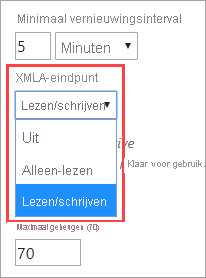
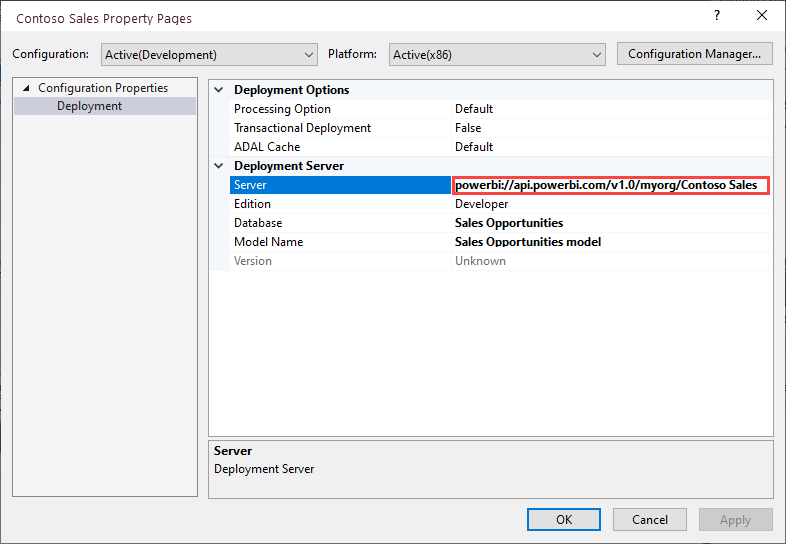
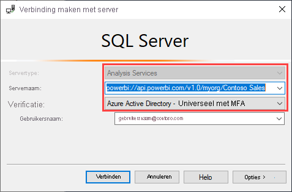
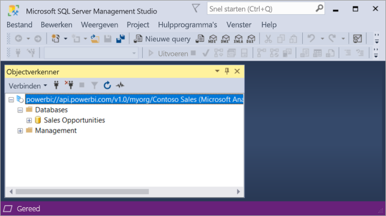
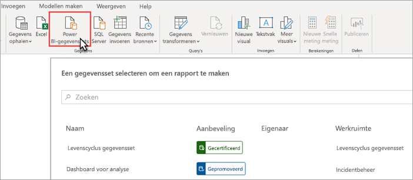
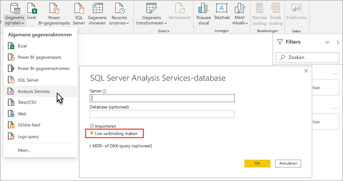

# Gegevenssetconnectiviteit met het XMLA-eindpunt (preview-versie)

Power BI Premium-werkruimten en -gegevenssets op compatibiliteitsniveau 1500 en hoger ondersteunen de openplatformconnectiviteit van clienttoepassingen en hulpprogramma's van Microsoft en van derden met behulp van een *XMLA-eind punt*.

> [!NOTE]
> Deze functie bevindt zich in de **preview-fase**. Functies in de preview-fase mogen niet worden gebruikt in een productieomgeving. Bepaalde functionaliteit, ondersteuning en documentatie is beperkt.  Raadpleeg de [Microsoft Online Services-voorwaarden (OST)](https://www.microsoft.com/licensing/product-licensing/products?rtc=1) voor meer informatie.

## Wat is een XMLA-eindpunt?

Power BI Premium maakt gebruik van het XMLA-protocol ([XML for Analysis](/analysis-services/xmla/xml-for-analysis-xmla-reference?view=power-bi-premium-current)) voor communicatie tussen clienttoepassingen en de engine waarmee uw Power BI-werkruimten en -gegevenssets wordt beheerd. Deze communicatie verloopt via wat vaak wordt aangeduid als XMLA-eindpunten. XMLA is hetzelfde communicatieprotocol dat wordt gebruikt door de Microsoft Analysis Services-engine, waarmee achter de schermen de semantische modellering, governance, levensduur en het gegevensbeheer van Power BI wordt uitgevoerd.

Standaard is *alleen-lezen* connectiviteit met het eindpunt ingeschakeld voor de **workload van gegevenssets** in een capaciteit. Met alleen-lezen bewerkingen kunnen toepassingen en hulpprogramma's voor gegevensvisualisatie query's uitvoeren op modelgegevens, metagegevens, gebeurtenissen en schema's van gegevenssets. *Lees- en schrijf*bewerkingen met het eindpunt kunnen worden geconfigureerd door aanvullende opties voor beheer, governance, geavanceerde semantische modellering, foutopsporing en controle van gegevenssets op te geven. Als lezen/schrijven is ingeschakeld, hebben Power BI Premium-gegevenssets meer pariteit met hulpprogramma's en processen voor modellering van tabellen op ondernemingsniveau van Azure Analysis Services en SQL Server Analysis Services.

> [!NOTE]
> Het is raadzaam om de moderne werkruimte-ervaring te gebruiken, met name wanneer u verbinding maakt met uw gegevenssets met behulp van het XMLA-eindpunt. Bewerkingen zoals het maken of verwijderen van gegevenssets worden niet ondersteund in klassieke werkruimten. Zie [Een upgrade uitvoeren van klassieke werkruimten in Power BI](../collaborate-share/service-upgrade-workspaces.md) als u een upgrade wilt uitvoeren van de klassieke werkruimten naar de nieuwe werkruimte-ervaring.

## Gegevensmodellering en beheerprogramma's

Dit zijn enkele van de meestvoorkomende hulpprogramma's die worden gebruikt met Azure Analysis Services en SQL Server Analysis Services, en nu worden ondersteund door Power BI Premium-gegevenssets:

**Visual Studio met Analysis Services-projecten** , ook wel bekend als SQL Server Data Tools, of kortweg **SSDT**, is een hulpprogramma voor het schrijven van tabellaire Analysis Services-modellen op bedrijfsniveau. Extensies van Analysis Services-projecten worden ondersteund in alle versies van Visual Studio 2017 en hoger, waaronder de gratis Community-editie. Extensie versie 2.9.6 of hoger is vereist om tabellaire modellen te implementeren in een Premium-werkruimte. Voor implementatie in een Premium-werkruimte moet het compatibiliteitsniveau van het model 1500 of hoger zijn. XMLA lezen/schrijven is vereist voor de workload voor gegevenssets. Zie [Tools for Analysis Services](/analysis-services/tools-and-applications-used-in-analysis-services?view=power-bi-premium-current) (Hulpprogramma's voor Analysis Services) voor meer informatie.

**SQL Server Management Studio (SSMS)**  : ondersteunt DAX-, MDX- en XMLA-query's. Voer specifieke vernieuwingsbewerkingen en scripts voor metagegevens van gegevenssets uit met behulp van de [Tabular Model Scripting Language](/analysis-services/tmsl/tabular-model-scripting-language-tmsl-reference) (TMSL, tabellaire modelscripttaal). Voor het uitvoeren van querybewerkingen is alleen-lezen vereist. Voor het uitvoeren van scripts voor metagegevens is lezen-schrijven vereist. SSMS-versie 18.4 of hoger is vereist. Klik  [hier](/sql/ssms/download-sql-server-management-studio-ssms) om SSMS te downloaden.

**SQL Server Profiler** : dit hulpprogramma, dat samen met SSMS wordt geïnstalleerd, voorziet in het bijhouden en opsporen van fouten in gegevenssetgebeurtenissen. Hoewel Profiler officieel is afgeschaft voor SQL Server, wordt het nog steeds opgenomen in SSMS en ondersteund voor Analysis Services en Power BI Premium. XMLA alleen-lezen is vereist. Zie  [SQL Server Profiler voor Analysis Services](/analysis-services/instances/use-sql-server-profiler-to-monitor-analysis-services?view=power-bi-premium-current) (Engelstalig) voor meer informatie.

**Implementatiewizard van Analysis Services** : dit hulpprogramma, dat wordt geïnstalleerd met SSMS, voorziet in de implementatie van in Visual Studio geschreven projecten met tabellaire modellen in Analysis Services- en Power BI Premium-werkruimten. Het kan interactief worden uitgevoerd of automatisch via de opdrachtregel. XMLA lezen/schrijven is vereist. Zie de [implementatiewizard van Analysis Services](/analysis-services/deployment/deploy-model-solutions-using-the-deployment-wizard?view=power-bi-premium-current) (Engelstalig) voor meer informatie.

**PowerShell-cmdlets** : Analysis Services-cmdlets kunnen worden gebruikt voor het automatiseren van beheertaken voor gegevenssets, zoals vernieuwingsbewerkingen. XMLA lezen/schrijven is vereist. Versie **21.1.18221** of hoger van de [PowerShell-module SqlServer](https://www.powershellgallery.com/packages/SqlServer/) is vereist. Azure Analysis Services-cmdlets in de module Az.AnalysisServices worden niet ondersteund voor Power BI Premium. Zie [Analysis Services PowerShell Reference](/analysis-services/powershell/analysis-services-powershell-reference?view=power-bi-premium-current) (naslaginformatie over PowerShell voor Analysis Services) voor meer informatie.

**Power BI Report Builder** : een hulpprogramma voor het maken van gepagineerde rapporten. Maak een rapportdefinitie die aangeeft welke gegevens er moeten worden opgehaald, waar deze moeten worden opgehaald en hoe deze moeten worden weergegeven. U kunt een voorbeeld van uw rapport bekijken in Report Builder en het rapport vervolgens publiceren naar de Power BI-service. XMLA alleen-lezen is vereist. Zie  [Power BI Report Builder](../paginated-reports/report-builder-power-bi.md) voor meer informatie.

**Tabular Editor**: een opensource-hulpprogramma voor het maken, onderhouden en beheren van tabellaire modellen met behulp van een eenvoudige intuïtieve editor. In een hiërarchische weergave worden alle objecten in het tabellaire model weergegeven. Objecten zijn onderverdeeld in weergavemappen met ondersteuning voor meervoudige selectie en bewerking van eigenschappen en markering van DAX-syntaxis. Voor het uitvoeren van querybewerkingen is XMLA alleen-lezen vereist. Voor metagegevensbewerkingen is lezen/schrijven vereist. Zie [tabulareditor.github.io](https://tabulareditor.github.io/) voor meer informatie.

**DAX Studio** : een opensource-hulpprogramma voor creatie, diagnose, afstemming van prestaties en analyse met DAX. Het bevat onder meer functies voor bladeren door objecten, geïntegreerde tracering, uitsplitsing van uitvoerbewerkingen van query's met gedetailleerde statistieken en markering en opmaak van DAX-syntaxis. Voor het uitvoeren van querybewerkingen is XMLA alleen-lezen vereist. Zie  [daxstudio.org](https://daxstudio.org/) voor meer informatie.

**ALM Toolkit**: een hulpprogramma voor het vergelijken van opensource-schema's voor Power BI-gegevenssets. Het wordt meestal gebruikt voor ALM-scenario's (Application Lifecycle Management). Implementaties uitvoeren in omgevingen en historische gegevens van incrementele vernieuwingen bewaren. Metagegevensbestanden, vertakkingen en opslagplaatsen vergelijken en samenvoegen. Algemene definities opnieuw gebruiken in gegevenssets. Voor het uitvoeren van querybewerkingen is alleen-lezen vereist. Voor metagegevensbewerkingen is lezen/schrijven vereist. Zie  [alm-toolkit.com](http://alm-toolkit.com/) voor meer informatie.

**Microsoft Excel** : Excel-draaitabellen worden vaak gebruikt voor het samenvatten, analyseren, verkennen en weergeven van overzichtsgegevens van Power BI-gegevenssets. Voor het uitvoeren van querybewerkingen is alleen-lezen vereist. Klik-en-Klaar-versie van Office 16.0.11326.10000 of hoger is vereist.

**Van derden** : bevat toepassingen en hulpprogramma's voor het visualiseren van clientgegevens waarmee u verbinding kunt maken met, query's kunt uitvoeren in en gebruik kunt maken van gegevenssets in Power BI Premium. Voor de meeste hulpprogramma's zijn de meest recente versies van de MSOLAP-clientbibliotheken vereist, maar voor sommige kunt u ADOMD gebruiken. Het XMLA-eindpunt met het kenmerk alleen-lezen of lezen/schrijven is afhankelijk van de bewerkingen.

### Clientbibliotheken

Clienttoepassingen communiceren niet rechtstreeks met het XMLA-eindpunt. In plaats daarvan worden *clientbibliotheken* gebruikt als abstractielaag. Dit zijn dezelfde clientbibliotheken die door toepassingen worden gebruikt om verbinding te maken met Azure Analysis Services en SQL Server Analysis Services. Met Microsoft-toepassingen zoals Excel, SQL Server Management Studio (SSMS) en de extensies van Analysis Services-projecten voor Visual Studio worden alle drie clientbibliotheken geïnstalleerd en worden ze samen met de reguliere toepassings- en extensie-updates bijgewerkt. Ontwikkelaars kunnen de clientbibliotheken ook gebruiken om aangepaste toepassingen te bouwen. In sommige gevallen, met name bij toepassingen en hulpprogramma's van derden, moet u mogelijk nieuwere versies van de clientbibliotheken installeren als deze niet samen met de toepassing worden geïnstalleerd. Clientbibliotheken worden maandelijks bijgewerkt. Zie  [Clientbibliotheken om verbinding te maken met Analysis Services](/azure/analysis-services/analysis-services-data-providers) voor meer informatie.

## Ondersteunde schrijfbewerkingen

Metagegevens van de gegevensset worden weergegeven via de clientbibliotheken op basis van het tabellaire objectmodel (TOM) voor ontwikkelaars om aangepaste toepassingen te bouwen. Hierdoor kunnen Visual Studio en hulpprogramma van de opensource-community, zoals Tabular Editor, aanvullende gegevensmodellerings- en implementatiemogelijkheden bieden die worden ondersteund door de Analysis Services-engine, maar nog niet in Power BI Desktop. De aanvullende functionaliteit voor gegevensmodellering omvat onder meer:

- [Berekeningsgroepen](/analysis-services/tabular-models/calculation-groups?view=power-bi-premium-current) voor hergebruik van berekeningen en vereenvoudigd verbruik van complexe modellen.

- [Vertalingen van metagegevens](/analysis-services/tabular-models/translations-in-tabular-models-analysis-services?view=power-bi-premium-current) voor het ondersteunen van rapporten en gegevenssets in meerdere talen.

- [Perspectieven](/analysis-services/tabular-models/perspectives-ssas-tabular?view=power-bi-premium-current) voor het definiëren van specifieke weergaven van metagegevens van gegevenssets voor specifieke bedrijfsdomeinen.

Beveiliging op objectniveau (OLS) wordt nog niet ondersteund in Power BI Premium-gegevenssets.

## Gegevenssets optimaliseren voor schrijfbewerkingen

Wanneer u het XMLA-eindpunt gebruikt voor het beheren van gegevenssets met schrijfbewerkingen, is het raadzaam om de gegevensset voor grote modellen in te schakelen. Dit vermindert de overhead van schrijfbewerkingen, waardoor ze aanzienlijk sneller kunnen worden. Voor gegevenssets van meer dan 1 GB (na compressie) kan het verschil aanzienlijk zijn. Zie [Grote modellen in Power BI Premium](service-premium-large-models.md) voor meer informatie.

## XMLA lezen/schrijven inschakelen

Standaard is voor een Premium-capaciteit de instelling voor de eigenschap XMLA-eindpunt ingeschakeld voor alleen-lezen. Dit betekent dat toepassingen alleen een gegevensset kunnen opvragen. Als u wilt dat toepassingen schrijfbewerkingen kunnen uitvoeren, moet de eigenschap XMLA-eindpunt worden geconfigureerd voor lezen/schrijven. De instelling voor de eigenschap XMLA-eindpunt voor een capaciteit wordt geconfigureerd in de **workload voor gegevenssets**. De instelling voor het XMLA-eindpunt is van toepassing op *alle werkruimten en gegevenssets* die aan de capaciteit zijn toegewezen.

### Lezen/schrijven inschakelen voor een capaciteit

1. Klik in de beheerportal op **Instellingen voor capaciteit** > **Power BI Premium** > naam van de capaciteit.
2. Vouw **Workloads** uit. Selecteer in de instelling **XMLA-eindpunt** de optie **Lezen/schrijven**.

    

## Verbinding maken met een Premium-werkruimte

Werkruimten die zijn toegewezen aan toegewezen capaciteiten hebben een verbindingsreeks in URL-indeling, zoals deze `powerbi://api.powerbi.com/v1.0/[tenant name]/[workspace name]`.

Toepassingen die verbinding maken met de werkruimte, gebruiken de URL alsof het een Analysis Services-servernaam is. Bijvoorbeeld `powerbi://api.powerbi.com/v1.0/contoso.com/Sales Workspace`.

Gebruikers met UPN's in dezelfde tenant (niet B2B) kunnen de naam van de tenant vervangen door `myorg`. Bijvoorbeeld  `powerbi://api.powerbi.com/v1.0/myorg/Sales Workspace`.

B2B-gebruikers moeten hun organisatie-UPN opgeven in de tenant naam. Bijvoorbeeld  `powerbi://api.powerbi.com/v1.0/fabrikam.com/Sales Workspace`.

### De verbindings-URL voor de werkruimte ophalen

Ga in de werkruimte naar **Instellingen** > **Premium** > **Werkruimteverbinding** en klik op **Kopiëren**.

## Verbindingsvereisten

### Oorspronkelijke catalogus

Voor sommige hulpprogramma's, zoals SQL Server Profiler, moet u mogelijk een *Oorspronkelijke catalogus* opgeven. Geef een gegevensset (database) in uw werkruimte op. In het dialoogvenster **Verbinding maken met server** klikt u op **Opties** > **Verbindingseigenschappen** > **Verbinding maken met database** en voert u de naam van de gegevensset in.

### Dubbele werkruimtenamen

[Nieuwe werkruimten](../collaborate-share/service-new-workspaces.md) (gemaakt met behulp van de nieuwe werkruimte-ervaring) in Power BI worden gevalideerd om te voorkomen dat er bij het maken van nieuwe naamruimten of bij het wijzigen van namen van bestaande werkruimten dubbele namen ontstaan. Werkruimten die niet gemigreerd zijn, kunnen resulteren in dubbele namen. Wanneer u verbinding maakt met een werkruimte met dezelfde naam als een andere werkruimte, krijgt u mogelijk de volgende fout:

**Kan geen verbinding maken met powerbi://api.powerbi.com/v1.0/ [tenantnaam] / [werkruimtenaam].**

U kunt deze fout omzeilen door naast de naam van de werkruimte de ObjectIDGuid op te geven, die u kunt kopiëren vanuit de objectID van de werkruimte in de URL. De objectID toevoegen aan de verbindings-URL. Bijvoorbeeld:  
'powerbi://api.powerbi.com/v1.0/myorg/Contoso-verkoop - 9d83d204-82a9-4b36-98f2-a40099093830'

### Dubbele naam van gegevensset

Bij het verbinden met een gegevensset met dezelfde naam als een andere gegevensset in dezelfde werkruimte moet u de GUID van de gegevensset toevoegen aan de naam van de gegevensset. U kunt zowel de naam als GUID van de gegevensset ophalen wanneer u verbinding hebt met de werkruimte in SSMS.

### Vertraging in de gegevenssets die worden weergegeven

Wanneer u verbinding maakt met een werkruimte, kan het enkele minuten duren alvorens wijzigingen vanwege nieuwe, verwijderde en hernoemde gegevenssets worden weergegeven.

### Niet-ondersteunde gegevenssets

De volgende gegevenssets zijn niet toegankelijk via het XMLA-eindpunt. Deze gegevenssets worden niet weergegeven onder de werkruimte in SSMS of in andere hulpprogramma's:

- Gegevenssets op basis van een liveverbinding met een Azure Analysis Services- of SQL Server Analysis Services-model worden niet ondersteund. 
- Gegevenssets op basis van een liveverbinding met een Power BI-gegevensset in een andere werkruimte. Zie [Introductie van gegevenssets in verschillende werkruimten](../connect-data/service-datasets-across-workspaces.md) voor meer informatie.
- Gegevenssets met pushgegevens met behulp van de REST-API.
- Gegevenssets op basis van Excel-werkmappen.

## Beveiliging

Naast de eigenschap voor het XMLA-eindpunt waarvoor lezen/schrijven is ingeschakeld de capaciteitsbeheerder, moet ook de instelling **Gegevens exporteren** in de Power BI beheerportal, die tevens vereist is voor Analyseren in Excel, worden ingeschakeld op tenantniveau.

Bij toegang via het XMLA-eindpunt wordt het ingestelde lidmaatschap van de beveiligingsgroep op het niveau van de werkruimte/app gerespecteerd.

Werkruimte-inzenders en hoger hebben schrijftoegang tot de gegevensset en zijn daarom gelijk aan Analysis Services-databasebeheerders. Ze kunnen nieuwe gegevenssets implementeren vanuit Visual Studio en TMSL-scripts uitvoeren in SSMS.

Bewerkingen waarvoor machtigingen als Analysis Services-serverbeheerder (in plaats van databasebeheerder) nodig zijn, zoals traceringen op serverniveau en gebruikersimitatie met behulp van de eigenschap [EffectiveUserName](/analysis-services/instances/connection-string-properties-analysis-services?view=power-bi-premium-current#bkmk_auth) van de verbindingsreeks worden op dit moment niet ondersteund in Power BI Premium.

Andere gebruikers met de [samenstellingsmachtiging](../connect-data/service-datasets-build-permissions.md) voor een gegevensset, zijn gelijk aan Analysis Services-databaselezers. Zij kunnen verbinding maken met en bladeren in gegevenssets voor gegevensverbruik en -visualisatie. Regels voor beveiliging op rijniveau (RLS) worden nageleefd en de metagegevens van de interne gegevensset worden niet weergeven.

### Modelrollen

Door metagegevens van gegevenssets via het XMLA-eindpunt in te stellen, kunt u modelrollen van een gegevensset maken, wijzigen of verwijderen, en ook filters voor beveiliging op rijniveau (RLS) instellen. Modelrollen in Power BI worden alleen gebruikt voor RLS. Gebruik het Power BI-beveiligingsmodel om machtigingen te beheren buiten beveiliging op rijniveau.

De volgende beperkingen zijn van toepassing bij het werken met gegevenssetrollen via het XMLA-eindpunt:

- **Tijdens de openbare preview-fase kunt u geen rollidmaatschap voor een gegevensset opgeven met behulp van het XMLA-eindpunt**. Geef in plaats daarvan rolleden op de pagina Beveiliging op rijniveau op voor een gegevensset in de Power BI-service.
- De enige machtiging voor een rol die kan worden ingesteld voor Power BI-gegevenssets is de machtiging Lezen. Voor leestoegang via het XMLA-eindpunt is de samenstellingsmachtiging voor een gegevensset vereist, ongeacht de aanwezigheid van rollen voor gegevenssets. Gebruik het Power BI-beveiligingsmodel om machtigingen te beheren buiten beveiliging op rijniveau.
- Regels voor beveiliging op objectniveau (OLS) worden momenteel niet ondersteund in Power BI.

### Gegevensbronreferenties instellen

Metagegevens die zijn opgegeven via het XMLA-eindpunt kunnen verbinding maken met gegevensbronnen, maar kunnen geen gegevensbronreferenties instellen. In plaats daarvan kunnen referenties worden ingesteld op de pagina met instellingen voor de gegevensset in de Power BI-service.

### Service-principals

Azure Service-principals kunnen worden gebruikt voor het uitvoeren van bewerkingen zonder toezicht op resources en op serviceniveau. Zie [Taken voor Premium-werkruimten en -gegevenssets automatiseren met service-principals](service-premium-service-principal.md) voor meer informatie.

## Modelprojecten implementeren vanuit Visual Studio (SSDT)

Het implementeren van een tabellair modelproject in Visual Studio naar een Power BI Premium-werkruimte gaat vrijwel hetzelfde als het implementeren naar een Azure Analysis Services- of SQL Server Analysis Services-server. Het enige verschil zit hem in de eigenschap voor de implementatieserver die wordt opgegeven voor het project en in hoe gegevensbronreferenties worden opgegeven, zodat gegevens door verwerkingsprocessen uit gegevensbronnen kunnen worden geïmporteerd in de nieuwe gegevensset in de werkruimte.

> [!IMPORTANT]
> Tijdens de openbare preview-fase kunnen geen rollidmaatschappen worden opgegeven met hulpprogramma's die gebruikmaken van het XMLA-eindpunt. Als uw modelproject niet kan worden geïmplementeerd, moet u ervoor zorgen dat u er geen gebruikers zijn opgegeven in een van de rollen. Als het model met succes is geïmplementeerd, geeft u gebruikers voor gegevenssetrollen op in de Power BI-service. Zie [Modelrollen](#model-roles) eerder in dit artikel voor meer informatie.

Als u een tabellair modelproject wilt implementeren dat is gemaakt in Visual Studio, moet u eerst de URL voor de werkruimteverbinding instellen in de projecteigenschap **Implementatieserver**. Ga in Visual Studio naar **Solution Explorer** en klik met de rechtermuisknop op het project en selecteer **Eigenschappen**. Plak de URL voor de werkruimteverbinding in de eigenschap **Server**.

Wanneer de eigenschap voor de implementatieserver is opgegeven, kan het project vervolgens worden geïmplementeerd.

**Bij de eerste implementatie**, wordt er een gegevensset in de werkruimte gemaakt met behulp van metagegevens uit het bestand model.bim. Als onderdeel van de implementatiebewerking, nadat de gegevensset in de werkruimte is gemaakt op basis van de metagegevens van het model, zal de verwerking voor het laden van gegevens in de gegevensset uit gegevensbronnen mislukken.

De verwerking mislukt omdat er - in tegenstelling tot een implementatie naar een instantie van een Azure- of SQL-analyseserver, waarbij de referenties van de gegevensbron worden gevraagd als onderdeel van de implementatiebewerking - bij een implementatie naar een Premium-werkruimte geen gegevensbronreferenties kunnen worden opgegeven. In plaats hiervan geeft u, nadat de metagegevens zijn geïmplementeerd en de gegevensset is gemaakt, gegevensbronreferenties op in de Power BI-service in de instellingen voor de gegevensset. Klik in de werkruimte op **Gegevenssets** > **Instellingen** > **Gegevensbronreferenties** > **Referenties bewerken**.

Wanneer u de gegevensbronreferenties hebt opgegeven, kunt u de gegevensset in de Power BI-service vernieuwen, het vernieuwingsschema configureren, of het (vernieuwings)proces verwerken vanuit SQL Server Management Studio om gegevens in de gegevensset te laden.

De implementatie-eigenschap **Verwerkingsoptie**, die is opgegeven in het project in Visual Studio, wordt gerespecteerd. Maar als voor een gegevensbron nog geen referenties zijn opgegeven in de Power BI-service, zal de verwerking mislukken, zelfs wanneer de implementatie van metagegevens met succes is voltooid. U kunt de eigenschap instellen op **Niet verwerken**, zodat er geen poging wordt gedaan om deze te verwerken tijdens de implementatie. Maar wellicht wilt u de eigenschap later weer instellen op **Standaard** omdat de verwerking wel zal slagen als de gegevensbronreferenties eenmaal zijn opgegeven in de gegevensbroninstellingen voor de nieuwe gegevensset.

## Verbinden met SSMS

Verbinding maken met een werkruimte met behulp van SSMS gaat net zoals verbinding maken met een Azure- of SQL Server Analysis Services-server. Het enige verschil is dat u de werkruimte-URL in de servernaam opgeeft, en u **Active Directory - Universeel met MFA** voor de verificatie moet gebruiken.

### Verbinding met een werkruimte maken met behulp van SSMS

1. Klik in SQL Server Management Studio op **Verbinding maken** > **Verbinding maken met de server**.

2. Selecteer **Analysis Services** als **servertype**. Geef in **Servernaam** de URL van de werkruimte op. Selecteer bij **Verificatie** **Active Directory - Universeel met MFA** en geef vervolgens in **Gebruikersnaam** de gebruikers-id van uw organisatie op.

    

Wanneer de verbinding is gemaakt, wordt de werkruimte weergegeven als een Analysis Services-server en worden gegevenssets in de werkruimte weergegeven als databases.  

Zie [Create Analysis Services scripts](/analysis-services/instances/create-analysis-services-scripts-in-management-studio?view=power-bi-premium-current) en [Tabular Model Scripting Language (TMSL)](/analysis-services/tmsl/tabular-model-scripting-language-tmsl-reference?view=power-bi-premium-current) voor meer informatie over het uitvoeren van scripts voor metagegevens met behulp van SSMS.

## Gegevensset vernieuwen

Het XMLA-eindpunt biedt uitgebreide mogelijkheden voor vernieuwing met SSMS, automatisering met PowerShell, [Azure Automation](/azure/automation/automation-intro) en [Azure Functions](/azure/azure-functions/functions-overview) met TOM. U kunt bijvoorbeeld bepaalde historische partities met [incrementele vernieuwing](service-premium-incremental-refresh.md) vernieuwen zonder alle historische gegevens opnieuw te hoeven laden.

In tegenstelling tot het configureren van vernieuwingen in de Power BI-service, is het aantal vernieuwingen via het XMLA-eindpunt niet beperkt tot 48 vernieuwingen per dag en wordt de [time-out voor geplande vernieuwingen](../connect-data/refresh-troubleshooting-refresh-scenarios.md#scheduled-refresh-timeout) niet opgelegd.

## Dynamische beheerweergaven (DMV's)

Analysis Services-[DMV's](/analysis-services/instances/use-dynamic-management-views-dmvs-to-monitor-analysis-services) bieden inzicht in de metagegevens, de herkomst en het resourcegebruik van gegevenssets. DMV's die beschikbaar zijn voor het uitvoeren van query's in Power BI via het XMLA-eind punt, zijn beperkt tot, ten hoogste, die waarvoor databasebeheerdersmachtigingen vereist zijn. Sommige DMV's zijn bijvoorbeeld niet toegankelijk omdat daarvoor beheerdersmachtigingen voor de Analysis Services-server nodig zijn.

## In Power BI Desktop gemaakte gegevenssets

### Verbeterde metagegevens

Voor XMLA-schrijfbewerkingen op gegevenssets die zijn gemaakt in Power BI Desktop en gepubliceerd naar een Premium-werkruimte, moeten verbeterde metagegevens zijn ingeschakeld. Zie [Verbeterde metagegevens van gegevensset](../connect-data/desktop-enhanced-dataset-metadata.md) voor meer informatie.

> [!CAUTION]
> Op dit moment kan een schrijfbewerking op een gegevensset die in Power BI Desktop is gemaakt, niet terug worden gedownload als een PBIX-bestand. Zorg ervoor dat u het oorspronkelijke PBIX-bestand bewaart.

### Gegevensbrondeclaratie

Wanneer u verbinding maakt met gegevensbronnen en query's op gegevens uitvoert, maakt Power BI Desktop gebruik van Power Query M-expressies als inline gegevensbrondeclaraties. Inline Power Query M-gegevensbrondeclaratie wordt wel ondersteund in Power BI Premium-werkruimten, maar niet in Azure Analysis Services of SQL Server Analysis Services. In plaats daarvan worden metagegevens in Analysis Services-hulpprogramma's voor gegevensmodellering gemaakt met behulp van *gestructureerde* en/of *provider*-gegevensbrondeclaraties. Met het XML-eindpunt in Power BI Premium worden ook gestructureerde en provider-gegevensbronnen ondersteund, maar niet als onderdeel van inline Power Query M-gegevensbrondeclaraties in Power BI Desktop-modellen. Zie [Inzicht in providers](/azure/analysis-services/analysis-services-datasource#understanding-providers) voor meer informatie.

### Power BI Desktop in de LiveConnect-modus

Power BI Desktop kan verbinding maken met een Power BI Premium-gegevensset via een liveverbinding. Wanneer u een liveverbinding gebruikt, hoeft u de gegevens niet lokaal te repliceren, waardoor gebruikers eenvoudiger semantische modellen kunnen gebruiken. Er zijn twee manieren waarop gebruikers verbinding kunnen maken:

Door **Power BI-gegevenssets** te selecteren en vervolgens een gegevensset te selecteren voor het maken van een rapport. Dit is de **aanbevolen** manier voor gebruikers om live verbinding te maken met gegevenssets. Deze methode biedt een betere detectie-ervaring, aangezien hiermee het goedkeuringsniveau van gegevenssets wordt weergegeven. Gebruikers hoeven geen URL's van werkruimten op te zoeken en aan te houden. Als u een gegevensset wilt zoeken, hoeven gebruikers alleen de naam van de gegevensset in te typen of te schuiven om de gegevensset te vinden die ze zoeken.

De andere manier waarop gebruikers verbinding kunnen maken, is door via **Gegevens ophalen** > **Analysis Services** de naam van een Power BI Premium-werkruimte als URL op te geven, **Live verbinding maken** te selecteren en vervolgens in Navigator een gegevensset selecteren. In dit geval gebruikt Power BI Desktop het XMLA-eindpunt om live verbinding te maken met de gegevensset, alsof het een Analysis Services-gegevensmodel is. 

Organisaties die bestaande rapporten hebben met een live verbinding met Analysis Services-gegevensmodellen en deze willen migreren naar Power BI Premium-gegevenssets, hoeven alleen de URL van de servernaam te wijzigen in **Gegevens transformeren** > **Gegevensbroninstellingen**.

> [!NOTE]
> Wanneer u tijdens de openbare voorbeeldweergave van XMLA lezen/schrijven via Power BI Desktop verbinding maakt met een Power BI Premium-gegevensset met behulp van **Gegevens ophalen** > **Analysis Services** en door de selectie van de optie **Liveverbinding maken**, is er nog geen ondersteuning voor het publiceren van een rapport in de Power BI-service.

## Auditlogboeken

Wanneer toepassingen verbinding maken met een werkruimte, wordt de toegang via XMLA-eindpunten geregistreerd in de Power BI-auditlogboeken bij de volgende bewerkingen:

|Beschrijvende naam van bewerking   |Naam van bewerking   |
|---------|---------|
|Verbonden met Power BI-gegevensset vanuit een externe toepassing      |  ConnectFromExternalApplication        |
|Vernieuwing van Power BI-gegevensset aangevraagd vanuit een externe toepassing      | RefreshDatasetFromExternalApplication        |
|Power BI-gegevensset gemaakt vanuit een externe toepassing      |  CreateDatasetFromExternalApplication        |
|Power BI-gegevensset bewerkt vanuit een externe toepassing     |  EditDatasetFromExternalApplication        |
|Power BI-gegevensset verwijderd vanuit een externe toepassing      |  DeleteDatasetFromExternalApplication        |

Zie  [Power BI controleren](service-admin-auditing.md) voor meer informatie.

## Zie ook

Hebt u nog vragen? [Misschien dat de Power BI-community het antwoord weet](https://community.powerbi.com/)