# <a name="incremental-refresh-in-power-bi"></a>Incrementeel vernieuwen in Power BI

Incrementele vernieuwing maakt zeer grote gegevenssets in Power BI mogelijk, met de volgende voordelen:

> [!div class="checklist"]
> * **Vernieuwen gaat sneller**: alleen gegevens die zijn gewijzigd, hoeven te worden vernieuwd. Vernieuw bijvoorbeeld alleen de laatste vijf dagen van een gegevensset van tien jaar.
> * **Vernieuwen is betrouwbaarder**: het is niet meer nodig om langdurige verbindingen met vluchtige bronsystemen te onderhouden.
> * **Verbruik van resources is lager**: als er minder gegevens zijn om te vernieuwen, wordt het algemene verbruik van geheugen en andere resources verlaagd.

> [!NOTE]
> Incrementeel vernieuwen is nu beschikbaar voor Power BI Pro, Premium en gedeelde abonnementen en gegevenssets. 

## <a name="configure-incremental-refresh"></a>Incrementeel vernieuwen configureren

Beleid voor incrementele vernieuwing wordt gedefinieerd in Power BI Desktop en toegepast zodra het beleid in de Power BI-service is gepubliceerd.


### <a name="filter-large-datasets-in-power-bi-desktop"></a>Grote gegevenssets filteren in Power BI Desktop

Grote gegevenssets met potentieel miljarden rijen passen mogelijk niet in een Power BI Desktop-model omdat het PBIX-bestand meestal is beperkt door de geheugenresources die beschikbaar zijn op de desktop-pc. Dergelijke gegevenssets worden daarom doorgaans gefilterd tijdens de import. Er wordt op deze manier gefilterd, of er nu gebruik wordt gemaakt van incrementeel vernieuwen of niet. Bij incrementeel vernieuwen filtert u op basis van de datum-/tijdparameters van Power Query.

#### <a name="rangestart-and-rangeend-parameters"></a>De parameters RangeStart en RangeEnd

Als u gebruik wilt maken van incrementele vernieuwing, worden gegevenssets gefilterd op basis van de datum- en tijdparameters van Power Query in combinatie met de gereserveerde, hoofdlettergevoelige namen **RangeStart** en **RangeEnd**. Deze parameters worden gebruikt om de gegevens die naar Power BI Desktop te worden geïmporteerd te filteren. Ze worden ook gebruikt om de gegevens dynamisch te partitioneren in bereiken nadat ze in de Power BI-service zijn gepubliceerd. De parameterwaarden worden vervangen door de service om op elke partitie te kunnen filteren. U hoeft ze niet in te stellen bij de gegevenssetinstellingen in de service. Na publicatie worden de parameterwaarden automatisch door de Power BI-service overschreven.

Selecteer **Parameters beheren** in de Power Query-editor om parameters met standaardwaarden te definiëren.

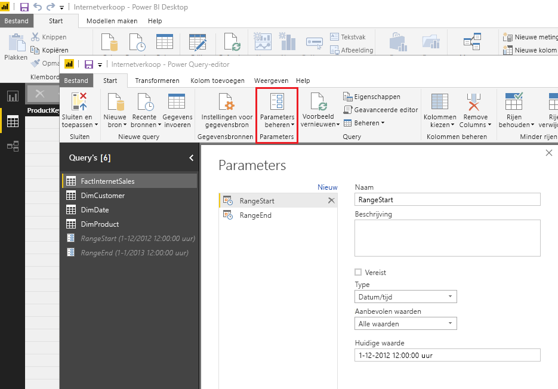

Wanneer u de parameters hebt gedefinieerd, kunt u het filter toepassen door de menuoptie **Aangepast filter** voor een kolom te selecteren.

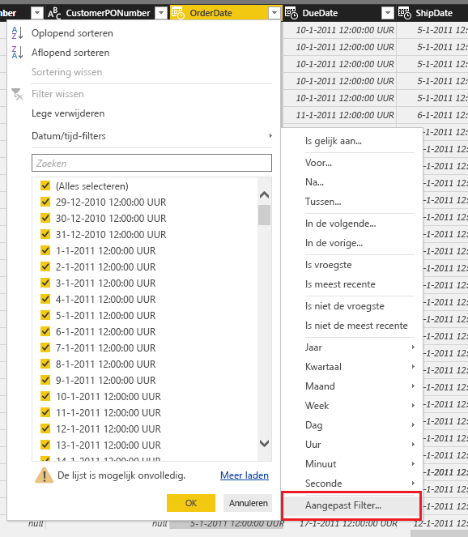

Zorg ervoor dat rijen worden gefilterd waarbij de kolomwaarde *na of gelijk is aan* **RangeStart** en *vóór* **RangeEnd**. Andere filtercombinaties kunnen ertoe leiden dat rijen dubbel worden geteld.

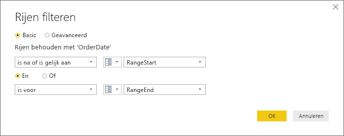

> [!IMPORTANT]
> Controleer of de query's een isgelijkteken (=) bevatten voor **RangeStart** of **RangeEnd**, maar niet voor beide. Als het isgelijkteken (=) voor beide parameters bestaat, kan een rij voldoen aan de voorwaarden voor twee partities, wat kan leiden tot dubbele gegevens in het model. Bijvoorbeeld:  
> \#"Gefilterde rijen" = Table.SelectRows(dbo_Fact, each [OrderDate] **>= RangeStart** and [OrderDate] **<= RangeEnd**) kan leiden tot dubbele gegevens.

> [!TIP]
> Hoewel het gegevenstype van de parameters datum/tijd moet zijn, is het wel mogelijk om ze te converteren zodat ze voldoen aan de vereisten van de gegevensbron. De volgende Power Query-functie converteert bijvoorbeeld een datum/tijd-waarde zodat deze overeenkomt met een surrogaatsleutel voor gehele getallen in de indeling *jjjjmmdd*, die vaker wordt gebruikt voor gegevenswarehouses. De functie kan worden aangeroepen door de filterstap.
>
> `(x as datetime) => Date.Year(x)*10000 + Date.Month(x)*100 + Date.Day(x)`

Selecteer **Sluiten en toepassen** in de Power Query Editor. U moet een subset van de gegevensset in Power BI Desktop hebben.

#### <a name="filter-date-column-updates"></a>Filteren op updates in de datumkolom

Het gegevenskolomfilter wordt in de Power BI-service gebruikt om gegevens dynamisch de partitioneren in bereiken. Incrementeel vernieuwen is niet bedoeld ter ondersteuning van gevallen waarin de gefilterde datumkolom in het bronsysteem wordt bijgewerkt. Een update wordt beschouwd als een invoeging en een verwijdering en niet als een echte update. Als de verwijdering zich voordoet in het historische bereik en niet in het incrementele bereik, wordt het niet opgepikt. Dit kan leiden tot mislukte pogingen de gegevens te vernieuwen vanwege partitiesleutelconflicten.

#### <a name="query-folding"></a>Query's vouwen

Het is belangrijk dat de partitiefilters naar het bronsysteem wordt gepusht als er query's worden ingediend voor vernieuwingsbewerkingen. Het filteren naar beneden duwen (push down) houdt in dat de gegevensbron ondersteuning moet bieden aan het 'vouwen van query's'. De meeste gegevensbronnen die ondersteuning bieden voor SQL-query's, ondersteunen het vouwen van query’s. Voor gegevensbronnen zoals platte bestanden, blobs en webfeeds geldt dat echter doorgaans niet. In gevallen waarin het filter niet wordt ondersteund door de back-end van de gegevensbron, kan deze niet naar beneden worden gepusht. In dergelijke gevallen biedt de mashup-engine compensatie door het filter lokaal toe te passen, waarvoor het nodig kan zijn de volledige gegevensset uit de gegevensbron op te halen. Hierdoor kan incrementeel vernieuwen traag worden en kan het proces zonder resources komen te zitten, zowel in de Power BI-service als in de on-premises gegevensgateway, indien gebruikt.

Gezien de diverse ondersteuningsniveaus voor het vouwen van query's voor elke gegevensbron, wordt u aangeraden te controleren of de filterlogica in de bronquery's is opgenomen. Als u dit eenvoudiger wilt maken, kunt u ook proberen met Power BI Desktop de controle uit te voeren. Als er geen controle kan worden uitgevoerd, wordt er in het dialoogvenster Incrementeel vernieuwen een waarschuwing weergegeven bij het definiëren van het beleid voor incrementeel vernieuwen. Gegevensbronnen op basis van SQL, zoals SQL Oracle en Teradata, kunnen gebruikmaken van deze waarschuwing. Mogelijk kunnen andere gegevensbronnen geen controle uitvoeren zonder query's bij te houden. Als de controle niet met Power BI Desktop kan worden uitgevoerd, wordt de volgende waarschuwing weergegeven. Als deze waarschuwing wordt weergegeven en u wilt controleren of de benodigde query is samengevouwen, kunt u de functie Diagnostische gegevens opvragen gebruiken of query's traceren die zijn ontvangen door de brondatabase.

 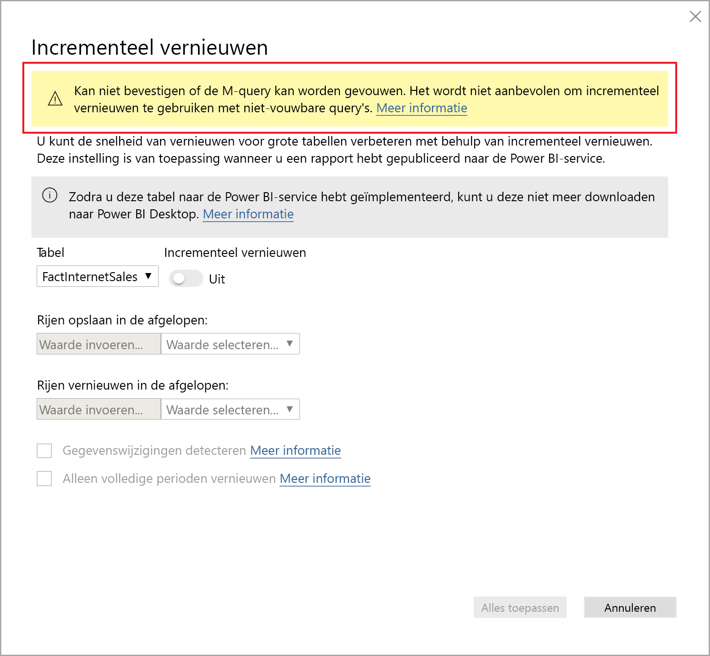

### <a name="define-the-refresh-policy"></a>Het vernieuwingsbeleid definiëren

Incrementele vernieuwing is beschikbaar in het contextmenu voor tabellen, met uitzondering van liveverbindingsmodellen.

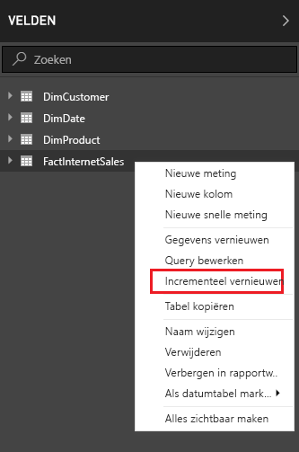

#### <a name="incremental-refresh-dialog"></a>Het dialoogvenster Incrementeel vernieuwen

Het dialoogvenster Incrementele vernieuwing wordt weergegeven. Gebruik de wisselknop om het dialoogvenster in te schakelen.

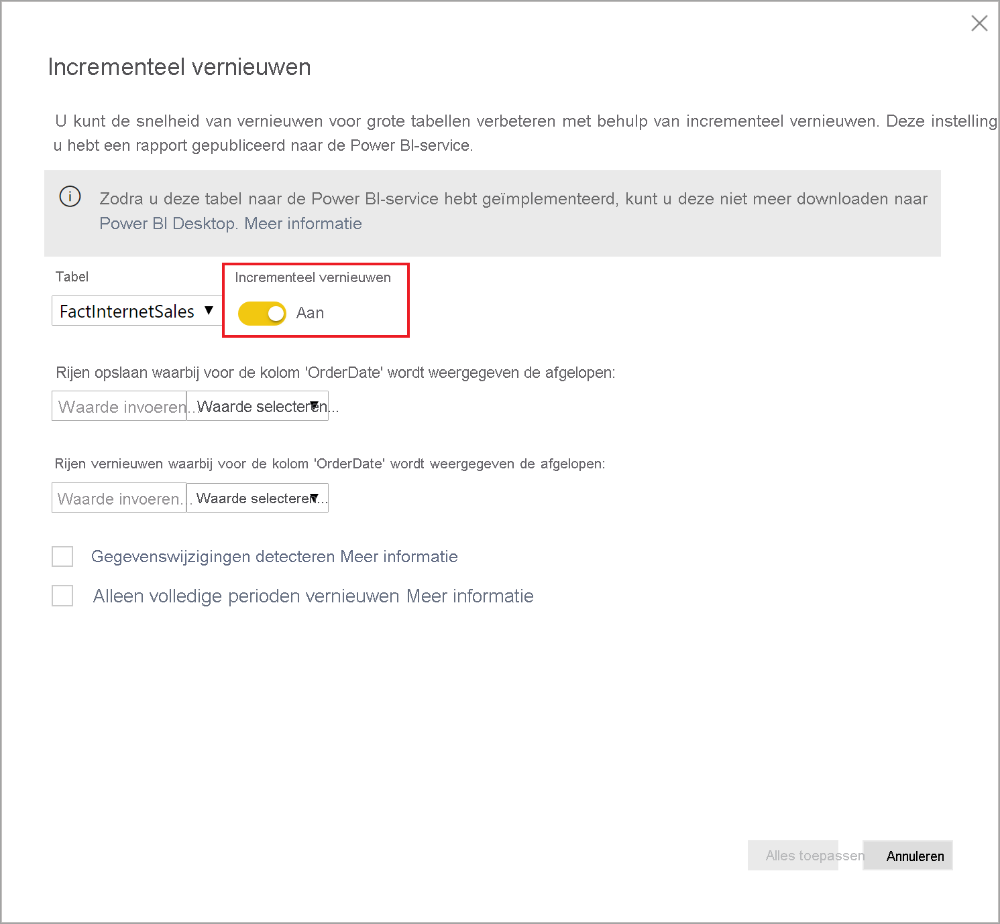

> [!NOTE]
> Als de Power Query-expressie voor de tabel niet naar de parameters met gereserveerde namen verwijst, wordt de wisselknop uitgeschakeld.

In de koptekst wordt het volgende uitgelegd:

- Vernieuwingsbeleid wordt gedefinieerd in Power BI Desktop; het wordt toegepast door vernieuwingsbewerkingen in de service.

- Als u het PBIX-bestand met een beleid voor incrementele vernieuwing uit de Power BI-service kunt downloaden, kan het niet worden geopend in Power BI Desktop. Dit wordt mogelijk in de toekomst wel ondersteund, maar vergeet niet dat deze gegevenssets zo groot kunnen worden dat het niet praktisch is om deze te downloaden en op een gewone desktop-pc te openen.

#### <a name="refresh-ranges"></a>Bereiken vernieuwen

In het volgende voorbeeld wordt vernieuwingsbeleid gedefinieerd voor het opslaan van in totaal vijf jaar aan gegevens plus de gegevens voor het huidige jaar tot aan de huidige datum, met incrementele vernieuwing van tien dagen aan gegevens. Met de eerste vernieuwingsbewerking worden historische gegevens geladen. De daaropvolgende vernieuwingen zijn incrementeel. Hiermee worden (indien gepland om dagelijks te worden uitgevoerd) de volgende bewerkingen uitgevoerd:

- Voeg een nieuwe dag aan gegevens toe.

- Vernieuw tien dagen tot aan de huidige datum.

- Verwijder kalenderjaren die ouder zijn dan vijf jaar voorafgaand aan de huidige datum. Als de huidige datum bijvoorbeeld 1 januari 2019 is, wordt het jaar 2013 verwijderd.

De eerste vernieuwing in de Power BI-service kan langer duren omdat alle vijf volledige kalenderjaren moeten worden geïmporteerd. Daarop volgende vernieuwingen kunnen in een fractie van die tijd worden voltooid.

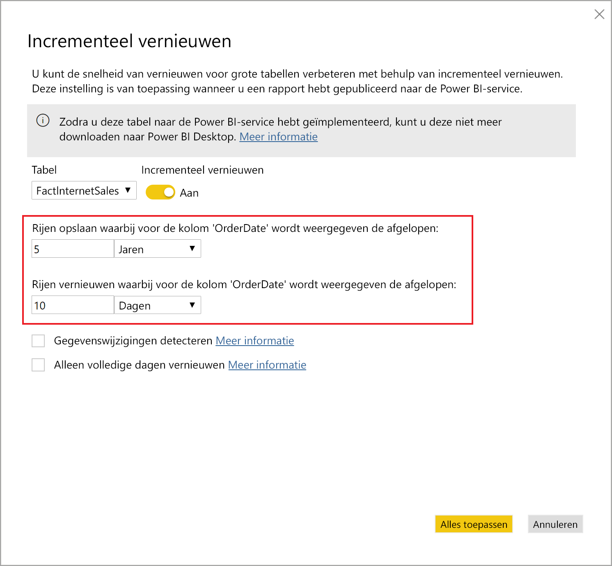


#### <a name="current-date"></a>Huidige datum

De *huidige datum* is gebaseerd op de systeemdatum op het moment van vernieuwen. Als gepland vernieuwen is ingeschakeld voor de gegevensset in de Power BI-service, wordt bij het bepalen van de huidige datum rekening gehouden met de opgegeven tijdzone. De tijdzone blijft bij zowel handmatig geactiveerde als geplande vernieuwingen gehandhaafd, indien beschikbaar. Bij een vernieuwing die bijvoorbeeld om 8 uur Pacific Time (VS en Canada) plaatsvindt, waarbij de tijdzone is opgegeven, wordt de huidige datum bepaald op basis van Pacific Time, niet GMT (wat anders de volgende dag zou zijn).

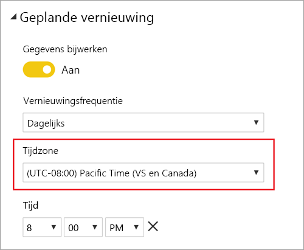

> [!NOTE]
> Definitie van deze bereiken is wellicht alles wat u nodig hebt. In dat geval kunt u meteen doorgaan naar de onderstaande publicatiestap. De extra vervolgkeuzelijsten zijn bedoeld voor geavanceerde functies.

### <a name="advanced-policy-options"></a>Geavanceerde beleidsopties

#### <a name="detect-data-changes"></a>Gegevenswijzigingen detecteren

Incrementele vernieuwing van tien dagen is veel efficiënter dan volledige vernieuwing van vijf jaar. Het kan echter nog beter. Als u het selectievakje **Gegevenswijzigingen detecteren** inschakelt, kunt u een datum/tijd-kolom selecteren voor de identificatie en die alleen wordt vernieuwd als er gegevens zijn gewijzigd. Hierbij wordt ervan uitgegaan dat een dergelijke kolom in het bronsysteem bestaat, wat gebruikelijk is voor controledoeleinden. **Dit mag niet dezelfde kolom zijn die wordt gebruikt voor het partitioneren van de gegevens met de parameters RangeStart/RangeEnd.** De maximumwaarde van deze kolom wordt geëvalueerd voor elke periode in het incrementele bereik. Als deze nog niet is gewijzigd sinds de laatste vernieuwing, hoeft u de periode niet te vernieuwen. In het voorbeeld kan hiermee het aantal dagen dat wordt vernieuwd nog eens verder worden beperkt van tien tot ongeveer twee dagen.

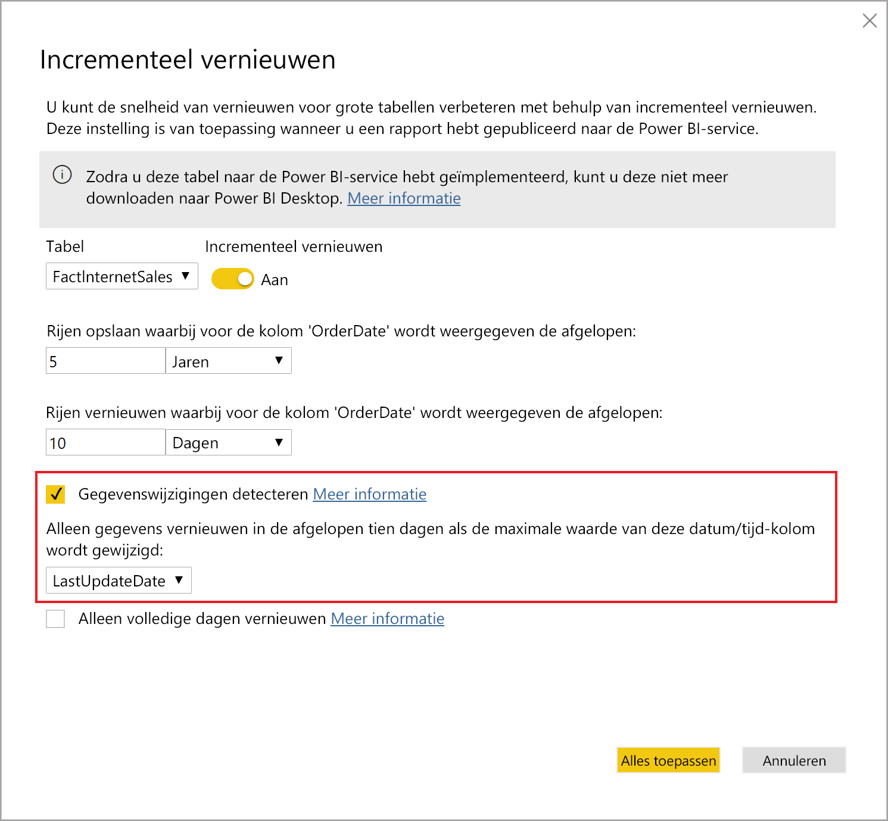

> [!TIP]
> Voor het huidige ontwerp moet de kolom die gegevenswijzigingen detecteert persistent zijn en in het cachegeheugen worden geplaatst. U kunt overwegen een van de volgende technieken te gebruiken om de kardinaliteit en het geheugenverbruik te beperken.
>
> Behoud alleen de maximumwaarde van deze kolom op het moment van de vernieuwing, bijvoorbeeld met behulp van een Power Query-functie.
>
> Beperk de nauwkeurigheid naar een niveau dat acceptabel is gezien uw vereisten voor de vernieuwingsfrequentie.
>
> Definieer een aangepaste query voor het detecteren van gegevenswijzigingen met behulp van het XMLA-eindpunt en voorkom dat de kolomwaarde helemaal wordt behouden. Zie 'Aangepaste query's voor het detecteren van gegevenswijzigingen' verderop voor meer informatie.

#### <a name="only-refresh-complete-periods"></a>Alleen volledige perioden vernieuwen

Stel dat u hebt gepland dat vernieuwing elke ochtend om 4:00 uur wordt uitgevoerd. Als gegevens in die vier uur in het bronsysteem worden weergegeven, wilt u mogelijk dat hier geen rekening mee wordt gehouden. Some zakelijke metrische gegevens, zoals vaten per dag in de olie- en gasindustrie, zijn niet logisch bij gedeeltelijke dagen.

Een ander voorbeeld is het vernieuwen van gegevens in een financieel systeem waar gegevens voor de vorige maand op de 12e kalenderdag van de maand worden goedgekeurd. U kunt het incrementele bereik instellen op 1 maand en de vernieuwing plannen op de twaalfde dag van de maand. Als u deze optie hebt ingeschakeld, worden bijvoorbeeld de gegevens van januari op 12 februari vernieuwd.

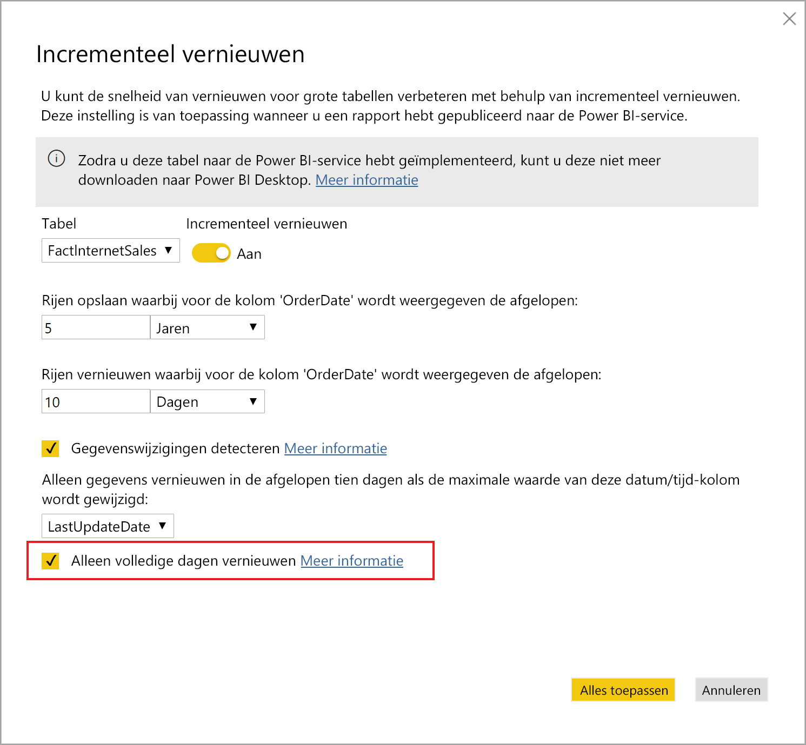

> [!NOTE]
> Vernieuwingsbewerkingen in de service worden in UTC-tijd uitgevoerd. Dit kan invloed hebben op de ingangsdatum en op volledige perioden. We zullen de mogelijkheid om de ingangsdatum voor een vernieuwingsbewerking binnenkort toevoegen.

## <a name="publish-to-the-service"></a>Publiceren naar de service

U kunt het model nu vernieuwen. De eerste vernieuwing kan langer duren omdat de historische gegevens moeten worden geïmporteerd. Daarop volgende vernieuwingen kunnen veel sneller worden uitgevoerd omdat hiervoor incrementele vernieuwing wordt gebruikt.

## <a name="query-timeouts"></a>Time-outs voor query’s

In het artikel [Problemen met vernieuwing oplossen](../connect-data/refresh-troubleshooting-refresh-scenarios.md) wordt uitgelegd dat vernieuwingsbewerkingen in de Power BI-service onderhevig zijn aan time-outs. Voor query's kan ook de standaardtime-out voor de gegevensbron worden ingesteld. De meeste relationele bronnen staan het overschrijven van time-outs in de M-expressie toe. De onderstaande expressie gebruikt bijvoorbeeld de [SQL Server-functie voor toegang tot gegevens](https://docs.microsoft.com/powerquery-m/sql-database) om dit op twee uur in te stellen. Elke periode die door de beleidsbereiken wordt gedefinieerd, stuurt een query in waarbij rekening wordt gehouden met de time-outinstelling voor de opdracht.

```powerquery-m
let
    Source = Sql.Database("myserver.database.windows.net", "AdventureWorks", [CommandTimeout=#duration(0, 2, 0, 0)]),
    dbo_Fact = Source{[Schema="dbo",Item="FactInternetSales"]}[Data],
    #"Filtered Rows" = Table.SelectRows(dbo_Fact, each [OrderDate] >= RangeStart and [OrderDate] < RangeEnd)
in
    #"Filtered Rows"
```

## <a name="xmla-endpoint-benefits-for-incremental-refresh"></a>Voordelen van XMLA-eindpunten voor incrementele vernieuwing

Het [XMLA-eindpunt](service-premium-connect-tools.md) voor gegevenssets in een Premium-capaciteit kan worden geconfigureerd voor lees- en schrijfbewerkingen. Dit kan aanzienlijke voordelen opleveren voor incrementele vernieuwing. Het aantal vernieuwingen via het XMLA-eindpunt is niet beperkt tot [48 vernieuwingen per dag](../connect-data/refresh-data.md#data-refresh) en er wordt geen [time-out voor geplande vernieuwingen](../connect-data/refresh-troubleshooting-refresh-scenarios.md#scheduled-refresh-timeout) opgelegd, wat nuttig kan zijn bij incrementele vernieuwingsscenario's.

### <a name="refresh-management-with-sql-server-management-studio-ssms"></a>Vernieuwingen beheren met SQL Server Management Studio (SSMS)

Als het XMLA-eindpunt voor lezen/schrijven is geconfigureerd, kan SSMS worden gebruikt voor het weergeven en beheren van partities die zijn gegenereerd door de toepassing met beleidsregels voor incrementeel vernieuwen. Zo kunt u bijvoorbeeld een specifieke historische partitie buiten het incrementele bereik vernieuwen om een back-up uit te voeren zonder alle historische gegevens te hoeven vernieuwen. U kunt ook SSMS gebruiken om historische gegevens voor zeer grote gegevenssets te laden door in batches historische partities toe te voegen of te vernieuwen.


#### <a name="override-incremental-refresh-behavior"></a>Gedrag van incrementeel vernieuwen onderschrijven

Met SSMS hebt u ook meer controle over het aanroepen van incrementele vernieuwingen via [Tabular Model Scripting Language (TMSL)](https://docs.microsoft.com/analysis-services/tmsl/tabular-model-scripting-language-tmsl-reference?view=power-bi-premium-current) en [Tabular Object Model (TOM, objectmodel in tabelvorm)](https://docs.microsoft.com/analysis-services/tom/introduction-to-the-tabular-object-model-tom-in-analysis-services-amo?view=power-bi-premium-current). Klik bijvoorbeeld in Objectverkenner in SSMS met de rechtermuisknop op een tabel en selecteer vervolgens de menuoptie **Tabel verwerken**. Klik vervolgens op de knop **Script** om een TMSL-vernieuwingsopdracht te genereren.

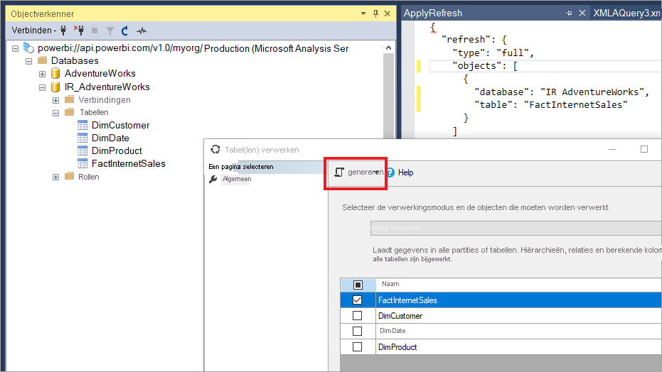

De volgende parameters kunnen worden ingevoegd in de TMSL-vernieuwingsopdracht om het standaardgedrag voor incrementeel vernieuwen te overschrijven.

- **applyRefreshPolicy**: als er een beleid voor incrementeel vernieuwen is gedefinieerd voor een tabel, bepaalt applyRefreshPolicy of het beleid wordt toegepast. Als het beleid niet wordt toegepast en u een volledige bewerking verwerkt, worden partitiedefinities ongewijzigd gelaten en worden alle partities in de tabel volledig vernieuwd. De standaardwaarde is Waar.

- **effectiveDate**: als er een incrementeel vernieuwingsbeleid wordt toegepast, moet de huidige datum bekend zijn om doorlopende tijdvensters voor het historische bereik en het incrementele bereik te bepalen. Met de parameter effectiveDate kunt u de huidige datum onderschrijven. Dit is handig voor testen, demo's en bedrijfsscenario's waarbij gegevens incrementeel worden vernieuwd tot een datum in het verleden of de toekomst (bijvoorbeeld budgetten in de toekomst). De standaardwaarde is de [huidige datum](#current-date).

```json
{ 
  "refresh": {
    "type": "full",

    "applyRefreshPolicy": true,
    "effectiveDate": "12/31/2013",

    "objects": [
      {
        "database": "IR_AdventureWorks", 
        "table": "FactInternetSales" 
      }
    ]
  }
}
```

### <a name="custom-queries-for-detect-data-changes"></a>Aangepaste query's voor het detecteren van gegevenswijzigingen

U kunt TMSL en/of TOM gebruiken om het gedrag van gedetecteerde gegevenswijzigingen te overschrijven. Zo kan niet alleen worden voorkomen dat de kolom last-update in het cachegeheugen behouden blijft, maar wordt het ook mogelijk om via ETL-processen configuratie-/instructietabellen voor te bereiden om alleen de partities te markeren die moeten worden vernieuwd. Het incrementele vernieuwingsproces wordt hierdoor efficiënter, omdat alleen de benodigde perioden worden vernieuwd, ongeacht hoe lang geleden gegevens zijn gewijzigd.

De pollingExpression is bedoeld als lichtgewicht M-uitdrukking of naam van een andere M-query. Deze moet een scalaire waarde retourneren en wordt uitgevoerd voor elke partitie. Als de geretourneerde waarde afwijkt van de laatste keer dat een incrementele vernieuwing is uitgevoerd, wordt de partitie gemarkeerd voor volledige verwerking.

In het volgende voorbeeld worden alle 120 maanden in het historische bereik voor teruggezette wijzigingen opgenomen. Als u 120 maanden opgeeft in plaats van 10 jaar, is gegevenscompressie mogelijk niet zo efficiënt, maar vermijdt u dat een volledig historisch jaar moet worden vernieuwd, wat duurder zou zijn dan wanneer een maand voldoende is voor een teruggezette wijziging.

```json
"refreshPolicy": {
    "policyType": "basic",
    "rollingWindowGranularity": "month",
    "rollingWindowPeriods": 120,
    "incrementalGranularity": "month",
    "incrementalPeriods": 120,
    "pollingExpression": "<M expression or name of custom polling query>",
    "sourceExpression": [
    "let ..."
    ]
}
```

## <a name="metadata-only-deployment"></a>Implementatie van alleen metagegevens

Wanneer u een nieuwe versie van een PBIX-bestand publiceert van Power BI Desktop naar een werkruimte in Power BI Premium en er al een gegevensset met dezelfde naam bestaat, wordt u gevraagd of u de bestaande gegevensset wilt vervangen.


In sommige gevallen wilt u de gegevensset wellicht niet vervangen, met name bij incrementele vernieuwingen. De gegevensset kan in Power BI Desktop veel kleiner zijn dan die in de service. Als op de gegevensset in de service een beleid voor incrementeel vernieuwen is toegepast, kan deze enkele jaren aan historische gegevens bevatten die verloren gaan als de gegevensset wordt vervangen. Het vernieuwen van alle historische gegevens kan uren duren en resulteert in downtime voor gebruikers van het systeem.

In plaats daarvan is het beter om een implementatie van alleen metagegevens uit te voeren. Hierdoor kunnen nieuwe objecten worden geïmplementeerd zonder dat er historische gegevens verloren gaan. Als u bijvoorbeeld een aantal metingen hebt toegevoegd, kunt u alleen de nieuwe metingen implementeren zonder dat u de gegevens hoeft te vernieuwen, en zo veel tijd besparen.

Als het XMLA-eindpunt is geconfigureerd voor lezen/schrijven, kunt u ook gebruikmaken van compatibele hulpprogramma's. ALM Toolkit is bijvoorbeeld een hulpprogramma voor het vergelijken van schema's voor Power BI-gegevenssets en kan worden gebruikt om alleen metagegevens te implementeren.

Download en installeer de meest recent versie van ALM Toolkit van de [GitHub-opslagplaats voor Analysis Services](https://github.com/microsoft/Analysis-Services/releases). Koppelingen naar documentatie en informatie over ondersteuning zijn beschikbaar via het lint Help. Als u een implementatie van alleen metagegevens wilt uitvoeren, voert u een vergelijking uit en selecteert u het actieve exemplaar van Power BI Desktop als de bron en de bestaande gegevensset in de service als het doel. Beoordeel de verschillen die worden weergegeven en sla de tabelupdate met incrementele vernieuwingspartities over of gebruik het dialoogvenster Opties om partities voor tabelupdates te behouden. Valideer de selectie om de integriteit van het doelmodel te controleren en werk deze vervolgens bij.


## <a name="see-also"></a>Zie ook

[Gegevenssetconnectiviteit met het XMLA-eindpunt](service-premium-connect-tools.md)   
[Problemen met vernieuwingsscenario's oplossen](../connect-data/refresh-troubleshooting-refresh-scenarios.md)   
