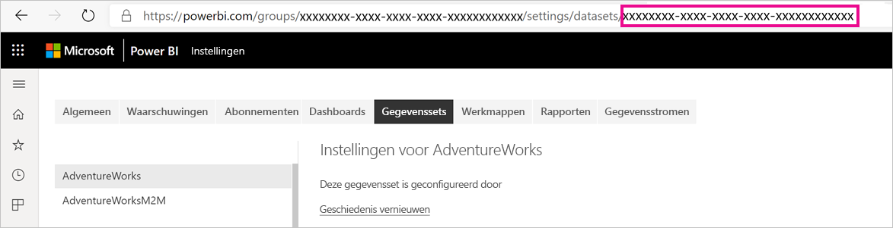
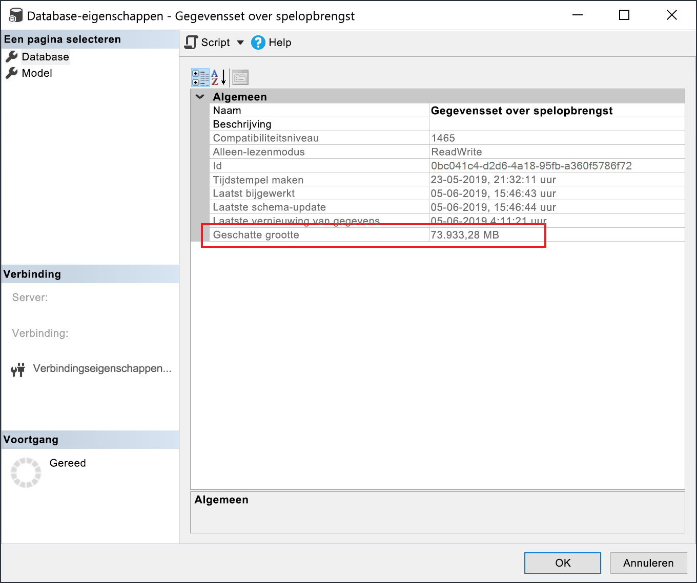

# <a name="large-datasets-in-power-bi-premium"></a>Grote gegevenssets in Power BI Premium

Gegevens van Power BI-gegevenssets kunnen sterk gecomprimeerd in het cachegeheugen worden opgeslagen voor geoptimaliseerde queryprestaties, waardoor een snelle interactie tussen gebruikers mogelijk wordt. Bij Premium-capaciteiten kunnen grote gegevenssets, die groter zijn dan de standaardlimiet van 10 GB, worden ingeschakeld dankzij de instelling **Opslagindeling voor grote gegevenssets**. Wanneer deze functie is ingeschakeld, wordt de grootte van de gegevensset beperkt door de grootte van de *Premium-capaciteit* of de maximale grootte die is ingesteld door de beheerder.

Grote gegevenssets kunnen worden ingeschakeld voor alle Premium P-SKU's en Embedded A-SKU's. De maximale grootte van de gegevensset in Premium is vergelijkbaar met Azure Analysis Services, wat betreft de beperkingen van de grootte van het gegevensmodel.

Hoewel de opslagindeling voor grote gegevenssets nodig is voor gegevenssets groter dan 10 GB, biedt deze extra voordelen wanneer u de instelling inschakelt. Als u van plan bent om hulpprogramma's op basis van XMLA-eindpunten te gebruiken voor schrijfbewerkingen in gegevenssets, kunt u beter de instelling inschakelen, zelfs voor gegevenssets die u niet per se zou aanmerken als een *grote* gegevensset. Wanneer deze functie is ingeschakeld, kan de opslagindeling voor grote gegevenssets voor betere prestaties van XMLA-schrijfbewerkingen zorgen.

Grote gegevenssets in de service hebben geen invloed op de uploadgrootte van Power BI Desktop modellen. Die is nog steeds beperkt tot 10 GB. In plaats daarvan kunnen in de service gegevenssets groter worden dan 10 GB bij een vernieuwing.

## <a name="enable-large-datasets"></a>Grote gegevenssets inschakelen

In de volgende stappen wordt beschreven hoe u grote gegevenssets inschakelt voor een nieuw model dat naar de service wordt gepubliceerd. Voor bestaande gegevenssets is alleen stap drie nodig.

1. Maak een model in Power BI Desktop. Als uw gegevensset groter wordt en geleidelijk meer geheugen verbruikt, moet u [Incrementeel vernieuwen](service-premium-incremental-refresh.md) configureren.

1. Publiceer het model naar de service als gegevensset.

1. Vouw in de service > Gegevensset > **Instellingen** **Opslagindeling voor grote gegevenssets** uit, klik op de schuifregelaar om deze **in te schakelen** en klik vervolgens op **Toepassen**.

    :::image type="content" source="media/service-premium-large-models/enable-large-dataset.png" alt-text="De schuifregelaar voor grote gegevenssets inschakelen":::

1. Roep een vernieuwing aan om historische gegevens te laden op basis van het beleid voor incrementeel vernieuwen. Tijdens de eerste keer vernieuwen kan het even duren voordat de geschiedenis is geladen. De volgende vernieuwingsbewerkingen zouden sneller moeten zijn, afhankelijk van uw beleid voor incrementeel vernieuwen.

## <a name="set-default-storage-format"></a>Standaardopslagindeling instellen

Voor alle nieuwe gegevenssets die in een aan Premium-capaciteit toegewezen werkruimte zijn gemaakt, kan standaard de opslagindeling voor grote gegevenssets zijn ingeschakeld.

1. Klik in de werkruimte op **Instellingen** > **Premium**.

1. Selecteer in **Standaardopslagindeling** **Opslagindeling voor grote gegevenssets** en klik vervolgens op **Opslaan**.

    :::image type="content" source="media/service-premium-large-models/default-storage-format.png" alt-text="Standaardopslagindeling inschakelen":::

### <a name="enable-with-powershell"></a>Inschakelen met PowerShell

U kunt ook de opslagindeling voor grote gegevenssets inschakelen met behulp van PowerShell. U moet beschikken over capaciteitsbeheer en beheerdersbevoegdheden voor werkruimten hebben om de PowerShell-cmdlets uit te voeren.

1. Zoek de gegevensset-ID (GUID) op. Op het tabblad **Gegevenssets** voor de werkruimte, onder de instellingen van de gegevensset, ziet u de ID in de URL.

    

1. Installeer de module [MicrosoftPowerBIMgmt](/powershell/module/microsoftpowerbimgmt.data/) van een Power shell-beheerprompt.

    ```powershell
    Install-Module -Name MicrosoftPowerBIMgmt
    ```

1. Voer de volgende cmdlets uit om u aan te melden en de opslagmodus voor de gegevensset te controleren.

    ```powershell
    Login-PowerBIServiceAccount

    (Get-PowerBIDataset -Scope Organization -Id <Dataset ID> -Include actualStorage).ActualStorage
    ```

    Het antwoord moet het volgende zijn. De opslagmodus is ABF (Analysis Services back-upbestand). Dit is de standaardinstelling.

    ```
    Id                   StorageMode

    --                   -----------

    <Dataset ID>         Abf
    ```

1. Voer de volgende cmdlets uit om de opslagmodus in te stellen. Het kan een paar seconden duren om naar Premium-bestanden te converteren.

    ```powershell
    Set-PowerBIDataset -Id <Dataset ID> -TargetStorageMode PremiumFiles

    (Get-PowerBIDataset -Scope Organization -Id <Dataset ID> -Include actualStorage).ActualStorage
    ```

    Het antwoord moet het volgende zijn. De opslagmodus is nu ingesteld op Premium-bestanden.

    ```
    Id                   StorageMode
    
    --                   -----------
    
    <Dataset ID>         PremiumFiles
    ```

U kunt de status van gegevenssetconversies controleren van en naar Premium-bestanden met behulp van de cmdlet [Get-PowerBIWorkspaceMigrationStatus](/powershell/module/microsoftpowerbimgmt.workspaces/get-powerbiworkspacemigrationstatus).

## <a name="dataset-eviction"></a>Gegevenssets verwijderen

Power BI maakt gebruik van dynamisch geheugenbeheer om inactieve gegevenssets uit het geheugen te verwijderen. Power BI verwijdert gegevenssets zodat andere gegevenssets kunnen worden geladen om query's af te handelen. Met dynamisch geheugenbeheer kan de som van de grootte van gegevenssets aanzienlijk groter zijn dan het geheugen dat beschikbaar is op de capaciteit, maar een enkele gegevensset moet in het geheugen passen. Zie [Hoe capaciteiten functioneren](service-premium-what-is.md#how-capacities-function)voor meer informatie over dynamisch geheugenbeheer.

U moet rekening houden met de gevolgen van het verwijderen van grote modellen. Ondanks een relatief snelle laadtijd van gegevenssets kan er nog steeds een merkbare vertraging optreden voor gebruikers als ze moeten wachten totdat grote verwijderde gegevenssets opnieuw worden geladen. Daarom wordt de functie voor grote modellen, in zijn huidige vorm, voornamelijk aanbevolen voor capaciteiten die zijn toegewezen aan vereisten voor bedrijfs-BI, en niet voor een combinatie met vereisten voor selfservice-BI. Capaciteiten die zijn toegewezen voor vereisten voor bedrijfs-BI activeren minder vaak verwijderingen en hoeven minder vaak gegevenssets opnieuw te laden. Anderzijds kunnen capaciteiten voor selfservice-BI veel kleine gegevenssets bevatten die vaker in en uit het geheugen worden geladen.

## <a name="checking-dataset-size"></a>De grootte van gegevenssets controleren

Nadat u historische gegevens hebt geladen, kunt u [SQL Server Management Studio](/sql/ssms/download-sql-server-management-studio-ssms) gebruiken via het [XMLA-eindpunt](service-premium-connect-tools.md) om de geschatte grootte van de gegevensset in het venster met modeleigenschappen te controleren.



U kunt ook de grootte van de gegevensset controleren door de volgende DMV-query's vanuit SQL Server Management Studio uit te voeren. Tel de kolommen DICTIONARY\_SIZE en USED\_SIZE uit de uitvoer bij elkaar op om de grootte van de gegevensset in bytes weer te geven.

```sql
SELECT * FROM SYSTEMRESTRICTSCHEMA
($System.DISCOVER_STORAGE_TABLE_COLUMNS,
 [DATABASE_NAME] = '<Dataset Name>') //Sum DICTIONARY_SIZE (bytes)

SELECT * FROM SYSTEMRESTRICTSCHEMA
($System.DISCOVER_STORAGE_TABLE_COLUMN_SEGMENTS,
 [DATABASE_NAME] = '<Dataset Name>') //Sum USED_SIZE (bytes)
```

## <a name="limitations-and-considerations"></a>Beperkingen en overwegingen

Houd bij het gebruik van grote gegevenssets rekening met de volgende beperkingen:

- **Er zijn nieuwe werkruimten vereist**: Grote gegevenssets werken alleen met [Nieuwe werkruimten](../collaborate-share/service-create-the-new-workspaces.md).

- **Downloaden in Power BI Desktop**: als een gegevensset wordt opgeslagen in Premium-bestanden, mislukt [downloaden als een pbix-bestand](../create-reports/service-export-to-pbix.md).
- **Ondersteunde regio's**: Grote gegevenssets worden ondersteund in alle Azure-regio's die ondersteuning bieden voor Premium Files-opslag. Zie [Beschikbare producten per regio](https://azure.microsoft.com/global-infrastructure/services/?products=storage) en raadpleeg de tabel in de volgende sectie voor meer informatie.

- **Maximale grootte van gegevensset instellen**: De maximale grootte van de gegevensset kan worden ingesteld door beheerders. De maximum waarde kan worden ingesteld van 0,1 GB tot de maximale capaciteit van de SKU.

## <a name="region-availability"></a>Beschikbaarheid in regio’s

Grote gegevenssets in Power BI zijn alleen beschikbaar in bepaalde Azure-regio’s die ondersteuning bieden voor [Azure Premium Files Storage](/azure/storage/files/storage-files-planning#storage-tiers).

De volgende lijst biedt regio’s waarin grote gegevenssets in Power BI beschikbaar zijn. Regio's die niet in de volgende lijst staan, worden niet ondersteund voor grote modellen:

|Azure-regio  |Afkorting van Azure-regio’s  |
|---------|---------|
|Australië - oost     | australiaeast        |
|Australië - zuidoost     | australiasoutheast        |
|Canada - oost     | canadaeast        |
|Canada - midden     | canadacentral        |
|India - centraal     | centralindia        |
|VS - centraal     | centralus        |
|Azië - oost     | eastasia        |
|VS - oost     | eastus        |
|VS - oost 2     | eastus2        |
|Japan - oost     | japaneast        |
|Japan - west     | japanwest        |
|Korea - centraal     | koreacentral        |
|Korea - zuid     | koreasouth        |
|VS - noord-centraal     | northcentralus        |
|Europa - noord     | northeurope        |
|VS - zuid-centraal     | southcentralus        |
|Azië - zuidoost     | southeastasia        |
|Verenigd Koninkrijk Zuid     | uksouth        |
|Verenigd Koninkrijk West     | ukwest        |
|Europa -west     | westeurope        |
|India - west     | westindia        |
|VS - west     | westus        |
|VS - west 2     | westus2        |

## <a name="next-steps"></a>Volgende stappen

De volgende koppelingen bevatten informatie die nuttig kan zijn voor het werken met grote modellen:

* [Azure Premium Files Storage](/azure/storage/files/storage-files-planning#storage-tiers)
* [Multi-Geo-ondersteuning voor Power BI Premium configureren](service-admin-premium-multi-geo.md)
* [Uw eigen versleutelingssleutels gebruiken voor Power BI](service-encryption-byok.md)
* [Hoe capaciteiten functioneren](service-premium-what-is.md#how-capacities-function)
* [Incrementeel vernieuwen:](service-premium-incremental-refresh.md)

Power BI heeft Power BI Premium Gen2 geïntroduceerd als preview-aanbieding, waardoor de Power BI Premium-ervaring als volgt wordt aangepast met verbeteringen:
* Prestaties
* Licenties per gebruiker
* Grotere schaal
* Verbeterde metrische gegevens
* Automatisch schalen
* Minder beheeroverhead

Zie [Power BI Premium Generation 2 (preview-versie)](service-premium-what-is.md#power-bi-premium-generation-2-preview) voor meer informatie over Power BI Premium Gen2.
