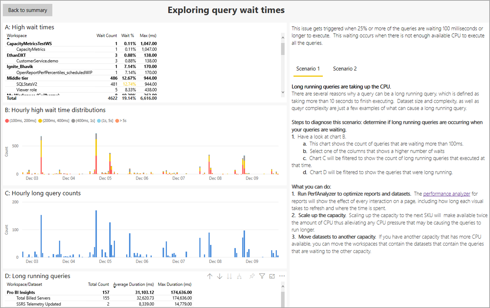
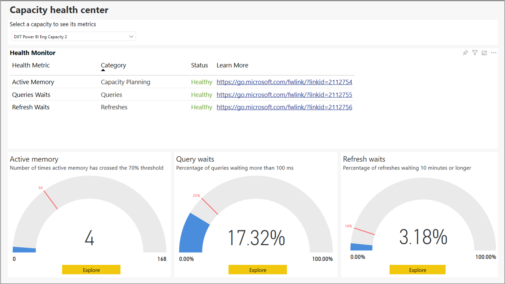

# Power BI Premium Metrics-app

U kunt de **Power BI Premium Metrics-app gebruiken** om de status en capaciteit van uw Power BI Premium-abonnement te beheren. Met de app gebruiken beheerders het **Centrum voor capaciteitsstatus** van de app voor het bekijken en werken met indicatoren die de status van de Premium-capaciteit controleren. De Metrics-app bestaat uit de landingspagina, het **Centrum voor capaciteitsstatus** en informatie over drie belangrijke metrische gegevens:

* Actief geheugen
* Querywachttijden
* Vernieuwingswachttijden

In de volgende secties worden de landingspagina en de drie pagina's van het rapport met metrische gegevens in detail beschreven. 

> [!IMPORTANT]
> Als er een hoog resourcegebruik is in uw Power BI Premium-capaciteit, wat leidt tot problemen met prestaties of betrouwbaarheid, kunt u e-mailmeldingen ontvangen om het probleem te identificeren en op te lossen. Dit kan een gestroomlijnde manier zijn om problemen met overbelaste capaciteiten op te lossen. Zie [Meldingen over capaciteit en betrouwbaarheid](service-interruption-notifications.md#capacity-and-reliability-notifications) voor meer informatie.

## Centrum voor Premium-capaciteitsstatus

Wanneer u de **Power BI Premium Metrics-app opent** ziet u het **Centrum voor capaciteitsstatus**. Hier krijgt u een overzicht van de status van uw Power BI Premium-capaciteit.

Op de landingspagina kunt u de Power BI Premium-capaciteit selecteren die u wilt bekijken, voor het geval uw organisatie meerdere Premium-abonnementen heeft. Als u een Premium-capaciteit wilt bekijken, selecteert u de vervolgkeuzelijst boven aan de pagina met de naam **Een capaciteit selecteren om de bijbehorende metrische gegevens te bekijken**.

De drie KPI's tonen de huidige status van de geselecteerde Premium-capaciteit op basis van de instellingen die worden toegepast op elk van de drie KPI's. 

Als u specifieke informatie over elke KPI wilt bekijken, selecteert u de knop **Verkennen** onder aan het visuele element van een KPI en wordt de detailpagina weergegeven. In de volgende secties vindt u een beschrijving van elke KPI en de pagina met de details.

## De metrische gegevens van het actieve geheugen

De metrische gegevens van het **actieve geheugen** maken deel uit van de categorie *capaciteitsplanning*, wat een goede statusindicator is voor het resourceverbruik, zodat u de capaciteit zo nodig kunt aanpassen om de schaal van de capaciteit te plannen. 

Het **actieve geheugen** is het geheugen dat wordt gebruikt voor het verwerken van gegevenssets die momenteel in gebruik zijn en die daarom niet worden verwijderd wanneer er geheugen nodig is. De metrische gegevens van het actieve geheugen geven aan of uw capaciteit extra belasting kan verwerken of dat de huidige belasting van de capaciteit al (bijna) bereikt is. Het actieve geheugen dat momenteel wordt gebruikt, betekent dat er minder geheugen beschikbaar is voor het ondersteunen van extra vernieuwingen en query's. 

De KPI van het **actieve geheugen** meet hoe vaak het actieve geheugen van de capaciteit de drempelwaarde van 70% vijftig maal heeft overschreden (de markering is ingesteld op 30% van de laatste zeven dagen), wat aangeeft dat de capaciteit het punt bereikt waarop gebruikers prestatieproblemen met query's kunnen krijgen.

De visuele meter die in deze sectie wordt getoond, laat zien dat de capaciteit de afgelopen zeven dagen, vanaf het moment dat het rapport voor het laatst is vernieuwd, de drempelwaarde van 70% vier keer heeft overschreden, opgesplitst in buckets per uur. De maximumwaarde van de meter, 168, vertegenwoordigt de laatste zeven dagen, in uren.

Voor meer informatie over de KPI van het actieve geheugen, klikt u op de knop **Verkennen** om een rapportpagina weer te geven met specifieke visualisaties van de gedetailleerde metrische gegevens, samen met een probleemoplossingshandleiding die in de rechterkolom op de pagina wordt weergegeven. 

Er worden twee scenario's uitgelegd, die u op de rapportpagina kunt weergeven door **Scenario 1** of **Scenario 2** op de pagina te selecteren. 

De probleemoplossingshandleidingen die bij de scenario's behoren, bieden gedetailleerde uitleg over wat de metrische gegevens betekenen, zodat u beter inzicht krijgt in de status van de capaciteit en wat u kunt doen om problemen te verhelpen. 

Deze twee scenario's worden gedetailleerd beschreven in de volgende secties.

### Scenario 1: de huidige belasting is te hoog 

Als u wilt bepalen of de capaciteit voldoende geheugen beschikbaar heeft om de toebedeelde werkbelastingen te voltooien, raadpleegt u het eerste visuele element op de pagina: **A: Percentages gebruikt geheugen**, waarin het geheugen wordt weergegeven dat wordt gebruikt door gegevenssets die actief worden verwerkt, en dus niet kunnen worden verwijderd.

De alarmdrempelwaarde voor een alarm, de rode stippellijn is, markeert incidenten die 90% van het geheugen gebruiken.

De waarschuwingsdrempelwaarde voor een waarschuwingsmelding, de gele stippellijn is, markeert incidenten die 70% van het geheugen gebruiken. 

Met de zwarte stippellijn wordt de trendlijn van het geheugengebruik aangegeven, gebaseerd op het geheugengebruik van het huidige capaciteitsverbruik volgens de tijdlijn in de grafiek.

Als het actieve geheugen vaak boven de alarmdrempelwaarde (rode stippellijn) en trendlijn van het geheugen (zwarte stippellijn) uitkomt, duidt dit op een hoog capaciteitsgebruik, waardoor mogelijk wordt voorkomen dat gedurende die tijden extra gegevenssets in het geheugen worden geladen. 

In dergelijke gevallen moet u goed op de andere grafieken op de pagina kijken om beter te kunnen bepalen welk geheugen wordt gebruikt en waarom er zoveel zo vaak wordt verbruikt, en hoe u de capaciteit kunt verdelen of optimaliseren, of, indien nodig, omhoog kunt schalen. 

Het tweede visuele element op de pagina, **B: Aantal geladen actieve gegevenssets per uur** geeft de aantallen weer van het maximum aantal gegevenssets dat in het geheugen is geladen, in buckets per uur. 

Het derde visuele element, **C: De aanwezigheid van gegevenssets in het geheugen** is een tabel waarin de gegevensset wordt vermeld op naam van de werkruimte, naam van de gegevensset, de gedecomprimeerde grootte van de gegevensset in het geheugen, en wordt de reden voor het laden in het geheugen uitgelegd (zoals een vernieuwing en/of een query die wordt uitgevoerd).

#### Diagnose van scenario 1

Consistent hoog actief geheugengebruik kan ertoe leiden dat gegevenssets die actief worden gebruikt, gedwongen worden verwijderd, of dat wordt voorkomen dat nieuwe gegevenssets worden geladen. De volgende stappen kunnen u helpen bij het vaststellen van problemen

1. Kijk eens naar grafiek *A: Percentages gebruikt geheugen*

    **a.** Als grafiek A laat zien dat de alarmdrempelwaarde (90%) vaak en/of gedurende opeenvolgende uren is overschreden, is de geheugencapaciteit te vaak te laag. In de onderstaande grafiek ziet u dat de waarschuwingsdrempelwaarde (70%) vier keer is overschreden.

    

    **b.** Grafiek *B: Aantal geladen actieve gegevenssets per uur* toont het maximum aantal unieke gegevenssets dat in het geheugen wordt geladen (in buckets per uur). Als u een balk in het visuele element selecteert, worden de redenen voor het visualiseren van de gegevenssets in het geheugen kruislings gefilterd.  

         

    **c.** Raadpleeg tabel **Aanwezigheid van gegevenssets in het geheugen** voor een lijst met de in het geheugen geladen gegevenssets. Sorteer op *Grootte van de gegevensset (MB)* om de gegevenssets te markeren die het meeste geheugen gebruiken. Capaciteitsbewerkingen zijn geclassificeerd als *interactief* of *achtergrond*. Interactieve bewerkingen zijn onder meer het weergeven van aanvragen van en reageren op interactie van gebruikers (filteren, query's op Q&A uitvoeren enzovoort). Het totaal aantal query's en het totaal aantal vernieuwingen geven een idee of er sterke geheugen-belastende, interactieve bewerkingen (query's) of achtergrondbewerkingen (vernieuwingen) op de gegevensset worden uitgevoerd. Het is belangrijk om te begrijpen dat interactieve bewerkingen altijd voorrang krijgen boven bewerkingen op de achtergrond om een zo goed mogelijke gebruikerservaring te garanderen. Als er onvoldoende resources zijn, worden de achtergrondbewerkingen aan een wachtrij toegevoegd en worden ze verwerkt zodra er resources vrijkomen. Achtergrondbewerkingen, zoals vernieuwingen van datasets en AI-functies, kunnen tijdens het verwerken worden gestopt door de Power BI-service en aan een wachtrij toegevoegd.
    
      

#### Oplossingen voor scenario 1

U kunt de volgende stappen uitvoeren om problemen met scenario 1 op te lossen:

1. **Capaciteit omhoog schalen**: het omhoog schalen van de capaciteit naar de volgende SKU maakt tweemaal zoveel geheugen beschikbaar dan dat van de huidige SKU, waarmee een eventuele te hoge geheugenbelasting wordt voorkomen.

2. **Gegevenssets naar een andere capaciteit verplaatsen**: als u over een capaciteit met meer geheugen beschikt, kunt u de werkruimten met die gegevenssets naar die capaciteit verplaatsen.

### Scenario 2: toekomstige belasting overschrijdt limieten

Als u wilt bepalen of de capaciteit voldoende geheugen beschikbaar heeft om de toebedeelde werkbelastingen te voltooien, kunt u visueel element **A: Percentages gebruikt geheugen** boven aan de pagina raadplegen. Hiermee wordt het geheugen aangegeven dat door gegevenssets wordt gebruikt die actief worden verwerkt en dus niet kunnen worden verwijderd. De zwarte stippellijn geeft de trends aan. In een capaciteit met een hoge geheugenbelasting wordt in hetzelfde visuele element de trendlijn voor het geheugen (zwarte stippellijn) in opwaartse richting getoond. Dit betekent dat mogelijk extra gegevenssets op dat moment niet in het geheugen kunnen worden geladen. De trendlijn, de zwarte stippellijn, toont de trend van de toename op basis van de zeven dagen aan gegevens. 

#### Diagnose van scenario 2

Als u het scenario 2 wilt diagnosticeren, bepaalt u of de trendlijn een opwaartse trend laat zien in de richting van een waarschuwings- of alarmdrempelwaarde. 

1. Kijk eens naar **grafiek A:**

    

    **a.** Als de grafiek een opwaartse lijn toont, geeft dat aan dat het geheugenverbruik in de afgelopen zeven dagen is toegenomen.

    **b.** Ga uit van de huidige toename en voorspel wanneer de trendlijn de waarschuwingsdrempelwaarde (de gele stippellijn) overschrijdt.

    **c.** Blijf de trendlijn ten minste om de dag controleren om na te gaan of de trend aanhoudt.

#### Oplossingen voor scenario 2

U kunt de volgende stappen uitvoeren om problemen met scenario 2 op te lossen:

1. **Capaciteit omhoog schalen**: het omhoog schalen van de capaciteit naar de volgende SKU maakt tweemaal zoveel geheugen beschikbaar dan dat van de huidige SKU, waarmee een eventuele te hoge geheugenbelasting wordt voorkomen.

2. **Gegevenssets naar een andere capaciteit verplaatsen**: als u over een capaciteit met meer geheugen beschikt, kunt u de werkruimten met die gegevenssets naar die capaciteit verplaatsen.

## Metrische gegevens van querywachttijden

De categorie **Query's** geeft aan of gebruikers te maken kunnen krijgen met visuele rapportelementen die traag of niet meer reageren. **Querywachttijden**: de tijd die de query nodig heeft om de uitvoerbewerking te starten vanaf het moment dat deze is geactiveerd. Met deze KPI wordt gemeten of 25% of meer van de query's van de geselecteerde capaciteit er 100 milliseconden of langer over doen om te worden uitgevoerd. Querywachttijden doen zich voor als er niet voldoende CPU beschikbaar is om alle wachtende query's uit te voeren. 

De meter in dit visuele element laat zien dat in de afgelopen zeven dagen, vanaf het moment dat het rapport voor het laatst is vernieuwd, 17,32% van de query's een wachttijd van meer dan 100 milliseconden heeft gehad. 

Als u meer wilt weten over de KPI van querywachttijden, klikt u op de knop **Verkennen** om een rapportpagina weer te geven met een visualisatie van de relevante metrische gegevens en een probleemoplossingshandleiding in de rechterkolom op de pagina. De probleemoplossingshandleiding bevat twee scenario's, elk met een gedetailleerde uitleg over de metrische gegevens, de status van de capaciteit en wat u kunt doen om het probleem te verhelpen.

In de volgende secties worden beide scenario's met een querywachttijd achtereenvolgens besproken.

### Scenario 1: langdurige query's verbruiken CPU-capaciteit

In scenario 1 nemen langdurige query's veel CPU-capaciteit in beslag. 

U kunt onderzoeken of slechte rapportprestaties worden veroorzaakt door een overbelaste capaciteit of door een slecht ontworpen gegevensset of rapport. Er zijn verschillende redenen waarom een query gedurende een lange periode kan worden uitgevoerd. Hiervoor geldt als maat een uitvoerbewerking die langer duurt dan tien seconden. De grootte en de complexiteit van de gegevensset, evenals de complexiteit van de query, zijn slechts enkele voorbeelden van de oorzaak van een langdurige query. 

Op de rapportpagina worden de volgende visuele elementen weergegeven: 

* De bovenste tabel met titel **A: Hoge wachttijden** vermeldt de gegevenssets met query's met een wachttijd. 
* **B: Distributies met hoge wachttijden per uur** toont de distributie van hoge wachttijden. 
* Grafiek **C: Aantal langdurige query's per uur**  geeft het aantal langlopende query's weer die zijn uitgevoerd, opgesplitst in buckets per uur.
* Het laatste visuele element, tabel **D: Langdurige query's**, vermeldt de langdurige query's en de bijbehorende statistieken.

U kunt stappen uitvoeren om problemen met querywachttijden op te sporen en op te lossen, zoals hierna wordt beschreven.

#### Diagnose van scenario 1

U kunt eerst bepalen of langdurige query's plaatsvinden wanneer uw query's in de wacht staan. 

Bekijk **grafiek B**. Deze toont het aantal query's met wachttijden van meer dan 100 ms. Selecteer een van de kolommen met een groot aantal wachttijden.

Wanneer u op een kolom met een hoge wachttijd klikt, wordt **grafiek C** gefilterd om het aantal langlopende query's weer te geven die tijdens die periode worden uitgevoerd, zoals weergegeven in de volgende afbeelding:

Daarnaast wordt **grafiek D** gefilterd om de langdurige query's weer te geven tijdens de geselecteerde periode.

#### Oplossingen voor scenario 1

Hier volgen de stappen die u kunt uitvoeren om problemen te verhelpen in scenario 1:

1. **Performance Analyzer uitvoeren om rapporten en gegevenssets te optimaliseren**: Performance Analyzer voor rapporten toont het effect van elke interactie op een pagina, inclusief hoe lang het duurt voor elk visueel element wordt vernieuwd en waaraan de tijd wordt besteed.

2. **Capaciteit omhoog schalen**: het omhoog schalen van de capaciteit naar de volgende SKU zorgt voor tweemaal zoveel beschikbare CPU, waardoor de query's langer kunnen worden uitgevoerd.

3. **Gegevenssets naar een andere capaciteit verplaatsen**: als u over een capaciteit met meer CPU beschikt, kunt u de werkruimten met de gegevenssets die de wachtende query's bevatten, naar die capaciteit verplaatsen.

### Scenario 2: te veel query's

In scenario 2 worden te veel query's uitgevoerd.

Wanneer het aantal query's dat moet worden uitgevoerd, de capaciteitslimieten overschrijdt, worden query's in een wachtrij geplaatst totdat bronnen beschikbaar zijn om ze uit te voeren. Als de grootte van de wachtrij te groot wordt, kan dit ertoe leiden dat query's in die wachtrij langer dan 100 milliseconden moeten wachten.

#### Diagnose van scenario 2

Selecteer uit **tabel A** een gegevensset met een hoog percentage wachttijden.

Als u een gegevensset met een hoge wachttijd hebt geselecteerd, wordt **grafiek B** gefilterd, zodat de wachttijddistributies voor query's op die gegevensset in de afgelopen zeven dagen worden weergegeven. Selecteer vervolgens een van de kolommen in **grafiek B**.

**Grafiek C** wordt vervolgens gefilterd om de lengte van de wachtrij weer te geven op het tijdstip dat is geselecteerd in grafiek B.

Als de lengte van de wachtrij de drempelwaarde van twintig overschrijdt, zijn de query's in de geselecteerde gegevensset waarschijnlijk uitgesteld, omdat er wordt geprobeerd te veel query's tegelijk uit te voeren.

#### Oplossingen voor scenario 2

U kunt de volgende stappen uitvoeren om problemen met scenario 2 op te lossen:

1. **Capaciteit omhoog schalen**: het omhoog schalen van de capaciteit naar de volgende SKU maakt tweemaal zoveel geheugen beschikbaar dan dat van de huidige SKU, waarmee een eventuele te hoge geheugenbelasting wordt voorkomen.

2. **Gegevenssets naar een andere capaciteit verplaatsen**: als u over een capaciteit met meer geheugen beschikt, kunt u de werkruimten met die gegevenssets naar die capaciteit verplaatsen.

## De metrische gegevens voor vernieuwingswachttijden

De metrische gegevens voor **Vernieuwingswachttijden** biedt inzicht in wanneer gebruikers te maken kunnen krijgen met oude rapportgegevens. **Vernieuwingswachttijden**: de tijd dat een bepaalde gegevensvernieuwing op uitvoering heeft gewacht, vanaf het moment dat deze op aanvraag werd geactiveerd of ingepland om te worden uitgevoerd. Deze KPI meet of 10% of meer van de wachtende vernieuwingsaanvragen tien minuten of langer moeten wachten. Het wachten vindt gewoonlijk plaats als er onvoldoende geheugen of CPU beschikbaar is.

Deze meter geeft aan dat in de afgelopen zeven dagen, na het laatste vernieuwingsrapport 3,18% van de vernieuwingen meer dan 10 minuten heeft gewacht. 

Als u meer wilt weten over de KPI voor **vernieuwingswachttijden**, klikt u op de knop **Verkennen**. Er wordt een pagina met metrische gegevens en een probleemoplossingshandleiding in de rechter kolom van de rapportpagina weergegeven. De handleiding bevat gedetailleerde uitleg over de metrische gegevens op de pagina en helpt u inzicht te krijgen in de status van de capaciteit en wat u kunt doen om problemen te verhelpen.

Er worden twee scenario's uitgelegd, die u op de rapportpagina kunt weergeven door Scenario 1 of Scenario 2 op de pagina te selecteren. In de volgende secties worden beide scenario's na elkaar besproken.

### Scenario 1: onvoldoende geheugen

In het eerste scenario is er onvoldoende geheugen beschikbaar om de gegevensset te laden. Er zijn twee situaties waardoor het vernieuwen wordt beperkt tijdens omstandigheden met te weinig geheugen:

1. Onvoldoende geheugen om de gegevensset te laden.
2. Het vernieuwen is geannuleerd vanwege een bewerking met een hogere prioriteit. 

De prioriteit voor het laden van gegevens sets is als volgt:

1. Interactieve query
2. Vernieuwing op aanvraag
3. Geplande vernieuwing

Als er onvoldoende geheugen beschikbaar is voor het laden van een gegevensset voor een interactieve query, worden geplande vernieuwingen gestopt en worden de gegevenssets uit het geheugen verwijderd totdat er voldoende geheugen beschikbaar is. Als daardoor niet voldoende geheugen beschikbaar komt, worden vernieuwingen op aanvraag gestopt en worden de gegevenssets uit het geheugen verwijderd.

#### Diagnose van scenario 1

Voor het diagnosticeren van scenario 1, moet u eerst bepalen of beperking wordt veroorzaakt door onvoldoende geheugen. Hiertoe voert u de volgende stappen uit:

1.    Selecteer de bewuste gegevensset in **tabel A** door erop te klikken: 

    

    a. Wanneer in **tabel A** een gegevensset is geselecteerd, wordt **grafiek B** gefilterd om de tijden weer te geven wanneer er is gewacht.

    

    b. **Grafiek C** wordt vervolgens gefilterd om eventuele beperkingen weer te geven, zoals in de volgende stap wordt uitgelegd. 

2. Bekijk de resultaten in de nu gefilterde **grafiek C**. Als uit de grafiek blijkt dat de beperking door te weinig geheugen is ontstaan terwijl de dataset wachtte, wachtte de dataset door gebrek aan geheugen.

    

3. Controleer ten slotte **grafiek D**, waarin de typen opgetreden vernieuwingen worden weergegeven, gepland versus op aanvraag. Eventuele vernieuwingen op aanvraag die op hetzelfde moment optreden, kunnen de oorzaak van de beperking zijn.

    

#### Oplossingen voor scenario 1

U kunt de volgende stappen uitvoeren om problemen met scenario 1 op te lossen:

1. **Capaciteit omhoog schalen**: het omhoog schalen van de capaciteit naar de volgende SKU maakt tweemaal zoveel geheugen beschikbaar dan dat van de huidige SKU, waarmee een eventuele te hoge belasting van geheugen en CPU wordt voorkomen.

2. **Gegevenssets naar een andere capaciteit verplaatsen**: als de wachttijden worden veroorzaakt door belasting van het geheugen en u over een capaciteit met meer geheugen beschikt, kunt u de werkruimten met de wachtende gegevenssets naar die capaciteit verplaatsen.

3. **Geplande vernieuwingen uitspreiden**: het uitspreiden van de vernieuwingen voorkomt dat er te veel vernieuwingen worden geprobeerd die gelijktijdig worden uitgevoerd.

### Scenario twee: onvoldoende CPU voor vernieuwen

In scenario twee is er niet genoeg beschikbare CPU om het vernieuwen uit te voeren. 

Power BI beperkt het aantal vernieuwingen dat gelijktijdig kan optreden voor toegewezen capaciteit. Dit aantal is gelijk aan het aantal back-endkernen x 1,5. Bijvoorbeeld: een toegewezen P1-capaciteit met vier back-endkernen kan zes vernieuwingen tegelijkertijd uitvoeren. Wanneer het maximum aantal gelijktijdige vernieuwingen is bereikt, staan andere vernieuwingen in de wacht totdat het uitvoeren van een vernieuwing is voltooid.

#### Diagnose van scenario 2

Als u scenario twee wilt diagnosticeren, moet u eerst bepalen of de beperking het gevolg is van het uitvoeren van maximale gelijktijdigheid voor vernieuwingen. Hiertoe voert u de volgende stappen uit:

1.    Selecteer de bewuste gegevensset in **tabel A** door erop te klikken: 

    

    a. Wanneer in **tabel A** een gegevensset is geselecteerd, wordt **grafiek B** gefilterd om de tijden weer te geven wanneer er is gewacht.

    

    b. **Grafiek C** wordt vervolgens gefilterd om eventuele beperkingen weer te geven, zoals in de volgende stap wordt uitgelegd. 

2. Bekijk de resultaten in de nu gefilterde **grafiek C**. Als de grafiek toont dat *Maximale gelijktijdig* heeft plaatsgevonden op momenten dat de gegevensset in de wacht stond, wachtte de gegevensset vanwege onvoldoende beschikbare CPU.

    

3. Controleer ten slotte **grafiek D**, waarin de typen opgetreden vernieuwingen worden weergegeven, gepland versus op aanvraag. Eventuele vernieuwingen op aanvraag die op hetzelfde moment optreden, kunnen de oorzaak van de beperking zijn.

    

#### Oplossingen voor scenario 2

1. **Capaciteit omhoog schalen**: het omhoog schalen van de capaciteit naar de volgende SKU maakt tweemaal zoveel geheugen beschikbaar en tweemaal zoveel gelijktijdige vernieuwingen mogelijk dan dat van de huidige SKU, waarmee een eventuele te hoge belasting van geheugen en CPU wordt voorkomen.

2. **Gegevenssets naar een andere capaciteit verplaatsen**: als de wachttijden worden veroorzaakt doordat de maximale gelijktijdigheid wordt bereikt en u over een capaciteit met meer gelijktijdigheid beschikt, kunt u de werkruimten met de wachtende gegevenssets naar die capaciteit verplaatsen.

3. **Geplande vernieuwingen uitspreiden**: het uitspreiden van de vernieuwingen voorkomt dat er te veel vernieuwingen worden geprobeerd die gelijktijdig worden uitgevoerd.

## Volgende stappen

* [Wat is Power BI Premium?](service-premium-what-is.md)
* [Releaseopmerkingen bij Power BI Premium](../service-premium-release-notes.md)
* [Technisch document over Microsoft Power BI Premium](https://aka.ms/pbipremiumwhitepaper)
* [Een technisch document over een Power BI-implementatie voor de onderneming plannen](https://aka.ms/pbienterprisedeploy)
* [De verlengde Pro-proefversie activeren](../service-extended-pro-trial.md)
* [Veelgestelde vragen over Power BI Embedded](../developer/embedded/embedded-faq.md)

Hebt u nog vragen? [Misschien dat de Power BI-community het antwoord weet](https://community.powerbi.com/)