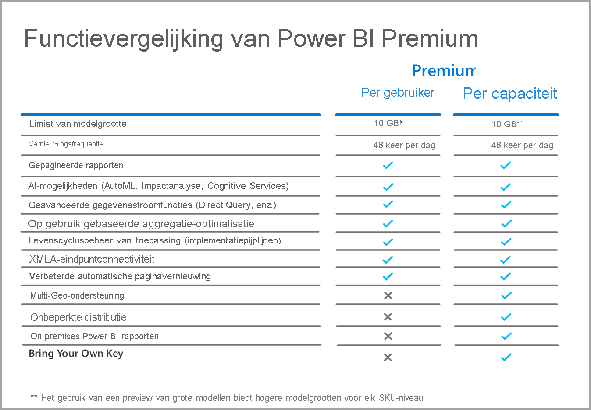

# Veelgestelde vragen over Power BI PPU (preview)

Met Power BI **Premium Per User** kunnen organisaties Premium-functies licentiëren per gebruiker. Premium Per User (PPU, Premium per gebruiker) omvat alle Power BI Pro-licentiemogelijkheden en voegt ook functies toe zoals gepagineerde rapporten, AI en andere mogelijkheden die alleen beschikbaar zijn voor Premium-abonnees. 

In dit artikel vindt u antwoord op veelgestelde vragen over PPU-licenties. Alle informatie in dit artikel is onderhevig aan wijziging en aanpassing, naarmate de PPU de preview-periode doorloopt en wordt vrijgegeven voor algemene beschikbaarheid (GA). 

In dit artikel worden vragen en antwoorden in de volgende categorieën ingedeeld:
* Algemene vragen 
* Vragen over beheer 
* Vragen over de ervaring van eindgebruikers 

## Algemene vragen

1.  **Wat is PPU (Premium Per User)?** 

    PPU (Premium Per User) is een nieuwe manier om premium-functies per gebruiker te licentiëren. Het omvat alle Power BI Pro-licentiemogelijkheden, samen met functies zoals gepagineerde rapporten, AI en andere mogelijkheden die nu alleen in Premium beschikbaar zijn.

2.  **Wanneer kan dit worden gekocht?**

    Er wordt nog gewerkt aan de ontwikkeling. Naar verwachting komt de PPU pas in 2021 algemeen beschikbaar. Totdat deze algemeen beschikbaar is, is de openbare preview-versie gratis beschikbaar voor alle organisaties.

3.  **Heb ik Power BI Pro EN een PPU-licentie nodig?**

    Nee, u krijgt alle mogelijkheden van Power BI Pro met een PPU-licentie.

4.  **Hoe kan ik een proefversie krijgen?**

    Er is een proefversie in het product en een aparte proefversie beschikbaar via Microsoft 365. Elke gebruiker, ervan uitgaand dat zijn of haar organisatie PPU niet heeft beperkt, kan toegang krijgen tot de proefversie in het product door PPU in te schakelen voor een werkruimte. Proefversies via Microsoft 365 kunnen via de portal worden ingeschakeld, net zoals Power BI Pro-proefversies worden geïnitieerd.  
    
5.  **Mijn initiële proefversie is verlopen maar we zitten nog steeds in de preview-periode.  Hoe kan ik mijn proefversie voor Premium per gebruiker verlengen/vernieuwen tijdens de preview-periode?**

    Voor klanten die de proefversie in het product gebruiken, kunt u op elk gewenst moment nadat uw oorspronkelijke proefversie is verlopen een nieuwe proefversie starten door in de rechterbovenhoek van de portal op het pictogram van uw profiel te klikken.  U ziet opnieuw een optie om u voor de proefversie aan te melden.  Hiermee start u een nieuwe proefversie voor 60 dagen.  Dit zal gedurende de hele preview-periode een optie blijven.  
    
    Voor klanten die gebruikmaken van de proefversie die via Microsoft 365 is aangeboden, kan uw tenantbeheerder de oorspronkelijke proefversie voor 30 dagen met nog eens 30 dagen verlengen. Dit is de maximale periode waarin de proefversie kan worden verlengd.

6.  **Welke functies zijn beschikbaar in PPU?**

    Het vergelijkingsraster voor functies is als volgt:    

    

7.  **Mijn organisatie heeft al Power BI Premium. Heb ik nu een PPU-licentie nodig om inhoud naar mijn capaciteit te publiceren?**
    
    Uw organisatie kan ervoor kiezen om de premium-capaciteit aan te vullen met PPU-licenties, maar PPU is niet vereist voor het publiceren van inhoud naar bestaande capaciteiten.  

## Vragen over beheer

1.  **Hoe kan ik PPU (Premium Per User) voor mijn tenant inschakelen?**
    
    Zodra een licentie is ingericht voor PPU voor de tenant, zijn PPU-functies beschikbaar in elke werkruimte waarin u deze inschakelt. Voor de preview kunt u de PPU-functies in de vervolgkeuzelijst van de capaciteit inschakelen door het PPU-item te selecteren, zoals weergegeven in de volgende afbeelding.

    

2.  **Werkt dit als een premium-capaciteit? Kan ik functies in-/uitschakelen?**

    Nee, het geheugen of de CPU wordt niet voor PPU beheerd. Het werkt net zoals Power BI Pro in dat opzicht. Uw tenantbeheerder kan geselecteerde functie-instellingen beheren, maar kan geen workloads uitschakelen, zoals gepagineerde rapporten, net zoals u geen dashboards kunt uitschakelen. 

3.  **Waar kan ik de PPU-instellingen beheren die beschikbaar worden gemaakt?**

    Beheerders kunnen deze instellingen beheren met een nieuwe menu-optie in de tenantinstellingen voor PPU.

4.  **Kan ik beperken welke gebruikers PPU-werkruimten kunnen maken?**

    Ja, op dezelfde manier waarop u momenteel kunt bepalen welke gebruikers werkruimten kunnen maken.

5.  **Kunnen tenantbeheerders zien welke werkruimten zijn gemarkeerd als PPU?**

    Ja, deze worden aangeroepen in het menu-item Werkruimten in het scherm van de tenantbeheerder. Hier kunt u zien welke werkruimten als premium zijn gemarkeerd.

6.  **Kan ik werkruimten verplaatsen tussen PPU- en premium-capaciteiten?**

    Ja. Voor algemene beschikbaarheid (GA) moet u gegevenssets of gegevensstromen in de werkruimte volledig vernieuwen zodra u deze terugplaatst naar de premium-capaciteit. Deze vereiste voorkomt misbruik door bedrijven die het CPU-oplaadmechanisme van Premium Gen2 willen omzeilen.

7.  **Zijn de capaciteit-API's beschikbaar voor PPU?**

    Er is een beperkte set API's beschikbaar om het verplaatsen van werkruimten mogelijk te maken, maar u kunt bijvoorbeeld geen workloads uitschakelen en andere dergelijke activiteiten uitvoeren.  
    
7.  **Worden service-principals ondersteund voor Premium-werkruimten per gebruiker?**

    Nee, service-principals in Premium-werkruimten per gebruiker worden momenteel niet ondersteund.  

## Vragen over de ervaring van eindgebruikers

1.  **Hoe weten andere gebruikers het als ik een werkruimte heb gemarkeerd als PPU?**
    
    Er is een nieuw pictogram geïntroduceerd om aan te geven welke werkruimten PPU zijn, zoals te zien is in de volgende afbeelding:

        

2.  **Wie heeft toegang tot inhoud in een PPU-werkruimte/-app?**

    Elke gebruiker moet een PPU-licentie hebben om inhoud in een PPU-werkruimte te kunnen bekijken. Dit omvat scenario's waarin gebruikers de inhoud via het XMLA-eindpunt openen, analyseren in Excel, modellen samenstellen, enzovoort. U kunt gebruikers die nog geen PPU-licentie hebben toegang verlenen tot de werkruimte. Zij ontvangen echter een bericht waarin staat dat zij geen toegang kunnen krijgen tot de inhoud. Hen wordt gevraagd om een proeflicentie te nemen als ze daarvoor in aanmerking komen. Als ze niet in aanmerking komen, moeten ze een licentie krijgen van hun tenantbeheerder.

3.  **Welke inhoud kunnen mensen met welk licentietype zien als deze met hen wordt gedeeld?**

    In het volgende diagram wordt beschreven wie welke soorten inhoud kan zien met PPU:

       

4.  **Kan ik PPU gebruiken voor ingesloten gebruiksvoorbeelden?**

    PPU werkt op dezelfde manier als ingesloten gebruiksvoorbeelden wanneer u een Pro-licentie gebruikt. U kunt de inhoud insluiten en elke gebruiker heeft een PPU-licentie nodig om deze te kunnen bekijken.

5.  **Wat gebeurt er met mijn PPU-werkruimte wanneer de preview-periode is afgelopen en ik ervoor kies om geen Premium-licenties per gebruiker aan te schaffen?**

    U en uw gebruikers hebben nog steeds toegang tot de werkruimte, maar inhoud waarvoor dat licentietype nodig is, zal niet beschikbaar zijn. U moet de werkruimte verplaatsen naar een premium-capaciteit of u moet eenvoudigweg de vereiste uitschakelen. 

6.  **Hoeveel totale opslagruimte krijg ik met PPU?**

    De volledige tenant zal dezelfde 100 TB-limiet hebben als een premium-capaciteit, wat betreft opslagruimte.

7.  **Is de export-API beschikbaar voor PPU?**

    Deze is momenteel beschikbaar voor gepagineerde rapporten en is elke vijf minuten beperkt tot één aanroep.  Power BI-rapporten worden momenteel niet ondersteund.  

8.  **Hoe werken e-mailabonnementen in PPU?**

    Iedereen met een PPU- of Pro-licentie kan het abonnement en de eventuele bijlage ervan ontvangen, op voorwaarde dat de bijlage voor alle gebruikers hetzelfde is. Pro-gebruikers kunnen de inhoud niet in de productportal weergeven. Als er extra abonnementsmogelijkheden worden geïntroduceerd die verschillende gegevensweergaven voor verschillende ontvangers mogelijk maken, is een PPU-licentie (of premium-capaciteit) nodig om deze mogelijkheden te gebruiken.

9.  **Kan ik met de vernieuwings-API via de portal het aantal van 48 vernieuwingen overschrijden?**

    Op dit moment zijn er geen beperkingen voor vernieuwingen.  

10. **Kan ik de app Power BI Premium Capacity Metrics gebruiken om het PPU-gebruik te controleren?**

    De app Power BI Premium Capacity Metrics werkt niet met Premium Gen2, waardoor u geen PPU-items kunt weergeven.  

11. **Kan ik een Power BI-gegevensset hosten in een PPU-werkruimte, een rapport ervan genereren, dit publiceren in een niet-PPU-werkruimte en gebruikers toegang geven tot dit rapport zonder dat ze een PPU-licentie nodig hebben?**

    Nee. Aangezien de gegevensset zich in een PPU-werkruimte bevindt, is deze niet zichtbaar voor gebruikers zonder licentie, ook al hebben ze toegang tot het rapport in de niet-PPU-werkruimte.

12. **Kan ik meerdere 10 GB-gegevensmodellen tegelijkertijd vernieuwen?**

    U bent onderworpen aan dezelfde beperkingen die worden opgelegd voor parallelle vernieuwingen in Premium Gen2.

13. **Kan ik inhoud die in PPU wordt gehost delen door deze op internet te publiceren?**

    Publiceren op internet gedraagt zich op dezelfde manier als bij inhoud die nu in een premium-capaciteit wordt gehost.

14. **Kan ik een gegevensstroom uitvoeren in een PPU-werkruimte, deze importeren in een Power BI-gegevensset in een andere werkruimte en ervoor zorgen dat gebruikers die deze inhoud gebruiken geen PPU-licentie nodig hebben?**

    Zolang de auteur van het Power BI-rapport een PPU-licentie heeft, is dit mogelijk tijdens de preview-periode voor PPU.

15. **Kan ik de mobiele Power BI-apps met PPU gebruiken?**

    Ja, de mobiele apps van Power BI zijn bijgewerkt om te werken met inhoud die is gepubliceerd in een PPU-app of -werkruimte.

**Volgende stappen**

* [Wat is Power BI Premium?](service-premium-what-is.md)
* [Technisch document over Microsoft Power BI Premium](https://aka.ms/pbipremiumwhitepaper)
* [Een technisch document over een Power BI-implementatie voor de onderneming plannen](https://aka.ms/pbienterprisedeploy)
* [De verlengde Pro-proefversie activeren](../fundamentals/service-self-service-signup-for-power-bi.md)
* [Veelgestelde vragen over Power BI Embedded](../developer/embedded/embedded-faq.md)

Hebt u nog vragen? [Misschien dat de Power BI-community het antwoord weet](https://community.powerbi.com/)
