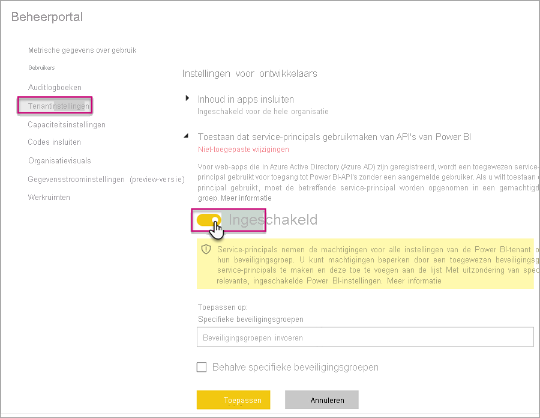
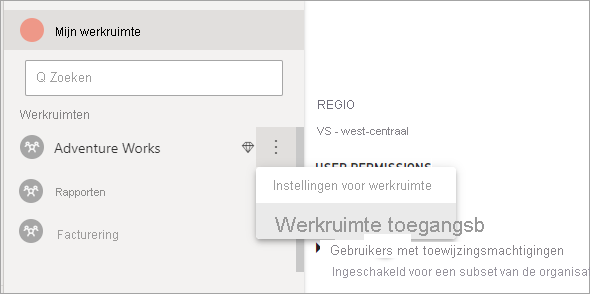

# <a name="automate-premium-workspace-and-dataset-tasks-with-service-principals"></a>Taken voor Premium-werkruimten en -gegevenssets automatiseren met service-principals

Service-principals zijn een Azure Active Directory-*appregistratie* die u in uw tenant maakt om onbeheerde bewerkingen op resource- en serviceniveau uit te voeren. Ze zijn een uniek type gebruikersidentiteit met een app-naam, toepassings-ID, tenant-ID en *clientgeheim* of certificaat voor een wachtwoord.

Power BI Premium maakt gebruik van dezelfde functionaliteit van service-principals als Power BI Embedded. Zie [Power BI-inhoud insluiten met service-principals](../developer/embedded/embed-service-principal.md) voor meer informatie.

In **Power BI Premium** kunnen service-principals ook worden gebruikt met het [XMLA-eindpunt](service-premium-connect-tools.md) voor het automatiseren van beheertaken voor gegevenssets, zoals het inrichten van werkruimten, het implementeren van modellen en het vernieuwen van de gegevensset met:

- PowerShell
- Azure Automation
- Azure Logic Apps
- Aangepaste clienttoepassingen

Alleen [nieuwe werkruimten](../collaborate-share/service-new-workspaces.md) ondersteunen XMLA-eindpuntverbindingen met service-principals. Klassieke-werkruimten worden niet ondersteund. Een service-principal heeft alleen de machtigingen die nodig zijn om taken uit te voeren voor werkruimten die er aan zijn toegewezen. Machtigingen worden toegewezen via werkruimtetoegang, net als bij gewone UPN-accounts.

Schrijfbewerkingen kunnen alleen worden uitgevoerd als voor de **workload Gegevensset** van de capaciteit het [XMLA-eindpunt voor lezen-schrijven is ingeschakeld](service-premium-connect-tools.md#enable-xmla-read-write). Voor gegevenssets die vanuit Power BI Desktop worden gepubliceerd, moet de functie [Indeling voor geavanceerde metagegevens](../connect-data/desktop-enhanced-dataset-metadata.md) zijn ingeschakeld.

> [!NOTE]
> De functie XMLA-eindpunt in Power BI Premium is **in de preview-fase**. Functies in de preview-fase mogen niet worden gebruikt in een productieomgeving. Bepaalde functionaliteit, ondersteuning en documentatie is beperkt.  Raadpleeg de [Microsoft Online Services-voorwaarden (OST)](https://www.microsoft.com/licensing/product-licensing/products?rtc=1) voor meer informatie.

## <a name="create-a-service-principal"></a>Een service-principal maken

Service-principals worden in Azure Portal gemaakt als een app registratie of met behulp van PowerShell. Wanneer u de service-principal maakt, moet u ervoor zorgen dat u de app-naam, de toepassing-id (client), de map-id (tenant) en het clientgeheim afzonderlijk kopieert en opslaat. Voor stappen voor het maken van een service-principal, zie:

[Service-principal maken - Azure Portal](https://docs.microsoft.com/azure/active-directory/develop/howto-create-service-principal-portal)   
[Service-principal maken - PowerShell](https://docs.microsoft.com/azure/active-directory/develop/howto-authenticate-service-principal-powershell)

## <a name="create-an-azure-ad-security-group"></a>Een Azure AD-beveiligingsgroep maken

Service-principals hebben standaard toegang tot alle tenantinstellingen waarvoor ze zijn ingeschakeld. Afhankelijk van uw beheerdersinstellingen kan dit toegang geven tot specifieke beveiligingsgroepen of de hele organisatie.

Als u de toegang van de service-principal wilt beperken tot specifieke tenantinstellingen, kunt u alleen toegang geven tot specifieke beveiligingsgroepen. U kunt ook een toegewezen beveiligingsgroep voor service-principals maken en deze uitsluiten van de gewenste tenantinstellingen. Zie [Een basisgroep maken en leden toevoegen met Azure Active Directory](https://docs.microsoft.com/azure/active-directory/fundamentals/active-directory-groups-create-azure-portal) als u wilt weten welke stappen er moeten worden genomen om een beveiligingsgroep te maken en een service-principal toe te voegen.

## <a name="enable-service-principals"></a>Service-principals inschakelen

Voordat u service-principals in Power BI kunt gebruiken, moet een beheerder eerst toegang tot service-principals inschakelen in de Power BI-beheerportal.

Ga naar de Power BI-**beheerportal** > **Tenantinstellingen** en vouw daar **Toestaan dat service-principals gebruikmaken van API's van Power BI** uit. Klik vervolgens op **Ingeschakeld**. Als u machtigingen wilt toepassen op een beveiligingsgroep, moet u de groepsnaam aan **specifieke beveiligingsgroepen** toevoegen.



## <a name="workspace-access"></a>Toegang tot werkruimte

Als u wilt dat uw service-principal over de benodigde machtigingen beschikt om bewerkingen op Premium-werkruimten en -gegevenssets uit te voeren, moet u de service-principal als Lid of Beheerder toevoegen. Het gebruik van werkruimtetoegang in de Power BI-service wordt hier beschreven, maar u kunt ook de [REST API Groepsgebruiker toevoegen](https://docs.microsoft.com/rest/api/power-bi/groups/addgroupuser) gebruiken.

1. Selecteer in de Power BI-service voor een werkruimte **Meer** > **Werkruimtetoegang**.

    

2. Zoek op toepassingsnaam, voeg de service-principal als een **Beheerder** of **Lid** toe aan de werkruimte.

    

## <a name="connection-strings-for-the-xmla-endpoint"></a>Verbindingsreeksen voor het XMLA-eindpunt

Zodra u een service-principal hebt gemaakt, service-principals hebt ingeschakeld voor uw tenant en de service-principal aan werkruimtetoegang hebt toegevoegd, kunt u deze als een gebruikers-id gebruiken in verbindingsreeksen voor het XMLA-eindpunt. Het verschil is dat u voor de parameters Gebruikers-id en Wachtwoord, de toepassings-id, tenant-id en het toepassingsgeheim opgeeft.

`Data Source=powerbi://api.powerbi.com/v1.0/myorg/<workspace name>; Initial Catalog=<dataset name>;User ID=app:<appId>@<tenantId>;Password=<app_secret>;`

### <a name="powershell"></a>PowerShell

#### <a name="using-sqlserver-module"></a>De module SQLServer gebruiken

In het volgende voorbeeld worden AppId, TenantId en AppSecret gebruikt voor het verifiëren van een bewerking voor het vernieuwen van een gegevensset:

```powershell
Param (
        [Parameter(Mandatory=$true)] [String] $AppId,
        [Parameter(Mandatory=$true)] [String] $TenantId,
        [Parameter(Mandatory=$true)] [String] $AppSecret
       )
$PWord = ConvertTo-SecureString -String $AppSecret -AsPlainText -Force

$Credential = New-Object -TypeName "System.Management.Automation.PSCredential" -ArgumentList $AppId, $PWord

Invoke-ProcessTable -Server "powerbi://api.powerbi.com/v1.0/myorg/myworkspace" -TableName "mytable" -DatabaseName "mydataset" -RefreshType "Full" -ServicePrincipal -ApplicationId $AppId -TenantId $TenantId -Credential $Credential
```

### <a name="amo-and-adomd"></a>AMO en ADOMD

Wanneer u verbinding maakt met clienttoepassingen en web-apps, bieden [AMO- en ADOMD-clientbibliotheken](https://docs.microsoft.com/azure/analysis-services/analysis-services-data-providers) versie 15.0.2 en hogere versies van installeerbare pakketten van NuGet, ondersteuning voor het gebruik van service-principals in verbindingsreeksen met de volgende syntaxis: `app:AppID` en wachtwoord of `cert:thumbprint`.

In het volgende voorbeeld worden `appID` en een `password` gebruikt voor het uitvoeren van een bewerking voor het vernieuwen van een modeldatabase:

```csharp
string appId = "xxx";
string authKey = "yyy";
string connString = $"Provider=MSOLAP;Data source=powerbi://api.powerbi.com/v1.0/<tenant>/<workspacename>;Initial catalog=<datasetname>;User ID=app:{appId};Password={authKey};";
Server server = new Server();
server.Connect(connString);
Database db = server.Databases.FindByName("adventureworks");
Table tbl = db.Model.Tables.Find("DimDate");
tbl.RequestRefresh(RefreshType.Full);
db.Model.SaveChanges();
```

## <a name="next-steps"></a>Volgende stappen

[Gegevenssetconnectiviteit met het XMLA-eindpunt](service-premium-connect-tools.md)  
[Azure Automation](https://docs.microsoft.com/azure/automation)  
[Azure Logic Apps](https://docs.microsoft.com/azure/logic-apps/)  
[Power BI REST API's](https://docs.microsoft.com/rest/api/power-bi/)
