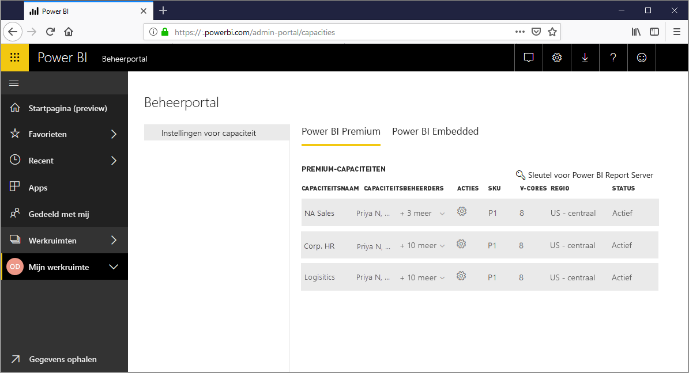
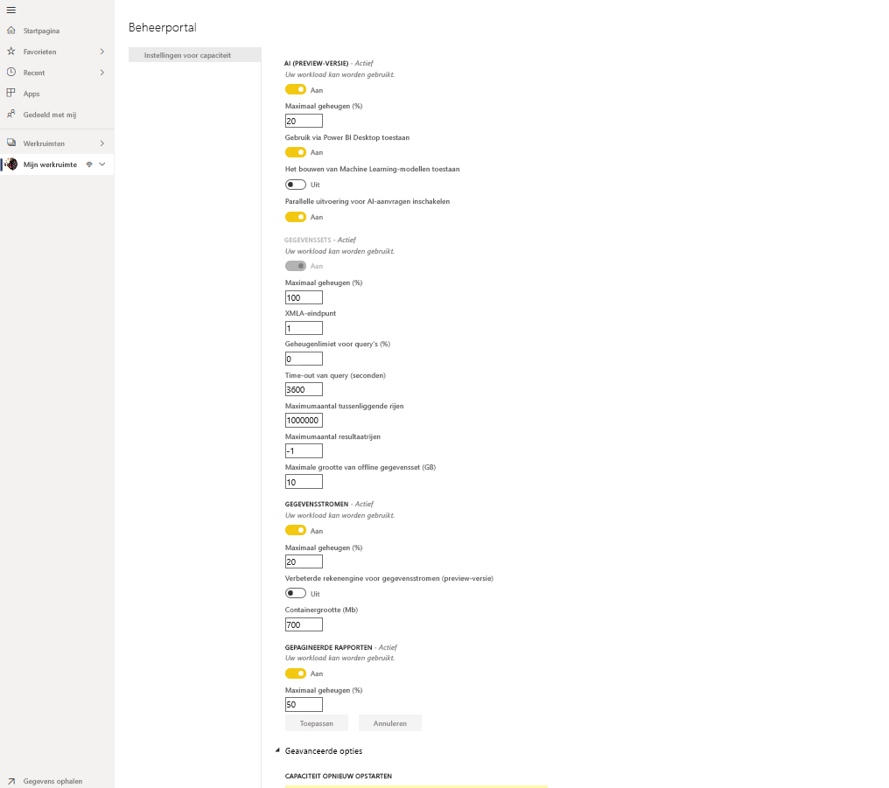
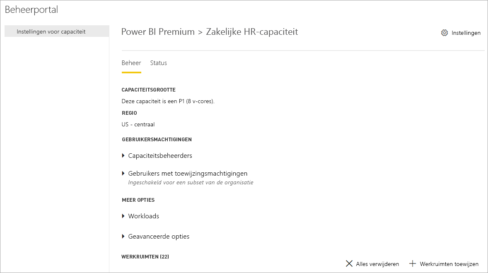
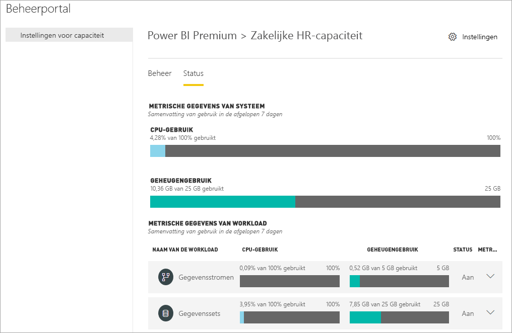
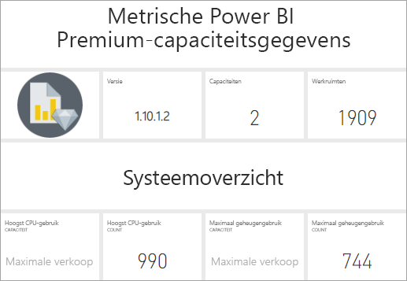
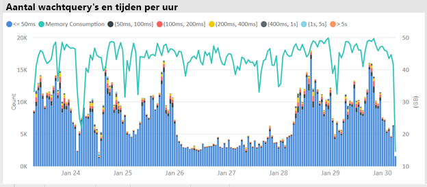
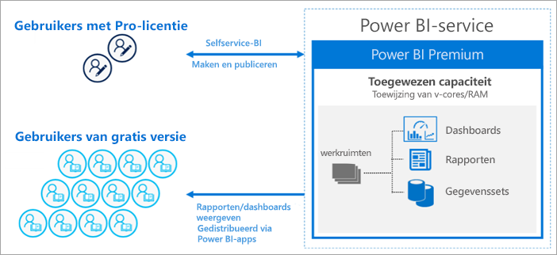
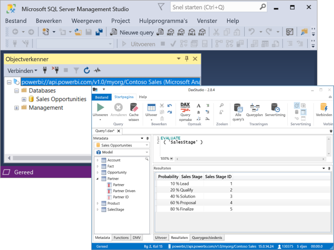

# Wat is Power BI Premium?

Met Power BI Premium kunt u toegewezen en geavanceerde resources voor uw organisatie configureren om de prestaties en reactietijd van de Power BI-service te verbeteren voor de gebruikers in uw organisatie. Een Power BI Premium abonnement biedt de gebruikers van uw organisatie de volgende voordelen:

> [!div class="checklist"]
> * Grotere schaal en prestaties
> * Flexibiliteit voor licentieverlening op capaciteit
> * Self-service en bedrijfs-BI integreren
> * On-premises BI uitbreiden met Power BI Report Server
> * Ondersteuning voor gegevensopslag per regio (Multi-Geo, meerdere geografische gebieden)
> * Gegevens delen met iedereen zonder een licentie per gebruiker te hoeven aanschaffen

 

In dit artikel worden belangrijke functies van Power BI Premium beschreven. In voorkomende gevallen worden koppelingen geboden naar aanvullende artikelen met meer gedetailleerde informatie. Raadpleeg de sectie _Vergelijking van Power BI-functies_ van [Power BI-prijzen](https://powerbi.microsoft.com/pricing/) voor meer informatie over Power BI Pro en Power BI Premium.

## Abonnementen en licenties

Power BI Premium is een Office 365-abonnement op tenantniveau beschikbaar in twee SKU-families (SKU: Stock Keeping Unit):

- **P**-SKU's (P1-P5) voor het insluiten van inhoud en zakelijke functies; hiervoor geldt een maandelijkse of jaarlijkse betalingsverplichting die maandelijks wordt gefactureerd en een licentie bevat voor het on-premises installeren van Power BI Report Server.

- **EM**-SKU's (EM1-EM3) voor het insluiten van inhoud in de _organisatie_. Hiervoor geldt een jaarlijkse betalingsverplichting die maandelijks in rekening worden gebracht. EM1- en EM2-SKU's zijn alleen beschikbaar via volumelicentieplannen. U kunt deze niet rechtstreeks kopen.

Een alternatieve methode is de aanschaf van een **Power BI Embedded**-abonnement in Azure. Er is één familie met **A**-SKU’s (A1-A6) waarvoor geen toezegging is vereist, en die per uur wordt gefactureerd voor gebruik met labels voor Power BI in toepassingen, in portals en op websites, of als een manier om P- of EM-capaciteiten te testen. Alle SKU's leveren v-cores voor het maken van capaciteit, maar de EM-SKU's zijn beperkt tot het insluiten van inhoud op kleinere schaal. EM1-, EM2-, A1- en A2-SKU's met minder dan vier v-cores worden niet uitgevoerd op een toegewezen infrastructuur.

Hoewel dit artikel is gericht op de P-SKU's, is veel van wat wordt beschreven ook relevant voor de A-SKU's. In tegenstelling tot de SKU's van het Premium-abonnement zijn voor Azure-SKU's geen tijdsverplichtingen vereist. Deze worden per uur gefactureerd. Ze bieden volledige elasticiteit bij omhoog en omlaag schalen, en bij het onderbreken, hervatten en verwijderen van capaciteit. 

Azure Power BI Embedded is grotendeels buiten het bereik van dit artikel, maar het wordt beschreven in de sectie [Testbenaderingen](service-premium-capacity-optimize.md#testing-approaches) van het artikel Optimizing Premium capacities (Premium-capaciteiten optimaliseren) als een praktische en economische optie voor het testen en meten van workloads. Zie de [documentatie voor Azure Power BI Embedded](https://azure.microsoft.com/services/power-bi-embedded/) voor meer informatie over Azure-SKU's.

### Aanschaffen

Power BI Premium-abonnementen worden aangeschaft door beheerders in het Microsoft 365-beheercentrum. Specifieker: globale beheerders van Office 365 of factureringsbeheerders zijn de enigen die SKU's kunnen aanschaffen. Bij de aankoop ontvangt de tenant een overeenkomstig aantal v-cores die deze kan toewijzen aan capaciteit, ook wel *v-core-pooling* genoemd. Als u bijvoorbeeld een P3-SKU koopt, ontvangt de tenant 32 v-cores. Zie [Power BI Premium kopen](service-admin-premium-purchase.md) voor meer informatie.

## Toegewezen capaciteit

Met Power BI Premium krijgt u *toegewezen capaciteit*. In tegenstelling tot een gedeelde capaciteit waarbij workloads worden uitgevoerd op rekenresources die worden gedeeld met andere klanten, wordt een toegewezen capaciteit uitsluitend gebruikt door één organisatie. De capaciteit is geïsoleerd met toegewezen rekenresources die betrouwbare en consistente prestaties leveren voor gehoste inhoud. Let op: de volgende resources zijn opgeslagen in gedeelde capaciteit in plaats van uw toegewezen capaciteit:

* Excel-werkmappen (tenzij de gegevens eerst zijn geïmporteerd in Power BI Desktop)
* [Push-gegevenssets](/rest/api/power-bi/pushdatasets)
* [Streaminggegevenssets](../connect-data/service-real-time-streaming.md#set-up-your-real-time-streaming-dataset-in-power-bi)
* [Q&A](../create-reports/power-bi-tutorial-q-and-a.md)

Werkruimten bevinden zich in capaciteiten. Elke Power BI-gebruiker heeft een persoonlijke werkruimte die **Mijn werkruimte** heet. Er kunnen extra werkruimten worden gemaakt om samenwerking mogelijk te maken. Deze werkruimten worden overigens **werkruimten** genoemd. Werkruimten, met inbegrip van persoonlijke werkruimten, worden standaard gemaakt in de gedeelde capaciteit. Als u over Premium-capaciteiten beschikt, kunnen zowel Mijn werkruimten als werkruimten worden toegewezen aan Premium-capaciteiten.

### Capaciteitsknooppunten

Zoals beschreven in de sectie [Abonnementen en licentieverlening](#subscriptions-and-licensing), zijn er twee SKU-families voor Power BI Premium: **EM** en **P**. Alle Power BI Premium-SKU's zijn beschikbaar als capaciteits*knooppunten*, waarbij elk voor een vaste hoeveelheid resources staat die bestaat uit een processor, geheugen en opslag. Naast de resources heeft elke SKU operationele limieten voor het aantal DirectQuery-verbindingen en liveverbindingen per seconde, en het aantal parallelle modellen wordt vernieuwd.

De verwerking vindt plaats door een vast aantal v-cores, evenredig verdeeld over back-end en front-end.

De **back-end-v-cores** zijn verantwoordelijk voor de Power BI-kernfunctionaliteit, waaronder het verwerken van query's, cachebeheer, het uitvoeren van R-services, het vernieuwen van modellen en het weergeven van rapporten en afbeeldingen op de server. Aan back-end-v-cores wordt een vaste hoeveelheid geheugen toegewezen die voornamelijk wordt gebruikt voor het hosten van modellen, ook wel actieve gegevenssets genoemd.

De **front-end-v-cores** zijn verantwoordelijk voor de webservice, het documentbeheer voor dashboards en rapporten, het beheren van de toegangsrechten, de planning, API's, uploaden en downloaden en in het algemeen voor alles met betrekking tot de gebruikerservaring.

De opslag is ingesteld op **100 TB per capaciteitsknooppunt**.

De resources en limieten van elke Premium-SKU (en A-SKU van een vergelijkbare omvang) in de volgende tabel beschreven:

| Capaciteitsknooppunten | Totaal aantal v-cores | v-cores voor back-end | RAM (GB) | v-cores voor front-end | DirectQuery/liveverbinding (per sec) | Model voor parallelle vernieuwing |
| --- | --- | --- | --- | --- | --- | --- |
| EM1/A1 | 1 | 0,5 | 3 | 0,5 | 3,75 | 1 |
| EM2/A2 | 2 | 1 | 5 | 1 | 7,5 | 2 |
| EM3/A3 | 4 | 2 | 10 | 2 | 15 | 3 |
| P1/A4 | 8 | 4 | 25 | 4 | 30 | 6 |
| P2/A5 | 16 | 8 | 50 | 8 | 60 | 12 |
| P3/A6 | 32 | 16 | 100 | 16 | 120 | 24 |
| P4 | 64 | 32 | 200 | 32 | 240 | 48 |
| P5 | 128 | 64 | 400 | 64 | 480 | 96 |
| | | | | | | |

> [!NOTE]
> Het gebruik van één grotere SKU (bijvoorbeeld één P2-SKU) kan de voorkeur hebben boven het combineren van kleinere SKU’s (bijvoorbeeld twee P1-SKU’s). U kunt bijvoorbeeld grotere modellen gebruiken en beter parallellisme bereiken met P2.

### Workloads van capaciteit

Workloads van capaciteit zijn services die beschikbaar zijn gesteld aan gebruikers. Standaard bieden Premium- en Azure-capaciteiten alleen ondersteuning voor de workload van een gegevensset die aan het uitvoeren van Power BI-query's is gekoppeld. De workload van een gegevensset kan niet worden uitgeschakeld. U kunt extra workloads inschakelen voor [AI (Cognitive Services)](https://powerbi.microsoft.com/blog/easy-access-to-ai-in-power-bi-preview/), [gegevensstromen](../transform-model/service-dataflows-overview.md#dataflow-capabilities-on-power-bi-premium) en [gepagineerde rapporten](../paginated-reports/paginated-reports-save-to-power-bi-service.md). Deze workloads worden alleen ondersteund in Premium-abonnementen. 

Met elke extra workload kunt u de maximale hoeveelheid geheugen configureren (als percentage van het totaal aan beschikbaar geheugen) die door de workload kan worden gebruikt. De standaardwaarden voor de maximale hoeveelheid geheugen worden bepaald door de SKU. U kunt de beschikbare resources van uw capaciteit maximaliseren door deze extra workloads alleen in te schakelen wanneer ze worden gebruikt. En u kunt de geheugeninstellingen alleen wijzigen wanneer u hebt vastgesteld dat de standaardinstellingen niet voldoen aan de resourcevereisten van uw capaciteit. Workloads kunnen door capaciteitsbeheerders voor een capaciteit worden ingeschakeld en geconfigureerd met behulp van **capaciteitsinstellingen** in de [beheerportal](service-admin-portal.md) of met behulp van de [REST API's voor capaciteiten](https://docs.microsoft.com/rest/api/power-bi/capacities).  

Raadpleeg [Configure workloads in a Premium capacity](service-admin-premium-workloads.md) (Workloads configureren in een Premium-capaciteit) voor meer informatie. 

### Hoe capaciteiten functioneren

De Power BI-service maakt te allen tijde zo goed mogelijk gebruik van capaciteitsresources zonder dat daarbij de limieten die zijn opgelegd aan de capaciteit worden overschreden.

Capaciteitsbewerkingen zijn geclassificeerd als *interactief* of *achtergrond*. Interactieve bewerkingen zijn onder meer het weergeven van aanvragen van en reageren op interactie van gebruikers (filteren, query's op Q&A uitvoeren enzovoort). Over het algemeen vormt het uitvoeren van query's in importmodellen een zware belasting voor uw geheugenresources, terwijl het uitvoeren van query's in DirectQuery- en liveverbinding-modellen een zware belasting vormt voor uw CPU. Bewerkingen op de achtergrond zijn onder meer de vernieuwing van gegevensstroom- en importmodellen en het opslaan van dashboardquery's in het cachegeheugen.

Het is belangrijk om te begrijpen dat interactieve bewerkingen altijd voorrang krijgen boven bewerkingen op de achtergrond om een zo goed mogelijke gebruikerservaring te garanderen. Als er onvoldoende resources zijn, worden de bewerkingen op de achtergrond aan een wachtrij toegevoegd om te worden verwerkt wanneer resources vrijkomen. Bewerkingen op de achtergrond, zoals de vernieuwing van gegevenssets, kunnen tijdens de verwerking worden stopgezet door de Power BI-service en aan een wachtrij worden toegevoegd.

Importmodellen moet volledig in het geheugen worden geladen, zodat ze kunnen worden opgevraagd of vernieuwd. De Power BI-service beheert het geheugengebruik door middel van geavanceerde algoritmen om voor een maximaal gebruik van het beschikbare geheugen te zorgen. Dit kan leiden tot een te grote inzet van de capaciteit: Hoewel het mogelijk is voor een capaciteit om veel importmodellen (maximaal 100 TB per Premium-capaciteit) op te slaan, kunnen deze niet tegelijkertijd in het geheugen worden geladen wanneer de gecombineerde schijfopslag de ondersteunde hoeveelheid geheugen overschrijdt (en extra geheugen nodig is voor het uitvoeren van query's en vernieuwen).

Importmodellen worden daarom zijn geladen en verwijderd uit het geheugen op basis van gebruik. Een importmodel wordt geladen wanneer dit wordt opgevraagd (interactieve bewerking) en zich nog niet in het geheugen bevindt, of wanneer dit moet worden vernieuwd (bewerking op de achtergrond).

Het verwijderen van een model uit het geheugen wordt ook wel *uitzetting* genoemd. Dit is een bewerking die Power BI snel kan uitvoeren, afhankelijk van de grootte van de modellen. Als zich in de capaciteit niet een geheugendruk voordoet, is het eenvoudig om modellen in het geheugen te laden en daar te houden. Wanneer er echter onvoldoende geheugen beschikbaar is om een model te laden, moet de Power BI-service eerst geheugen vrijmaken. Dit geheugen wordt vrijgemaakt door het detecteren van inactief geworden modellen, door modellen op te zoeken die in de laatste drie minuten niet zijn gebruikt \[[1](#endnote-1)\] en deze vervolgens te verwijderen. Als er geen inactieve modellen zijn om te verwijderen, gaat Power BI-service modellen verwijderen die zijn geladen voor bewerkingen op de achtergrond. Wanneer 30 seconden lang pogingen zijn mislukt \[[1](#endnote-1)\], wordt als laatste redmiddel de interactieve bewerking afgebroken. In dit geval wordt de rapportgebruiker op de hoogte gesteld van de fout, met een suggestie om het over enkele ogenblikken opnieuw te proberen. In sommige gevallen kunnen modellen uit het geheugen worden verwijderd vanwege servicebewerkingen.

Het is belangrijk om te benadrukken dat de verwijdering van gegevenssets normaal en verwacht gedrag is. Er wordt gestreefd naar een maximaal geheugengebruik door het laden en verwijderen van modellen waarvan de gecombineerde omvang groter kan zijn dan het beschikbare geheugen. Dit is zo bedoeld, en het is transparant voor gebruikers van rapporten. Hoge aantallen verwijderingen betekenen niet noodzakelijkerwijs dat de capaciteit van onvoldoende resources is voorzien. Dit kan echter een probleem worden als de reactietijd voor query's of vernieuwen lijdt onder de hoge aantallen verwijderingen.

Het vernieuwen van importmodellen vormt altijd een zware belasting voor uw geheugen, aangezien modellen in het geheugen moeten worden geladen. Er is extra geheugen vereist voor verwerking. Volledig vernieuwen kan ongeveer de dubbele hoeveelheid geheugen gebruiken die nodig is voor het model. Dit zorgt ervoor dat het model zelfs tijdens de verwerking kan worden opgevraagd, omdat de query's naar het bestaande model worden verzonden, totdat het vernieuwen is voltooid en de gegevens van het nieuwe model beschikbaar zijn. Voor incrementeel vernieuwen is minder geheugen vereist. Ook kan het sneller worden voltooid en kan zo de druk op capaciteitsresources aanzienlijk worden verminderd. Vernieuwen kan ook een zware belasting voor modellen vormen, met name de modellen met complexe Power Query-transformaties of berekende tabellen/kolommen die complex zijn of zijn gebaseerd op grote tabellen.

Voor vernieuwen moet net als bij query's, het model in het geheugen worden geladen. Als er onvoldoende geheugen is, probeert Power BI-service inactieve modellen te verwijderen, en als dit niet mogelijk is (als alle modellen actief zijn), wordt de vernieuwingstaak in de wachtrij geplaatst. Vernieuwen betekent gewoonlijk een zware belasting voor uw CPU, zelfs zwaarder dan query's. Hierom zijn er capaciteitsbeperkingen op het aantal gelijktijdige vernieuwingen, dat is ingesteld op 1,5 keer het aantal back-end-v-cores, naar boven afgerond. Als er te veel gelijktijdige vernieuwingen plaatsvinden, wordt een geplande vernieuwing in de wachtrij geplaatst. Wanneer deze situaties zich voordoen, duurt het langer voordat de vernieuwing is voltooid. Voor vernieuwingen op aanvraag, zoals die worden geactiveerd door een gebruikersaanvraag of een API-aanroep, worden drie nieuwe pogingen uitgevoerd \[[1](#endnote-1)\]. Als er nog steeds niet voldoende resources zijn, wordt het vernieuwen afgebroken.

Opmerkingen bij de sectie:   
\[1\] kan worden gewijzigd.

### Regionale ondersteuning

Bij het maken van een nieuwe capaciteit kunnen globale Office 365-beheerders en Power BI-servicebeheerders een regio opgeven waarin de werkruimten zich zullen bevinden die aan de capaciteit worden toegewezen. Dit staat bekend als **Multi-Geo (meerdere geografische gebieden)** . Met meerdere geografische gebieden (Multi-Geo) kunnen organisaties aan gegevenslocatievereisten voldoen door inhoud in datacenters in een bepaalde regio te implementeren, zelfs als deze verschilt van de regio waarin het Office 365-abonnement zich bevindt. Raadpleeg [Ondersteuning van Multi-Geo voor Power BI Premium](service-admin-premium-multi-geo.md) voor meer informatie.

### Capaciteitsbeheer

Het beheren van Premium-capaciteiten omvat het maken of verwijderen van capaciteiten, toewijzen van beheerders en werkruimten, configureren van workloads, en het controleren en aanbrengen van correcties voor optimale prestaties van de capaciteit. 

Globale beheerders van Office 365 en Power BI-servicebeheerders kunnen Premium-capaciteiten maken van beschikbare v-cores of bestaande Premium-capaciteiten wijzigen. De grootte van de capaciteit en de geografische regio worden opgegeven wanneer een capaciteit is gemaakt, en er wordt ten minste één capaciteitsbeheerder toegewezen. 

Wanneer capaciteiten zijn gemaakt, worden de meeste beheertaken uitgevoerd in de [beheerportal](service-admin-portal.md).

Capaciteitsbeheerders kunnen werkruimten toewijzen aan de capaciteit, gebruikersmachtigingen beheren en andere beheerders toewijzen. Capaciteitsbeheerders kunnen ook workloads configureren door geheugentoewijzingen aan te passen, en, indien nodig, een capaciteit opnieuw opstarten door bewerkingen opnieuw in te stellen voor het geval dat een capaciteit overbelast raakt.

Capaciteitsbeheerders kunnen ook controleren of een capaciteit probleemloos werkt. Ze kunnen het functioneren van capaciteiten rechtstreeks in de beheerportal of via de app Power BI Premium Capacity Metrics controleren.

Zie [Premium-capaciteiten beheren](service-premium-capacity-manage.md) voor meer informatie over het maken van capaciteiten, het toewijzen van beheerders en het toewijzen van werkruimten. Zie [Administrator roles related to Power BI](service-admin-administering-power-bi-in-your-organization.md#administrator-roles-related-to-power-bi) (Beheerdersrollen voor Power BI) voor meer informatie over rollen.

### Controleren

De controle van Premium-capaciteiten biedt beheerders inzicht in de prestaties van capaciteiten. U kunt de capaciteiten controleren via de beheerportal of met de app [Power BI Premium Capacity Metrics](https://app.powerbi.com/groups/me/getapps/services/capacitymetrics).

Wanneer u een controle uitvoert in de portal, biedt dit een snelle weergave met metrische gegevens op hoog niveau van de afgelopen zeven dagen, waarin wordt aangegeven welke belastingen zijn opgelegd, welke resources door uw capaciteit zijn gebruikt, welke gemiddelden dit oplevert. 

De app **Power BI Premium Capacity Metrics** biedt de meest uitgebreide informatie over hoe uw capaciteiten presteren. De app biedt een dashboard op hoog niveau en meer gedetailleerde rapporten.

Vanuit het dashboard van de app kunt u op een cel met metrische gegevens klikken als u een gedetailleerd rapport wilt openen. Rapporten bieden gedetailleerde metrische gegevens en filterfunctionaliteit waarmee u kunt inzoomen op de belangrijkste informatie die u nodig hebt om ervoor te zorgen dat uw capaciteit probleemloos blijft werken.

Zie [Monitoring in the Power BI Admin portal](service-admin-premium-monitor-portal.md) (Controles uitvoeren in de Power BI-beheerportal) en [Monitoring with the Power BI Premium Capacity Metrics app](service-admin-premium-monitor-capacity.md) (Controles uitvoeren met de app Power BI Premium Capacity Metrics) voor meer informatie over het controleren van capaciteit.

### Capaciteiten optimaliseren

Optimaal gebruikmaken van uw capaciteiten is essentieel om zeker te zijn dat u gebruikers goede prestaties biedt en u de maximale waarde krijgt voor uw Premium-investering. Beheerders kunnen door de controle van belangrijke metrische gegevens bepalen hoe zij het beste knelpunten kunnen oplossen en de nodige actie kunnen ondernemen. Zie [Optimizing Premium capacities](service-premium-capacity-optimize.md) (Premium-capaciteiten optimaliseren) en [Premium capacity scenarios](service-premium-capacity-scenarios.md) (Scenario's voor Premium-capaciteit) voor meer informatie.

### REST-API 's voor capaciteiten

De Power BI REST API's bevatten een verzameling met [capaciteit-API's](https://docs.microsoft.com/rest/api/power-bi/capacities). Beheerders kunnen met de API's veel aspecten van uw Premium-capaciteiten via een programma beheren, waaronder workloads inschakelen en uitschakelen, werkruimten toewijzen aan een capaciteit, en meer.

## Grote gegevenssets

Afhankelijk van de SKU biedt Power BI Premium ondersteuning voor het uploaden van Power BI Desktop-modelbestanden (.pbix) tot een maximale grootte van **10 GB**. Eenmaal geladen, kan vervolgens het model worden gepubliceerd naar een werkruimte die is toegewezen aan een Premium-capaciteit. Een gegevensset kan vervolgens worden vernieuwd tot een grootte van **12 GB**.

### Overwegingen over grootte

Grote gegevenssets kunnen een zware belasting vormen voor uw resources. U kunt het beste een P1-SKU nemen voor alle gegevenssets die groter zijn dan 1 GB. Hoewel het mogelijk is om grote modellen te publiceren naar werkruimten die worden ondersteund door A-SKU's tot A3, kunt u de gegevenssets niet vernieuwen.

De volgende tabel bevat de aanbevolen SKU's voor het uploaden van PBIX-bestanden of het publiceren naar de Power BI-service:

   |SKU  |Grootte van pbix-bestand   |
   |---------|---------|
   |P1    | < 3 GB        |
   |P2    | < 6 GB        |
   |P3, P4, P5    | tot 10 GB   |

De Power BI Embedded A4-SKU is gelijk aan de P1-SKU, A5 = P2 en A6 = P3. Wanneer u grote gegevenssets publiceert naar A- en EM-SKU's, worden mogelijk fouten geretourneerd die niet specifiek zijn voor de beperking van de modelgrootte in de gedeelde capaciteit. Vernieuwingsfouten voor gegevenssets in A- en EM-SKU's verwijst mogelijk naar time-outs.

Als u [Grote modellen](service-premium-large-models.md) inschakelt voor een gegevensset, worden de bestandsbeperkingen voor PBIX-bestanden nog steeds toegepast op het uploaden of publiceren van bestanden. Met de combinatie van Incrementeel vernieuwen en Grote modellen kunnen gegevenssets echter veel groter worden dan deze limieten. Bij grote modellen wordt de grootte van de gegevensset alleen beperkt door de maximale Power BI Premium-capaciteit.

Uw pbix-bestanden bevatten gegevens in een *sterk gecomprimeerde toestand*. De gegevensgrootte neemt waarschijnlijk toe wanneer de gegevens in het geheugen worden geladen. Vervolgens neemt de grootte mogelijk nog meerdere keren toe tijdens het vernieuwen van gegevens.

Geplande vernieuwing van grote gegevenssets kan erg lang duren en kan een zware belasting voor uw resources vormen. Het is belangrijk dat u het vernieuwen van gegevens daarom niet te veel gelijktijdig plant. Het is raadzaam om [incrementeel vernieuwen](service-premium-incremental-refresh.md) te configureren omdat dit sneller en betrouwbaarder is en hiermee minder resources worden verbruikt.

Het voor de eerste keer laden van een rapport voor grote gegevenssets kan erg lang duren als het al enige tijd geleden is dat de gegevensset is gebruikt. Voor rapporten waarvoor het laden langer duurt, wordt de laadvoortgang via een voortgangsbalk weergegeven.

Omdat de beperkingen van geheugen en tijd per query veel hoger zijn in Premium capaciteit, is het raadzaam filters en slicers te gebruiken om van visuals alleen de benodigde informatie weer te geven.

## Incrementeel vernieuwen

Incrementeel vernieuwen vormt een onlosmakelijk onderdeel van het hebben en onderhouden van grote gegevenssets in Power BI Premium. Incrementeel vernieuwen heeft veel voordelen: vernieuwen vindt bijvoorbeeld sneller plaats omdat er alleen gegevens worden vernieuwd die gewijzigd moeten worden. Vernieuwen is betrouwbaarder, omdat het niet nodig is om langdurige verbindingen met vluchtige gegevensbronnen te onderhouden. Het verbruik van resources is lager, omdat het algemene verbruik van geheugen en andere resources wordt verlaagd als er minder gegevens zijn om te vernieuwen. Beleid voor incrementele vernieuwing wordt gedefinieerd in **Power BI Desktop** en toegepast zodra het beleid wordt gepubliceerd naar een werkruimte in een Premium-capaciteit. 

Raadpleeg [Incremental refresh in Power BI Premium](service-premium-incremental-refresh.md) (Incrementeel vernieuwen in Power BI Premium) voor meer informatie.

## Gepagineerde rapporten

Gepagineerde rapporten, die worden ondersteund op P1-P3- en A4_A6-SKU's, zijn gebaseerd op RDL-technologie (RDL: Report Definition Language) in SQL Server Reporting Services. Hoewel deze zijn gebaseerd op RDL-technologie, werkt het niet hetzelfde als Power BI Report Server, een downloadbaar rapportageplatform dat u on-premises kunt installeren en ook is opgenomen in Power BI Premium. Gepagineerde rapporten zijn zo geformatteerd dat deze goed passen op een pagina, die kan worden afgedrukt of gedeeld. De gegevens worden in een tabel weergegeven, zelfs als de tabel meerdere pagina's omvat. Met behulp van de gratis Windows Desktop-toepassing [**Power BI Report Builder**](https://go.microsoft.com/fwlink/?linkid=2086513) stellen gebruikers gepagineerde rapporten op en publiceren deze naar de service.

In Power BI Premium zijn gepagineerde rapporten een workload die voor een capaciteit moet worden ingeschakeld via de beheerportal. Capaciteitsbeheerders kunnen bij de inschakeling vervolgens de hoeveelheid geheugen opgeven als percentage van het totaal aan geheugenresources van de capaciteit. In tegenstelling tot andere typen workloads worden in Premium gepagineerde rapporten in een ingesloten ruimte in de capaciteit uitgevoerd. De maximale hoeveelheid geheugen die u aan deze ruimte hebt toegewezen wordt gebruikt, ongeacht of de workload wel of niet actief is. De standaardwaarde is 20. 

Raadpleeg [Paginated reports in Power BI Premium](../paginated-reports/paginated-reports-report-builder-power-bi.md) (Gepagineerde rapporten in Power BI Premium) voor meer informatie. Zie [Workloads configureren](service-admin-premium-workloads.md) voor meer informatie over het inschakelen van de workload voor gepagineerde rapporten.

## Power BI Report Server
 
Power BI Report Server maakt deel uit van Power BI Premium en is een *on-premises* rapportserver met een webportal. U kunt uw BI-omgeving on-premises bouwen en rapporten distribueren achter de firewall van uw organisatie. Report Server biedt gebruikers toegang tot uitgebreide, interactieve en zakelijke rapportmogelijkheden van SQL Server Reporting Services. Gebruikers kunnen visuele gegevens verkennen en snel patronen ontdekken om betere, snellere beslissingen te nemen. Report Server biedt governance op uw eigen voorwaarden. Als en wanneer het zover is, kunt u met Power BI Report Server eenvoudig migreren naar de cloud, waar uw organisatie volop van alle functies van Power BI Premium kan profiteren.

Zie [Power BI Report Server](../report-server/get-started.md) voor meer informatie.

## Onbeperkt inhoud delen

Met Premium is iedereen die binnen én buiten uw organisatie werkt in staat om uw Power BI-inhoud te bekijken, inclusief gepagineerde en interactieve rapporten. En dat zelfs zonder afzonderlijke licenties te hoeven aanschaffen. 

Premium voorziet in een wijdverbreide distributie van inhoud door Pro-gebruikers zonder dat ontvangers die de inhoud bekijken een Pro-licentie nodig hebben. Voor makers van inhoud is een Pro-licentie vereist. Makers maken verbinding met gegevensbronnen, modelleren gegevens en maken rapporten en dashboards die zijn verpakt als werkruimte-apps. Gebruikers zonder een Pro-licentie hebben nog steeds toegang tot een werkruimte die zich in de Power BI Premium-capaciteit bevindt, zolang ze een rol van een kijker hebben. 

Zie [Power BI-licentieverlening](service-admin-licensing-organization.md) voor meer informatie.

## Analysis Services in Power BI Premium (preview-versie)

De voor zakelijke doeleinden beproefde Microsoft **Analysis Services Vertipaq-engine** is de drijvende kracht achter de Power BI Premium-werkruimten en -gegevenssets. Analysis Services biedt programmeerbaarheid en ondersteuning voor clienttoepassingen en hulpprogramma's via clientbibliotheken en API's die ondersteuning bieden voor het open-standaard XMLA-protocol. Standaard bieden gegevenssetsworkloads op Power BI Premium-capaciteit ondersteuning voor *alleen-lezen*bewerkingen van Microsoft en clienttoepassingen en hulpprogramma's van derden via een **XMLA-eindpunt**. Capaciteitsbeheerders kunnen er ook voor kiezen om *lees- en schrijf*bewerkingen via het eindpunt uit te schakelen of toe te staan.

Met alleen-lezentoegang kunnen hulpprogramma's van Microsoft, zoals SQL Server Management Studio (SSMS) en SQL Server Profiler en apps van derden, zoals DAX Studio en toepassingen voor gegevensvisualisatie, verbinding maken met en query's uitvoeren op Premium-gegevenssets met behulp van XMLA-, DAX-, MDX-, DMV- en traceergebeurtenissen. Met lees-/schrijftoegang kunnen hulpprogramma's voor gegevensmodellering op bedrijfsniveau, zoals Visual Studio met de extensie voor Analysis Services-projecten of Tabular Editor (open source), tabellaire modellen implementeren als een gegevensset voor een Premium-werkruimte. Met hulpprogramma's zoals SSMS kunnen beheerders Tabular Model Scripting Language (TMSL) gebruiken om scripts voor het wijzigen van metagegevens en geavanceerde scenario's voor het vernieuwen van gegevens uit te voeren. 

Zie [Gegevenssetconnectiviteit met het XMLA-eindpunt](service-premium-connect-tools.md) voor meer informatie.

## Volgende stappen

> [!div class="nextstepaction"]
> [Premium-capaciteiten beheren](service-premium-capacity-manage.md)

Hebt u nog vragen? [Misschien dat de Power BI-community het antwoord weet](https://community.powerbi.com/)

