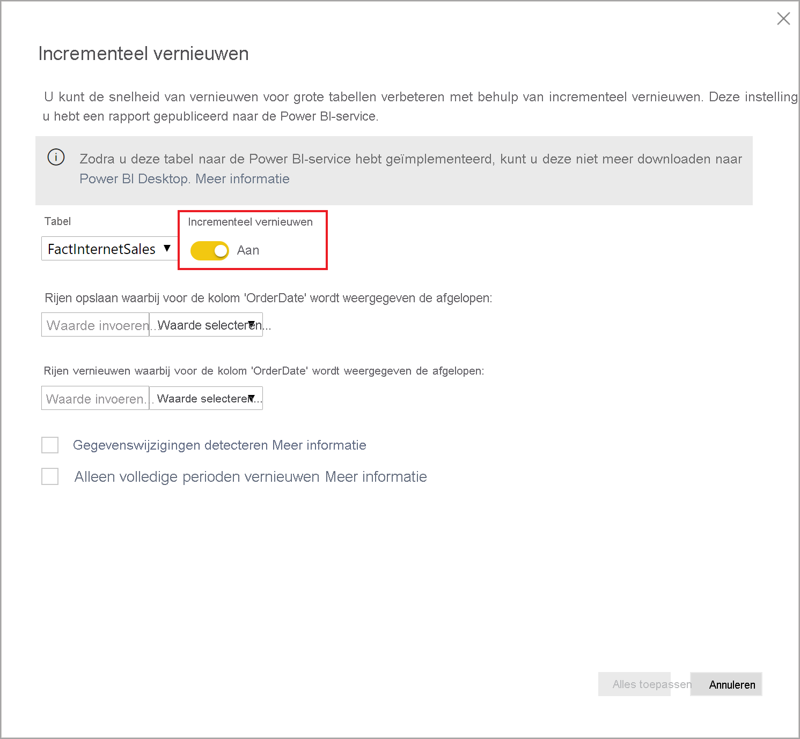

# Wat is Power BI Premium?

U kunt Power BI Premium gebruiken om toegang te krijgen tot functies en mogelijkheden die alleen beschikbaar zijn in Premium en daarmee een grotere schaal en betere prestaties bieden voor Power BI-inhoud in uw organisatie. Met Power BI Premium kunnen meer gebruikers in uw organisatie optimaal profiteren van Power BI met betere prestaties en reactietijd. Power BI Premium biedt u en de gebruikers van uw organisatie bijvoorbeeld de volgende voordelen:

> [!div class="checklist"]
> * Grotere schaal en betere prestaties voor uw Power BI-rapporten
> * Flexibiliteit voor licentieverlening op capaciteit
> * Eersteklas functies voor gegevensvisualisatie en het uitlezen van inzichten, zoals AI-gestuurde analyses, samenstelbare en herbruikbare gegevensstromen en gepagineerde rapporten
> * Eenduidige self-service en zakelijke BI met een aantal exclusieve Premium-mogelijkheden die zwaardere werkbelastingen ondersteunen en schaalbaarheid van ondernemingen vereisen
> * Ingebouwde licentie voor het uitbreiden van on-premises BI met Power BI Report Server
> * Ondersteuning voor gegevenslocatie per regio (meerdere geografische gebieden) en door de klant beheerde versleutelingssleutels voor data-at-rest (BYOK)
> * De mogelijkheid om Power BI inhoud te delen met iedereen (zelfs buiten uw organisatie) zonder een licentie per gebruiker aan te schaffen

 

In dit artikel worden belangrijke functies van Power BI Premium beschreven. In voorkomende gevallen worden koppelingen geboden naar aanvullende artikelen met meer gedetailleerde informatie. Raadpleeg de sectie _Vergelijking van Power BI-functies_ van [Power BI-prijzen](https://powerbi.microsoft.com/pricing/) voor meer informatie over Power BI Pro en Power BI Premium.

## Power BI Premium Generation 2 (preview)

Power BI Premium heeft onlangs een nieuwe versie van Power BI Premium uitgebracht: **Power BI Premium Generation 2**, gemakshalve aangeduid **Premium Gen2**. Premium Gen2 is momenteel beschikbaar als preview-versie en kan tijdens de preview-periode worden gebruikt door Premium-abonnees. U kunt de oorspronkelijke versie van Premium gebruiken of overschakelen naar het gebruik van Premium Gen2. U kunt slechts een van beide gebruiken voor uw Premium-capaciteit. 

Premium Gen2 biedt de volgende updates of verbeterde ervaring:

* Mogelijkheid om **Premium per gebruiker**-licenties toe te wijzen naast per capaciteit.

* Verbeterde **prestaties** voor elke capaciteitsgrootte, op elk gewenst moment: Analysebewerkingen worden tot wel 16 keer sneller uitgevoerd op Premium-Gen2. Bewerkingen worden altijd op de hoogste snelheid uitgevoerd en kunnen niet worden vertraagd wanneer de belasting van de capaciteit de capaciteitslimieten nadert.

* **Grotere schaal**:
    * *Geen limieten* voor de gelijktijdigheid van vernieuwingen, zodat u niet langer planningen hoeft bij te houden voor gegevenssets die worden vernieuwd op uw capaciteit
    * Minder geheugenbeperkingen
    * Volledige scheiding tussen rapportinteractie en geplande vernieuwingen

* **Verbeterde metrische gegevens** met duidelijke en genormaliseerde gegevens over capaciteitsgebruik, die alleen afhankelijk zijn van de complexiteit van analysebewerkingen die de capaciteit uitvoert, en niet van de grootte, de mate van belasting van het systeem tijdens het uitvoeren van analyses, of andere factoren. Met de verbeterde metrische gegevens zijn analyse van het gebruik, budgetplanning, terugstortingen en de noodzaak om te upgraden duidelijk zichtbaar met ingebouwde rapportage. Tijdens de preview-periode zullen betere metrische gegevens beschikbaar worden gemaakt. Klanten die toegang tot de metrische gegevens over het gebruik gedurende de afgelopen zeven dagen willen, kunnen contact opnemen met de klantenondersteuning. 

* Met **automatische schaalaanpassing** kan *automatisch* één v-core tegelijk voor 24 uur worden toegevoegd wanneer de belasting van de capaciteit de limiet overschrijdt, zodat er geen vertragingen ontstaan door overbelasting. V-cores worden automatisch verwijderd wanneer niet-actieve tijd wordt gedetecteerd. Voor extra v-cores voor uw Azure-abonnement betaalt u per gebruik. Automatische schaalaanpassing wordt beschikbaar gesteld tijdens de evaluatieperiode. 

* **Minder beheeroverhead**, met proactieve en configureerbare beheerdersmeldingen over het capaciteitsverbruiksniveau en toename van de belasting.

### Met Premium Gen2

Schakel Premium Gen2 in om gebruik te kunnen maken van de updates. Voer de volgende stappen uit om Premium Gen2 in te schakelen:

1. Ga in de beheerportal naar **Capaciteitsinstellingen**.
2. Selecteer **Power BI Premium**.
3. Er wordt een sectie weergegeven met de titel **Premium Generation 2 (preview)** , waarin de schuifregelaar voor Premium Generation 2 (preview) ingeschakeld. 
4. Verplaats de schuifregelaar naar **Ingeschakeld**.

De volgende afbeelding laat zien hoe u Premium Gen2 inschakelt. 

 

### Bekende beperkingen in Premium Gen2

Momenteel zijn de volgende bekende beperkingen van toepassing op Premium Gen2:

1.    Capaciteitsgebruik in Premium Gen2 kan niet worden bijgehouden in de app voor metrische gegevens.

2.    De capaciteitsinstellingen voor Premium Gen2 voor specifieke werkbelastingen zijn nog niet zichtbaar op de pagina Premium Gen2-capaciteitsinstellingen in de beheerportal. Om de instellingen te wijzigen verplaatst u de capaciteit naar de oorspronkelijke versie van Premium, wijzigt u de instellingen en stelt u de capaciteit opnieuw in op het gebruik van Premium Gen2. De instellingen voor geheugentoewijzing zijn niet van toepassing op Premium Gen2-capaciteit.

3.  Als u XMLA op Premium Gen2 wilt gebruiken, moet u ervoor zorgen dat u de meest recente versies van de [hulpprogramma’s voor gegevensmodellering en -beheer](service-premium-connect-tools.md#data-modeling-and-management-tools) gebruikt. 

4.  Analysis Services-functies in Premium Gen2 worden alleen ondersteund in de meest recente clientbibliotheken. Geschatte releasedatums voor afhankelijke hulpprogramma's ter ondersteuning van deze vereiste zijn:

    |Hulpprogramma|Minimumversie vereist|Geschatte releasedatum|
    |---|---|---|
    |SQL Server Management Studio (SSMS)|18,8|8 december 2020|
    |SQL Server Data Tools (SSDT)|2.9.15|Algemene beschikbaarheid 30 november 2020|
    | AS PowerShell| Hoger dan 21.1.18229|6 november 2020|

## Abonnementen en licenties

Power BI Premium is een Microsoft 365-abonnement op tenantniveau beschikbaar in twee SKU-families (SKU: Stock Keeping Unit):

- **P**-SKU's (P1-P5) voor het insluiten van inhoud en zakelijke functies; hiervoor geldt een maandelijkse of jaarlijkse betalingsverplichting die maandelijks wordt gefactureerd en een licentie bevat voor het on-premises installeren van Power BI Report Server.

- **EM**-SKU's (EM1-EM3) voor het insluiten van inhoud in de _organisatie_. Hiervoor geldt een jaarlijkse betalingsverplichting die maandelijks in rekening worden gebracht. EM1- en EM2-SKU's zijn alleen beschikbaar via volumelicentieplannen. U kunt deze niet rechtstreeks kopen.

### Updates voor Premium Gen2 (preview-versie)
Premium Gen2 is momenteel alleen beschikbaar als een volledig ondersteunde preview-functie voor **P**- en **EM**-SKU's. De capaciteit van **A**-SKU's biedt nog geen extra voordelen van de Premium Gen2-previewupdate.

### Aanschaffen

Power BI Premium-abonnementen worden aangeschaft door beheerders in het Microsoft 365-beheercentrum. Specifieker: globale beheerders of factureringsbeheerders zijn de enigen die SKU's kunnen aanschaffen. Bij de aankoop ontvangt de tenant een overeenkomstig aantal v-cores die deze kan toewijzen aan capaciteit, ook wel *v-core-pooling* genoemd. Als u bijvoorbeeld een P3-SKU koopt, ontvangt de tenant 32 v-cores. Zie [Power BI Premium kopen](service-admin-premium-purchase.md) voor meer informatie.

#### Power BI Premium per gebruiker (preview-versie)

Met Power BI **Premium Per User** kunnen organisaties Premium-functies licentiëren per gebruiker. Premium Per User (PPU, Premium per gebruiker) omvat alle Power BI Pro-licentiemogelijkheden en voegt functies toe zoals gepagineerde rapporten, AI en andere mogelijkheden die alleen beschikbaar zijn voor Premium-abonnees. Premium per gebruiker is momenteel beschikbaar als preview-versie. Raadpleeg het artikel [Veelgestelde vragen over Power BI Premium Per User (preview)](service-premium-per-user-faq.md) voor meer informatie over Premium per gebruiker, met inbegrip van een functievergelijking en andere informatie over de preview-versie. 

## Gereserveerde capaciteit

Met Power BI Premium krijgt u *gereserveerde capaciteit*. In tegenstelling tot een gedeelde capaciteit waarbij analyses van werkbelastingen worden uitgevoerd op rekenresources die worden gedeeld met andere klanten, wordt een gereserveerde capaciteit uitsluitend gebruikt door één organisatie. De capaciteit is geïsoleerd met gereserveerde rekenresources die betrouwbare en consistente prestaties leveren voor gehoste inhoud. Houd er rekening mee dat de verwerking van de volgende typen Power BI inhoud wordt opgeslagen in de gedeelde capaciteit, in plaats van uw gereserveerde capaciteit:

* Excel-werkmappen (tenzij de gegevens eerst zijn geïmporteerd in Power BI Desktop)
* [Push-gegevenssets](/rest/api/power-bi/pushdatasets)
* [Streaminggegevenssets](../connect-data/service-real-time-streaming.md#set-up-your-real-time-streaming-dataset-in-power-bi)
* [Q&A](../create-reports/power-bi-tutorial-q-and-a.md)

Werkruimten bevinden zich in capaciteiten. Elke Power BI-gebruiker heeft een persoonlijke werkruimte die **Mijn werkruimte** heet. Er kunnen extra werkruimten worden gemaakt om samenwerking mogelijk te maken. Deze werkruimten worden overigens **werkruimten** genoemd. Werkruimten, met inbegrip van persoonlijke werkruimten, worden standaard gemaakt in de gedeelde capaciteit. Als u over Premium-capaciteiten beschikt, kunnen zowel Mijn werkruimten als werkruimten worden toegewezen aan Premium-capaciteiten.

Mijn werkruimten van capaciteitsbeheerders worden automatisch toegewezen aan Premium-capaciteit.

### Updates voor Premium Gen2 (preview-versie)

Premium Gen2-knooppunten gebruiken geen gereserveerde infrastructuur meer. In plaats daarvan zorgt de service ervoor dat er voldoende rekenkracht beschikbaar is voor elke werkbelasting die wordt uitgevoerd door voldoende resources uit een gedeelde groep van zeer geschikte rekenknooppunten toe te wijzen.

### Capaciteitsknooppunten

Zoals beschreven in de sectie [Abonnementen en licentieverlening](#subscriptions-and-licensing), zijn er twee SKU-families voor Power BI Premium: **EM** en **P**. Alle Power BI Premium-SKU's zijn beschikbaar als capaciteits *knooppunten*, waarbij elk voor een vaste hoeveelheid resources staat die bestaat uit een processor, geheugen en opslag. Naast de resources heeft elke SKU operationele limieten voor het aantal DirectQuery-verbindingen en liveverbindingen per seconde, en het aantal parallelle modellen wordt vernieuwd.

De verwerking vindt plaats door een vast aantal v-cores, evenredig verdeeld over back-end en front-end.

De **back-end-v-cores** zijn verantwoordelijk voor de Power BI-kernfunctionaliteit, waaronder het verwerken van query's, cachebeheer, het uitvoeren van R-services, het vernieuwen van modellen en het weergeven van rapporten en afbeeldingen op de server. Aan back-end-v-cores wordt een vaste hoeveelheid geheugen toegewezen die voornamelijk wordt gebruikt voor het hosten van modellen, ook wel actieve gegevenssets genoemd.

De **front-end-v-cores** zijn verantwoordelijk voor de webservice, het documentbeheer voor dashboards en rapporten, het beheren van de toegangsrechten, de planning, API's, uploaden en downloaden en in het algemeen voor alles met betrekking tot de gebruikerservaring.

De opslag is ingesteld op **100 TB per capaciteitsknooppunt**.

De resources en limieten van elke Premium-SKU (en A-SKU van een vergelijkbare omvang) in de volgende tabel beschreven:

| Capaciteitsknooppunten | Totaal aantal v-cores | v-cores voor back-end | RAM (GB) | v-cores voor front-end | DirectQuery/liveverbinding (per sec) | Model voor parallelle vernieuwing |
| --- | --- | --- | --- | --- | --- | --- |
| EM1/A1 | 1 | 0,5 | 3 | 0,5 | 3,75 | 1 |
| EM2/A2 | 2 | 1 | 5 | 1 | 7,5 | 2 |
| EM3/A3 | 4 | 2 | 10 | 2 | 15 | 3 |
| P1 | 8 | 4 | 25 | 4 | 30 | 6 |
| P2 | 16 | 8 | 50 | 8 | 60 | 12 |
| P3 | 32 | 16 | 100 | 16 | 120 | 24 |
| P4 [1](#limit)| 64 | 32 | 200 | 32 | 240 | 48 |
| P5 [1](#limit)| 128 | 64 | 400 | 64 | 480 | 96 |
| | | | | | | |

<a name="limit">1</a>: Alleen op aanvraag. Voor zeer grote modellen, die groter zijn dan 100 GB.

>[!NOTE]
>Het gebruik van één grotere SKU (bijvoorbeeld één P2-SKU) kan de voorkeur hebben boven het combineren van kleinere SKU’s (bijvoorbeeld twee P1-SKU’s). U kunt bijvoorbeeld grotere modellen gebruiken en beter parallellisme bereiken met P2.

#### Updates voor Premium Gen2 (preview-versie)

Met **Premium Gen2** is de hoeveelheid geheugen die beschikbaar is op elke knooppuntgrootte ingesteld op de maximale geheugenruimte van één artefact en niet op het cumulatieve verbruik van het geheugen. In Premium Gen2 is bijvoorbeeld slechts één gegevensset beperkt tot 25 GB, terwijl in de oorspronkelijke Premium de totale geheugencapaciteit van de gegevenssets die op hetzelfde moment worden verwerkt was beperkt tot 25 GB.

### Workloads van capaciteit

Workloads van capaciteit zijn services die beschikbaar zijn gesteld aan gebruikers. Standaard bieden Premium- en Azure-capaciteiten alleen ondersteuning voor de workload van een gegevensset die aan het uitvoeren van Power BI-query's is gekoppeld. De workload van een gegevensset kan niet worden uitgeschakeld. U kunt extra workloads inschakelen voor [AI (Cognitive Services)](https://powerbi.microsoft.com/blog/easy-access-to-ai-in-power-bi-preview/), [gegevensstromen](../transform-model/dataflows/dataflows-introduction-self-service.md) en [gepagineerde rapporten](../paginated-reports/paginated-reports-save-to-power-bi-service.md). Deze workloads worden alleen ondersteund in Premium-abonnementen. 

Met elke extra workload kunt u de maximale hoeveelheid geheugen configureren (als percentage van de totale capaciteit aan beschikbaar geheugen) die door de workload kan worden gebruikt. De standaardwaarden voor de maximale hoeveelheid geheugen worden bepaald door de SKU. U kunt de beschikbare resources van uw capaciteit maximaliseren door deze extra workloads alleen in te schakelen wanneer ze worden gebruikt. En u kunt de geheugeninstellingen alleen wijzigen wanneer u hebt vastgesteld dat de standaardinstellingen niet voldoen aan de resourcevereisten van uw capaciteit. Workloads kunnen door capaciteitsbeheerders voor een capaciteit worden ingeschakeld en geconfigureerd met behulp van **capaciteitsinstellingen** in de [beheerportal](service-admin-portal.md) of met behulp van de [REST API's voor capaciteiten](/rest/api/power-bi/capacities).  

Raadpleeg [Configure workloads in a Premium capacity](service-admin-premium-workloads.md) (Workloads configureren in een Premium-capaciteit) voor meer informatie. 

### Hoe capaciteiten functioneren

De Power BI-service maakt te allen tijde zo goed mogelijk gebruik van capaciteitsresources zonder dat daarbij de limieten die zijn opgelegd aan de capaciteit worden overschreden.

Capaciteitsbewerkingen zijn geclassificeerd als *interactief* of *achtergrond*. Interactieve bewerkingen zijn onder meer het weergeven van aanvragen van en reageren op interactie van gebruikers (filteren, query's op Q&A uitvoeren enzovoort). Bewerkingen op de achtergrond zijn onder meer de vernieuwing van gegevensstroom- en importmodellen en het opslaan van dashboardquery's in het cachegeheugen.

Het is belangrijk om te begrijpen dat interactieve bewerkingen altijd voorrang krijgen boven bewerkingen op de achtergrond om een zo goed mogelijke gebruikerservaring te garanderen. Als er onvoldoende resources zijn, worden de bewerkingen op de achtergrond aan een wachtrij toegevoegd tot er resources vrijkomen. Bewerkingen op de achtergrond, zoals de vernieuwing van gegevenssets, kunnen tijdens de verwerking worden onderbroken door de Power BI-service, aan een wachtrij worden toegevoegd en later alsnog worden uitgevoerd.

Importmodellen moet volledig in het geheugen worden geladen, zodat ze kunnen worden opgevraagd of vernieuwd. De Power BI-service maakt gebruik van geavanceerde algoritmen om het geheugengebruik redelijk te beheren, maar in zeldzame gevallen kan de capaciteit overbelast raken als er onvoldoende resources zijn om te voldoen aan de realtimevereisten van klanten. Hoewel het mogelijk is om veel importmodellen op te slaan in permanente opslag (tot 100 TB per Premium-capaciteit), kunnen niet alle modellen tegelijk in het geheugen zijn opgeslagen, anders kan de grootte van de geheugenlimiet van de capaciteit eenvoudig worden overschreden door de gegevensset in het geheugen. Naast het geheugen dat nodig is voor het laden van de gegevenssets, is er extra geheugen nodig voor het uitvoeren van query's en vernieuwingsbewerkingen.

Importmodellen worden daarom geladen en verwijderd uit het geheugen op basis van gebruik. Een importmodel wordt geladen wanneer dit wordt opgevraagd (interactieve bewerking), of wanneer dit moet worden vernieuwd (bewerking op de achtergrond).

Het verwijderen van een model uit het geheugen wordt ook wel *uitzetting* genoemd. Dit is een bewerking die Power BI snel kan uitvoeren, afhankelijk van de grootte van de modellen. Als de capaciteit geen geheugendruk ondervindt en het model niet inactief is (dat wil zeggen, actief wordt gebruikt), kan het model in het geheugen worden opgeslagen zonder te worden verwijderd. Als Power BI bepaalt dat er onvoldoende geheugen is om een model te laden, probeert de Power BI-service geheugen vrij te maken door inactieve modellen te verwijderen. Dit zijn doorgaans de modellen die zijn geladen voor interactieve bewerkingen die in de afgelopen drie minuten niet zijn gebruikt \[[1](#endnote-1)\]. Als er geen inactieve modellen zijn om te verwijderen, probeert Power BI-service modellen te verwijderen die zijn geladen voor bewerkingen op de achtergrond. Wanneer 30 seconden lang pogingen zijn mislukt \[[1](#endnote-1)\], wordt als laatste redmiddel de interactieve bewerking afgebroken. In dit geval wordt de rapportgebruiker op de hoogte gesteld van de fout, met een suggestie om het over enkele ogenblikken opnieuw te proberen. In sommige gevallen kunnen modellen uit het geheugen worden verwijderd vanwege servicebewerkingen.

Het is belangrijk om te benadrukken dat de verwijdering van gegevenssets normaal verwacht gedrag is voor de capaciteit. De capaciteit streeft ernaar het geheugengebruik te verdelen door de levenscyclus van modellen in het geheugen te beheren op een manier die transparant is voor gebruikers. Een hoog aantal verwijderingen betekent niet noodzakelijkerwijs dat de capaciteit van onvoldoende resources is voorzien. Het kan echter een probleem worden als de prestaties van query's of vernieuwingen verminderen als gevolg van de belasting van het laden en verwijderen van modellen binnen een korte periode.

Het vernieuwen van importmodellen vormt altijd een zware belasting voor uw geheugen, aangezien modellen in het geheugen moeten worden geladen. Er is ook extra tussenliggend geheugen vereist voor de verwerking. Bij een volledige vernieuwing is ongeveer twee keer zoveel geheugen nodig voor het model, omdat Power BI een bestaande momentopname van het model in het geheugen onderhoudt totdat de bewerking is voltooid. Hierdoor kan het model worden opgevraagd, zelfs wanneer het wordt verwerkt. Query's kunnen worden verzonden naar de bestaande momentopname van het model totdat het vernieuwen is voltooid en de nieuwe modelgegevens beschikbaar zijn.

Bij incrementeel vernieuwen wordt de partitie vernieuwd in plaats van het volledige model. Dit gaat doorgaans sneller en vergt minder geheugen, en kan het resourcegebruik van de capaciteit aanzienlijk verminderen. Vernieuwen kan ook een zware belasting voor modellen vormen, met name de modellen met complexe Power Query-transformaties of berekende tabellen/kolommen die complex zijn of zijn gebaseerd op grote gegevensvolumes.

Voor vernieuwen moet net als bij query's, het model in het geheugen worden geladen. Als er onvoldoende geheugen is, probeert Power BI-service inactieve modellen te verwijderen, en als dit niet mogelijk is (als alle modellen actief zijn), wordt de vernieuwingstaak in de wachtrij geplaatst. Vernieuwen betekent gewoonlijk een zware belasting voor uw CPU, zelfs zwaarder dan query's. Daarom geldt een limiet voor het aantal gelijktijdige vernieuwingen. Deze wordt berekend als het maximum van 1,5 x het aantal v-cores voor back-end. Als er te veel gelijktijdige vernieuwingen zijn, wordt de geplande vernieuwing in de wachtrij geplaatst totdat er een vernieuwingssleuf beschikbaar is. Hierdoor duurt de bewerking langer. Voor vernieuwingen op aanvraag, zoals die worden geactiveerd door een gebruikersaanvraag of een API-aanroep, worden drie nieuwe pogingen uitgevoerd \[[1](#endnote-1)\]. Als er nog steeds niet voldoende resources zijn, wordt het vernieuwen afgebroken.

#### Updates voor Premium Gen2 (preview-versie)

Voor Premium Gen2 zijn geen cumulatieve geheugenlimieten vereist, en daarom dragen gelijktijdige vernieuwingen van gegevenssets niet bij aan resourcebeperkingen. Bovendien geldt er geen limiet voor het aantal actieve vernieuwingen per v-core. Het vernieuwen van afzonderlijke gegevenssets wordt nog steeds bepaald door het bestaande geheugen- en CPU-limieten van de capaciteit. U kunt op elk gewenst moment zo veel vernieuwingen plannen en uitvoeren als nodig is, waarna de Power BI-service ze als een beste poging vernieuwt op het geplande tijdstip.

Opmerkingen bij de sectie:   
\[1\] kan worden gewijzigd.

### Regionale ondersteuning

Bij het maken van een nieuwe capaciteit kunnen globale beheerders en Power BI-servicebeheerders een regio opgeven waarin de werkruimten zich zullen bevinden die aan de capaciteit worden toegewezen. Dit staat bekend als **Multi-Geo (meerdere geografische gebieden)** . Met meerdere geografische gebieden (Multi-Geo) kunnen organisaties aan gegevenslocatievereisten voldoen door inhoud in datacenters in een bepaalde regio te implementeren, zelfs als deze verschilt van de regio waarin het Microsoft 365-abonnement zich bevindt. Raadpleeg [Ondersteuning van Multi-Geo voor Power BI Premium](service-admin-premium-multi-geo.md) voor meer informatie.

### Capaciteitsbeheer

Het beheren van Premium-capaciteiten omvat het maken of verwijderen van capaciteiten, toewijzen van beheerders en werkruimten, configureren van workloads, en het controleren en aanbrengen van correcties voor optimale prestaties van de capaciteit. 

Globale beheerders en Power BI-servicebeheerders kunnen Premium-capaciteiten maken van beschikbare v-cores of bestaande Premium-capaciteiten wijzigen. De grootte van de capaciteit en de geografische regio worden opgegeven wanneer een capaciteit is gemaakt, en er wordt ten minste één capaciteitsbeheerder toegewezen. 

Wanneer capaciteiten zijn gemaakt, worden de meeste beheertaken uitgevoerd in de [beheerportal](service-admin-portal.md).

Capaciteitsbeheerders kunnen werkruimten toewijzen aan de capaciteit, gebruikersmachtigingen beheren en andere beheerders toewijzen. Capaciteitsbeheerders kunnen ook workloads configureren door geheugentoewijzingen aan te passen, en, indien nodig, een capaciteit opnieuw opstarten door bewerkingen opnieuw in te stellen als een capaciteit overbelast raakt.

Capaciteitsbeheerders kunnen ook controleren of een capaciteit probleemloos werkt. Ze kunnen het functioneren van capaciteiten rechtstreeks in de beheerportal of via de app Power BI Premium Capacity Metrics controleren.

Zie [Premium-capaciteiten beheren](service-premium-capacity-manage.md) voor meer informatie over het maken van capaciteiten, het toewijzen van beheerders en het toewijzen van werkruimten. Zie [Administrator roles related to Power BI](service-admin-administering-power-bi-in-your-organization.md#administrator-roles-related-to-power-bi) (Beheerdersrollen voor Power BI) voor meer informatie over rollen.

### Controleren

De controle van Premium-capaciteiten biedt beheerders inzicht in de prestaties van capaciteiten. U kunt de capaciteiten controleren via de beheerportal of met de app [Power BI Premium Capacity Metrics](https://app.powerbi.com/groups/me/getapps/services/capacitymetrics).

Wanneer u een controle uitvoert in de portal, biedt dit een snelle weergave met metrische gegevens op hoog niveau van de afgelopen zeven dagen, waarin wordt aangegeven welke belastingen zijn opgelegd, welke resources door uw capaciteit zijn gebruikt, welke gemiddelden dit oplevert. 

> [!NOTE]
> **Updates voor Premium Gen2 (preview)** -Voor Premium Gen2 is alleen bewaking van één aspect vereist: hoeveel CPU-tijd uw capaciteit nodig heeft om de belasting op elk moment te kunnen leveren. Als u de CPU-tijd voor de aangeschafte SKU-grootte overschrijdt, wordt uw capaciteit automatisch geschaald om te voldoen aan de behoeften, of worden interactieve bewerkingen beperkt op basis van uw configuratie-instellingen.

De app **Power BI Premium Capacity Metrics** biedt de meest uitgebreide informatie over hoe uw capaciteiten presteren. De app biedt een dashboard op hoog niveau en meer gedetailleerde rapporten.

Vanuit het dashboard van de app kunt u op een cel met metrische gegevens klikken als u een gedetailleerd rapport wilt openen. Rapporten bieden gedetailleerde metrische gegevens en filterfunctionaliteit waarmee u kunt inzoomen op de belangrijkste informatie die u nodig hebt om ervoor te zorgen dat uw capaciteit probleemloos blijft werken.

Zie [Monitoring in the Power BI Admin portal](service-admin-premium-monitor-portal.md) (Controles uitvoeren in de Power BI-beheerportal) en [Monitoring with the Power BI Premium Capacity Metrics app](service-admin-premium-monitor-capacity.md) (Controles uitvoeren met de app Power BI Premium Capacity Metrics) voor meer informatie over het controleren van capaciteit.

#### Updates voor Premium Gen2 (preview-versie)
**Premium Gen2-** -capaciteit maakt geen gebruik van de app voor metrische gegevens, maar van de app voor capaciteitsgebruik die tijdens de preview-periode beschikbaar wordt gemaakt. Klanten die hun gebruik willen bekijken, kunnen een exemplaar van het gebruiksrapport voor de afgelopen krijgen door het rapport aan te vragen bij de klantenondersteuning. Het rapport wordt binnen 72 uur na aanvraag verstrekt. De app voor capaciteitsgebruik kan worden gestart vanaf uw pagina voor capaciteitsbeheer in de **beheerportal** voor elke capaciteit en biedt de mogelijkheid om 30 dagen en meer aan gegevens te analyseren.

### Capaciteiten optimaliseren

Optimaal gebruikmaken van uw capaciteiten is essentieel om zeker te zijn dat u gebruikers goede prestaties biedt en u de maximale waarde krijgt voor uw Premium-investering. Beheerders kunnen door de controle van belangrijke metrische gegevens bepalen hoe zij het beste knelpunten kunnen oplossen en de nodige actie kunnen ondernemen. Zie [Optimizing Premium capacities](service-premium-capacity-optimize.md) (Premium-capaciteiten optimaliseren) en [Premium capacity scenarios](service-premium-capacity-scenarios.md) (Scenario's voor Premium-capaciteit) voor meer informatie.

### REST-API 's voor capaciteiten

De Power BI REST API's bevatten een verzameling met [capaciteit-API's](/rest/api/power-bi/capacities). Beheerders kunnen met de API's veel aspecten van uw Premium-capaciteiten via een programma beheren, waaronder workloads inschakelen en uitschakelen, werkruimten toewijzen aan een capaciteit, en meer.

## Grote gegevenssets

Afhankelijk van de SKU biedt Power BI Premium ondersteuning voor het uploaden van Power BI Desktop-modelbestanden (.pbix) tot een maximale grootte van **10 GB**. Eenmaal geladen, kan vervolgens het model worden gepubliceerd naar een werkruimte die is toegewezen aan een Premium-capaciteit. Een gegevensset kan vervolgens worden vernieuwd tot een grootte van **12 GB**.

### Overwegingen over grootte

Grote gegevenssets kunnen een zware belasting vormen voor uw resources. U kunt het beste een P1- of A4-SKU nemen voor alle gegevenssets die groter zijn dan 1 GB. Hoewel het mogelijk is om grote modellen te publiceren naar werkruimten die worden ondersteund door A-SKU's tot A3, kunt u de gegevenssets niet vernieuwen.

De volgende tabel bevat de aanbevolen SKU's voor het uploaden van PBIX-bestanden of het publiceren naar de Power BI-service:

   |SKU  |Grootte van pbix-bestand   |
   |---------|---------|
   |P1    | < 3 GB        |
   |P2    | < 6 GB        |
   |P3, P4, P5    | tot 10 GB  |

De Power BI Embedded A4-SKU is gelijk aan de P1-SKU, A5 = P2 en A6 = P3.

### Opslagindeling voor grote gegevenssets

Als u de instelling [Opslagindeling voor grote gegevenssets](service-premium-large-models.md) inschakelt voor een gegevensset, worden de beperkingen voor de grootte van PBIX-bestanden nog steeds toegepast op het uploaden of publiceren van bestanden. De maximale uploadgrootte wordt niet beïnvloed door de opslagindeling voor grote gegevenssets. Wanneer incrementeel vernieuwen en de opslagindeling voor grote gegevensset zijn ingeschakeld, kunnen bij de publicatie van gegevenssets naar de service deze gegevenssets echter veel groter worden dan deze limieten. Bij een opslagindeling voor grote gegevenssets wordt de grootte van de gegevensset alleen beperkt door de maximale Power BI Premium-capaciteit.

Met Power BI-gegevenssets kunnen gegevens sterk gecomprimeerd in de in-memory cache worden opgeslagen voor geoptimaliseerde queryprestaties, om snellere gebruikersinteractiviteit in grote gegevenssets mogelijk te maken. Voorheen waren gegevenssets in Power BI Premium beperkt tot 10 GB, na compressie. Voor grote modellen wordt de beperking verwijderd en wordt de grootte van de gegevensset alleen beperkt door de capaciteitsgrootte of door de maximale grootte die de beheerder instelt. Door dergelijke grote gegevenssets in te schakelen, kan de grootte van de Power BI-gegevenssets beter worden afgestemd op de grootte van Azure Analysis Services-modellen.

Uw pbix-bestanden bevatten gegevens in een *sterk gecomprimeerde toestand*. De gegevensgrootte neemt waarschijnlijk toe wanneer de gegevens in het geheugen worden geladen. Vervolgens neemt de grootte mogelijk nog meerdere keren toe tijdens het vernieuwen van gegevens.

Geplande vernieuwing van grote gegevenssets kan erg lang duren en kan een zware belasting voor uw resources vormen. Het is belangrijk dat u het vernieuwen van gegevens daarom niet te veel gelijktijdig plant. Het is raadzaam om [incrementeel vernieuwen](service-premium-incremental-refresh.md) te configureren omdat dit sneller en betrouwbaarder is en hiermee minder resources worden verbruikt.

Het voor de eerste keer laden van een rapport voor grote gegevenssets kan erg lang duren als het al enige tijd geleden is dat de gegevensset is gebruikt. Voor rapporten waarvoor het laden langer duurt, wordt de laadvoortgang via een voortgangsbalk weergegeven.

Omdat de beperkingen van geheugen en tijd per query veel hoger zijn in Premium capaciteit, is het raadzaam filters en slicers te gebruiken om van visuals alleen de benodigde informatie weer te geven.

## Incrementeel vernieuwen

Incrementeel vernieuwen vormt een onlosmakelijk onderdeel van het hebben en onderhouden van grote gegevenssets in Power BI Premium en Power BI Pro. Incrementeel vernieuwen heeft veel voordelen: vernieuwen vindt bijvoorbeeld sneller plaats omdat er alleen gegevens worden vernieuwd die gewijzigd moeten worden. Vernieuwen is betrouwbaarder, omdat het niet nodig is om langdurige verbindingen met vluchtige gegevensbronnen te onderhouden. Het verbruik van resources is lager, omdat het algemene verbruik van geheugen en andere resources wordt verlaagd als er minder gegevens zijn om te vernieuwen. Beleid voor incrementele vernieuwing wordt gedefinieerd in **Power BI Desktop** en toegepast zodra het beleid wordt gepubliceerd naar een werkruimte in een Premium-capaciteit. 

Raadpleeg [Incremental refresh in Power BI Premium](service-premium-incremental-refresh.md) (Incrementeel vernieuwen in Power BI Premium) voor meer informatie.

## Gepagineerde rapporten

Gepagineerde rapporten, die worden ondersteund op P1-P3- en A4_A6-SKU's, zijn gebaseerd op RDL-technologie (RDL: Report Definition Language) in SQL Server Reporting Services. Hoewel deze zijn gebaseerd op RDL-technologie, werkt het niet hetzelfde als Power BI Report Server, een downloadbaar rapportageplatform dat u on-premises kunt installeren en ook is opgenomen in Power BI Premium. Gepagineerde rapporten zijn zo geformatteerd dat deze goed passen op een pagina, die kan worden afgedrukt of gedeeld. De gegevens worden in een tabel weergegeven, zelfs als de tabel meerdere pagina's omvat. Met behulp van de gratis Windows Desktop-toepassing [**Power BI Report Builder**](https://aka.ms/pbireportbuilder) stellen gebruikers gepagineerde rapporten op en publiceren deze naar de service.

In Power BI Premium zijn gepagineerde rapporten een workload die voor een capaciteit moet worden ingeschakeld via de beheerportal. Capaciteitsbeheerders kunnen bij de inschakeling vervolgens de hoeveelheid geheugen opgeven als percentage van het totaal aan geheugenresources van de capaciteit. In tegenstelling tot andere typen workloads worden in Premium gepagineerde rapporten in een ingesloten ruimte in de capaciteit uitgevoerd. De maximale hoeveelheid geheugen die u aan deze ruimte hebt toegewezen wordt gebruikt, ongeacht of de workload wel of niet actief is. De standaardwaarde is 20. 

> [!NOTE]
> **Premium Gen2 (preview)** kent geen geheugenbeheer voor gepagineerde rapporten. In Premium Gen2 worden gepagineerde rapporten ondersteund op de EM1-EM3-SKU's.

### Gepagineerde rapporten en Premium Gen2

Wanneer u Premium Gen2 gebruikt, profiteren gepagineerde rapporten in Power BI van de verbeteringen in de architectuur en techniek in Premium Gen2. In de volgende secties worden de voordelen van Premium Gen2 voor gepagineerde rapporten beschreven.

**Ruimere beschikbaarheid van SKU’s**: met gepagineerde rapporten die worden uitgevoerd in Premium Gen2 kunnen rapporten worden uitgevoerd over alle beschikbare ingebouwde en Premium-SKU's. De facturering wordt berekend per CPU-uur over een periode van 24 uur. Hiermee worden de SKU's die gepagineerde rapporten ondersteunen aanzienlijk uitgebreid.

**Dynamisch schalen**: met Premium Gen2 kunnen uitdagingen rondom pieken in de activiteit of benodigde bronnen dynamisch worden verwerkt als dat nodig is. 

**Verbeterde caching**: vóór Premium Gen2 waren gepagineerde rapporten nodig om veel bewerkingen uit te voeren in de context van geheugen dat is toegewezen aan de capaciteit voor de werkbelasting. In Premium Gen2 ontstaat door vermindering van het vereiste geheugen voor veel bewerkingen de mogelijkheid voor klanten om langlopende bewerkingen uit te voeren zonder dat dit van invloed is op andere gebruikerssessies. 

**Verbeterde beveiliging en code-isolatie**: in Premium-Gen2 kan code-isolatie plaatsvinden op gebruikersniveau in plaats van op capaciteitsniveau, zoals het geval was in het oorspronkelijke Premium-aanbod. 

Raadpleeg [Paginated reports in Power BI Premium](../paginated-reports/paginated-reports-report-builder-power-bi.md) (Gepagineerde rapporten in Power BI Premium) voor meer informatie. Zie [Workloads configureren](service-admin-premium-workloads.md) voor meer informatie over het inschakelen van de workload voor gepagineerde rapporten.

## Power BI Report Server
 
Power BI Report Server maakt deel uit van Power BI Premium en is een *on-premises* rapportserver met een webportal. U kunt uw BI-omgeving on-premises bouwen en rapporten distribueren achter de firewall van uw organisatie. Report Server biedt gebruikers toegang tot uitgebreide, interactieve en zakelijke rapportmogelijkheden van SQL Server Reporting Services. Gebruikers kunnen visuele gegevens verkennen en snel patronen ontdekken om betere, snellere beslissingen te nemen. Report Server biedt governance op uw eigen voorwaarden. Als en wanneer het zover is, kunt u met Power BI Report Server eenvoudig migreren naar de cloud, waar uw organisatie volop van alle functies van Power BI Premium kan profiteren.

Zie [Power BI Report Server](../report-server/get-started.md) voor meer informatie.

## Onbeperkt inhoud delen

Met Premium is iedereen die binnen én buiten uw organisatie werkt in staat om uw Power BI-inhoud te bekijken, inclusief gepagineerde en interactieve rapporten. En dat zelfs zonder afzonderlijke licenties te hoeven aanschaffen. 

Premium voorziet in een wijdverbreide distributie van inhoud door Pro-gebruikers zonder dat ontvangers die de inhoud bekijken een Pro-licentie nodig hebben. Voor makers van inhoud is een Pro-licentie vereist. Makers maken verbinding met gegevensbronnen, modelleren gegevens en maken rapporten en dashboards die zijn verpakt als werkruimte-apps. Gebruikers zonder een Pro-licentie hebben nog steeds toegang tot een werkruimte die zich in de Power BI Premium-capaciteit bevindt, zolang ze een rol van een kijker hebben. 

Zie [Power BI-licentieverlening](service-admin-licensing-organization.md) voor meer informatie.

## Analysis Services in Power BI Premium

De voor zakelijke doeleinden beproefde Microsoft **Analysis Services Vertipaq-engine** is de drijvende kracht achter de Power BI Premium-werkruimten en -gegevenssets. Analysis Services biedt programmeerbaarheid en ondersteuning voor clienttoepassingen en hulpprogramma's via clientbibliotheken en API's die ondersteuning bieden voor het open-standaard XMLA-protocol. Standaard bieden gegevenssetsworkloads op Power BI Premium-capaciteit ondersteuning voor *alleen-lezen* bewerkingen van Microsoft en clienttoepassingen en hulpprogramma's van derden via een **XMLA-eindpunt**. Capaciteitsbeheerders kunnen er ook voor kiezen om *lees- en schrijf* bewerkingen via het eindpunt uit te schakelen of toe te staan.

Met alleen-lezentoegang kunnen hulpprogramma's van Microsoft, zoals SQL Server Management Studio (SSMS) en SQL Server Profiler en apps van derden, zoals DAX Studio en toepassingen voor gegevensvisualisatie, verbinding maken met en query's uitvoeren op Premium-gegevenssets met behulp van XMLA-, DAX-, MDX-, DMV- en traceergebeurtenissen. Met lees-/schrijftoegang kunnen hulpprogramma's voor gegevensmodellering op bedrijfsniveau, zoals Visual Studio met de extensie voor Analysis Services-projecten of Tabular Editor (open source), tabellaire modellen implementeren als een gegevensset voor een Premium-werkruimte. Met hulpprogramma's zoals SSMS kunnen beheerders Tabular Model Scripting Language (TMSL) gebruiken om scripts voor het wijzigen van metagegevens en geavanceerde scenario's voor het vernieuwen van gegevens uit te voeren. 

Zie [Gegevenssetconnectiviteit met het XMLA-eindpunt](service-premium-connect-tools.md) voor meer informatie.

## Volgende stappen

> [!div class="nextstepaction"]
> [Premium-capaciteiten beheren](service-premium-capacity-manage.md)
> [Documentatie voor Azure Power BI Embedded](https://azure.microsoft.com/services/power-bi-embedded/)

Hebt u nog vragen? [Misschien dat de Power BI-community het antwoord weet](https://community.powerbi.com/)
