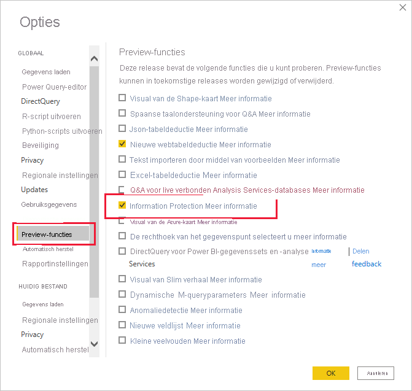

# Vertrouwelijkheidslabels toepassen in Power BI

Vertrouwelijkheidslabels voor Microsoft Information Protection op uw rapporten, dashboards, gegevenssets, gegevensstromen en PBIX-bestanden kunnen uw gevoelige inhoud beschermen tegen ongeautoriseerde gegevenstoegang en lekken. Door uw gegevens op de juiste manier te labelen met vertrouwelijkheidslabels, zorgt u ervoor dat alleen bevoegde personen toegang tot uw gegevens hebben. In dit artikel wordt beschreven hoe u met de Power BI-service en in Power BI Desktop vertrouwelijkheidslabels kunt toepassen.

Zie [Vertrouwelijkheidslabels in Power BI](service-security-sensitivity-label-overview.md) voor meer informatie over vertrouwelijkheidslabels in Power BI.

## Vertrouwelijkheidslabels in de Power BI-service toepassen

In de Power BI-service kunt u vertrouwelijkheidslabels toepassen op rapporten, dashboards, gegevenssets en gegevensstromen.

Ga als volgt te werk als u vertrouwelijkheidslabels wilt toepassen in de Power BI-service:
* U moet over een [Power BI Pro-licentie](./service-admin-purchasing-power-bi-pro.md) en machtigingen voor bewerken beschikken voor de inhoud die u van een label wilt voorzien.
* Vertrouwelijkheidslabels moeten voor uw organisatie zijn ingeschakeld. Neem contact op met uw Power BI-beheerder als u dit niet zeker weet.
* U moet bij een beveiligingsgroep horen die machtigingen heeft om vertrouwelijkheidslabels toe te passen, zoals beschreven in [Vertrouwelijkheidslabels inschakelen in Power BI](./service-security-enable-data-sensitivity-labels.md).
* Er moet aan alle [licentievereisten en overige vereisten](./service-security-enable-data-sensitivity-labels.md#licensing-and-requirements) zijn voldaan.

Wanneer gegevensbeveiliging is ingeschakeld op uw tenant, worden vertrouwelijkheidslabels weergegeven in de kolom Vertrouwelijkheid in de lijstweergave van dashboards, rapporten, gegevenssets en gegevensstromen.

**Een vertrouwelijkheidslabel toepassen of wijzigen op een rapport of dashboard**
1. Klik op **Meer opties (...)** .
1. Selecteer **Instellingen**.
1. Kies in het deelvenster van de instellingen het juiste vertrouwelijkheidslabel.
1. Sla de instellingen op.

In de volgende afbeelding ziet u deze stappen in een rapport

**Een vertrouwelijkheidslabel op een gegevensset of gegevensstroom toepassen of wijzigen**

1. Klik op **Meer opties (...)** .
1. Selecteer **Instellingen**.
1. Selecteer het tabblad Gegevenssets of Gegevensstromen, afhankelijk van welke van toepassing is.
1. Vouw de sectie Vertrouwelijkheidslabels uit en kies het juiste vertrouwelijkheidslabel.
1. Pas de instellingen toe.

De volgende twee afbeeldingen illustreren deze stappen voor een gegevensset.

Kies **Meer opties (...)** en klik vervolgens op **Instellingen**.

Op het tabblad met de instellingen voor gegevenssets opent u de sectie Vertrouwelijkheidslabel, kiest u het gewenste vertrouwelijkheidslabel en klikt u op **Toepassen**.

## Vertrouwelijkheidslabels in Power BI Desktop (preview) toepassen

Ga als volgt te werk als u vertrouwelijkheidslabels in Power BI Desktop wilt gebruiken:
* U moet over een [Power BI Pro-licentie](./service-admin-purchasing-power-bi-pro.md) beschikken.
* Vertrouwelijkheidslabels moeten voor uw organisatie zijn ingeschakeld. Neem contact op met uw Power BI-beheerder als u dit niet zeker weet.
* U moet bij een beveiligingsgroep horen die machtigingen heeft om vertrouwelijkheidslabels toe te passen, zoals beschreven in [Vertrouwelijkheidslabels inschakelen in Power BI](./service-security-enable-data-sensitivity-labels.md).
* Er moet aan alle [licentievereisten en overige vereisten](./service-security-enable-data-sensitivity-labels.md#licensing-and-requirements) zijn voldaan.
* De schakelaar voor de preview-functie Information Protection in Power BI Desktop moet zijn ingeschakeld. Als u de knop Vertrouwelijkheid op het tabblad Start ziet, is de preview-functie ingeschakeld. Als u de knop niet ziet, gaat u naar **Bestand > Opties en instellingen > Opties > Preview-functies** en schakelt u het selectievakje naast **Information Protection** in.

    

    >[!Important]
    >Nadat u de preview-functie Information Protection hebt ingeschakeld, moet u Desktop opnieuw starten om vertrouwelijkheidslabels te kunnen gebruiken.
    >
    >Als de computer vastloopt wanneer u opnieuw opstart, kan het zijn dat de vereiste Visual C++ Redistributable Runtime Library-versie op uw computer ontbreekt. Als u een dergelijke crash ondervindt, gaat u naar de downloadpagina [Microsoft Visual C++ 2015 Redistributable Update 3](https://www.microsoft.com/download/details.aspx?id=53587) voor instructies over het downloaden en installeren van de update. Nadat u de update hebt geïnstalleerd, start u de computer opnieuw op.

    Als u de optie voor de preview Information Protection niet ziet, is de preview-functie mogelijk voor uw organisatie geblokkeerd. Neem in dat geval contact op met de Power BI-beheerder.

* U moet zijn aangemeld.

Als u een vertrouwelijkheidslabel wilt toepassen op het bestand waaraan u werkt, klikt u op de knop Vertrouwelijkheid op het tabblad Start en kiest u het gewenste label in het menu dat wordt geopend.

>[!NOTE]
> Als u de functie Vertrouwelijkheidslabels hebt ingeschakeld in Preview-functies maar de knop Vertrouwelijkheid nog steeds niet ziet, is het mogelijk dat u geen geschikte licentie hebt of niet bij een beveiligingsgroep hoort die gemachtigd is om vertrouwelijkheidslabels toe te passen, zoals beschreven in [Vertrouwelijkheidslabels in Power BI inschakelen](./service-security-enable-data-sensitivity-labels.md).

Nadat u het label hebt toegepast, wordt het weergegeven in de statusbalk.

### Vertrouwelijkheidslabel bij het uploaden of downloaden van PBIX-bestanden naar/van de service
* Wanneer u een PBIX-bestand publiceert naar de Power BI-service vanuit Desktop of wanneer u rechtstreeks een PBIX-bestand uploadt naar de Power BI-service met behulp van **Gegevens ophalen**, wordt het label van het PBIX-bestand toegepast op het rapport en de gegevensset die in de service zijn gemaakt. Als het PBIX-bestand dat u publiceert of uploadt bestaande assets vervangt (dat wil zeggen assets die dezelfde naam hebben als het PBIX-bestand), worden de labels op deze assets overschreven door het label van het PBIX-bestand. Als het. pbix-bestand geen label heeft, worden de labels in de service bewaard.
* Als u Downloaden naar PBIX gebruikt in de Power BI-service en als het rapport en de gegevensset die worden gedownload beide labels bevatten en deze labels verschillend zijn, is het label dat wordt toegepast op het PBIX-bestand de meer beperkende van de twee.

## Vertrouwelijkheidslabels verwijderen

### Service
Als u een vertrouwelijkheidslabel van een rapport, dashboard, gegevensset of gegevensstroom wilt verwijderen, volgt u [dezelfde procedure als die voor het toepassen van labels in de Power BI-service](#apply-sensitivity-labels-in-the-power-bi-service). U kiest echter **(Geen)** wanneer u wordt gevraagd de vertrouwelijkheid van de gegevens te classificeren.

### Bureaublad
Het is in Desktop niet mogelijk om het vertrouwelijkheidslabel van een PBIX-bestand te verwijderen nadat het is opgeslagen met het label. In dergelijke gevallen wordt aanbevolen het bestand te publiceren naar de Power BI-service en vervolgens in de service het label te verwijderen van het volgende rapport en de gegevensset.

## Overwegingen en beperkingen

Zie [Vertrouwelijkheidslabels in Power BI](service-security-sensitivity-label-overview.md#limitations) voor de lijst met beperkingen voor vertrouwelijkheidslabels in Power BI.

## Volgende stappen

In dit artikel wordt beschreven hoe u vertrouwelijkheidslabels in Power BI kunt toepassen. De volgende artikelen bieden meer informatie over gegevensbeveiliging in Power BI. 

* [Overzicht van vertrouwelijkheidslabels in Power BI](./service-security-sensitivity-label-overview.md)
* [Vertrouwelijkheidslabels inschakelen in Power BI](./service-security-enable-data-sensitivity-labels.md)
* [Microsoft Cloud App Security-besturingselementen gebruiken in Power BI](./service-security-using-microsoft-cloud-app-security-controls.md)