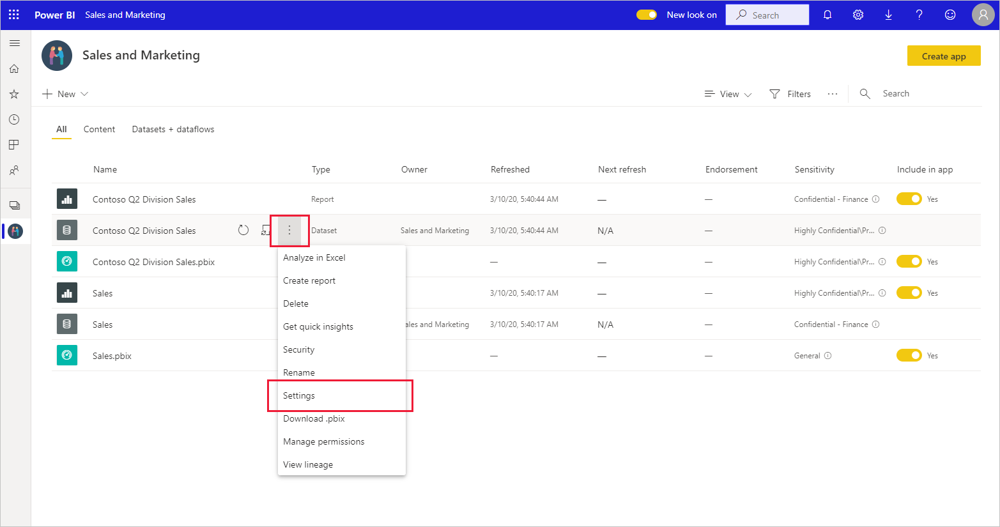

# Vertrouwelijkheidslabels toepassen in Power BI

Vertrouwelijkheidslabels voor Microsoft Information Protection op uw rapporten, dashboards, gegevenssets en gegevensstromen kunnen uw gevoelige inhoud beschermen tegen ongeautoriseerde toegang tot gegevens en lekkage. Door uw gegevens op de juiste manier te labelen met vertrouwelijkheidslabels, zorgt u ervoor dat alleen bevoegde personen toegang tot uw gegevens hebben. In dit artikel ziet u hoe u vertrouwelijkheidslabels op uw inhoud kunt toepassen.

Vertrouwelijkheidslabels toepassen in Power BI:
* U moet over een Power BI Pro-licentie en machtigingen voor bewerken beschikken voor de inhoud die u van een label wilt voorzien.
* U moet bij een beveiligingsgroep horen die machtigingen heeft om vertrouwelijkheidslabels toe te passen, zoals beschreven in het artikel [Vertrouwelijkheidslabels inschakelen in Power BI](./service-security-enable-data-sensitivity-labels.md#enable-sensitivity-labels).
* Aan alle [vereisten](./service-security-sensitivity-label-overview.md#requirements-for-using-sensitivity-labels-in-power-bi) en [licentievereisten](./service-security-data-protection-overview.md#licensing) moet zijn voldaan.

Zie [Vertrouwelijkheidslabels in Power BI](service-security-sensitivity-label-overview.md) voor meer informatie over vertrouwelijkheidslabels in Power BI.

## Vertrouwelijkheidslabels toepassen

Wanneer gegevensbeveiliging is ingeschakeld op uw tenant, worden vertrouwelijkheidslabels weergegeven in de kolom Vertrouwelijkheid in de lijstweergave van dashboards, rapporten, gegevenssets en gegevensstromen.

**Een vertrouwelijkheidslabel toepassen of wijzigen op een rapport of dashboard**
1. Klik op **Meer opties (...)** .
1. Selecteer **Instellingen**.
1. Kies in het deelvenster van de instellingen het juiste vertrouwelijkheidslabel.
1. Sla de instellingen op.

In de volgende afbeelding ziet u deze stappen in een rapport

**Een vertrouwelijkheidslabel op een gegevensset of gegevensstroom toepassen of wijzigen**

1. Klik op **Meer opties (...)** .
1. Selecteer **Instellingen**.
1. Kies in het deelvenster van de instellingen het juiste vertrouwelijkheidslabel.
1. Pas de instellingen toe.

De volgende twee afbeeldingen illustreren deze stappen voor een gegevensset.

Kies **Meer opties (...)** en klik vervolgens op **Instellingen**.

Op de pagina Instellingen opent u de sectie Vertrouwelijkheidslabels, kiest u het gewenste vertrouwelijkheidslabel en klikt u op **Toepassen**.

## Vertrouwelijkheidslabels verwijderen
Als u een vertrouwelijkheidslabel wilt verwijderen uit een rapport, dashboard, gegevensset of gegevensstroom, volgt u de [dezelfde procedure als wordt gebruikt voor het toepassen van labels](#applying-sensitivity-labels), maar kiest u **(Geen)** wanneer u wordt gevraagd de vertrouwelijkheid van de gegevens te classificeren. 

## Overwegingen en beperkingen

Zie [Vertrouwelijkheidslabels in Power BI](service-security-sensitivity-label-overview.md#limitations) voor de lijst met beperkingen voor vertrouwelijkheidslabels in Power BI.

## Volgende stappen

In dit artikel wordt beschreven hoe u vertrouwelijkheidslabels in Power BI kunt toepassen. De volgende artikelen bieden meer informatie over gegevensbeveiliging in Power BI. 

* [Overzicht van vertrouwelijkheidslabels in Power BI](./service-security-sensitivity-label-overview.md)
* [Vertrouwelijkheidslabels inschakelen in Power BI](./service-security-enable-data-sensitivity-labels.md)
* [Microsoft Cloud App Security-besturingselementen gebruiken in Power BI](./service-security-using-microsoft-cloud-app-security-controls.md)