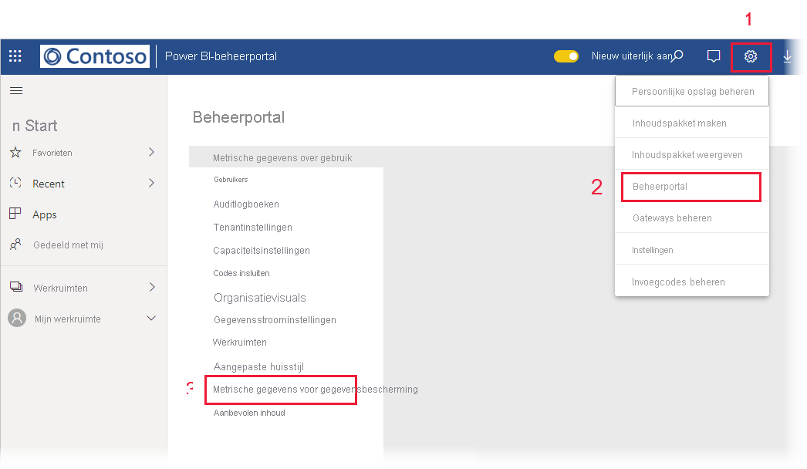

# Metrisch rapport gegevensbescherming

## Wat is het metrische rapport gegevensbescherming?
Het rapport met metrische gegevens over gegevensbescherming is een speciaal rapport dat [Power BI beheerders](./service-admin-role.md) kunnen gebruiken om het gebruik en de ingebruikname van vertrouwelijkheidslabels in hun tenant te controleren en bij te houden.

 
Het rapport bevat het volgende:
* Een 100% gestapeld kolomdiagram waarin het dagelijkse gebruik van vertrouwelijkheidslabels in de tenant gedurende de afgelopen 7, 30 of 90 dagen wordt weergegeven. Met dit diagram kunt u eenvoudig het relatieve gebruik van de verschillende typen labels in de loop van de tijd bijhouden.
* Ringdiagrammen die de huidige status van het gebruik van vertrouwelijkheidslabels in de tenant weergeven ten aanzien van dashboards, rapporten, gegevenssets en gegevensstromen.
* Een koppeling naar de Cloud App Security-portal waar Power BI-waarschuwingen, gebruikers die risico's lopen, activiteitslogboeken en andere informatie beschikbaar zijn. Zie [Microsoft Cloud App Security-besturingselementen gebruiken in Power BI](./service-security-using-microsoft-cloud-app-security-controls.md) voor meer informatie.

Het rapport wordt elke 24 uur vernieuwd.

## Het metrische rapport gegevensbescherming bekijken

U moet een [Power BI-beheerdersrol](./service-admin-role.md) hebben om het rapport te openen en te bekijken.
Als u het rapport wilt bekijken, gaat u naar **Instellingen > Beheerportal** en kiest u **Metrische gegevens van bescherming**.

 
 
De eerste keer dat u het metrische rapport gegevensbescherming opent, kan het enkele seconden duren voordat het is geladen. Er worden een rapport en een gegevensset met de titel **Metrische gegevens gegevensbescherming (automatisch gegenereerd)** gemaakt in uw persoonlijke omgeving onder Mijn werkruimte. U wordt aangeraden om het rapport niet hier te bekijken. Dit is niet het volledige rapport. U kunt het rapport beter in de beheerportal bekijken, zoals hierboven is beschreven.

> [!CAUTION]
> Maak geen enkele wijziging in het rapport of de gegevensset, omdat nieuwe versies van het rapport van tijd tot tijd worden getotaliseerd. Alle wijzigingen die u in het oorspronkelijke rapport hebt aangebracht, worden overschreven als u de nieuwe versie bijwerkt.

## Rapporten bijwerken

Er worden periodiek verbeterde versies van het metrische rapport gegevensbescherming uitgebracht. Wanneer u het rapport opent en er een nieuwe versie beschikbaar is, wordt u gevraagd of u de nieuwe versie wilt openen. Als u ja zegt, wordt de nieuwe versie van het rapport geladen en wordt de oude versie overschreven. Eventuele wijzigingen die u in het oude rapport en/of de oude gegevensset hebt aangebracht, gaan verloren. U kunt ervoor kiezen om de nieuwe versie niet te openen, maar in dat geval profiteert u niet van de verbeteringen in de nieuwe versie. 
## Opmerkingen en overwegingen
* Voor het genereren van het metrische rapport gegevensbescherming moet u [Information Protection](./service-security-enable-data-sensitivity-labels.md) hebben ingeschakeld op uw tenant en [vertrouwelijkheidslabels hebben toegepast](./service-security-apply-data-sensitivity-labels.md). 
* Als u toegang wilt tot Cloud App Security informatie, moet uw organisatie beschikken over de juiste [Cloud App Security-licentie](./service-security-using-microsoft-cloud-app-security-controls.md#cloud-app-security-licensing).
* Als u besluit om informatie uit het metrische rapport gegevensbescherming met een gebruiker te delen die geen Power BI beheerder is, moet u er rekening mee houden dat dit rapport vertrouwelijke informatie over uw organisatie bevat.
* Het metrische rapport gegevensbescherming is een speciaal soort rapport en wordt niet weergegeven in de lijsten Gedeeld met mij, Recent en Favorieten.
* Het rapport met metrische gegevens over gegevensbescherming is niet beschikbaar voor [externe gebruikers (Azure Active Directory B2B-gastgebruikers)](./service-admin-azure-ad-b2b.md).
## Volgende stappen
* [Vertrouwelijkheidslabels in Power BI](./service-security-sensitivity-label-overview.md)
* [Microsoft Cloud App Security-besturingselementen gebruiken in Power BI](service-security-using-microsoft-cloud-app-security-controls.md)
* [Informatie over de rol Power BI-servicebeheerder](service-admin-role.md)
* [Vertrouwelijkheidslabels inschakelen in Power BI](service-security-enable-data-sensitivity-labels.md)