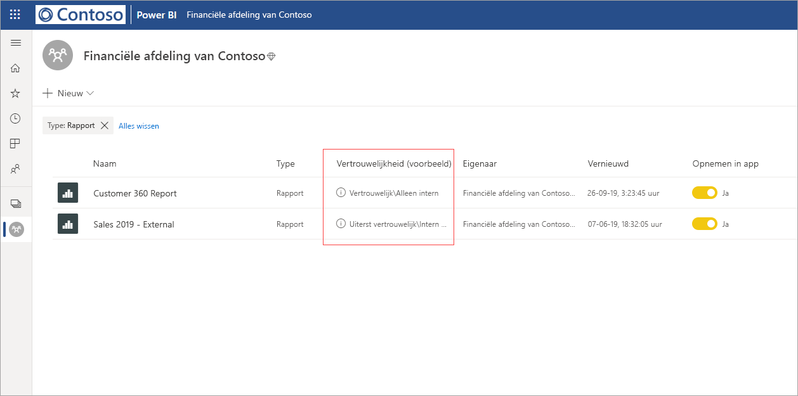
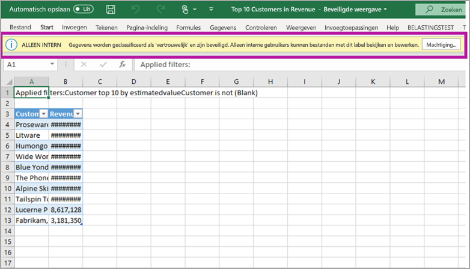

# Gegevensbeveiliging in Power BI (preview-versie)

Moderne ondernemingen hebben strikte bedrijfsregelgeving en vereisten voor het verwerken en beveiligen van gevoelige gegevens. Power BI kan worden geïntegreerd met Microsoft Information Protection en Microsoft Cloud App Security om beter beheer en betere zichtbaarheid van gevoelige gegevens in Power BI te krijgen. 

Met gegevensbeveiliging voor Power BI kunt u het volgende doen:

* Gebruik de vertrouwelijkheidslabels van Microsoft om inhoud in de Power BI-service (dashboards, rapporten, gegevenssets en gegevensstromen) te classificeren en te labelen, met behulp van dezelfde taxonomie die wordt gebruikt om bestanden in Office 365 te classificeren en te beveiligen. 

* Dwing beveiligingsinstellingen af, zoals versleuteling of watermerken wanneer u gegevens van de Power BI-service naar bestanden exporteert door het vertrouwelijkheidslabel en de beveiliging van de inhoud toe te passen (Excel, PowerPoint en PDF). 

  Uw gebruikers kunnen bijvoorbeeld het label Vertrouwelijk toepassen op een rapport in Power BI. Wanneer u de gegevens vervolgens exporteert naar een Excel-bestand, past Power BI het label Vertrouwelijk toe op het bestand. Met het label kan de inhoud worden versleuteld en het watermerk Vertrouwelijk worden toegepast.

* Gebruik Microsoft Cloud App Security om activiteiten in Power BI bij te houden, beveiligingsproblemen te onderzoeken en inhoud in Power BI te beveiligen met App-beheer voor voorwaardelijke toegang van Microsoft Cloud App Security. 

## Vertrouwelijkheidslabels in Power BI

Gevoeligheidslabel worden gemaakt en beheerd in het [Microsoft 365-beveiligingscentrum](https://security.microsoft.com/) of het [Microsoft 365-compliancecentrum](https://compliance.microsoft.com/).

Voor toegang tot vertrouwelijkheidslabels in deze centra navigeert u naar **Classificatie > Vertrouwelijkheidslabels**. Deze vertrouwelijkheidslabels kunnen worden gebruikt door meerdere Microsoft-services zoals Azure Information Protection, Office-apps en Office 365-services.

> [!IMPORTANT]
> Azure Information Protection-klanten moet de labels naar een van de eerder genoemde services migreren om vertrouwelijkheidslabels te kunnen gebruiken in Power BI. Daarnaast worden vertrouwelijkheidslabels alleen ondersteund in openbare clouds en niet voor tenants in clouds, zoals onafhankelijke clouds.
>
> Lees meer over [het migreren van vertrouwelijkheidslabels naar Microsoft Information Protection](https://docs.microsoft.com/azure/information-protection/configure-policy-migrate-labels).

## Hoe vertrouwelijkheidslabels werken

Wanneer u een vertrouwelijkheidslabel toepast op een Power BI-dashboard, -rapport, -gegevensset of -gegevensstroom, is dit vergelijkbaar met het toepassen van een *tag* op die resource; dit levert de volgende voordelen op:
* **Aanpasbaar**: u kunt categorieën maken voor verschillende niveaus van gevoelige inhoud in uw organisatie, zoals Persoonlijk, Openbaar, Algemeen, Vertrouwelijk en Zeer vertrouwelijk.
* **Duidelijke tekst**: omdat de tekst op het label vrij duidelijk is, kunnen gebruikers gemakkelijk begrijpen hoe ze de inhoud moeten behandelen volgens de richtlijnen voor vertrouwelijkheidslabels.
* **Permanent**: nadat een vertrouwelijkheidslabel is toegepast op inhoud, blijft het bij die inhoud wanneer deze wordt geëxporteerd naar de volgende ondersteunde bestandstypen: Excel, PowerPoint en PDF. 

  Dit houdt in dat het vertrouwelijkheidslabel de inhoud volgt, inclusief de bijbehorende beveiligingsinstellingen. Bovendien wordt het label de basis voor het toepassen en afdwingen van beleidsregels. 

## Voorbeeld van een vertrouwelijkheidslabel 

Hier ziet u een voorbeeld van de manier waarop een vertrouwelijkheidslabel in Power BI kan werken.

1. In de Power BI-service is het vertrouwelijkheidslabel **Zeer vertrouwelijk - Alleen intern** toegepast op een rapport.

   

2. Wanneer gegevens vanuit dit rapport worden geëxporteerd naar een Excel-bestand, worden het vertrouwelijkheidslabel en de beveiliging toegepast op het geëxporteerde Excel-bestand.

   

In Microsoft Office-toepassingen wordt een vertrouwelijkheidslabel als een tag aan de e-mail of het document weergegeven, vergelijkbaar met de bovenstaande afbeelding.

U kunt ook een classificatie aan de inhoud toewijzen (zoals een sticker) die bij de inhoud blijft en met de inhoud meegaat wanneer de gebruiker deze inhoud gebruikt en deelt. U kunt deze classificatie gebruiken om gebruiksrapporten te genereren en om activiteitsgegevens voor uw gevoelige inhoud te zien. Op basis van deze informatie kunt u er altijd later voor kiezen om beveiligingsinstellingen toe te passen.

## Vertrouwelijkheidslabels gebruiken in Power BI

Voordat uw vertrouwelijkheidslabels kunnen worden ingeschakeld in Power BI, moet u eerst aan de volgende vereisten voldoen: 

* Controleer of gevoeligheidslabels zijn gedefinieerd in het [Microsoft 365-beveiligingscentrum](https://security.microsoft.com/) of het [Microsoft 365-compliancecentrum](https://compliance.microsoft.com/). 
* [Schakel vertrouwelijkheidslabels in](service-security-enable-data-sensitivity-labels.md) (preview-versie) in Power BI.
* Controleer of gebruikers de juiste licentie hebben;
  * Als gebruikers labels willen toepassen of weergeven in Power BI, moeten ze over een Azure Information Protection Premium P1- of Premium P2-licentie beschikken. Microsoft Azure Information Protection kan ofwel als zelfstandig product als via een van de Microsoft-licentiesuites worden aangeschaft. Zie [Prijzen voor Azure Information Protection](https://azure.microsoft.com/pricing/details/information-protection/) voor meer informatie.
  * Als gebruikers labels willen toepassen op Power BI-resources, moeten ze naast een van de bovenstaande Azure Information Protection-licenties ook over een Power BI Pro-licentie beschikken. 

## Inhoud beveiligen met Microsoft Cloud App Security

U kunt inhoud in Power BI beveiligen tegen onbedoelde lekken of inbreuk met behulp van Microsoft Cloud App Security. Zodra Microsoft Cloud App Security is ingesteld en geconfigureerd, kunnen beveiligingsbeheerders gebruikerstoegang en -activiteit bijhouden, realtime risicoanalyse uitvoeren en labelspecifieke besturingselementen instellen.

Organisaties kunnen bijvoorbeeld Microsoft Cloud App Security gebruiken om een beleid in te stellen dat voorkomt dat gebruikers gevoelige gegevens vanuit Power BI kunnen downloaden naar onbeheerde apparaten. Met een dergelijke configuratie kunnen gebruikers productief blijven en vanuit elke locatie verbinding maken met Power BI, terwijl ze Microsoft Cloud App Security gebruiken om gebruikersacties te voorkomen die mogelijk voor problemen zorgen, allemaal in realtime. 

### Vereisten

Voordat u voor uw vertrouwelijkheidslabels gebruik kunt maken van Microsoft Cloud App Security, moet aan de volgende vereisten worden voldaan: 

* Cloud App Security en Azure Information Protection [moeten worden ingeschakeld voor uw tenant](https://docs.microsoft.com/cloud-app-security/azip-integration).
* De app [moet worden verbonden met Microsoft Cloud App Security](https://docs.microsoft.com/cloud-app-security/enable-instant-visibility-protection-and-governance-actions-for-your-apps).

## Overwegingen en beperkingen

De volgende lijst biedt een aantal beperkingen van vertrouwelijkheidslabels in Power BI:

* Voor het toepassen en weergeven van Microsoft Information Protection-vertrouwelijkheidslabels in Power BI is een Azure Information Protection Premium P1- of Premium P2-licentie vereist. Microsoft Azure Information Protection kan ofwel als zelfstandig product als via een van de Microsoft-licentiesuites worden aangeschaft. Zie [Prijzen voor Azure Information Protection](https://azure.microsoft.com/pricing/details/information-protection/) voor meer informatie.
* Vertrouwelijkheidslabels kunnen alleen worden toegepast op dashboards, rapporten, gegevenssets en gegevensstromen.
* Afdwinging van labels en besturingselementen voor beveiliging op geëxporteerde bestanden wordt alleen ondersteund voor Excel-, PowerPoint- en PDF-bestanden. Labels en beveiliging worden niet afgedwongen wanneer gegevens worden geëxporteerd naar .CSV-bestanden, Abonneren op e-mail, Visuals insluiten en Afdrukken.
* Een gebruiker die een bestand uit Power BI exporteert, beschikt over machtigingen voor toegang tot en het bewerken van dat bestand volgens de instellingen voor het vertrouwelijkheidslabel. De gebruiker die de gegevens exporteert, krijgt geen eigenaarsmachtigingen voor het bestand. 
* Vertrouwelijkheidslabels zijn momenteel niet beschikbaar voor [gepagineerde rapporten]( https://docs.microsoft.com/power-bi/paginated-reports-report-builder-power-bi) en werkmappen.
* Vertrouwelijkheidslabels op Power BI-assets zijn alleen zichtbaar in de werkruimtelijst en herkomstweergaven; labels zijn momenteel niet zichtbaar in de weergaven Favorieten, Gedeeld met mij, Recente items of App. Houd er echter rekening mee dat een label dat op een Power BI-asset is toegepast, zelfs als dit niet zichtbaar is, permanent worden toegevoegd aan de gegevens die naar Excel-, PowerPoint- en PDF-bestanden worden geëxporteerd.
* Het gevoeligheidslabel *bestand Versleutelingsinstelling*, geconfigureerd in het [Microsoft 365-beveiligingscentrum](https://security.microsoft.com/) of het [Microsoft 365-compliancecentrum](https://compliance.microsoft.com/), is alleen van toepassing op bestanden die *worden geëxporteerd vanuit* Power BI; het wordt niet afgedwongen *binnen* Power BI.
* [HYOK-beveiliging](https://docs.microsoft.com/azure/information-protection/configure-adrms-restrictions) wordt niet ondersteund voor labels die zijn toegepast in Power BI.
* Er gelden [licentievereisten](https://docs.microsoft.com/microsoft-365/compliance/sensitivity-labels-office-apps#subscription-and-licensing-requirements-for-sensitivity-labels) voor het weergeven en toepassen van labels in Office-apps.
* Vertrouwelijkheidslabels worden alleen ondersteund voor tenants in de wereldwijde (openbare) cloud. Vertrouwelijkheidslabels worden niet ondersteund voor tenants in andere clouds.

## Volgende stappen

In dit artikel hebt u een overzicht gekregen van gegevensbeveiliging in Power BI. De volgende artikelen bieden meer informatie over gegevensbeveiliging in Power BI. 

* [Vertrouwelijkheidslabels voor gegevens in Power BI inschakelen](service-security-enable-data-sensitivity-labels.md)
* [Vertrouwelijkheidslabels voor gegevens toepassen in Power BI](../designer/service-security-apply-data-sensitivity-labels.md)
* [Microsoft Cloud App Security-besturingselementen gebruiken in Power BI](service-security-using-microsoft-cloud-app-security-controls.md)
* [Metrisch rapport gegevensbescherming](service-security-data-protection-metrics-report.md)