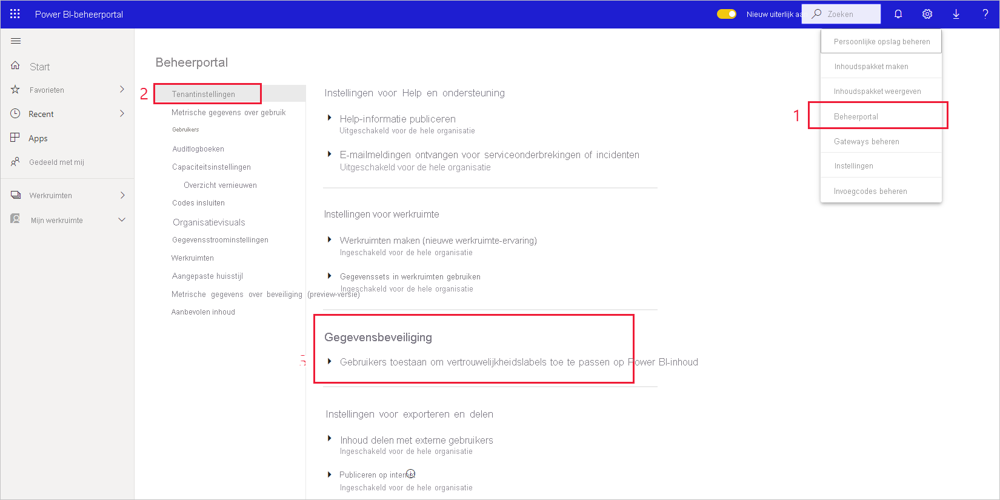
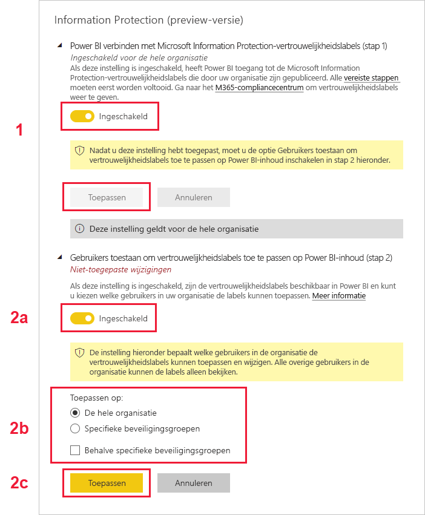

# Vertrouwelijkheidslabels inschakelen in Power BI

Als u [vertrouwelijkheidslabels voor Microsoft Information Protection](/microsoft-365/compliance/sensitivity-labels) wilt gebruiken in Power BI, moeten ze zijn ingeschakeld op de tenant. In dit artikel wordt aan Power BI-beheerders uitgelegd hoe dit te doen. Zie [Vertrouwelijkheidslabels in Power BI](service-security-sensitivity-label-overview.md) voor een overzicht van vertrouwelijkheidslabels in Power BI. Zie [Vertrouwelijkheidslabels toepassen](./service-security-apply-data-sensitivity-labels.md) voor informatie over het toepassen van vertrouwelijkheidslabels in Power BI 

Wanneer vertrouwelijkheidslabels zijn ingeschakeld:

* Bepaalde gebruikers en beveiligingsgroepen in een organisatie kunnen [vertrouwelijkheidslabels classificeren en toepassen](./service-security-apply-data-sensitivity-labels.md) op hun Power BI-inhoud. In de Power BI-service betekent dit de rapporten, dashboards, gegevenssets en gegevensstromen. In Power BI Desktop betekent dit de PBIX-bestanden.
* In de service kunnen alle leden van de organisatie deze labels bekijken. In Desktop kunnen alleen leden van de organisatie de labels zien die de labels hebben gepubliceerd.

Voor het inschakelen van vertrouwelijkheidslabels is een Azure Information Protection-licentie vereist. Zie [Licenties en vereisten](#licensing-and-requirements) voor meer details.

>[!NOTE]
>Gedurende de eerste 48 uur nadat gebruikers hebben gekozen voor de preview-functie Information Protection, **kunnen ze problemen ondervinden met PBIX-bestanden waarop vertrouwelijkheidslabels zijn toegepast (bijvoorbeeld bij het publiceren van het PBIX-bestand in de service, of het downloaden ervan vanuit de service)** . Dergelijke problemen zijn normaal en worden binnen 48 uur automatisch opgelost.

## Licenties en vereisten

* Voor het toepassen en weergeven van Microsoft Information Protection-vertrouwelijkheidslabels in Power BI is een Azure Information Protection Premium P1- of Premium P2-licentie vereist. Azure Information Protection kan hetzij als zelfstandig product of via een van de Microsoft-licentiesuites worden aangeschaft. Zie [Prijzen voor Azure Information Protection](https://azure.microsoft.com/pricing/details/information-protection/) voor meer informatie.

    >[!NOTE]
    > Als uw organisatie gebruikmaakt van vertrouwelijkheidslabels van Azure Information Protection, moeten deze worden gemigreerd naar het Microsoft Information Protection Unified Labeling-platform om te kunnen worden gebruikt in Power BI. [Meer informatie over het migreren van vertrouwelijkheidslabels](/azure/information-protection/configure-policy-migrate-labels).

* Als gebruikers labels willen toepassen op Power BI-inhoud en -bestanden, moeten ze naast een van de bovenstaande Azure Information Protection-licenties ook over een Power BI Pro-licentie beschikken.

* Office-apps hebben hun eigen [licentievereisten voor het weergeven en toepassen van vertrouwelijkheidslabels]( https://docs.microsoft.com/microsoft-365/compliance/get-started-with-sensitivity-labels#subscription-and-licensing-requirements-for-sensitivity-labels ).

* Voordat u vertrouwelijkheidslabels toepast op de tenant, moet u controleren of vertrouwelijkheidslabels zijn gedefinieerd en gepubliceerd voor relevante gebruikers en groepen. Zie [Vertrouwelijkheidslabels en bijbehorend beleid maken en configureren](/microsoft-365/compliance/create-sensitivity-labels) voor meer details.

* Voor het gebruik van vertrouwelijkheidslabels in Desktop is de Desktop-versie van december 2020 of nieuwer vereist.

    >[!NOTE]
    > Als u een beveiligd PBIX-bestand wilt openen met een Desktop-versie die ouder is dan december 2020, mislukt dit en wordt u gevraagd de Desktop-versie bij te werken.

## Vertrouwelijkheidslabels inschakelen

Vertrouwelijkheidslabels moeten op de tenant worden ingeschakeld voordat ze kunnen worden gebruikt in zowel de service als op in Desktop. In deze sectie wordt beschreven hoe u deze labels in de tenantinstellingen inschakelt. Zie [Vertrouwelijkheidslabels uitschakelen in Desktop voor de hele organisatie](#disable-sensitivity-labels-in-desktop-across-your-org) voor aanvullende overwegingen in verband met Desktop. 

Als u vertrouwelijkheidslabels voor de tenant wilt inschakelen, gaat u naar de **beheerportal** van Power BI, opent u het deelvenster **Tenantinstellingen** en zoekt u de sectie **Information Protection**.

Voer in de sectie **Information Protection** de volgende stappen uit:
1. Open **Gebruikers toestaan om vertrouwelijkheidslabels toe te passen op Power BI-inhoud**.
1. Schakel de wisselknop in.
1. Definieer wie vertrouwelijkheidslabels in Power BI-assets kan toepassen en wijzigen. Standaard kan iedereen in uw organisatie vertrouwelijkheidslabels toepassen. U kunt er echter voor kiezen om vertrouwelijkheidslabels alleen voor specifieke gebruikers of beveiligingsgroepen in te stellen. Zodra u ofwel de gehele organisatie of specifieke beveiligingsgroepen hebt geselecteerd, kunt u specifieke subsets van gebruikers of beveiligingsgroepen uitsluiten.
   
   * Wanneer vertrouwelijkheidslabels zijn ingeschakeld voor de gehele organisatie, worden uitzonderingen doorgaans gevormd door beveiligingsgroepen.
   * Wanneer vertrouwelijkheidslabels alleen zijn ingeschakeld voor specifieke gebruikers of beveiligingsgroepen, vormen specifieke gebruikers doorgaans de uitzondering.  
    Dankzij deze methode is het mogelijk om te voorkomen dat bepaalde gebruikers vertrouwelijkheidslabels kunnen toepassen in Power BI, zelfs als ze deel uitmaken van een groep die wel machtigingen heeft om dit te doen.

1. Druk op **Toepassen**.

> [!IMPORTANT]
> Alleen Power BI Pro-gebruikers die over machtigingen beschikken voor het *maken*  en *bewerken* van de asset en die deel uitmaken van de relevante beveiligingsgroep die in deze sectie is ingesteld, kunnen de vertrouwelijkheidslabels instellen en bewerken. Gebruikers die geen deel uitmaken van deze groep kunnen het label niet instellen of bewerken.  

## Vertrouwelijkheidslabels uitschakelen in Desktop voor de hele organisatie

Voor organisaties die er zeker van willen zijn dat PBIX-bestanden **niet** werken met vertrouwelijkheidslabels, kan de Power BI-beheerder een groepsbeleid maken dat ervoor zorgt dat in Power BI gebruikers worden geblokkeerd om PBIX-bestanden te classificeren en te beveiligen of bestanden te openen waarop al beveiliging is toegepast. Ga als volgt te werk om een dergelijk beleid te maken:

1. Open de [register-editor](https://support.microsoft.com/windows/how-to-open-registry-editor-in-windows-10-deab38e6-91d6-e0aa-4b7c-8878d9e07b11).

1. Zoek de sleutel **HKEY_CURRENT_USER\SOFTWARE\Policies\Microsoft\Microsoft Power BI Desktop**.

1. Zoek de valueName **EnableInformationProtection** en stel deze in op **onwaar**.

Zie het [Overzicht vertrouwelijkheidslabels](./service-security-sensitivity-label-overview.md#limitations) voor meer beperkingen en overwegingen met betrekking tot het gebruik van vertrouwelijkheidslabel in Power BI Desktop.

## Problemen oplossen

Power BI maakt gebruik van vertrouwelijkheidslabels voor Microsoft Information Protection. Als u dus een foutbericht krijgt wanneer u vertrouwelijkheidslabels inschakelt, kan dit een van de volgende redenen hebben:

* U beschikt niet over een Azure Information Protection-[licentie](#licensing-and-requirements).
* De vertrouwelijkheidslabels zijn niet [gemigreerd](#enable-sensitivity-labels) naar de Microsoft Information Protection-versie die wordt ondersteund in Power BI.
* Er zijn geen Microsoft Information Protection-vertrouwelijkheidslabels [gedefinieerd in de organisatie](#enable-sensitivity-labels).

## Overwegingen en beperkingen

Zie [Vertrouwelijkheidslabels in Power BI](service-security-sensitivity-label-overview.md#limitations) voor de lijst met beperkingen voor vertrouwelijkheidslabels in Power BI.

## Volgende stappen

In dit artikel wordt beschreven hoe u vertrouwelijkheidslabels in Power BI kunt inschakelen. De volgende artikelen bieden meer informatie over gegevensbeveiliging in Power BI. 

* [Overzicht van vertrouwelijkheidslabels in Power BI](service-security-sensitivity-label-overview.md)
* [Vertrouwelijkheidslabels toepassen in Power BI](./service-security-apply-data-sensitivity-labels.md)
* [Microsoft Cloud App Security-besturingselementen gebruiken in Power BI](service-security-using-microsoft-cloud-app-security-controls.md)
* [Rapport met metrische gegevens voor beveiliging](service-security-data-protection-metrics-report.md)