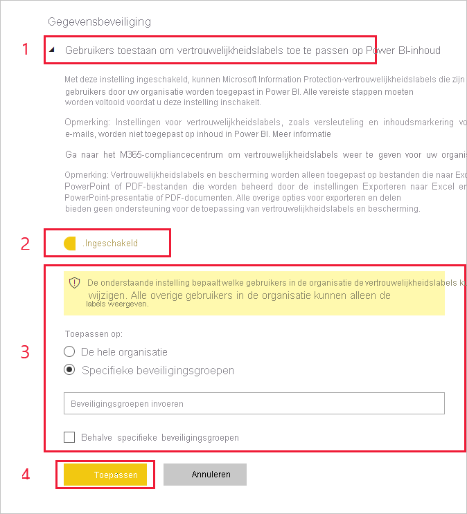

# Vertrouwelijkheidslabels voor gegevens inschakelen in Power BI (preview-versie)

Wanneer [Microsoft Information Protection-vertrouwelijkheidslabels voor gegevens](https://docs.microsoft.com/microsoft-365/compliance/sensitivity-labels) zijn ingeschakeld in Power BI, is het volgende van toepassing:

* Bepaalde gebruikers en beveiligingsgroepen in een organisatie kunnen [vertrouwelijkheidslabels classificeren en toepassen](../designer/service-security-apply-data-sensitivity-labels.md) op hun Power BI-dashboards, -rapporten, -gegevenssets en -gegevensstromen (hierna *assets* genoemd).
* Alle leden van de organisatie kunnen die labels zien.

Vertrouwelijkheidslabels voor gegevens bevorderen gegevensbeveiliging doordat Power BI-auteurs en -gebruikers zich bewust worden van de vertrouwelijkheid van gegevens, terwijl ze meteen informatie krijgen over wat de classificatie betekent en hoe gegevens met die classificatie moeten worden behandeld.

Wanneer Power BI-gegevens met een vertrouwelijkheidslabel worden geëxporteerd naar een Excel-, PowerPoint- of PDF-bestand, wordt het vertrouwelijkheidslabel voor gegevens mee gestuurd. Dit houdt in dat een gebruiker die vanwege beleidsregels met betrekking tot vertrouwelijkheidslabels geen toestemming heeft voor toegang tot gelabelde gegevens, de bestanden niet *buiten* Power BI (in Excel-, PowerPoint- of PDF-apps) kan openen.

Voor het inschakelen van vertrouwelijkheidslabels voor gegevens is een Azure Information Protection-licentie vereist. Zie [Licenties](#licensing) voor meer informatie.

## Vertrouwelijkheidslabels voor gegevens inschakelen

Als u het gebruik van Microsoft Information Protection-vertrouwelijkheidslabels voor gegevens in Power BI wilt inschakelen, gaat u naar de Power BI-beheerportal. Open het deelvenster Tenantinstellingen en zoek de sectie Information Protection.

Voer in de sectie **Information Protection** de volgende stappen uit:
1.  Schakel de wisselknop **Microsoft Information Protection-vertrouwelijkheidslabels inschakelen** in en druk op **Toepassen**. Met deze stap maakt u *alleen* de vertrouwelijkheidslabels zichtbaar voor uw gehele organisatie; er worden geen labels toegepast. Als u wilt definiëren wie die labels in Power BI kan toepassen, moet u stap 2 voltooien.
2.  Definieer wie vertrouwelijkheidslabels in Power BI-assets kan toepassen en wijzigen. Deze stap bestaat uit drie acties:
    1.  Schakel de wisselknop **Vertrouwelijkheidslabels instellen voor Power BI-inhoud en -gegevens** in.
    2.  Selecteer de relevant beveiligingsgroep(en). Standaard kan iedereen in uw organisatie vertrouwelijkheidslabels toepassen. U kunt er echter voor kiezen om vertrouwelijkheidslabels alleen voor specifieke gebruikers of beveiligingsgroepen in te stellen. Zodra u ofwel de gehele organisatie of specifieke beveiligingsgroepen hebt geselecteerd, kunt u specifieke subsets van gebruikers of beveiligingsgroepen uitsluiten.
    * Wanneer vertrouwelijkheidslabels zijn ingeschakeld voor de gehele organisatie, worden uitzonderingen doorgaans gevormd door beveiligingsgroepen.
    * Wanneer vertrouwelijkheidslabels alleen zijn ingeschakeld voor specifieke gebruikers of beveiligingsgroepen, vormen specifieke gebruikers doorgaans de uitzondering.  
    Dankzij deze methode is het mogelijk om te voorkomen dat bepaalde gebruikers vertrouwelijkheidslabels kunnen toepassen in Power BI, zelfs als ze deel uitmaken van een groep die wel machtigingen heeft om dit te doen.
    
    3. Druk op **Toepassen**.

> [!IMPORTANT]
> Alleen Power BI Pro-gebruikers die over machtigingen beschikken voor het *maken*  en *bewerken* van de asset en die deel uitmaken van de relevante beveiligingsgroep die in deze sectie is ingesteld, kunnen de vertrouwelijkheidslabels instellen en bewerken. Gebruikers die geen deel uitmaken van deze groep kunnen het label niet instellen of bewerken. 

## Overwegingen en beperkingen

Power BI maakt gebruik van vertrouwelijkheidslabels voor Microsoft Information Protection. Als u dus een foutbericht krijgt wanneer u vertrouwelijkheidslabels inschakelt, kan dit een van de volgende redenen hebben:

* U beschikt niet over een Azure Information Protection-[licentie](#licensing).
* De vertrouwelijkheidslabels zijn niet gemigreerd naar de Microsoft Information Protection-versie die wordt ondersteund door Power BI. Krijg meer informatie over [het migreren van vertrouwelijkheidslabels](https://docs.microsoft.com/azure/information-protection/configure-policy-migrate-labels).
* Er zijn geen Microsoft Information Protection-vertrouwelijkheidslabels gedefinieerd in de organisatie. Daarnaast moet een label onderdeel zijn van een gepubliceerd beleid om te kunnen worden gebruikt. [Krijg meer informatie over vertrouwelijkheidslabels](https://docs.microsoft.com/Office365/SecurityCompliance/sensitivity-labels) of ga naar het [Microsoft-beveiligings- en compliancecentrum](https://sip.protection.office.com/sensitivity?flight=EnableMIPLabels) voor meer informatie over het definiëren van labels en het publiceren van beleidsregels voor uw organisatie.

## Licentieverlening

* Voor het weergeven of toepassen van Microsoft Information Protection-labels in Power BI, moeten gebruikers beschikken over een Azure Information Protection Premium P1- of Premium P2-licentie. Microsoft Azure Information Protection kan ofwel als zelfstandig product als via een van de Microsoft-licentiesuites worden aangeschaft. Zie [Prijzen voor Azure Information Protection](https://azure.microsoft.com/pricing/details/information-protection/) voor meer informatie.
* Gebruikers die labels op Power BI-assets moeten toepassen, moeten over een Power BI Pro-licentie beschikken.

## Volgende stappen

In dit artikel is beschreven hoe u vertrouwelijkheidslabels voor gegevens in Power BI kunt inschakelen. De volgende artikelen bieden meer informatie over gegevensbeveiliging in Power BI. 

* [Overzicht van gegevensbeveiliging in Power BI](service-security-data-protection-overview.md)
* [Vertrouwelijkheidslabels voor gegevens toepassen in Power BI](../designer/service-security-apply-data-sensitivity-labels.md)
* [Microsoft Cloud App Security-besturingselementen gebruiken in Power BI](service-security-using-microsoft-cloud-app-security-controls.md)
* [Metrisch rapport gegevensbescherming](service-security-data-protection-metrics-report.md)