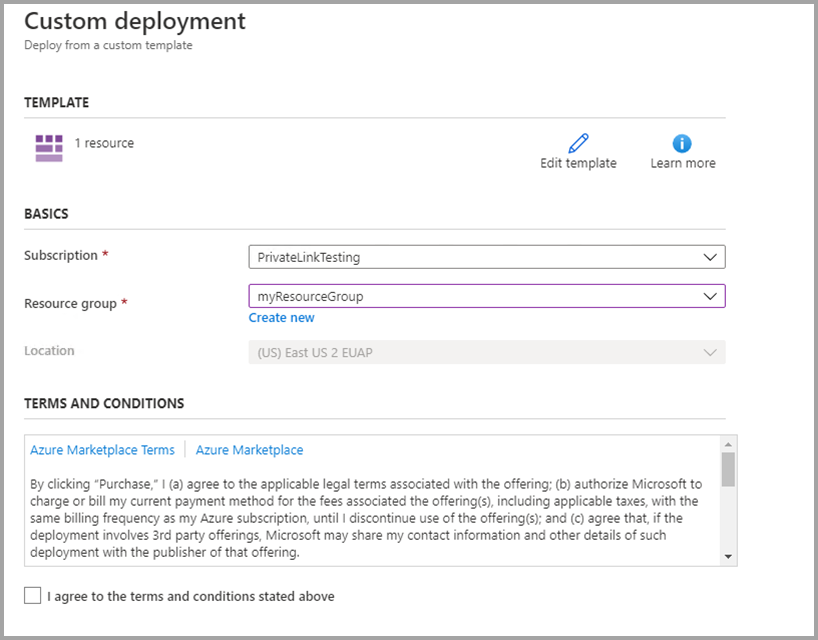
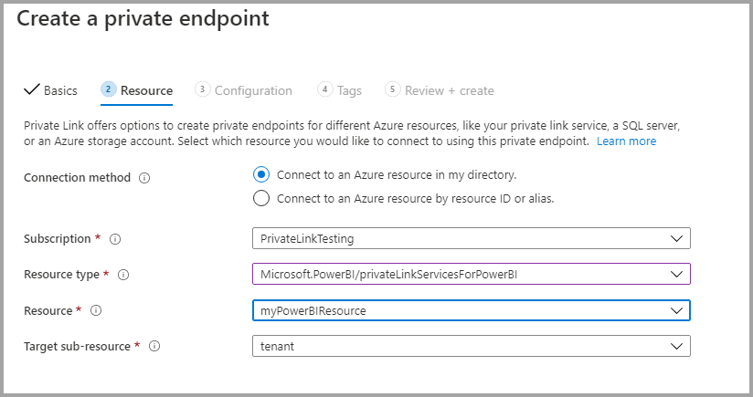

# <a name="private-links-for-accessing-power-bi"></a>Privékoppelingen voor toegang tot Power BI

In Power BI kunt u een eindpunt configureren en gebruiken waarmee uw organisatie privétoegang tot Power BI kan krijgen. Als u privékoppelingen wilt configureren, moet u een Power BI-beheerder zijn en machtigingen hebben in Azure om resources te maken en te configureren, zoals virtuele machines (VM's) en virtuele netwerken (V-Net). 

De stappen waarmee u via privékoppelingen veilig toegang kunt krijgen tot Power BI zijn als volgt:

1. [Privékoppelingen inschakelen voor Power BI](#enable-private-links-for-power-bi)
2. [Een Power BI-resource maken in Azure Portal](#create-a-power-bi-resource-in-the-azure-portal)
3. [Een virtueel netwerk maken](#create-a-virtual-network)
4. [Een virtuele machine (VM) maken](#create-a-virtual-machine-vm)
5. [Een privé-eindpunt maken](#create-a-private-endpoint)
6. [Verbinding maken met een virtuele machine met behulp van Extern bureaublad (RDP)](#connect-to-a-vm-using-remote-desktop-rdp)
7. [Privétoegang tot Power BI krijgen vanuit de virtuele machine](#access-power-bi-privately-from-the-vm)
8. [Openbare toegang tot Power BI uitschakelen](#disable-public-access-for-power-bi)

In de volgende secties vindt u aanvullende informatie voor elke stap.

## <a name="enable-private-links-for-power-bi"></a>Privékoppelingen inschakelen voor Power BI

U kunt aan de slag gaan door u als beheerder aan te melden bij Power BI op app.powerbi.com en naar de beheerportal te navigeren. Selecteer **Tenantinstellingen**, schuif naar **Geavanceerde netwerken** en schakel vervolgens het keuzerondje in om **Azure Private Link** in te schakelen, zoals wordt weergegeven in de volgende afbeelding. 

Het duurt ongeveer 15 minuten om een privékoppeling voor uw tenant te configureren. Hierbij wordt onder meer een afzonderlijke FQDN voor de tenant geconfigureerd zodat u privé kunt communiceren met Power BI-services.


Na voltooiing kunt u doorgaan met de volgende stap.

## <a name="create-a-power-bi-resource-in-the-azure-portal"></a>Een Power BI-resource maken in Azure Portal

Meld u nu aan bij [Azure Portal](https://portal.azure.com) en maak een Power BI-resource met behulp van een **Azure-sjabloon**. Vervang de parameters in de ARM-voorbeeldsjabloon, die in de volgende tabel worden weergegeven, om een Power BI-resource te maken.


|**Parameter**  |**Waarde**  |
|---------|---------|
|```<resource-name>```    | myPowerBIResource         |
|```<tenant-object-id>```     | 52d40f65-ad6d-48c3-906f-1ccf598612d4         |

Het ARM-sjabloon maken 

```
{
  "$schema": "http://schema.management.azure.com/schemas/2015-01-01/deploymentTemplate.json#",
  "contentVersion": "1.0.0.0",
  "parameters": {},
  "resources": [
      {
          "type":"Microsoft.PowerBI/privateLinkServicesForPowerBI",
          "apiVersion": "2020-06-01",
          "name" : "<resource-name>",
          "location": "global",
          "properties" : 
          {
               "tenantId": "<tenant-object-id>"
          }
      }
  ]
}
```

Schakel in het dialoogvenster dat wordt weergegeven het selectievakje in om akkoord te gaan met de voorwaarden en selecteer vervolgens **Aankoop**.




## <a name="create-a-virtual-network"></a>Een virtueel netwerk maken

De volgende stap bestaat uit het maken van een virtueel netwerk en een subnet. Vervang de voorbeeldparameters in de onderstaande tabel door uw eigen parameters om een virtueel netwerk en een subnet te maken.

| Parameter |   Waarde| 
|---------|---------|
| ```<resource-group-name>```   | myResourceGroup |
| ```<virtual-network-name>```  | myVirtualNetwork |
| ```<region-name>```   | Central US  |
| ```<IPv4-address-space>```    | 10.1.0.0/16 |
| ```<subnet-name>```   | mySubnet |
| ```<subnet-address-range>```  | 10.1.0.0/24 |

1. Selecteer in de linkerbovenhoek van het scherm **Een resource maken > Netwerken > Virtueel netwerk** of zoek naar **Virtueel netwerk** in het zoekvak.
2. Typ of selecteer in **Virtueel netwerk maken** de volgende gegevens op het tabblad **Basisinformatie**:

    |Instellingen | Waarde |
    |-------------------|---------|
    |**Projectgegevens**|
    |Abonnement | Selecteer uw Azure-abonnement |
    |Resourcegroep |   Selecteer **Nieuwe maken**, voer ```<resource-group-name>``` in en selecteer vervolgens **OK**, of selecteer een bestaande ```<resource-group-name>``` op basis van parameters. |
    |**Exemplaardetails** |
    | Naam  | Voer ```<virtual-network-name>``` in |
    |Region | Selecteer ```<region-name>``` |
    
    De volgende afbeelding toont het tabblad **Basisinformatie**.
    
    


3. Selecteer vervolgens het tabblad **IP-adressen** of klik op de knop **Volgende: IP-adressen** onderaan het formulier. Voer op het tabblad IP-adressen de volgende gegevens in:

    |Instellingen | Waarde |
    |-------------------|---------|
    |IPv4-adresruimte |Voer ```<IPv4-address-space>``` in |
    
    
    

4. In **Subnetnaam** selecteert u het woord *standaard* en in **Subnet bewerken** voert u de volgende gegevens in:

    |Instellingen | Waarde |
    |-------------------|---------|
    | Subnetnaam |Voer ```<subnet-name>``` in |
    | Subnetadresbereik | Voer ```<subnet-address-range>``` in |
    
    
    

5. Selecteer het tabblad **Opslaan** en selecteer vervolgens het tabblad **Beoordelen en maken** of selecteer de knop **Beoordelen en maken**. 

6. Ten slotte selecteert u **Create**.

Zodra u deze stappen hebt voltooid, kunt u een virtuele machine (VM) maken, zoals wordt beschreven in de volgende sectie.

## <a name="create-a-virtual-machine-vm"></a>Een virtuele machine (VM) maken


De volgende stap bestaat uit het maken van een virtueel netwerk en uit het maken van het subnet om de virtuele machine (VM) te hosten.

1. Selecteer in de linkerbovenhoek van het scherm in Azure Portal **Een resource maken > Compute > Virtuele machine**.

2. Typ of selecteer in **Een virtuele machine maken - Basisinformatie** de volgende gegevens:

    |Instellingen | Waarde |
    |-------------------|---------|
    |**Projectgegevens**||
    |Abonnement | Selecteer uw Azure-abonnement |
    |Resourcegroep |   Selecteer **myResourceGroup** die u in de vorige sectie hebt gemaakt. |
    |**Exemplaardetails** ||
    |Naam | Voer **myVm** in |
    |Region | Selecteer **VS - centraal** |
    |Beschikbaarheidsopties| Laat de standaardwaarde **Geen infrastructuurredundantie vereist** staan |
    |Installatiekopie | Selecteer **Windows 10 Pro** |
    |Grootte | Laat de standaardwaarde **Standard DS1 v2** staan |
    |BEHEERDERSACCOUNT ||
    |Gebruikersnaam |Voer een gebruikersnaam naar keuze in |
    |Wachtwoord | Voer een wachtwoord naar keuze in. Het wachtwoord moet minstens 12 tekens lang zijn en moet voldoen aan de [gedefinieerde complexiteitsvereisten](/azure/virtual-machines/windows/faq#what-are-the-password-requirements-when-creating-a-vm) |
    |Wachtwoord bevestigen | Voer het wachtwoord opnieuw in |
    |REGELS VOOR BINNENKOMENDE POORT ||
    |Openbare poorten voor inkomend verkeer | Laat de standaardwaarde **Geen** staan |
    |GELD BESPAREN ||
    |Hebt u al een Windows-licentie? |  Laat de standaardwaarde **Nee** staan |

3. Selecteer vervolgens**Volgende: Schijven**
4. Behoud de standaardinstellingen in **Een virtuele machine maken – schijven** en selecteer **Volgende: Netwerken**.
5. Selecteer in **Een virtuele machine maken - Netwerken** de volgende gegevens:

    |Instellingen | Waarde |
    |-------------------|---------|
    |Virtueel netwerk|   Laat de standaardwaarde **MyVirtualNetwork** staan|
    |Adresruimte| Laat de standaardwaarde **10.1.0.0/24** staan|
    |Subnet |Laat de standaardwaarde **mySubnet (10.1.0.0/24)** staan|
    |Openbare IP| Laat de standaardwaarde **(new) myVm-ip** staan|
    |Openbare poorten voor inkomend verkeer|  Selecteer **Allow selected**|
    |Binnenkomende poorten selecteren|  Selecteer **RDP**|

6. Selecteer **Controleren + maken**. De pagina **Beoordelen en maken** wordt weergegeven, waar uw configuratie wordt gevalideerd in Azure.
7. Als u het bericht **Validatie geslaagd** ziet, selecteert u **Maken**.


## <a name="create-a-private-endpoint"></a>Een privé-eindpunt maken

De volgende stap, die in deze sectie wordt beschreven, bestaat uit het maken van een privé-eindpunt voor Power BI.

1. Selecteer in de linkerbovenhoek van het scherm in Azure Portal de optie **Een resource maken > Netwerken > Private Link-centrum (preview)** .
2. Selecteer in **Private Link-centrum – Overzicht** bij de optie **Een privéverbinding met een service maken** de optie **Een privé-eindpunt maken**.
3. Typ of selecteer in **Een privé-eindpunt maken (preview) – Basisinformatie** de volgende gegevens:

    |Instellingen | Waarde |
    |-------------------|---------|
    |**Projectgegevens** ||
    |Abonnement|  Selecteer uw Azure-abonnement|
    |Resourcegroep|    Selecteer **myResourceGroup**. U hebt deze in de vorige sectie gemaakt|
    |**Exemplaardetails** ||
    |Naam|  Voer *myPrivateEndpoint* in. Als deze naam al wordt gebruikt, maakt u een unieke naam|
    |Region|    Selecteer **VS - centraal**|
    
    De volgende afbeelding toont het venster **Een privé-eindpunt maken - Basisinformatie**.
    
    

4. Zodra deze informatie is voltooid, selecteert u **Volgende: Resource** en typt of selecteert u in **Een privé-eindpunt maken – Resource** de volgende gegevens:

    |Instellingen | Waarde |
    |-------------------|---------|
    |Verbindingsmethode| Selecteer Verbinding maken met een Azure-resource in mijn directory|
    |Abonnement|  Selecteer uw abonnement|
    |Resourcetype| Selecteer **Microsoft.PowerBI/privateLinkServicesForPowerBI** |
    |Resource|  myPowerBIResource|
    |Stel subresource in|   Tenant|
    
    De volgende afbeelding toont het venster **Een privé-eindpunt maken - Resource**.
    
    

5. Zodra deze informatie correct is ingevoerd, selecteert u **Volgende: Configuratie** en typt of selecteert u in **Een privé-eindpunt maken (preview) – Configuratie** de volgende gegevens:

    |Instellingen | Waarde |
    |-------------------|---------|
    |**NETWERKEN** ||
    |Virtueel netwerk|   Selecteer *myVirtualNetwork* |
    |Subnet |Selecteer *mySubnet* |
    |**INTEGRATIE VAN PRIVÉ-DNS** ||
    |Integreren met privé-DNS-zone|   Selecteer **Ja** |
    |Privé-DNS-zone   |Selecteer <br><br>
    *(New)privatelink.analysis.windows.net* <br>
    *(New)privatelink.pbidedicated.windows.net* <br>
    *(New)privatelink.tip1.powerquery.microsoft.com* |
    
    De volgende afbeelding toont het venster **Een privé-eindpunt maken - Configuratie**.
    
    
    
    Selecteer **Beoordelen en maken**. Hiermee wordt de pagina **Beoordelen en maken** weergegeven, waar uw configuratie wordt gevalideerd in Azure. Als u het bericht **Validatie geslaagd** ziet, selecteert u **Maken**.

## <a name="connect-to-a-vm-using-remote-desktop-rdp"></a>Verbinding maken met een virtuele machine met behulp van Extern bureaublad (RDP)

Nadat u de virtuele machine **myVM** hebt gemaakt, volgt u de volgende stappen om er via internet verbinding mee te maken:

1. Voer in de zoekbalk van de portal *myVm* in.
2. Selecteer de knop **Verbinding maken**. Nadat u de knop **Verbinden** hebt geselecteerd, wordt **Verbinden met virtuele machine** geopend.
3. Selecteer **RDP-bestand downloaden**. In Azure wordt een RDP-bestand (Remote Desktop Protocol) gemaakt en het bestand wordt gedownload naar de computer.
4. Open het gedownloade RDP-bestand.
5. Selecteer **Verbinding maken** wanneer hierom wordt gevraagd.
6. Voer de gebruikersnaam en het wachtwoord in die u hebt opgegeven toen u de virtuele machine maakte in de vorige stap.
7. Selecteer **OK**.
8. Er wordt mogelijk een certificaatwaarschuwing weergegeven tijdens het aanmelden. Als er een certificaatwaarschuwing wordt weergegeven, selecteert u **Ja** of **Doorgaan**.

## <a name="access-power-bi-privately-from-the-vm"></a>Privétoegang tot Power BI krijgen vanuit de VM

De volgende stap is om privétoegang tot Power BI te krijgen vanuit de virtuele machine die u in de vorige stap hebt gemaakt. Volg hiervoor de volgende stappen: 

1. Open PowerShell in het extern bureaublad van myVM.
2. Voer in: nslookup 52d40f65ad6d48c3906f1ccf598612d4-api.privatelink.analysis.windows.net.
3. U ontvangt een bericht dat er ongeveer als volgt uitziet:

    ```
    Server:  UnKnown
    Address:  168.63.129.16
    
    Non-authoritative answer:
    Name:    52d40f65ad6d48c3906f1ccf598612d4-api.privatelink.analysis.windows.net
    Address:  10.1.0.4
    ```

4. Open de browser en ga naar app.powerbi.com om privétoegang tot Power BI te krijgen.

## <a name="disable-public-access-for-power-bi"></a>Openbare toegang tot Power BI uitschakelen

Ten slotte moet u openbare toegang tot Power BI uitschakelen. 

Meld u als beheerder aan op app.powerbi.com en navigeer naar de **Beheerportal**. Selecteer **Tenantinstellingen** en schuif naar de sectie **Geavanceerde netwerken**. Schakel de wisselknop in de sectie **Openbare netwerktoegang blokkeren** in, zoals wordt weergegeven in de volgende afbeelding. Het duurt ongeveer 15 minuten voordat de toegang van uw organisatie tot Power BI via het openbare internet is uitgeschakeld.

Nu bent u klaar. Na het volgen van deze stappen is Power BI alleen toegankelijk voor uw organisatie via privékoppelingen, niet via het openbare internet. 

## <a name="considerations-and-limitations"></a>Overwegingen en beperkingen

Er zijn enkele overwegingen voor het werken met privékoppelingen in Power BI:

* Er is geen enkel gebruik van externe afbeeldingen of thema's mogelijk bij gebruik van een omgeving met privékoppelingen en er kunnen gevolgen zijn voor aangepaste visuals
* Exporteerservices, zoals Exporteren naar PDF, het exporteren naar Excel vanuit een rapport en andere exporteerservices, werken niet bij gebruik van een omgeving met privékoppelingen
* SQL Server Reporting Services-rapporten, voorheen bekend als RDL-bestanden (bestanden met de indeling *.rdl), worden niet weergegeven in omgevingen met privékoppelingen
* Als internettoegang is uitgeschakeld en als de gegevensset of gegevensstroom verbinding maakt met een Power BI-gegevensset of -gegevensstroom als gegevensbron, mislukt de verbinding


## <a name="next-steps"></a>Volgende stappen

- [Power BI in uw organisatie beheren](service-admin-administering-power-bi-in-your-organization.md)  
- [Understanding the Power BI admin role](service-admin-role.md) (Power BI-beheerdersrol)  
- [Power BI controleren in uw organisatie](service-admin-auditing.md)  

Hebt u nog vragen? [Misschien dat de Power BI-community het antwoord weet](https://community.powerbi.com/)
