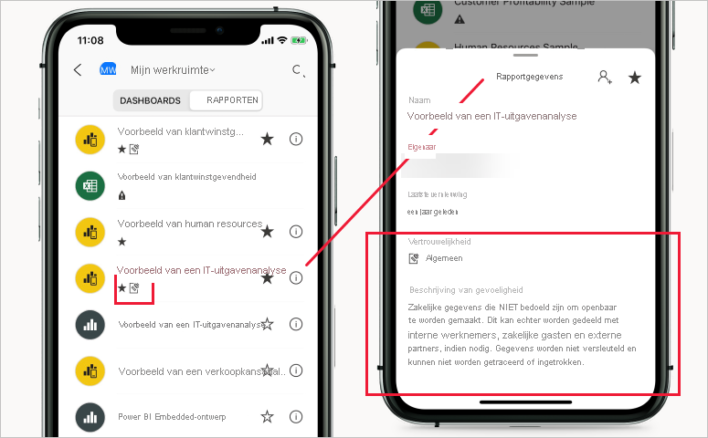

# Vertrouwelijkheidslabels in Power BI

In dit artikel wordt de functionaliteit beschreven van [vertrouwelijkheidslabels voor Microsoft Information Protection](https://docs.microsoft.com/microsoft-365/compliance/sensitivity-labels?view=o365-worldwide) in Power BI. Zie [Vertrouwelijkheidslabels toepassen in Power BI](./service-security-apply-data-sensitivity-labels.md) voor meer informatie over hoe u vertrouwelijkheidslabels toepast op Power BI-rapporten, -dashboards, -gegevenssets en -gegevensstromen. Zie [Vertrouwelijkheidslabels inschakelen in Power BI](service-security-enable-data-sensitivity-labels.md) voor meer informatie over het inschakelen van vertrouwelijkheidslabels voor uw tenant.

De vertrouwelijkheidslabels voor Microsoft Information Protection bieden gebruikers een eenvoudige manier om essentiële inhoud in Power BI te classificeren zonder dat dit ten koste gaat van de productiviteit of de mogelijkheid om samen te werken.

Vertrouwelijkheidslabels kunnen worden toegepast op gegevenssets, rapporten, dashboards en gegevensstromen. Wanneer gegevens worden geëxporteerd van Power BI naar Excel-, PowerPoint- of PDF-bestanden, past Power BI automatisch een vertrouwelijkheidslabel toe op het geëxporteerde bestand en wordt het beschermd op basis van de labelinstellingen voor bestandsversleuteling. Zodoende blijven uw gevoelige gegevens beschermd, ongeacht waar ze zich bevinden.

Vertrouwelijkheidslabels die worden toegepast op Power BI-rapporten, -dashboards, -gegevenssets en -gegevensstromen zijn zichtbaar op veel plaatsen in de Power BI-service. Vertrouwelijkheidslabels voor rapporten en dashboards zijn ook zichtbaar in de mobiele Power BI-apps voor iOS en Android en in ingesloten visuals.

Het [rapport met metrische gegevens over beveiliging](service-security-data-protection-metrics-report.md) dat beschikbaar is in de beheerportal van Power BI, biedt Power BI-beheerders volledig zicht op de gevoelige informatie in de Power BI-tenant. Daarnaast bevatten de auditlogboeken van Power BI vertrouwelijkheidslabelinformatie over activiteiten zoals het toepassen, verwijderen en wijzigen van labels, en over activiteiten zoals het weergeven van rapporten, dashboards enzovoort, waarmee Power BI- en beveiligingsbeheerders inzicht krijgen in het gebruik van gevoelige gegevens voor bewaking, onderzoek en beveiligingswaarschuwingen.

## Belangrijke overwegingen

Vertrouwelijkheidslabels zijn **niet** van invloed op de toegang tot inhoud in Power BI: de toegang tot inhoud in Power BI wordt uitsluitend beheerd via Power BI-machtigingen. Hoewel de labels zichtbaar zijn, worden de bijbehorende versleutelingsinstellingen (geconfigureerd in het [Microsoft 365-beveiligingscentrum](https://security.microsoft.com/) of het [Microsoft 365-compliancecentrum](https://compliance.microsoft.com/)) niet toegepast. Ze worden alleen toegepast op gegevens die worden geëxporteerd naar Excel-, PowerPoint- en PDF-bestanden.

Vertrouwelijkheidslabels en bestandsversleuteling worden **niet** toegepast in andere exportpaden dan exportpaden naar Excel, PowerPoint en PDF. De Power BI-tenantbeheerder kan bepaalde of alle exportpaden uitschakelen waarvoor vertrouwelijkheidslabels en de bijbehorende bestandsversleutelingsinstellingen niet worden ondersteund.

>[!NOTE]
> Gebruikers aan wie toegangsrechten voor een rapport worden verleend, krijgen toegang tot de hele onderliggende gegevensset, tenzij de toegang wordt beperkt door [beveiliging op rijniveau (RLS)](./service-admin-rls.md). Ontwerpers van rapporten kunnen rapporten classificeren en labelen met behulp van vertrouwelijkheidslabels. Als het vertrouwelijkheidslabel beveiligingsinstellingen heeft, worden deze beveiligingsinstellingen door Power BI toegepast bij het exporteren van rapportgegevens naar Excel-, PowerPoint- of PDF-bestanden. Alleen geautoriseerde gebruikers kunnen beveiligde bestanden openen.

## Hoe vertrouwelijkheidslabels werken in Power BI

Wanneer u een vertrouwelijkheidslabel toepast op een Power BI-dashboard, -rapport, -gegevensset of -gegevensstroom, is dit vergelijkbaar met het toepassen van een tag op die resource. Dit levert de volgende voordelen op:
* **Aanpasbaar**: u kunt categorieën maken voor verschillende niveaus van gevoelige inhoud in uw organisatie, zoals Persoonlijk, Openbaar, Algemeen, Vertrouwelijk en Zeer vertrouwelijk.
* **Duidelijke tekst**: omdat de tekst op het label vrij duidelijk is, kunnen gebruikers gemakkelijk begrijpen hoe ze de inhoud moeten behandelen volgens de richtlijnen voor vertrouwelijkheidslabels.
* **Persistentie**: nadat een vertrouwelijkheidslabel is toegepast op inhoud, wordt de inhoud ervan meegenomen bij het exporteren naar Excel-, PowerPoint en PDF-bestanden. Bovendien wordt het label de basis voor het toepassen en afdwingen van beleidsregels.

Hier kunt u aan de hand van een voorbeeld zien hoe vertrouwelijkheidslabels in Power BI werken. In de onderstaande afbeelding ziet u hoe een vertrouwelijkheidslabel wordt toegepast op een rapport in de Power BI-service, hoe de gegevens uit het rapport worden geëxporteerd naar een Excel-bestand en hoe het vertrouwelijkheidslabel en de beveiligingen behouden blijven in het geëxporteerde bestand.

In Microsoft Office-toepassingen wordt een vertrouwelijkheidslabel als een tag aan de e-mail of het document weergegeven, vergelijkbaar met wat er is weergegeven in de bovenstaande afbeelding.

U kunt ook een classificatie aan de inhoud toewijzen (zoals een sticker) die bij de inhoud blijft en met de inhoud meegaat wanneer de gebruiker deze inhoud gebruikt en deelt in Power BI. U kunt deze classificatie gebruiken om gebruiksrapporten te genereren en om activiteitsgegevens voor uw gevoelige inhoud te zien. Op basis van deze informatie kunt u er altijd later voor kiezen om beveiligingsinstellingen toe te passen.

## Overname van vertrouwelijkheidslabels bij het maken van nieuwe inhoud

Wanneer er nieuwe rapporten en dashboards worden gemaakt in de Power BI-service, nemen ze automatisch het vertrouwelijkheidslabel over dat eerder is toegepast op de bovenliggende gegevensset of het rapport. Als er bijvoorbeeld een nieuw rapport wordt gemaakt voor een gegevensset met het vertrouwelijkheidslabel Zeer vertrouwelijk, wordt dit label ook automatisch toegepast op het nieuwe rapport.

In de volgende afbeelding ziet u hoe het vertrouwelijkheidslabel van een gegevensset automatisch wordt toegepast op een nieuw rapport dat op basis van de gegevensset is gebouwd.

>[!NOTE]
>Als het vertrouwelijkheidslabel om welke reden dan ook niet kan worden toegepast op het nieuwe rapport of dashboard, kan Power BI **niet voorkomen** dat er een nieuw item wordt gemaakt.

## Vertrouwelijkheidslabels en beveiliging voor geëxporteerde gegevens

Wanneer gegevens worden geëxporteerd van Power BI naar Excel-, PowerPoint- of PDF-bestanden, past Power BI automatisch een vertrouwelijkheidslabel toe op het geëxporteerde bestand en wordt het beschermd op basis van de labelinstellingen voor bestandsversleuteling. Zodoende blijven uw gevoelige gegevens beschermd, ongeacht waar ze zich bevinden.

Een gebruiker die een bestand uit Power BI exporteert, beschikt over machtigingen voor toegang tot en het bewerken van dat bestand volgens de instellingen voor het vertrouwelijkheidslabel. Ze hebben geen eigenaarsmachtiging voor het bestand.

Vertrouwelijkheidslabels en beveiliging worden niet toegepast wanneer gegevens worden geëxporteerd naar CSV- of PBIX-bestanden, Analyseren in Excel of een ander exportpad.

Bij het toepassen van een vertrouwelijkheidslabel en beveiliging op een geëxporteerd bestand wordt geen markering van inhoud toegevoegd aan het bestand. Als het label echter is geconfigureerd voor het toepassen van inhoudsmarkeringen, worden de markeringen automatisch toegepast door de Azure Information Protection Unified labeling-client wanneer het bestand wordt geopend in Office-bureaublad-apps. De inhoudsmarkeringen worden niet automatisch toegepast wanneer u ingebouwde labels gebruikt voor desktop-, mobiele of web-apps. Zie [Wanneer Office-apps inhoud markeren en versleutelen](https://docs.microsoft.com/microsoft-365/compliance/sensitivity-labels-office-apps?view=o365-worldwide#when-office-apps-apply-content-marking-and-encryption) voor meer details.

Het exporteren mislukt als een label niet kan worden toegepast wanneer gegevens naar een bestand worden geëxporteerd. Als u wilt controleren of het exporteren is mislukt omdat het label niet kan worden toegepast, klikt u op de naam van het rapport of het dashboard in het midden van de titelbalk en kijkt u of de tekst Vertrouwelijkheidslabel kan niet worden geladen in de info-vervolgkeuzelijst wordt weergegeven. Dit kan gebeuren als gevolg van een tijdelijk systeemprobleem of als het toegepaste label niet is gepubliceerd of verwijderd door de beveiligingsbeheerder.

## Persistentie van vertrouwelijkheidslabel in ingesloten rapporten en dashboards

U kunt Power BI-rapporten, -dashboards en -visuals insluiten in zakelijke toepassingen zoals Microsoft Teams en SharePoint of op de website van een organisatie. Wanneer u een visual, rapport of dashboard insluit waarop een vertrouwelijkheidslabel is toegepast, wordt het vertrouwelijkheidslabel zichtbaar in de ingesloten weergave en blijven het label en de bijbehorende beveiliging gehandhaafd wanneer gegevens worden geëxporteerd naar Excel.

De volgende insluitingsscenario's worden ondersteund:
* [Insluiten voor uw organisatie](../developer/embedded/embed-sample-for-your-organization.md)
* Microsoft 365-apps (bijvoorbeeld [Teams](../collaborate-share/service-collaborate-microsoft-teams.md) en [SharePoint](../collaborate-share/service-embed-report-spo.md))
* [Veilige URL insluiten](../collaborate-share/service-embed-secure.md) (insluiten vanuit de Power BI-service) 

## Vertrouwelijkheidslabels in de mobiele Power BI-apps

Vertrouwelijkheidslabels kunnen worden weergegeven in rapporten en dashboards in de mobiele Power BI-apps. Een pictogram in de buurt van de naam van het rapport of dashboard geeft aan dat het een vertrouwelijkheidslabel heef. Het type label en een beschrijving van het label vindt u in het informatievak van het rapport of dashboard.

## Ondersteunde clouds
Vertrouwelijkheidslabels worden alleen ondersteund in algemene (openbare) clouds en niet voor tenants in clouds, zoals nationale clouds.

## Vereisten voor het gebruik van vertrouwelijkheidslabels in Power BI

Voordat uw vertrouwelijkheidslabels kunnen worden ingeschakeld en gebruikt in Power BI, moet u eerst aan de volgende vereisten voldoen:
* Controleer of gevoeligheidslabels zijn gedefinieerd in het [Microsoft 365-beveiligingscentrum](https://security.microsoft.com/) of het [Microsoft 365-compliancecentrum](https://compliance.microsoft.com/).
* [Schakel vertrouwelijkheidslabels in](service-security-enable-data-sensitivity-labels.md) in Power BI.
* Controleer of gebruikers de [juiste licenties](#licensing) hebben.

## Licentieverlening

* Voor het toepassen en weergeven van Microsoft Information Protection-vertrouwelijkheidslabels in Power BI is een Azure Information Protection Premium P1- of Premium P2-licentie vereist. Microsoft Azure Information Protection kan ofwel als zelfstandig product als via een van de Microsoft-licentiesuites worden aangeschaft. Zie [Prijzen voor Azure Information Protection](https://azure.microsoft.com/pricing/details/information-protection/) voor meer informatie.
* Er gelden [licentievereisten](https://docs.microsoft.com/microsoft-365/compliance/get-started-with-sensitivity-labels#subscription-and-licensing-requirements-for-sensitivity-labels) voor het weergeven en toepassen van labels in Office-apps.
* Als gebruikers labels willen toepassen op Power BI-inhoud, moeten ze naast een van de bovenstaande Azure Information Protection-licenties ook over een Power BI Pro-licentie beschikken.

## Vertrouwelijkheidslabel maken en beheren

Gevoeligheidslabel worden gemaakt en beheerd in het [Microsoft 365-beveiligingscentrum](https://security.microsoft.com/) of het [Microsoft 365-compliancecentrum](https://compliance.microsoft.com/).

Voor toegang tot vertrouwelijkheidslabels in deze centra navigeert u naar **Classificatie > Vertrouwelijkheidslabels**. Deze vertrouwelijkheidslabels kunnen worden gebruikt door meerdere Microsoft-services zoals Azure Information Protection, Office-apps en Office 365-services.

>[!Important]
> Als uw organisatie Azure Information Protection-vertrouwelijkheidslabels gebruikt, moet u naar een van de eerder genoemde services [migreren](https://docs.microsoft.com/azure/information-protection/configure-policy-migrate-labels) om de labels te kunnen gebruiken in Power BI.

## Beperkingen

De volgende lijst biedt een aantal beperkingen van vertrouwelijkheidslabels in Power BI:

* Vertrouwelijkheidslabels kunnen alleen worden toegepast op dashboards, rapporten, gegevenssets en gegevensstromen. Ze zijn momenteel niet beschikbaar voor [gepagineerde rapporten](../paginated-reports/report-builder-power-bi.md) en werkmappen.
* Vertrouwelijkheidslabels op Power BI-assets zijn zichtbaar in de werkruimtelijst en de weergaven Herkomst, Favorieten, Recente items en Apps; labels zijn momenteel niet zichtbaar in de weergave Gedeeld met mij. Houd er echter rekening mee dat een label dat op een Power BI-asset is toegepast, zelfs als dit niet zichtbaar is, permanent worden toegevoegd aan de gegevens die naar Excel-, PowerPoint- en PDF-bestanden worden geëxporteerd.
* Vertrouwelijkheidslabels voor gegevens worden niet ondersteund voor sjabloon-apps. Gevoeligheidslabels die door de maker van de sjabloon-app zijn ingesteld, worden verwijderd wanneer de app wordt uitgepakt en geïnstalleerd, en gevoeligheidslabels die door gebruikers van de app aan artefacten in een geïnstalleerde sjabloon-app zijn toegevoegd, gaan verloren (opnieuw ingesteld op niets) wanneer de app wordt bijgewerkt.
* Power BI biedt geen ondersteuning voor vertrouwelijkheidslabels van de beveiligingstypen [Niet doorsturen](https://docs.microsoft.com/microsoft-365/compliance/encryption-sensitivity-labels?view=o365-worldwide#let-users-assign-permissions), [Door de gebruiker gedefinieerd](https://docs.microsoft.com/microsoft-365/compliance/encryption-sensitivity-labels?view=o365-worldwide#let-users-assign-permissions) en [HYOK](https://docs.microsoft.com/azure/information-protection/configure-adrms-restrictions). De beveiligingstypen Niet doorsturen en Door de gebruiker gedefinieerd verwijzen naar labels die zijn gedefinieerd in het [Microsoft 365-beveiligingscentrum](https://security.microsoft.com/) of het [Microsoft 365-compliancecentrum](https://compliance.microsoft.com/).
* U wordt afgeraden gebruikers toe te staan om bovenliggende labels toe te passen in Power BI. Als een bovenliggend label wordt toegepast op inhoud, mislukt het exporteren van gegevens van die inhoud naar een bestand (Excel, PowerPoint en PDF). Zie [Sublabels (labels groeperen)](https://docs.microsoft.com/microsoft-365/compliance/sensitivity-labels?view=o365-worldwide#sublabels-grouping-labels).

## Volgende stappen

In dit artikel hebt u een overzicht gekregen van gegevensbeveiliging in Power BI. De volgende artikelen bieden meer informatie over gegevensbeveiliging in Power BI. 

* [Vertrouwelijkheidslabels inschakelen in Power BI](service-security-enable-data-sensitivity-labels.md)
* [Vertrouwelijkheidslabels toepassen in Power BI](service-security-apply-data-sensitivity-labels.md)
* [Microsoft Cloud App Security-besturingselementen gebruiken in Power BI](service-security-using-microsoft-cloud-app-security-controls.md)
* [Rapport met metrische gegevens voor beveiliging](service-security-data-protection-metrics-report.md)