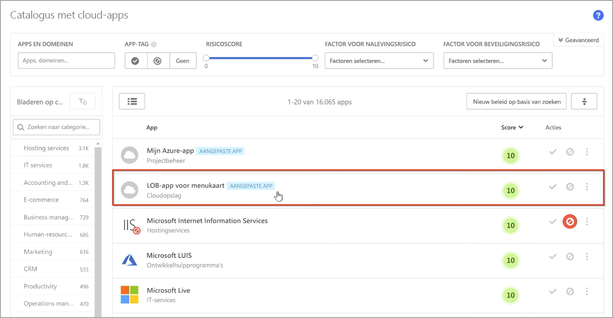
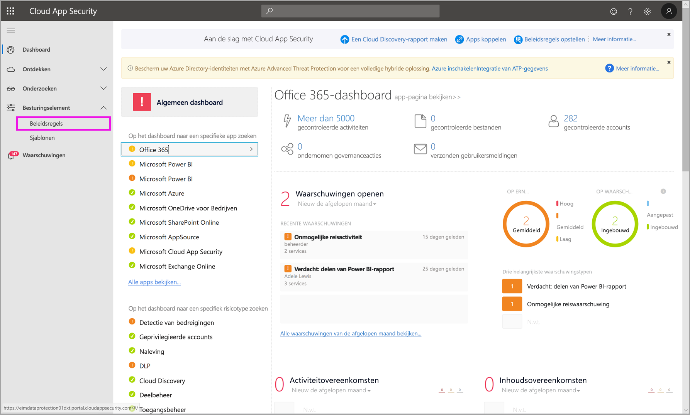
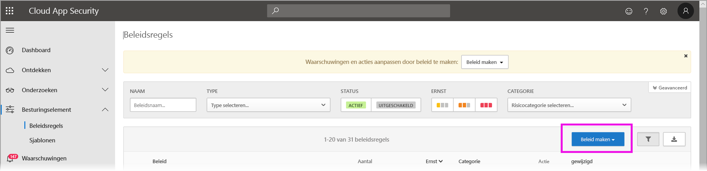
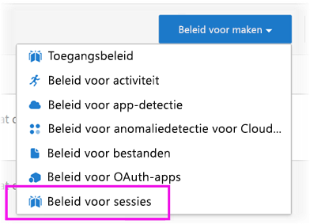
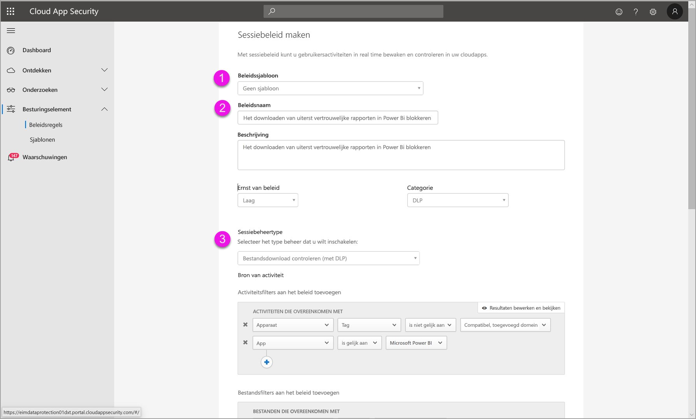
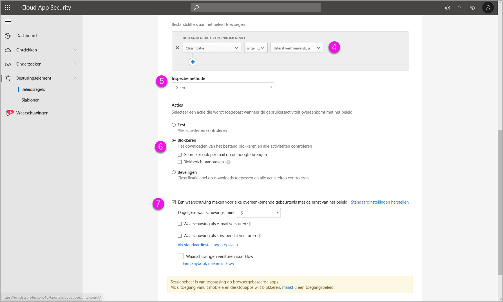
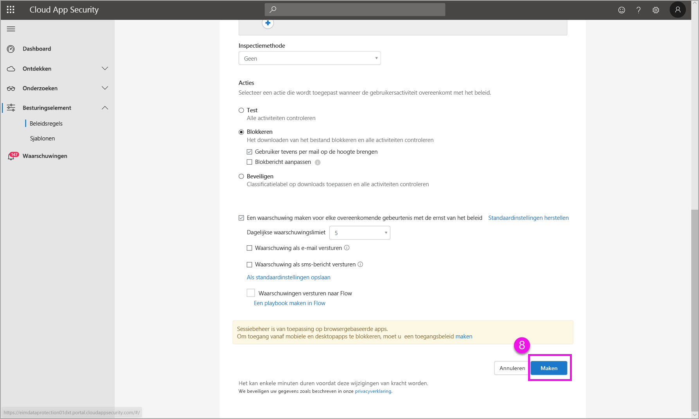

# Microsoft Cloud App Security-besturingselementen gebruiken in Power BI (preview-versie)

Met behulp van Microsoft Cloud App Security met Power BI kunt u uw Power BI-rapporten, -gegevens en -services beveiligen tegen onbedoelde lekken of inbreuk. Met Cloud App Security maakt u beleidsregels voor voorwaardelijke toegang voor de gegevens van uw organisatie, met behulp van realtime sessiebesturingselementen in Azure Active Directory (Azure AD), waarmee u kunt garanderen dat uw Power BI-analyses veilig zijn. Zodra dit beleid is ingesteld, kunnen beveiligingsbeheerders gebruikerstoegang en -activiteit bijhouden, realtime risicoanalyse uitvoeren en labelspecifieke besturingselementen instellen. 

U kunt Microsoft Cloud App Security configureren voor allerlei apps en services, niet alleen Power BI. Cloud App Security is een Microsoft-service waarmee apps en apparaten worden beveiligd en dat wordt beheerd via een eigen dashboard. U moet Cloud App Security configureren om met Power BI te werken, zodat u kunt profiteren van Cloud App Security-beveiligingen voor uw Power BI-gegevens en -analyses. Zie de documentatie over [Microsoft Cloud App Security](https://docs.microsoft.com/cloud-app-security/) voor meer informatie over Cloud App Security, inclusief een overzicht van hoe het werkt, het dashboard en app-risicoscores.

## Microsoft Cloud App Security gebruiken met Power BI

Als u Microsoft Cloud App Security met Power BI wilt gebruiken, moet u relevante Microsoft-beveiligingsservices gebruiken en configureren. Een aantal hiervan worden buiten Power BI ingesteld.

### Microsoft Cloud App Security-licenties

U moet over de volgende licenties beschikken om Microsoft Cloud App Security in uw tenant te kunnen gebruiken:
* MCAS: biedt OCAS-mogelijkheden voor alle ondersteunde apps, onderdeel van EMS E5- en M365 E5-suites.
* CAS-D: Biedt alleen MCAS-detectie.
* OCAS: Biedt alleen MCAS-mogelijkheden voor Office 365, onderdeel van de Office E5-suite.
* Optioneel: AAD P1 en AIP P1 om te kunnen profiteren van de uitgebreide Microsoft Cloud App Security-mogelijkheden.

In de onderstaande secties worden de stappen beschreven voor het gebruik van Microsoft Cloud App Security in Power BI.

### Sessiebeleidsregels instellen in Azure Active Directory (vereist)
De stappen die moeten worden uitgevoerd om sessiebesturingselementen in te stellen, worden voltooid in de Azure AD- en Microsoft Cloud App Security-portals. In de Azure AD-portal maakt u een beleid voor voorwaardelijke toegang voor Power BI en leidt u sessies die worden gebruikt in Power BI om via de Microsoft Cloud App Security-service. 

Microsoft Cloud App Security werkt met behulp van een reverse-proxy-architectuur en wordt geïntegreerd met voorwaardelijke toegang van Azure AD om gebruikersactiviteit in Power BI in realtime bij te houden. U ziet hier de volgende stappen voor meer informatie over het proces. In de gekoppelde inhoud in elk van de volgende stappen vindt u gedetailleerde stapsgewijze instructies. U kunt ook dit [Cloud App Security-artikel](https://docs.microsoft.com/cloud-app-security/proxy-deployment-aad) lezen voor een beschrijving van het volledige proces.

1.  [Een Azure AD-proefbeleid voor voorwaardelijke toegang maken](https://docs.microsoft.com/cloud-app-security/proxy-deployment-aad#add-azure-ad)
2.  [Aanmelden bij elke app met behulp van een gebruiker die binnen het bereik van het beleid valt](https://docs.microsoft.com/cloud-app-security/proxy-deployment-aad#sign-in-scoped)
3.  [Controleren of de apps zijn geconfigureerd op het gebruik van toegangs- en sessiebesturingselementen](https://docs.microsoft.com/cloud-app-security/proxy-deployment-aad#portal)
4.  [De implementatie testen](https://docs.microsoft.com/cloud-app-security/proxy-deployment-aad#step-4-test-the-deployment)

Het proces voor het instellen van sessiebeleidsregels wordt in detail beschreven in het artikel [Sessiebeleidsregels](https://docs.microsoft.com/cloud-app-security/session-policy-aad). 

### Beleidsregels voor anomaliedetectie instellen om PBI-activiteiten bij te houden (aanbevolen)
U kunt Power BI-beleidsregels voor anomaliedetectie definiëren waarvoor het bereik onafhankelijk kan worden bepaald, zodat ze alleen van toepassing zijn op de gebruikers en groepen die u in het beleid wilt opnemen of die u van het beleid wilt uitsluiten. [Meer informatie](https://docs.microsoft.com/cloud-app-security/anomaly-detection-policy#scope-anomaly-detection-policies).

Cloud App Security heeft ook twee toegewezen, ingebouwde detecties voor Power BI. [Zie de sectie later in dit document voor meer informatie](#built-in-microsoft-cloud-app-security-detections-for-power-bi).

### Vertrouwelijkheidslabels voor Microsoft Information Protection gebruiken (aanbevolen)

Met vertrouwelijkheidslabels kunt u gevoelige inhoud classificeren en beveiligen, zodat mensen in uw organisatie kunnen samenwerken met partners buiten uw organisatie, waarbij ze rekening houden met en zich bewust blijven van gevoelige inhoud en gegevens. 

U kunt het artikel over [vertrouwelijkheidslabels in Power BI](../designer/service-security-apply-data-sensitivity-labels.md) lezen voor meer informatie over het proces van het gebruik van vertrouwelijkheidslabels voor Power BI. Zie hieronder voor een [voorbeeld van een Power BI-beleid op basis van vertrouwelijkheidslabels](#example).

## Ingebouwde Microsoft Cloud App Security-detecties voor Power BI

Met behulp van Microsoft Cloud App Security-detecties kunnen beheerders specifieke activiteiten van een bewaakte app bijhouden. Voor Power BI zijn er momenteel twee toegewezen, ingebouwde Cloud App Security-detecties: 

* **Verdachte share**: detecteert wanneer een gebruiker een gevoelig rapport deelt met een onbekend e-mailadres (van buiten de organisatie). Een gevoelig rapport is een rapport waarvan het vertrouwelijkheidslabel is ingesteld op **ALLEEN INTERN** of hoger. 

* **Massaal delen van rapporten**: detecteert wanneer een gebruiker veel verschillende rapporten in één sessie deelt.

Instellingen voor deze detecties worden geconfigureerd in de Cloud App Security-portal. [Meer informatie](https://docs.microsoft.com/cloud-app-security/anomaly-detection-policy#unusual-activities-by-user). 

## De Power BI-beheerdersrol in Microsoft Cloud App Security

Er is een nieuwe rol gemaakt voor Power BI-beheerders wanneer ze Microsoft Cloud App Security met Power BI gebruiken. Wanneer u zich als een Power BI-beheerder bij de [Cloud App Security-portal](https://portal.cloudappsecurity.com/) aanmeldt, hebt u beperkte toegang tot voor Power BI relevante gegevens, waarschuwingen, gebruikers die risico lopen, activiteitenlogboeken en andere informatie.

## Overwegingen en beperkingen 
Het gebruik van Cloud App Security met Power BI is ontworpen om inhoud en gegevens van uw organisatie te beveiligen, met detecties waarmee gebruikerssessies en hun activiteiten worden bijgehouden. Wanneer u Cloud App Security met Power BI gebruikt, zijn er een aantal beperkingen waarmee u rekening moet houden:

* Microsoft Cloud App Security werkt alleen voor Excel-, PowerPoint- en PDF-bestanden.
* Als u de mogelijkheden van vertrouwelijkheidslabels in uw sessiebeleidsregels voor Power BI wilt gebruiken, moet u over een Azure Information Protection Premium P1- of Premium P2-licentie beschikken. Microsoft Azure Information Protection kan ofwel als zelfstandig product als via een van de Microsoft-licentiesuites worden aangeschaft. Zie [Prijzen voor Azure Information Protection](https://azure.microsoft.com/pricing/details/information-protection/) voor meer informatie. Daarnaast moeten vertrouwelijkheidslabels zijn toegepast op uw Power BI-assets.

> [!CAUTION]
> * Het beleid voor *inhoudsinspectie* in Microsoft Cloud App Security is momenteel niet beschikbaar in Power BI wanneer u een beleid voor Excel-bestanden toepast. Stel dit beleid dus niet in voor Power BI.
> * In het sessiebeleid werkt de mogelijkheid 'beveiligen' (in het gedeelte 'actie') alleen als het item niet van labels is voorzien. Als er al een label bestaat, wordt de actie 'beveiligen' niet toegepast; u kunt een bestaand label dat al op een item in Power BI is toegepast, niet overschrijven.

## Voorbeeld

In het volgende voorbeeld ziet u hoe u een nieuw sessiebeleid maakt met behulp van Microsoft Cloud App Security met Power BI.

Maak eerst een nieuw sessiebeleid. Selecteer **Beleidsregels** in het linkermenu in de **Cloud App Security**-portal.

Selecteer het vervolgkeuzemenu **Beleid maken** in het venster dat wordt weergegeven.

In de lijst met opties in het vervolgkeuzemenu selecteert u **Sessiebeleid**.

In het venster dat wordt weergegeven, maakt u het sessiebeleid. Met de genummerde stappen worden instellingen voor de volgende afbeelding beschreven.

  1. In het vervolgkeuzemenu **Beleidssjabloon** kiest u *Geen sjabloon*.
  2. Geef in het vak **Beleidsnaam** een relevante naam voor uw sessiebeleid op.
  3. Als **Sessiebeheertype** selecteert u *Beheerbestand gedownload (met DLP)* .

      Voor de sectie **Bron van activiteit** sectie kiest u relevante beleidsregels voor blokkeren. Het wordt aanbevolen onbeheerde en niet-compatibele apparaten te blokkeren. Kies ervoor om downloads te blokkeren wanneer de sessie in Power BI wordt uitgevoerd.

        

        Wanneer u omlaag bladert, ziet u meer opties. In de volgende afbeelding ziet u die opties, met extra voorbeelden. 

  4. Kies *Vertrouwelijkheidslabel* als *Zeer vertrouwelijk* of de optie die het beste bij uw organisatie past.
  5. Wijzig de **Inspectiemethode** in *geen*.
  6. Kies de optie voor **Blokkeren** die het beste bij uw behoeften past.
  7. Zorg ervoor dat u een waarschuwing voor zo'n actie maakt.

        

        

  8. Zorg er tot slot voor dat u op de knop **Maken** drukt om het sessiebeleid te maken.

        

> [!CAUTION]
> Zorg ervoor dat u geen beleid voor **Inhoudsinspectie** in Power BI Excel-bestanden maakt. Dit is een bekende beperking van deze *preview-versie*.

## Volgende stappen
In dit artikel wordt beschreven hoe Microsoft Cloud App Security gegevens- en inhoudsbeveiligingen voor Power BI kan bieden. U bent mogelijk ook geïnteresseerd in de volgende artikelen, waarin gegevensbeveiliging voor Power BI en ondersteunende inhoud voor de Azure-services die dat inschakelen, wordt beschreven.

* [Overzicht van gegevensbeveiliging in Power BI](service-security-data-protection-overview.md)
* [Vertrouwelijkheidslabels voor gegevens in Power BI inschakelen](service-security-enable-data-sensitivity-labels.md)
* [Vertrouwelijkheidslabels voor gegevens toepassen in Power BI](../designer/service-security-apply-data-sensitivity-labels.md)

U bent mogelijk ook geïnteresseerd in de volgende artikelen over Azure en beveiliging:

* [Apps beveiligen met App-beheer voor voorwaardelijke toegang van Microsoft Cloud App Security](https://docs.microsoft.com/cloud-app-security/proxy-intro-aad)
* [App-beheer voor voorwaardelijke toegang implementeren voor aanbevolen apps](https://docs.microsoft.com/cloud-app-security/proxy-deployment-aad)
* [Sessiebeleidsregels](https://docs.microsoft.com/cloud-app-security/session-policy-aad)
* [Overzicht van vertrouwelijkheidslabels](https://docs.microsoft.com/microsoft-365/compliance/sensitivity-labels)