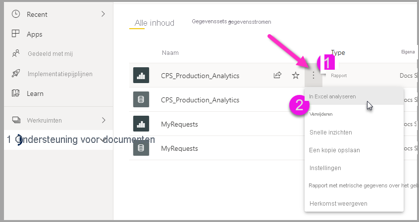

# In Excel analyseren
Met **Analyseren in Excel** kunt u Power BI-gegevenssets overbrengen naar Excel, en ze daar weergeven en bewerken met behulp van draaitabellen, grafieken, slicers en andere Excel-functies. Als u **Analyseren in Excel** wilt gebruiken, moet u de functie eerst downloaden uit Power BI downloaden en installeren, en vervolgens een of meer gegevenssets selecteren voor gebruik in Excel. 

In dit artikel leest u hoe u Analyseren in Excel installeert en gebruikt, wat de beperkingen zijn en wat mogelijke vervolgstappen zijn. Deze onderwerpen komen aan bod:

* [Analyseren in Excel installeren](#install-analyze-in-excel)
* [Verbinding maken met Power BI-gegevens](#connect-to-power-bi-data)
* [Excel gebruiken om de gegevens te analyseren](#use-excel-to-analyze-the-data)
* [Uw werkmap opslaan en delen](#saving-and-sharing-your-new-workbook)
* [Vereisten](#requirements)

Laten we maar meteen beginnen met het installatieproces.

## Analyseren in Excel installeren

U moet **Analyseren in Excel** via koppelingen die worden aangeboden in de Power BI-service. Power BI detecteert de versie van Excel die u op uw computer hebt en downloadt automatisch de juiste versie (32-bits of 64-bits). De Power BI-service wordt in een browser uitgevoerd. U kunt zich met de volgende koppeling aanmelden bij Power BI:

* [Aanmelden bij Power BI](https://app.powerbi.com)

Nadat u zich hebt aangemeld en de Power BI-service wordt uitgevoerd in uw browser, selecteert u **Meer opties** (de drie punten ...) in de rechterbovenhoek en selecteert u **Downloaden > Updates voor Analyseren in Excel**. Dit menu-item is van toepassing op nieuwe installaties van updates van Analyseren in Excel.

U kunt ook in de Power BI-service naar een gegevensset gaan die u wilt analyseren en het item **Meer opties** selecteren voor een gegevensset, rapport of ander Power BI-item. Selecteer in het menu dat wordt weergegeven de optie **Analyseren in Excel**, zoals deze wordt weergegeven in de volgende afbeelding.

In beide gevallen detecteert Power BI of u Analyseren in Excel hebt geïnstalleerd. Als dat niet het geval is, wordt u gevraagd de functie te downloaden. 

Wanneer u Downloaden selecteert, detecteert Power BI de versie van Excel die u hebt geïnstalleerd en downloadt de juiste versie van het installatieprogramma voor Analyseren in Excel. U ziet een downloadstatus onder aan uw browser of op een andere plaats waar uw specifieke browser de voortgang van de download bijhoudt. 

Wanneer het downloaden is voltooid, voert u het installatieprogramma (.msi) uit om Analyseren in Excel te installeren. De naam van het installatieproces is niet Analyseren in Excel, maar iets als **Microsoft Analysis Services OLE DB-provider** zoals wordt weergegeven in de volgende afbeelding.

Als het installeren is voltooid, kunt u een rapport selecteren in de Power BI-service (of een ander Power BI gegevenselement, zoals een gegevensset), en dit vervolgens analyseren in Excel.

## Verbinding maken met Power BI-gegevens

Navigeer in het Power BI-service naar de gegevensset of het rapport dat u wilt analyseren in Excel en doe daarna het volgende:

1. Selecteer het menu **Meer opties**.

1. Selecteer **Analyseren in Excel**.

    In de volgende afbeelding ziet u hoe u een rapport kunt selecteren.

    
    
    >[!NOTE]
    >Houd er rekening mee dat als u Analyseren in Excel selecteert in het menu Rapport, u werkt met de onderliggende gegevensset van het rapport dat in Excel wordt geopend.

    De Power BI-service maakt vervolgens een Excel-bestand van de gegevensset die is ontworpen (en gestructureerd) voor gebruik met **Analyseren in Excel**, en start een downloadproces in uw browser.
    
    

    De bestandsnaam komt overeen met die van de gegevensset (of het rapport of een andere gegevensbron) waaruit deze is afgeleid. Als het rapport dus *Quarterly Report* heet, dan heet het gedownloade bestand **Quarterly Report.xlsx**.

    >[!Note]
    >Analyseren in Excel downloadt nu een Excel-bestand in plaats van een ODC-bestand. Hiermee wordt gegevensbescherming ingeschakeld voor gegevens die vanuit Power BI worden geëxporteerd. Het gedownloade Excel-bestand neemt het vertrouwelijkheidslabel over van de gegevensset die wordt geanalyseerd in Excel.

3. Open het Excel-bestand.

    >[!NOTE]
    >De eerste keer dat u het bestand opent, moet u mogelijk op **Bewerken inschakelen** en vervolgens **Inhoud inschakelen** klikken, afhankelijk van uw instellingen voor [Beveiligde weergave](https://support.microsoft.com/en-gb/office/what-is-protected-view-d6f09ac7-e6b9-4495-8e43-2bbcdbcb6653?ui=en-us&rs=en-gb&ad=gb) en [Vertrouwd document](https://support.microsoft.com/en-us/office/trusted-documents-cf872bd8-47ec-4c02-baa5-1fdba1a11b53).
    >
    >
    >
    >

Wanneer u Excel gebruikt voor het analyseren van Power BI met behulp van een draaitabel, wordt de overname van vertrouwelijkheidslabels naar Excel uitgebreid. Wanneer u een draaitabel in Excel maakt en er een vertrouwelijkheidslabel is toegepast op een Power BI-gegevensset, wordt het label automatisch toegepast op het Excel-bestand. 

Als het label van de gegevensset vervolgens wordt gewijzigd in een meer beperkend label, wordt het label dat op het Excel-bestand is toegepast, automatisch bijgewerkt nadat de gegevens zijn vernieuwd. Als de gegevensset wordt gewijzigd en minder beperkend wordt, wordt het label niet overgenomen of bijgewerkt.

Vertrouwelijkheidslabels in Excel die handmatig zijn ingesteld, worden niet automatisch overschreven met het label van de gegevensset. Als een Excel-bestand een handmatig ingesteld vertrouwelijkheidslabel heeft, wordt een beleidstip weergegeven met de aanbeveling het label bij te werken. 

Zie [Vertrouwelijkheidslabels toepassen in Power BI](../admin/service-security-apply-data-sensitivity-labels.md) voor meer informatie.

## Excel gebruiken om de gegevens te analyseren

Zodra u bewerken en inhoud hebt ingeschakeld, ziet u in Excel een lege **draaitabel** en lijst met **velden** uit de Power BI-gegevensset, klaar om te worden geanalyseerd.

Het Excel-bestand heeft een MSOLAP-verbindingsreeks die is verbonden met uw gegevensset in Power BI. Wanneer u de gegevens analyseert of ermee werkt, vraagt Excel die gegevensset op in Power BI en worden de resultaten naar Excel geretourneerd. Als de gegevensset is verbonden met een live gegevensbron met behulp van DirectQuery, vraagt Power BI de gegevensbron op en retourneert Power BI de resultaten naar Excel.

Nu er verbinding is met de gegevens in Power BI, kunt u draaitabellen en grafieken maken en de gegevensset analyseren, net zoals bij een lokale gegevensset in Excel.

**Analyseren in Excel** is vooral handig voor gegevenssets en rapporten die verbinding maken met de volgende gegevensbronnen:

* *Tabellaire analyseservices* of databases van het type *Multidimensionaal*
* Power BI Desktop-bestanden of Excel-werkmappen met gegevensmodellen waarvoor modelmetingen zijn gemaakt met DAX (Data Analysis Expressions).

> [!IMPORTANT]
> Met **Analyseren in Excel** worden alle gegevens op detailniveau zichtbaar voor alle gebruikers met een machtiging voor de gegevensset.

Er zijn een paar dingen waar u rekening mee moet houden wanneer u aan de slag gaat met Analyseren in Excel, omdat u hiervoor misschien iets extra's moet doen om aan het werk te kunnen. Deze gevallen worden beschreven in de volgende secties. 

### Aanmelden bij Power BI
Hoewel u bent aangemeld bij Power BI in uw browser, kunt u de eerste keer dat u een nieuw Excel-bestand in Excel opent, worden gevraagd om u aan te melden bij Power BI met uw Power BI-account. Hiermee wordt de verbinding van Excel met Power BI geverifieerd.

### Gebruikers met meerdere Power BI-accounts
Sommige gebruikers hebben meerdere Power BI-accounts. Als dat geldt voor u, bent u mogelijk met het ene account aangemeld bij Power BI, maar heeft uw andere account toegang tot de gegevensset die wordt gebruikt in Analyseren in Excel. In dat geval kan er een fout als **Verboden** worden weergegeven of mislukt het aanmelden wanneer u probeert een gegevensset te openen die wordt gebruikt in een Analyseren in Excel-werkmap.

Als dat gebeurt, krijgt u de mogelijkheid om zich opnieuw aan te melden. U kunt zich dan aanmelden met het Power BI-account dat toegang heeft tot de gegevensset die wordt verwerkt door Analyseren in Excel. U kunt ook uw naam selecteren in het bovenste lint in Excel, waaraan kunt zien bij welk account u momenteel bent aangemeld. Meld u af en meld u vervolgens aan met het andere account.

## Uw werkmap opslaan en delen

Selecteer **Opslaan** om de Excel-werkmap op te slaan die u met de Power BI-gegevensset hebt gemaakt, net als iedere andere werkmap. U kunt de werkmap echter niet publiceren of opnieuw importeren in Power BI, omdat u alleen werkmappen kunt publiceren of importeren in Power BI die gegevens in tabellen hebben, of die een gegevensmodel hebben. Aangezien de nieuwe werkmap een verbinding met de gegevensset in Power BI heeft, zou publiceren of importeren in Power BI continu worden herhaald.

Wanneer uw werkmap is opgeslagen, kunt u deze delen met andere Power BI-gebruikers in uw organisatie. 

Wanneer gebruikers met wie u de werkmap hebt gedeeld deze openen, zien ze uw draaitabellen en gegevens van het moment dat de werkmap voor het laatst werd opgeslagen, wat mogelijk niet de nieuwste versie van de gegevens is. Gebruikers kunnen de knop **Vernieuwen** in het lint **Gegevens** gebruiken om de nieuwste gegevens weer te geven. Omdat de werkmap is verbonden met een gegevensset in Power BI, moeten gebruikers bij het vernieuwen van de werkmap zich aanmelden bij Power BI. De eerste keer dat ze via deze methode proberen bij te werken, moeten ze de Excel-updates installeren.

Gebruikers moeten de gegevensset vernieuwen, en vernieuwen voor externe verbindingen wordt niet ondersteund in Excel Online. Daarom is het raadzaam dat gebruikers de werkmap op hun computer openen in de bureaubladversie van Excel.

> [!NOTE]
> Beheerders voor Power BI-tenants kunnen de *Power BI-beheerportal* gebruiken om het gebruik van **Analyseren in Excel** met on-premises gegevenssets die zijn ondergebracht in AS-databases (Analysis Services) uit te schakelen. Wanneer deze optie is uitgeschakeld, is **Analyseren in Excel** niet beschikbaar voor AS-databases, maar kan de functie wel worden gebruikt voor andere gegevenssets.

## Andere manieren om toegang te krijgen tot Power BI-gegevenssets vanuit Excel
Gebruikers met specifieke Office-SKU's kunnen ook verbinding maken met Power BI-gegevenssets vanuit Excel met behulp van de functie **Gegevens ophalen** in Excel. Als uw SKU deze functie niet ondersteunt, wordt de menu-optie **Gegevens ophalen** niet weergegeven.

Selecteer op het lint van **Gegevens** **Gegevens ophalen > Uit Power BI-gegevensset**, zoals wordt weergegeven in de volgende afbeelding.

Er verschijnt een deelvenster waarin u kunt bladeren door gegevenssets waartoe u toegang hebt, zien of gegevenssets zijn gecertificeerd of worden aanbevolen, en vaststellen of labels voor gegevensbeveiliging zijn toegepast op die gegevenssets. 

Meer informatie over het op deze manier overbrengen van gegevens naar Excel vindt u in [Een draaitabel maken op basis van Power BI-gegevenssets](https://support.office.com/article/31444a04-9c38-4dd7-9a45-22848c666884) in de Excel-documentatie.

U hebt ook toegang tot **aanbevolen tabellen** in Excel, via de galerie **Gegevenstypen**. Als u meer wilt weten over aanbevolen tabellen, en hoe u ze kunt openen, raadpleegt u [Toegang tot aanbevolen Power BI-tabellen in Excel (preview)](service-excel-featured-tables.md).

## Vereisten
Er zijn enkele vereisten voor het gebruik van **Analyseren in Excel**:

* **Analyseren in Excel** wordt ondersteund voor Microsoft Excel 2010 SP1 of hoger.

* Excel-draaitabellen bieden geen ondersteuning voor aggregatie van numerieke velden met slepen en neerzetten. Uw gegevensset in Power BI *moet vooraf gedefinieerde metingen hebben*. Meer informatie over het [maken van metingen](../transform-model/desktop-measures.md).
* Sommige organisaties hebben mogelijk groepsbeleidregels ingesteld die voorkomen dat de vereiste **Analyseren in Excel**-updates naar Excel worden geïnstalleerd. Als het niet lukt om de updates te installeren, vraagt u dit na bij uw beheerder.
* Voor **Analyseren in Excel** is vereist dat de gegevensset in Power BI Premium staat of dat de gebruiker een Power BI Pro-licentie heeft. Raadpleeg de sectie _Vergelijking van Power BI-functies_ in [Power BI-prijzen](https://powerbi.microsoft.com/pricing/) als u meer wilt weten over de verschillen in functionaliteit tussen licentietypen.
* Gebruikers kunnen verbinding maken met gegevenssets via Analyseren in Excel als ze zijn gemachtigd voor de onderliggende gegevensset.  Een gebruiker kan deze machtiging op verschillende manieren hebben verkregen, zoals door de rol van lid van de werkruimte met daarin de gegevensset, doordat het rapport of dashboard met hem/haar is gedeeld waarin wordt gebruikgemaakt van de gegevensset, of doordat deze over een samenstellingsmachtigingen beschikt voor de gegevensset in een werkruimte of een app die de gegevensset bevat. Meer informatie over [Samenstellingsmachtiging](../connect-data/service-datasets-build-permissions.md) voor gegevenssets.
* Gastgebruikers kunnen **Analyseren in Excel** niet gebruiken voor gegevenssets die zijn verzonden vanuit (afkomstig zijn uit) een andere tenant. 
* De functie **Analyseren in Excel** is een functie van de Power BI-service. Deze functie is niet beschikbaar in Power BI Report Server of Power BI Embedded. 
* **Analyseren in Excel** wordt alleen ondersteund op computers met Microsoft Windows.

Gebruikers die de functie **Analyseren in Excel** willen verwijderen, kunnen dit doen via het onderdeel **Programma's toevoegen of verwijderen** in het Configuratiescherm van uw Windows-computer.

## Problemen oplossen
Wanneer u Analyseren in Excel gebruikt, krijgt u mogelijk een onverwacht resultaat of werkt de functie niet zoals verwacht. [Deze pagina bevat oplossingen voor algemene problemen bij het gebruik van Analyseren in Excel](desktop-troubleshooting-analyze-in-excel.md).

## Volgende stappen

Wellicht bent u ook geïnteresseerd in de volgende artikelen:

* [Drillthrough voor meerdere rapporten gebruiken in Power BI Desktop](../create-reports/desktop-cross-report-drill-through.md)
* [Slicers Power BI Desktop gebruiken](../visuals/power-bi-visualization-slicers.md)
* [Probleemoplossing analyseren in Excel](desktop-troubleshooting-analyze-in-excel.md)
* [Toegang tot aanbevolen Power BI-tabellen in Excel (preview)](service-excel-featured-tables.md)
* [Vertrouwelijkheidslabels toepassen in Power BI](../admin/service-security-apply-data-sensitivity-labels.md)
