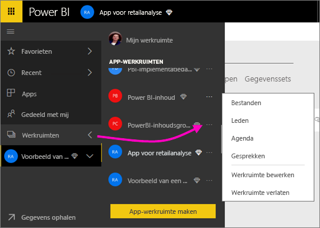

# Samenwerken in een klassieke werkruimte
De Power BI-werkruimten zijn ideale locaties om met uw collega's samen te werken aan dashboards, rapporten en gegevenssets om *apps* te maken. Dit artikel heeft betrekking op de oorspronkelijke, *klassieke* werkruimten.  

Samenwerken eindigt niet met de werkruimten in Power BI. Wanneer u een van de klassieke werkruimten in Power BI maakt, maakt u automatisch een Microsoft 365-groep op de achtergrond. Microsoft 365 biedt een andere groep services, zoals het delen van bestanden op OneDrive voor Bedrijven, conversaties in Exchange, gedeelde agenda en taken. Meer informatie over [groepen in Microsoft 365](https://support.office.com/article/Create-a-group-in-Office-365-7124dc4c-1de9-40d4-b096-e8add19209e9).

> [!NOTE]
> In de nieuwe werkruimte-ervaring is de relatie tussen Power BI-werkruimten en Microsoft 365-groepen gewijzigd. Wanneer u een van de nieuwe werkruimten in Power BI maakt, maakt u niet meer automatisch een Microsoft 365-groep op de achtergrond. Zie [De nieuwe werkruimten maken in Power BI](service-create-the-new-workspaces.md) voor meer informatie.

U hebt een [Power BI Pro-licentie](../fundamentals/service-features-license-type.md) nodig om een werkruimte te maken.

## Samenwerken aan Power BI Desktop-bestanden in een werkruimte
Nadat u een Power BI Desktop-bestand hebt gemaakt, kunt u het publiceren in uw werkruimte, zodat alle personen in uw werkruimte er samen aan kunnen werken.

1. Selecteer in Power BI Desktop **Publiceren** op het lint **Start** en selecteer vervolgens de werkruimte in het vak **Een doel selecteren**.
   
    
2. Selecteer in de Power BI-service de pijl naast **Werkruimten** > selecteer de werkruimte.
   
    
3. Selecteer het tabblad **Rapporten** en kies vervolgens uw rapport.
   
    
   
    Vanaf dit punt werkt het net als elk ander rapport in Power BI. U en anderen in de werkruimte kunnen het rapport wijzigen en tegels opslaan in een dashboard van uw keuze.

## Samenwerken in Microsoft 365
Samenwerken in Microsoft 365 wordt gestart vanuit de klassieke werkruimte in Power BI.

1. Selecteer in de Power BI-service de pijl naast **Werkruimten** > selecteer **Meer opties** (...) naast de naam van uw werkruimte. 
   
   
2. In dit menu kunt u op een aantal manieren samenwerken met uw groep: 
   
   * Een [groepsconversatie hebben in Microsoft 365](#have-a-group-conversation-in-microsoft-365).
   * [Een gebeurtenis plannen](#schedule-an-event-on-the-group-workspace-calendar) in de agenda van de groepswerkruimte.
   
   De eerste keer dat u naar uw groepswerkruimte in Microsoft 365 gaat, kan dit even duren. Wacht 15 tot 30 minuten en vernieuw uw browser.

## Een groepsconversatie hebben in Microsoft 365
1. Selecteer **Meer opties** (...) naast de naam van uw werkruimte \> **Gesprekken**. 
   
    
   
   De mail- en conversatiesite voor de groepswerkruimte wordt geopend in Outlook voor Microsoft 365.
   
   
2. Meer informatie over [groepsconversaties in Outlook voor Microsoft 365](https://support.office.com/Article/Have-a-group-conversation-a0482e24-a769-4e39-a5ba-a7c56e828b22).

## Een gebeurtenis plannen in de agenda van de groepswerkruimte
1. Selecteer **Meer opties** (...) naast de naam van de werkruimte \> **Agenda**. 
   
   
   
   Hiermee opent u de agenda voor uw groepswerkruimte in Outlook voor Microsoft 365.
   
   
2. Meer informatie over [groepsagenda's in Outlook in Microsoft 365](https://support.office.com/Article/Add-edit-and-subscribe-to-group-events-0cf1ad68-1034-4306-b367-d75e9818376a).

## Een klassieke werkruimte beheren
Als u eigenaar of beheerder bent van een werkruimte, kunt u ook werkruimteleden toevoegen of verwijderen. Meer informatie over [een Power BI app-werkruimte beheren](service-manage-app-workspace-in-power-bi-and-office-365.md).

## Volgende stappen
* [Publiceer apps in Power BI](service-create-distribute-apps.md).
* Hebt u nog vragen? [Misschien dat de Power BI-community het antwoord weet](https://community.powerbi.com/).
* Feedback? Ga naar [Power BI-ideeën](https://ideas.powerbi.com/forums/265200-power-bi).
